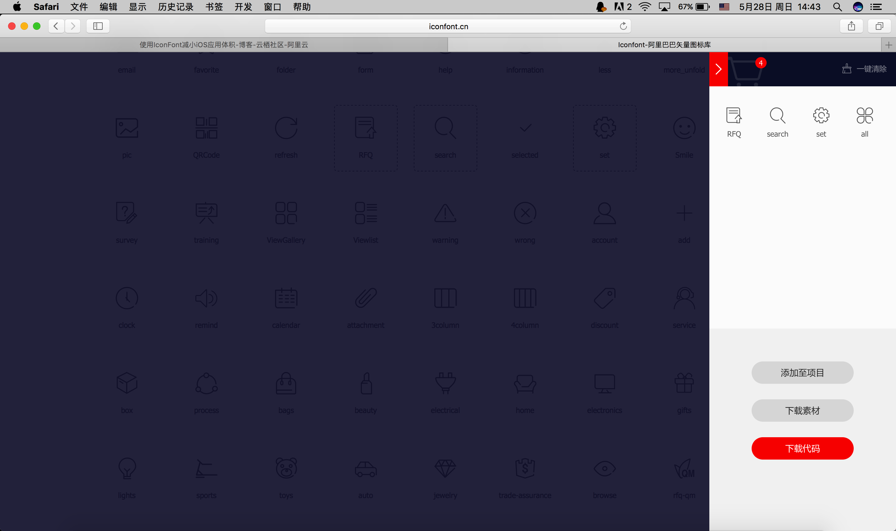

# Image Assets Optimization for Project Size

> A small iOS project with many features can grow large in size. Under an Xcode project, image assets can take up a lot of space, and if an app needs a one-click skin/theme change, imagine how many images that requires. Each set of images also needs 1x, 2x, 3x, etc.

## Introduction

IconFont technology originated in the web field from Web Font technology. Over time, web design became more beautiful. But system-installed fonts on computers could no longer satisfy designers, so Web Font technology was born. An English character font set is not large; by downloading fonts over the network, webpages can be rendered. With Web Font technology, designers gained much more freedom.

In web design, icons need to adapt to multiple resolutions, and each icon would require a separate network request. Someone thought to use the Web Font approach to solve both problems: make vector icons into a font, so a single network request suffices and the icons scale cleanly. Another way to solve this is using sprite images.

The web community has used IconFont-like techniques for years—when I first encountered Bootstrap in 2015, Font Awesome was very popular. Recently IconFont technology has been applied to iOS image assets. I had some time to research and整理 (organize) it, and I record my learning here.

## Advantages

* Reduce size — font files are smaller than images
* Icon fidelity when scaling — solves 2x/3x and future n× image issues
* Easy to change color and size, image reuse

## Disadvantages

* Only suitable for
  `single-color icons`
* Using Unicode characters is hard to understand
* Need to maintain the font library

There are many tutorials online about how to make IconFonts; I won't discuss that here.

## How to use

1. First pick some rich resource sites. I've used Alibaba's IconFont for years and didn't research others, so I'll use Alibaba's product here. Address: http://www.iconfont.cn/plus

2. Open the site and select suitable icons into the cart, as shown:


3. After selecting, view the cart and click to download the code.

4. Open the downloaded file; its structure is as follows. In iOS development we use the Unicode form of IconFont, so open demo_unicode.html


**Note:** Create UIFont using the font's PostScript name, not the file name; text values are 8-digit Unicode characters. We can open demo.html to find the HTML entity Unicode code for each icon. For example: the icon "店" corresponds to HTML entity Unicode code: 0x3439. Converted it becomes: \U00003439 — replace 0x with \U and pad with zeros to reach 8 characters.

# Using IconFont in Xcode

Initial attempt usage

1. First see how to use IconFont simply.
2. Add the downloaded **iconfont.ttf** into the Xcode project and ensure it's included in Build settings.


3. How to use?

```objective-c
NSMutableAttributedString *attributedStr = [[NSMutableAttributedString alloc] initWithString:@"\U0000e696  \U0000e6ab  \U0000e6ac  \U0000e6ae"];
[attributedStr addAttribute:NSForegroundColorAttributeName value:[UIColor redColor] range:NSMakeRange(0, 1)];
[attributedStr addAttribute:NSForegroundColorAttributeName value:[UIColor orangeColor] range:NSMakeRange(3, 1)];
[attributedStr addAttribute:NSForegroundColorAttributeName value:[UIColor blackColor] range:NSMakeRange(9, 1)];
self.label.attributedText = attributedStr;
[self.view addSubview:self.label];

#pragma mark - getter and setter
-(UILabel *)label{
       if (!_label) {
           _label = [[UILabel alloc] initWithFrame:CGRectMake(100, 100, BoundWidth-200, 40)];
           _label.font = [UIFont fontWithName:@"iconfont" size:24];
           _label.textColor = [UIColor purpleColor];
       }
       return _label;
   }
```

#### Further encapsulation for easier use

Generating a UIImage from IconFont only requires LBPIconFontmake(par1, par2, par3), where par1: the iconfont Unicode value; par2: image size; par3: image color. LBPIconFontmake is a macro: #define LBPIconFontmake(text,size,color) [[LBPFontInfo alloc] initWithText:text withSize:size andColor:color].

```objective-c
self.latestImageView.image = [UIImage iconWithInfo:LBPIconFontmake(@"\U0000e6ac", 60, @"000066") ];
```


1. LBPFontInfo encapsulates font information.
2. UIColor+picker sets color from a hex string.
3. LBPIconFont registers the IconFont into the system and uses it.
4. UIImage+LBPIconFont provides a UIImage category for using IconFont.

# Demo repository

https://github.com/FantasticLBP/IconFont_Demo