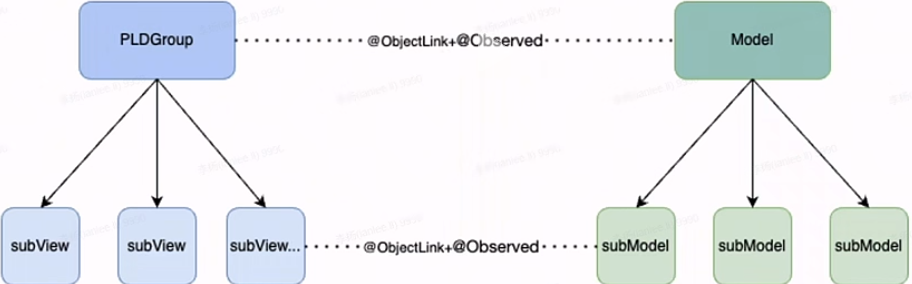
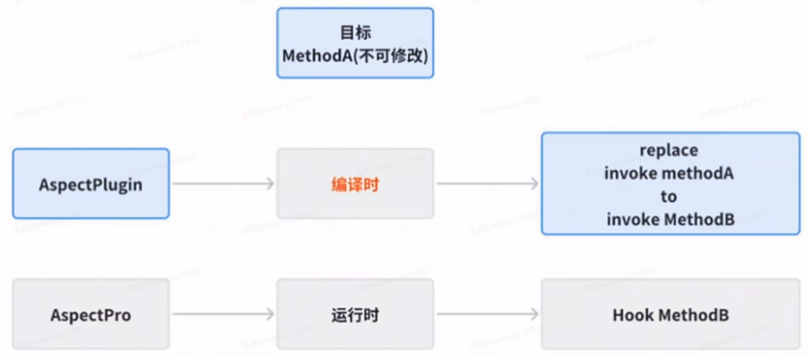
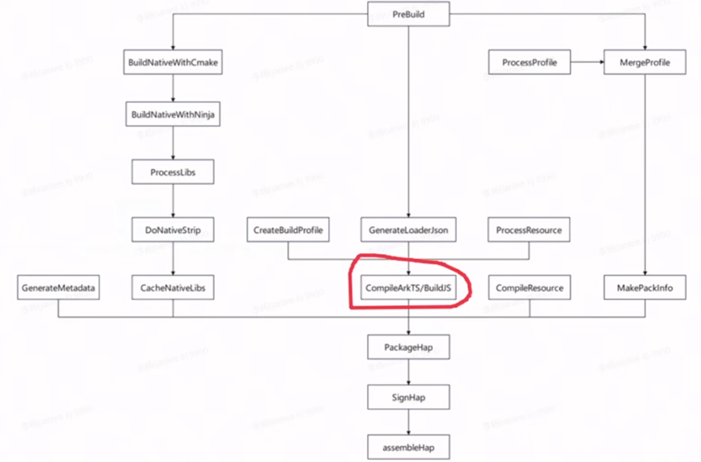
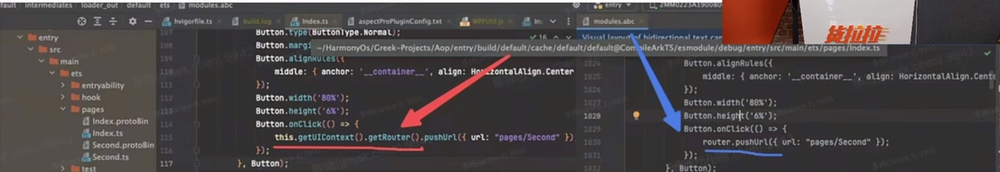
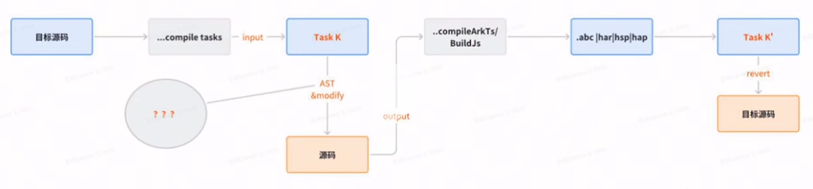
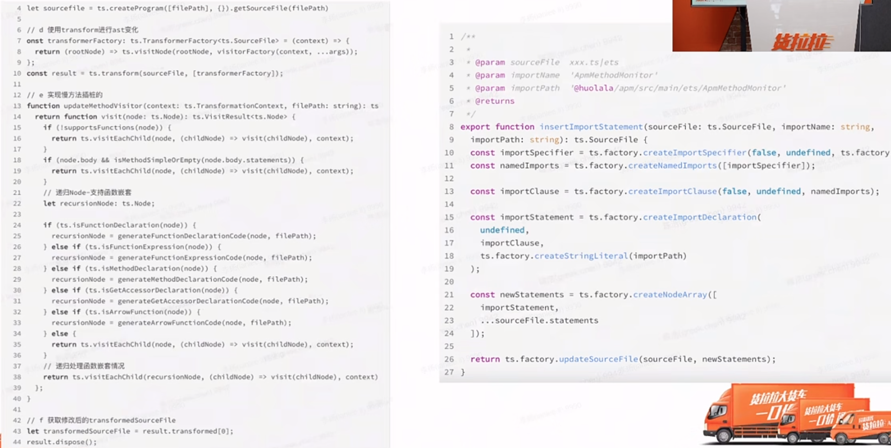

## 写给 iOSer 的鸿蒙开发 tips

## 下载问题

The other possible cause is that the system language of the PC is English and the region code is US. You could try to perform the following operations to change the region code to CN. Before changing the region code, close DevEco Studio.


For Mac OS: ~/Library/Application Support/Huawei/DevEcoStudio3.0/options/country.region.xml

修改为 CN

```xml
<application>
    <component name="CountryRegionSetting">
        <countryregion name="CN"/>
    </component>
</application>
```


## 鸿蒙开发任务拆分

### 依赖梳理

- 梳理依赖的二方、三方 SDK，根据对应 SDK 的鸿蒙化排期调整整体项目的排期
- 暂时不能鸿蒙化的 SDK 功能降级

### 优先级对齐

- 根据依赖梳理的排期，倒推二方 SDK 的优先级
- 梳理各个团队的 P1、P2、P3 任务

### 功能定版

- 考虑到部分基础能力无法实现和人力资源排期的问题，无法完全对齐 Android 版本
- 根据前期梳理，确定每个节点的功能范围

### 架构设计

- App 模块架构基本对齐 Android
- 鸿蒙特性部分微调
- 基础能力下沉到 C++，提升复用

## 规范

### 代码规范制定

除了常规流程的 MR，但对于鸿蒙，大家都属于摸着石头过河的状态。开发也是摸着石头过河，所以会变开发，定期制定、更新代码规范文档，并定期 review 项目代码，完善代码规范，避免糟糕代码野蛮生长

### 踩坑分享

及时收集整理开发过程中的踩坑点，定期在团队内分享，减少或避免相同问题的再次发生

### 最佳实践分享

定期梳理最佳实践，鼓励分享。快速提高、拉齐大家的鸿蒙水平


## 鸿蒙背景下的跨端方案

业务使用 TS 开发，公用一套渲染引擎


### 引擎选择

| 引擎           |                 | 优点                              | 缺点                          |
| -------------- | --------------- | --------------------------------- | ----------------------------- |
| JavaScriptCore | Apple           | 在 iOS 平台上有非常明显的主场优势 | 在 Android 缺乏优化，适配不好 |
| V8             | Google          | 性能优异，支持 JIT，支持调试      | 体积大、内存占用大            |
| quickJS        | Fabrice Bellard | 体积小、内存小                    | 无法进行 JIT，不支持调试      |
| panda 熊猫     | 鸿蒙            | 内置 JS 引擎，支持 JIT            | 没有太多关于引擎的介绍        |

所以 iOS 侧旋 JavascriptCore 引擎，Android 选 quickJS 作为 JS 引擎，后续增加 V8 作为本地开发调试的引擎。


## 公共能力

### 公共桥能力

业务方可以通过公共桥直接使用 Native 侧的能力：

- modal 弹窗：Modal 桥主要用来展示 toast、dialog、window 等一些原生系统弹窗能力
- keyboard：keyboard 桥主要用来控制键盘相关的操作
- Navigator：Navigator 桥主要用来负责导航以及对导航栏的定制操作
- Network：Network 桥主要用于网络相关的操作
- Storage：Storage 桥主要用来持久化存储和获取数据
- Broadcast：Broadcast 桥主要用于接收和发送通知

### 自定义桥能力开发

- 定义桥协议：定义需要实现的功能、确定桥所属模块与方法名、参数等
- TS 侧开发：在 TS 侧实现桥协议的方法，确定以同步还是异步的方式回调
- Native 侧开发：通过公共通信层解析 TS 侧透传的方法与参数，实现 Native 侧功能与回调
- 桥注册：桥开发完毕后，需要在 Native 侧通过 registerCustomModule 方法，注册后才可以使用
- 桥使用：TS 侧业务代码通过调用桥协议，来使用自定义桥功能

### 渲染

将 js 引擎返回的 UI 数据通过解析进行渲染，根布局为 stack，子组件通过 offset 确定位置、size 确定大小、type 确定组件类型。会有重叠、内嵌的情况，则递归循环渲染即可

参考鸿蒙 RN 团队在1月份的方案，使用 stack 组件内部，forEach 循环渲染子组件。适配初期，在嵌套不深的页面没有发现问题，整体上打通了从 JS 代码到引擎渲染的核心流程。



左侧的 UI 树和右侧的 Model 树，通过 `@ObjectLink` 、`@Observed` 来进行数据渲染和刷新。


## 鸿蒙APO 探索之路

AOP Aspect Oriented Programming 是一种编程范式，被允许开发者将关注点与业务逻辑中分离出来。

AOP 优势：解耦、复用、模块化

AOP 应用场景：日志、埋点、监控

### AOP 的实现方案

- 编译时：AspectJ 
- 类加载时：AspectJ
- 链接时：fishhook
-  运行时：Epic

### 为什么使用 AOP？

日志、网络、性能监控、埋点等多个 AOP 使用场景。

### 鸿蒙 AOP 方案探索

#### 痛点

- 匿名函数、箭头函数：`Button.onClick(ClickEvent)`
- 函数局部类： `HttpClient#Builder()#build()`

```ts
View().
onClick(() => {
	// handle business logic
})
```

- 属性不可修改场景：`router.pushUrl`

  `Object.defineProperty()` 当 writeable 特性设置为 false 的时候，该属性是不可修改的。尝试对一个不可修改的属性进行写入时不会改变它。在严格模式下还会报错。

  鸿蒙也是基于 TS 的，所以也可以调用 `Object.freeze()` 冻结属性。比如鸿蒙早期路由实现，是基于 Router 的，很多 API 的参数，writeable 属性都是 false。

解决方案

无统一修改点场景一：箭头参数函数 `Button.onClick(ClickEvent)`

构造一个第一个参数为函数的 wrappFn 函数，持有目标参数函数。就跟 Native 侧的 hook 一样。构造一个一样的 hook 函数。  

```ts
function hookMethod(traget, action, beforeFn?, afterFn?) {
	wrapMethod(target, action, (originalMethod) => function(callback) {
    	const wrappedCallback = (...args) => {
       	beforeFn?.apply(this, args) 
        callback.apply(this, args) 
        afterFn?.apply(this, args) 
      }
      originalMethod.call(this, wrappedCallback)
  });
} 
```

使用 

```ts
Aspect.addBefore(Button, 'onClick', () => {
	router.pushUrl({url: 'pages/Index' })
  logger.w(TAG, '1.Aspect add before --- Button#onClick()#action, do your business...');
}, true)
```

无统一修改点场景二：局部类 `HttpClient#Builder()#build()`

AOP 的本质是关注点分离，面对这种情况，每次通过 HttpClient 获取 Budiler() 就会产生不同的对象，所以传统的通过 hook 某个类的方法形式，已经不再适用了。所以需要通过更高层的 hook，即 `Object.defineProperty`

通过属性定义拦截 HttpClient 的 Builder() 属性的获取，builder 的获取，都会被收口拦截。

```ts
function hookMethod(target: any, propertyName: string, methodName: string, beforeFn?: (context: any, args: any[]) => void, afterFn?: (context: any, args: any[], result: any) => void) {
    
    const propertyDescriptor = Object.getOwnPropertyDescriptor(target, propertyName)
    if (propertyDescriptor && propertyDescriptor.get) {
        Object.defineProperty(target, propertyName, {
            get() {
                const originalTarget = propertyDescriptor.get!.call(this)
                const originalMethod = originalTarget.prototype[methodName]
                originalTarget.prototype[methodName] = function (...args: any[]) {
                    beforeFn?.call(this, this, args)
                    let result = originalMethod.apply(this, args)
                    afterFn?.call(this, this, args, result)
                    return result
                }
                return originalTarget
            }  
        })
    }
}  
```

使用

```ts
Apsect.hookMethod({
	target: HttpClient,
  methodNameOrProperty: 'Builder',
  beforeFn: (context: args) => {
    const builderContext = context as InstanceType<typeof HttpClient.Builder>;
    builderContext._eventListener = new MyEnevtListener()
    builderContext.addInterceptor(new MyEnevtListener());
  },
	propertyMethodNameOrType: 'build'
})
```

无统一修改点场景三：`router.pushUrl`，编译时 + 运行时组合实现偷梁换柱。



如何实现编译时替换？

鸿蒙提供了 Hvigor Plugin 编译时自定义插件，用于实现定制化构建。思路：直接利用 Hvigor Plugin hook 某个编译 task


那到底 hook 哪个编译 task？



问题：

- output 修改无效

  

  

  ArkTS 编译之后会产生临时目录，将 ets 编译为 ts。那是不是可以直接修改产物，看看最后能不能影响方舟字节码。

  发现修改了 index.protoBin 、ts 文件，发现最终无法影响编译产物 `*.abc`  文件

  联系了鸿蒙团队的工程师，验证了说是2条并行链路。并不是先编译产生临时文件，再通过临时文件产生 `*.abc` 文件。事实上是2个并行过程。所以此路不通

- input 无法 hook，Hvigor plugin 暂未开放相关能力

  

  Hvigor 目前开放的能力有限，仅支持在默认的 task 前后加一些钩子函数。但无法修改 input。此路不通

- 既然没法直接修改默认 task，怎么实现？

  思路：copy -> modify -> revert

  

  

  插桩只能影响产物，不能影响源码。所以先对源码进行备份。

  ```ts
  export function HllEntreyPlugin(): HvigorPlugin {
      return {
          pluginId: 'HllEntryPlugin',
          apply: (node: HvigorNode) => {
              node.registerTask({
                  name: 'HllEntreyPluginInjectTask',
                  run: () => {
                      dispatcherToPlugins(node) // copy & modify
                  }
              });
              node.registerTask({
                  name: 'HllEntryPluginResetTask',
                  run: () => {
                      resetPluginCodes(originalBackUpFiles)   // revert
                  },
                  dependcies: ['default@CompileArkTS'],
                  postDependencies: ['assembleHap']
              })
          }
      }
  }
  ```

  如何修改 AST？

  鸿蒙目前没有提供修改 AST 的能力。如何做？

  ArkTS 虽然没有提供 AST 相关 API。但从 CompileArkTS Task 产物来看，ArkTS 最终会编译成 TS。

  且 TS 提供 AST 相关 API。TS 是开源的，TS 开源代码中有关于 AST 的模块。[TS Compiler API](https://github.com/microsoft/TypeScript/wiki/Using-the-Compiler-API)

  可以基于源码中 AST 相关的 API 可以抽取封装一下。

  于是，整个流程就变成了 

  

  可以利用 [Typescript AST Viewer](https://github.com/dsherret/ts-ast-viewer) 来查看 AST 抽象语法树信息。可以在线查看 AST，官网地址为：[Typescript AST Viewer](https://ts-ast-viewer.com)

  

  

  

  

  

  


#### Aspect（运行时）

官方在 API 11 开始提供的方案，可快速实现对类方法前后进行插桩或替换。

关键点一：属于可修改-即 addBefore、addAfter、replace 接口的原理，基于 class 


#### AspectPro V1（编译时<正则> + 运行时）

#### AspectPro V2（编译时<AST> + 运行时） 

