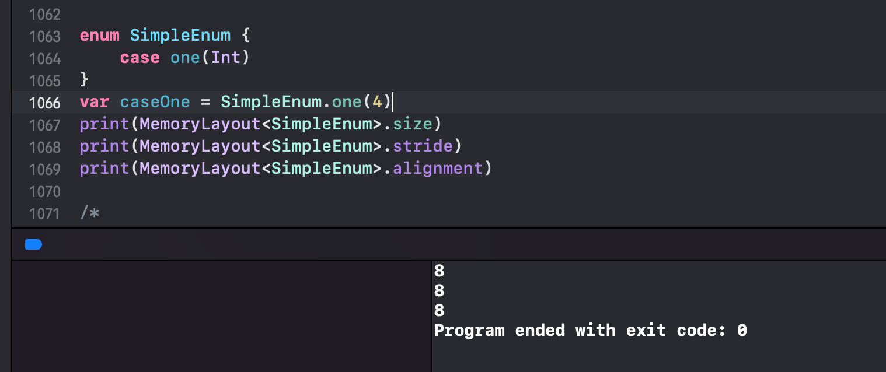

# Swift 枚举值内存布局

> enum 使用很简单，那大家有没有思考过系统针对枚举的实现是怎么样的？
>
> 不同类型的枚举占用多大内存空间？下面结合汇编来窥探下系统实现原理


## 基础枚举(不带关联值、不带原始值)

```swift
enum Season {
    case spring
    case summer
    case antumn
    case winter
}

var season: Season = Season.spring
print(Mems.ptr(ofVal: &season))
season = Season.summer
season = Season.antumn
print("over")
```

- `var season: Season = Season.spring` 基础枚举，默认值是0。

  

- `season = Season.summer`，此时可以看到第一个字节的位置是1. 

  

- `season = Season.antumn` ，此时可以看到第一个字节的位置是2

  

结论：查看内存信息，可以看到**不带关联值、不带原始值的基础枚举，只占1个字节大小空间，且值为默认值**

延伸：对于无关联值、无原始值的简单枚举，Swift 编译器会进行内存优化：

- 当枚举 case ≤ 256 个时，使用 1 字节（UInt8）
- 当 case ≤ 65536 时，使用 2 字节（UInt16）


## 只有原始值的枚举

不带关联值、只有原始值的枚举

```swift
enum Season : Int {
    case spring = 1
    case summer = 2
    case antumn = 3
    case winter = 4
}

//print(MemoryLayout<Season>.size)
//print(MemoryLayout<Season>.stride)
//print(MemoryLayout<Season>.alignment)

var season: Season = Season.spring
print(Mems.ptr(ofVal: &season))
season = .summer
season = .winter
print("over")
```

- `var season: Season = Season.spring` 基础枚举，变量默认值，可以看到第一个字节的位置是0

  

- `season = .winter` 基础枚举，当赋值为 winter 的时候，可以看到第一个字节的位置是3

  

结论：**只带有原始值的枚举，同样只占用1个字节，该字节的值为枚举的位置索引（比如1、2），而非原始值。原始值不占用枚举的内存**


## 只带有关联值的枚举

```swift
enum Season {
    case spring(Int, Int, Int)
    case summer(Int, Int)
    case antumn(Int)
    case winter(Bool)
    case unknown
}

print(MemoryLayout<Season>.size)
print(MemoryLayout<Season>.stride)
print(MemoryLayout<Season>.alignment)

var season: Season = Season.spring(1, 2, 3)
print(Mems.ptr(ofVal: &season))
season = Season.summer(4, 5)
season = Season.antumn(6)
season = Season.winter(true)
season = Season.unknown
print("over")
```

- `var season: Season = Season.spring(1, 2, 3)` 带有关联值的枚举：

  `.spring` 有3个 Int，单个 Int 占8个字节空间，所以红色框代表 spring 的1，蓝色框代表 spring 的2，绿色框代表 spring 的3，黄色框代表枚举的第1个 case，剩余7个字节，为空。后续的7个字节是为了内存对齐而补齐的内存。

  

  其内存信息如下（8字节为1组，对应上图）

  ```shell
  01 00 00 00 00 00 00 00 
  02 00 00 00 00 00 00 00 
  03 00 00 00 00 00 00 00 
  00
  00 00 00 00 00 00 00
  ```

  这段内存信息怎么看？我划分了下

  ```shell
  case spring 的关联值的第1个 Int：		 01 00 00 00 00 00 00 00 
  case spring 的关联值的第2个 Int：		 02 00 00 00 00 00 00 00 
  case spring 的关联值的第3个 Int：		 03 00 00 00 00 00 00 00 
  表明哪个 case 的索引值:					     00
  内存对齐占用：											  00 00 00 00 00 00 00
  ```

  下面的几组一样

- `season = Season.summer(4, 5)` 带有关联值的枚举，`.summer` 这个枚举关联值有2个 Int，单个 Int 占8个字节空间，所以红色框代表 summer 第一个关联值 4，蓝色框代表 summer 第二个关联值 5，绿色框为空，黄色框代表枚举的第2个 case，剩余7个字节，为空。

  

  其内存信息如下（8字节为1组，对应上图）

  ```shell
  case summer 的关联值的第1个 Int：	 	04 00 00 00 00 00 00 00 
  case summer 的关联值的第2个 Int： 	05 00 00 00 00 00 00 00 
  空（按照最大内存预留的位置）:	        00 00 00 00 00 00 00 00 
  表明哪个 case 的索引值:							01
  内存对齐占用：											 00 00 00 00 00 00 00
  ```

- `season = Season.antumn(6) 带有关联值的枚举，`. `antumn` 存在关联值 1个 Int，单个 Int 占8个字节空间，所以红色框代表 antumn 的6，蓝色框为空，绿色框为空，黄色框代表枚举的第3个 case，剩余7个字节，为空。

  

  其内存信息如下（8字节为1组，对应上图）

  ```shell
  case autumn 的关联值的第1个 Int：	06 00 00 00 00 00 00 00
  空（按照最大内存预留的位置）:				00 00 00 00 00 00 00 00 
  空（按照最大内存预留的位置）: 			00 00 00 00 00 00 00 00 
  表明哪个 case 的索引值:						02
  内存对齐占用：										 00 00 00 00 00 00 00
  ```

- `season = Season.winter(true)` 带有关联值的枚举，`. `winter`  关联值是 1个 Bool，单个 Bool 占1个字节空间，所以红色框代表 winter 的 true，蓝色框为空，绿色框为空，黄色框代表枚举的第4个 case，剩余7个字节，为空。

  

  其内存信息如下（8字节为1组，对应上图）

  ```shell
  case winter 的关联值的第1个 Int：	01 00 00 00 00 00 00 00 
  空（按照最大内存预留的位置）:				00 00 00 00 00 00 00 00 
  空（按照最大内存预留的位置）:				00 00 00 00 00 00 00 00 
  表明哪个 case 的索引值:						03
  内存对齐占用：										 00 00 00 00 00 00 00
  ```

- `season = Season.unknown`  带有关联值的枚举，`unknown` 没有关联值，所以红色框为空，蓝色框为空，绿色框为空，黄色框代表枚举的第5个 case，剩余7个字节，为空。

  

  其内存信息如下（8字节为1组，对应上图）

  ```shell
  case unknown 关联值的第1个Int:		  00 00 00 00 00 00 00 00 
  空(按照最大内存预留的位置):     			00 00 00 00 00 00 00 00 
  空(按照最大内存预留的位置):						00 00 00 00 00 00 00 00 
  表明哪个 case 的索引值:	  				   04
  内存对齐占用:											  00 00 00 00 00 00 00
  ```

- `MemoryLayout<Season>.size` ：3个 Int 最大为3*8，1个字节用来表达位置信息，`3*8 + 1 = 25`

- `MemoryLayout<Season>.stride` ：获取系统分配给数据类型的内存大小，也就是实际内存大小（对齐后的）

- `MemoryLayout<Season>.alignment` 内存对齐系数，以8 Byte 为单位，对象分配的内存必须是该值的整数倍

结论：

- **对于有不同枚举值有不同关联结构的枚举，其内存由关联值最大的 case 的内存决定（其余的 case 沿用该结构。所有 case 共享同一块内存区域。该区域大小为最大关联值所需内存）**
- **除了最大内存的 case 外，还需要1个字节存储所属哪个 case**（通常 1 字节，具体取决于 case 数量，1字节能表示的 case 数量为256个）
- **枚举总内存实际大小 = 1个字节存储所属哪个 case +  关联值所占内存最大的 case 的内存大小** 
- **另外，枚举所占内存还需要考虑内存对齐的情况。比如本例中实际内存为25，内存对齐为8字节，所以最终分配了32字节的内存**


## 只有一个 case 的枚举

```swift
enum SimpleEnum {
    case one
}
var caseOne = SimpleEnum.one
print(MemoryLayout<SimpleEnum>.size) 			// 0
print(MemoryLayout<SimpleEnum>.stride) 		// 1
print(MemoryLayout<SimpleEnum>.alignment) // 1
```

为什么 size 为0？看上去是一个变量，但根本不占内存。因为枚举里面就一个 case，所以里面根本不需要存储值来区分是哪个 case。 

```swift
enum SimpleEnum {
    case one
    case two
}
var caseOne = SimpleEnum.one	
print(MemoryLayout<SimpleEnum>.size)			// 1
print(MemoryLayout<SimpleEnum>.stride)		// 1
print(MemoryLayout<SimpleEnum>.alignment)	// 1
```

现在好理解，2个 case 需要存储1个 Byte 的值来区分是哪个 case，1 Byte 可以代表最多256个 case


## 只有1个 case 且带关联值的枚举

```swift
enum SimpleEnum {
    case one(Int)
}
var caseOne = SimpleEnum.one(4)
print(MemoryLayout<SimpleEnum>.size)			// 8	
print(MemoryLayout<SimpleEnum>.stride)		// 8
print(MemoryLayout<SimpleEnum>.alignment) // 8
```

- 带有关联值且只有1个 case 的枚举，因为有1个 Int 的关联值，需要8 Byte 存储关联值
- 但只有1个 case，不需要额外空间来判断所属哪个枚举值，所以不需要额外空间


请看下面的对照实验

```swift
enum SimpleEnum {
    case one(Int)
    case two
}
var caseOne = SimpleEnum.one(4)
print(MemoryLayout<SimpleEnum>.size)				// 9 
print(MemoryLayout<SimpleEnum>.stride)			// 16
print(MemoryLayout<SimpleEnum>.alignment)		// 8
```

2个 case，其中一个 case 有关联值 Int，所以需要8 Byte 存 Int 值，1 Byte 区分是哪个 case，实际需要占用 8 + 1 = 9 Byte，内存对齐单位是8，9向上为16。


### 为什么不能复用关联值的空间

case1 占用8个字节，case2 占用1个字节，能用 case1 的8个字节的最开始的位置存储 case2 的信息吗？这样的话节省内存

- **内存布局的确定性**：Swift 要求枚举实例的内存布局在编译时确定。若允许不同 case 复用同一块内存，会导致运行时动态解析内存布局，降低性能和安全性。

- **所有 case 共享同一块内存**：枚举实例的内存大小由**最大关联值的大小 + 标签所需空间**决定。

- **标签（Discriminant）**：用于区分不同 case，通常占用 1 字节（但具体由 case 数量决定）。

  **标签的占用大小**由枚举的 `case` 数量决定：

  - **1 个 `case`**：不需要标签（因为没有其他可能性）。
  - **2~256 个 `case`**：标签通常占用 **1 字节**（`UInt8`，可以表示 256 种可能）。
  - **257~65536 个 `case`**：标签占用 **2 字节**（`UInt16`）。
  - 更大数量依此类推（但实际中几乎不会用到如此多的 `case`）。

  - **内存对齐约束**：即使标签的逻辑占用小于 1 字节（例如只有 2 个 `case`，理论上只需 1 位），实际仍会占用 **至少 1 字节**（因为内存按字节寻址）。

- **内存对齐**：总大小会按对齐要求（如 8 字节）向上取整到最近的倍数（即 `stride`）。

  

以示例中的 `SimpleEnum` 为例：

- `case one(Int)`：需要 8 字节存储 `Int` + 1 字节标签 → 共 9 字节。
- `case two`：仅需 1 字节标签 → 但内存仍需按最大 case 分配（即 8 字节关联值空间 + 1 字节标签 → 总 9 字节）。

因此，无论当前是哪个 case，枚举实例始终占用 **9 字节**（对齐后 `stride` 为 16 字节）。


更改验证标签对于枚举占用内存大小的影响



可以看到 enum 只有1个 case 的时候，内存大小只和最大关联值大小有关，1个 case 的情况下不需要额外的空间来判断所属哪个 case。

因此此时枚举的内存大小 = 最大关联值的内存大小 = 8


## 用汇编验证下内存

```swift
enum Season {
    case spring(Int, Int, Int)
    case summer(Int, Int)
    case antumn(Int)
    case winter(Bool)
    case unknown
}

var season: Season = Season.spring(1, 2, 3)
print(Mems.ptr(ofVal: &season))
season = Season.summer(4, 5)
season = Season.antumn(6)
season = Season.winter(true)
season = Season.unknown
print("over")
```

断点停到 `var season: Season = Season.spring(1, 2, 3)` 位置


将断点处的汇编单独摘出来研究

```assembly
0x10000334b <+11>:  movq   $0x1, 0x8eaa(%rip)        ; demangling cache variable for type metadata for Swift.Array<Swift.UInt8> + 4
0x100003356 <+22>:  movq   $0x2, 0x8ea7(%rip)        ; SwiftDemo.season : SwiftDemo.Season + 4
0x100003361 <+33>:  movq   $0x3, 0x8ea4(%rip)        ; SwiftDemo.season : SwiftDemo.Season + 12
0x10000336c <+44>:  movb   $0x0, 0x8ea5(%rip)        ; SwiftDemo.season : SwiftDemo.Season + 23
0x100003373 <+51>:  movl   $0x1, %edi
```

`rip` 存储的说指令的地址。CPU 要执行的下一条指令地址就存储在 rip 中。所以在执行第一行的时候，rip 寄存器的值。

所以第一句汇编代码的意思是：rip 为 `0x100003356`，再加上 `0x8eaa`，得到一个地址值（用 Mac 自带的计算器可以算出）`0X10000C200`，然后 movq 是将十六进制的1赋值给 `0X10000C200` 这个地址。

第二句汇编代码类似，此时 rip 为 `0x100003361`，再加上 `0x8ea7`，得到一个地址值 `0X10000C208`，然后 movq 将十六进制的2赋值给 `0X10000C208` 这个地址。

第三句汇编代码类似，此时 rip 为 `0x10000336c`，再加上 `0x8ea4`，得到一个地址值 `0X10000C210`，然后 movq 将十六进制的3赋值给 `0X10000C210` 这个地址。

第四句汇编代码类似，此时 rip 为 `0x100003373`，再加上 `0x8ea5`，得到一个地址值 `0X10000C218`，然后 movq 将十六进制的0赋值给 `0X10000C218` 这个地址。

此时断点走到下一行，拿到 season 的内存地址 `0X10000C200` ，查看内存发现和上面理论分析一直

```shell
01 00 00 00 00 00 00 00 
02 00 00 00 00 00 00 00 
03 00 00 00 00 00 00 00 
00 00 00 00 00 00 00 00
```

结论：如果枚举存在关联值，内存大小为：
- 1个字节用来存储成员值
- n个字节用来存储关联值（n取占用内存最大的关联值），任何一个 case 的关联值都共用这 n 个字节
- 且存在内存对齐，所以占用大小为 n 和 1 的最大值，再结合内存对齐。
- 如果枚举的定义非常简单，系统会用1个字节来存放值，最大范围是256个 case。
- 枚举定义如果有原始值，也不会影响内存布局。


## switch 的工作原理

```swift
enum Season {
    case spring(Int, Int, Int)
    case summer(Int, Int)
    case antumn(Int)
    case winter(Bool)
    case unknown
}

var season: Season = Season.spring(1, 2, 3)
switch season {
    case let .spring(v1, v2, v3):
        print(".spring", v1, v2, v3)
    case let .summer(v1, v2):
        print(".summer", v1, v2)
    case let .antumn(v1):
        print(".antumn", v1)
    case let .winter(v1):
        print(".winter", v1)
    case .unknown:
        print(".unkown")
}
```

- Swift 先判断 season 的成员值，判断属于哪个 case。
  - 如果发现成员值为0，则走第1个 case，将 season 的前24个字节，分别赋值给第1个 case 的 v1、v2、v3
  - 如果发现成员值为1，则走第2个 case，将 season 的前16个字节，分别赋值给第2个 case 的 v1、v2
  - 如果发现成员值为2，则走第3个 case，将 season 的前8个字节，赋值给第3个 case 的 v1
  - 如果发现成员值为3，则走第4个 case，将 season 的第1个字节，赋值给第4个 case 的 v1
  - 如果发现成员值为4，则走第5个 case，则执行第5个 case 的打印逻辑


## Swift 枚举的本质

从表象来看，枚举存在以下情况：

- **不带关联值、不带原始值的基础枚举，只占1个字节大小空间，且值为默认值**
- **只带有原始值的枚举，同样只占用1个字节，该字节的值为枚举的位置索引（比如1、2），而非原始值**
- **带有关联值的枚举内存大小：**
  - **对于有不同枚举值有不同关联结构的枚举，其内存由关联值最大的 case 的内存决定（其余的 case 沿用该结构。所有 case 共享同一块内存区域。该区域大小为最大关联值所需内存）**
  - **除了最大内存的 case 外，还需要1个字节存储所属哪个 case**（通常 1 字节，具体取决于 case 数量，1字节能表示的 case 数量为256个）
  - **枚举总内存实际大小 = 1个字节存储所属哪个 case +  关联值所占内存最大的 case 的内存大小** 
  - **另外，枚举所占内存还需要考虑内存对齐的情况。比如本例中实际内存为25，内存对齐为8字节，所以最终分配了32字节的内存**

但从本质来讲：

- 对于无关联值、无原始值的简单枚举，Swift 编译器会进行内存优化：

  - 当枚举 case ≤ 256 个时，使用 1 字节（UInt8）

  - 当 case ≤ 65536 时，使用 2 字节（UInt16）

- **内存布局的确定性**：Swift 要求枚举实例的内存布局在编译时确定。若允许不同 case 复用同一块内存，会导致运行时动态解析内存布局，降低性能和安全性。

- **所有 case 共享同一块内存**：枚举实例的内存大小由**最大关联值的大小 + 标签所需空间**决定。

- **标签（Discriminant）**：用于区分不同 case，通常占用 1 字节（但具体由 case 数量决定）。

  **标签的占用大小**由枚举的 `case` 数量决定：

  - **1 个 `case`**：不需要标签（因为没有其他可能性）。
  - **2~256 个 `case`**：标签通常占用 **1 字节**（`UInt8`，可以表示 256 种可能）。
  - **257~65536 个 `case`**：标签占用 **2 字节**（`UInt16`）。
  - 更大数量依此类推（但实际中几乎不会用到如此多的 `case`）。

  - **内存对齐约束**：即使标签的逻辑占用小于 1 字节（例如只有 2 个 `case`，理论上只需 1 位），实际仍会占用 **至少 1 字节**（因为内存按字节寻址）。

- **内存对齐**：总大小会按对齐要求（如 8 字节）向上取整到最近的倍数（即 `stride`）。