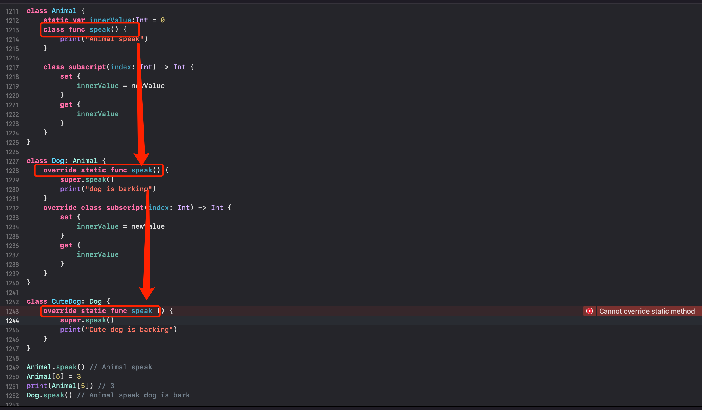
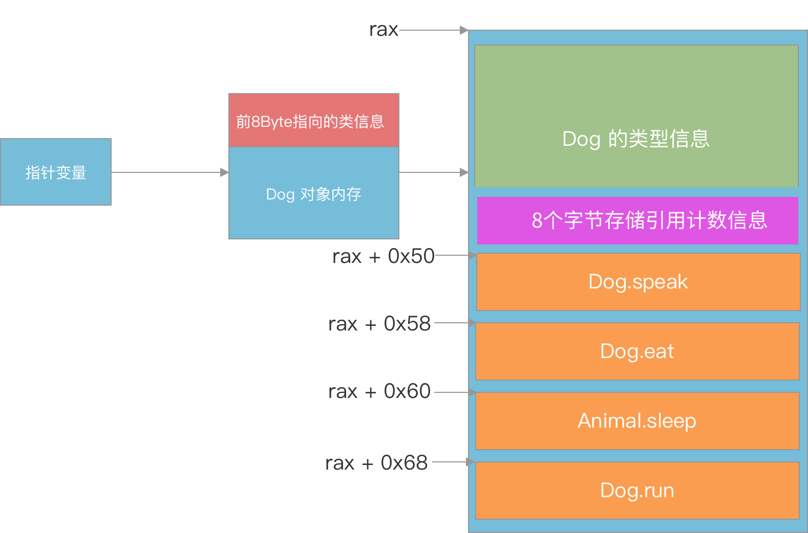

# Swift 类底层剖析

## 类的内存结构

```swift
class Person {
    var age: Int = 0
}

class Student: Person {
    var score: Int = 0
}

class Worker: Student {
    var salary: Int = 0
}

let person = Person()
person.age = 28
print(Mems.size(ofRef: person))	 	
print(Mems.memStr(ofRef: person))

32
0x000000010000c400 0x0000000000000003 
0x000000000000001c 0x0000000000000000

let student = Student()
student.score = 100
print(Mems.size(ofRef: student))
print(Mems.memStr(ofRef: student))
32
0x000000010000c4b0 0x0000000000000003 
0x000000000000001c 0x0000000000000064

let worker = Worker()
worker.salary = 1000
print(Mems.size(ofRef: worker))
print(Mems.memStr(ofRef: worker))
48
0x000000010000c580 0x0000000000000003 
0x000000000000001c 0x0000000000000064 0x00000000000003e8 0x00007ff8501c0938
```

- 内存对齐都是16 Byte 的整数倍
- 一个类内存中，至少占16字节的内存。前8位是类信息、其次的8位是引用计数信息，接着是属性内存区域
- 由于类存在继承，所以子类中，前16字节存储类信息和引用计数信息，其次是属性内存，存在继承的话，前面的属性是父类的属性，后面才是自己的属性。

所以：

- Person 类的内存： 8 Byte 的类信息 + 8 Byte 引用计数信息 + 8 Byte Int  Age 属性 = 24 Byte，由于需要16的倍数，所以是32 Byte
- Student 类的内存： 8 Byte 的类信息 + 8 Byte 引用计数信息 + 8 Byte Int  Age 属性 + 8 Byte 的 Int Score 属性 = 32 Byte，由于需要16的倍数，所以是32 Byte
- Worker 类的内存： 8 Byte 的类信息 + 8 Byte 引用计数信息 + 8 Byte Int  Age 属性 + 8 Byte 的 Int Score 属性  + 8 Byte 的 Int Salary 属性 = 40 Byte，由于需要16的倍数，所以是 48 Byte


## 继承

值类型（枚举、结构体）不支持继承，只有类支持继承

没有父类的类，称为基类。Swift 并不像 OC、Java 那样规定：任何类最终都要继承自某个基类（OC 的 NSObject）。

```swift
import Foundation
class Person {}
class Student: Person {}
print(class_getSuperclass(Student.self)!)		// Person
print(class_getSuperclass(Person.self)!) 		// _TtCs12_SwiftObject
```

丛输出可以看出 Swift 还存在一个隐藏基类：`Swift._SwiftObject`，可查看 [Swift 源码](https://github.com/apple/swift/blob/main/stdlib/public/runtime/SwiftObject.h)


## 方法

结构体和枚举是值类型，默认情况下，值类型的属性是不能被自身的实例方法修改。

如果想在方法内修改，需要在 `func` 前加 `mutating` 才可以

```swift
struct Point {
    var x: Double = 0.0
    var y: Double = 0.0
    func moveBy(_ delatX: Double, _ delatY: Double) {
        self.x += delatX
        self.y += delatY
    }
}
var point = Point()
point.moveBy(0.2, 0.2)
// compiler error
Left side of mutating operator isn't mutable: 'self' is immutable
```

改进

```swift
struct Point {
    var x: Double = 0.0
    var y: Double = 0.0
    mutating func moveBy(_ delatX: Double, _ delatY: Double) {
        self.x += delatX
        self.y += delatY
    }
}
var point = Point()
point.moveBy(0.2, 0.4)
print(point.x, point.y)
// 0.2 0.4
```


## 重写方法

`override` 

被 class 修饰的类型方法、下标，允许被子类重写

被 static 修饰的类型方法、下标，不允许被子类重写

```swift
class Animal {
    static var innerValue:Int = 0
    class func speak() {
        print("Animal speak")
    }
    
    class subscript(index: Int) -> Int {
        set {
            innerValue = newValue
        }
        get {
            innerValue
        }
    }
}

class Dog: Animal {
    override class func speak() {
        super.speak()
        print("dog is bark")
    }
    override class subscript(index: Int) -> Int {
        set {
            innerValue = newValue
        }
        get {
            innerValue
        }
    }
}

Animal.speak() // Animal speak
Animal[5] = 3
print(Animal[5]) // 3
Dog.speak() // Animal speak dog is bark
```

但如果将 `Animal` 方法的 `class` 改为 `static`，就无法 `override` 了




- 如果父类的方法是被 class 修饰的，子类继承后重写时，可以将 class 改为 static。
- 虽然子类可以将父类方法的 class 改为 static。但影响的是当前子类的子类，无法再重写方法了。


## 重写属性

- 子类不可以将父类的属性改写为存储属性
- 子类可以将父类的属性（存储属性、计算属性）重写为计算属性
- 只能重写 var 属性，不能重写 let 属性
- 重写时，属性名、类型要一致
- 子类重写后的属性权限（读写），不能小于父类属性的权限
  - 如果父类属性是只读的，子类重写后的属性要么是只读的，要么是可读可写的
  - 如果父类的属性是可读可写的，子类重写后的属性也必须是可读可写的


## 重写类型属性

- 被 class 修饰的计算类型属性，可以被子类重写
- 被 static 修饰的类型属性（存储、计算），不可以被子类重写
- 可以在子类中为父类属性（除了只读的计算属性、let 属性）增加属性观察器

```swift
class Shape {
    var radius: Int = 1 {
        willSet {
            print("Shape will set radius", newValue)
        }
        didSet {
            print("Shape did set radius", oldValue, radius)
        }
    }
}
class Circle: Shape {
    override var radius: Int {
        willSet {
            print("Cirle will set radius", newValue)
        }
        didSet {
            print("Circle did set radius", oldValue, radius)
        }
    }
}
var circle = Circle()
circle.radius = 2
// console
Cirle will set radius 2
Shape will set radius 2
Shape did set radius 1 2
Circle did set radius 1 2
```

可以看到输出类似 Node 的洋葱模型，willset 从外到里，didset 从里到外。 


## final

- 被 final 修饰的方法、属性、下标是禁止被重写的

- 被 final 修饰的类，禁止被继承


## Swift 协议（Protocol）中声明的属性必须使用 var 关键字

协议的核心目标：定义“能力”而非“实现”
协议是描述类型应该具备什么能力的抽象蓝图，而不是具体实现。
属性在协议中本质上定义的是对外的访问接口（读、写），而不是存储方式（常量或变量）。
因此，**协议中的属性声明必须明确其访问权限（{ get } 或 { get set }），而 var 是唯一能表达这种动态性的关键字**。

- 协议中的属性用 var：统一表示“访问接口”，支持动态约束（{ get } 或 { get set }）。
- 遵循类型可用 let 或 var：只要满足协议的访问权限要求即可。
- let 无法用于协议：因其无法表达可写性，违背协议动态描述能力的初衷。


## <span id="target-anchor">多态的实现原理</span>

- OC： Runtime
- C++：虚函数表
- Swift：没有 Runtime，所以多态的实现类似 C++

来个 Demo
```swift
class Animal {
    func speak () {
        print("Animal speak")
    }
    func eat () {
        print("Animal eat")
    }
    func sleep () {
        print("Animal sleep")
    }
}

class Dog: Animal {
    override func speak() {
        print("Dog speak")
    }
    override func eat() {
        print("Dog eat")
    }
    func run () {
        print("Dog run")
    }
}

var animal = Animal()
animal.speak()
animal.eat()
animal.sleep()

animal = Dog()
animal.speak()
animal.eat()
animal.sleep()
// console
Animal speak
Animal eat
Animal sleep
Dog speak
Dog eat
Animal sleep
```

在 `animal.speak()` 处加断点，可以看到


解释：

- 汇编84行 `movq  0x9356(%rip), %r13 ` 是将全局变量 `animal` 的地址赋值给  `r13`
- 汇编90行 `movq  (%r13), %rax` 将 `r13` 处取出内存的前8个字节，赋值给 `rax`
- 汇编91行 `callq *0x50(%rax)` ，也就是计算出 `rax + 0x50` 的地址，然后取出8 Byte 出来，也就是 `Dog.speak` 然后调用
- 汇编107行 `callq *0x58(%rax)` ，也就是计算出 `rax + 0x508` 的地址，然后取出8 Byte 出来，也就是  `Dog.eat` 然后调用
- 汇编123行 `callq *0x60(%rax)` ，也就是计算出 `rax + 0x60` 的地址，然后取出8 Byte 出来，也就是 `Animal.sleep` 然后调用


画了张图，也就是说 `rax` 中存放了 Dog 对象内存中的前8个字节，也就是下图的最右侧




核心是上面的内存布局图。结合汇编就知道多态是如何实现的。

1. Swift 多态的实现原理

Swift 的多态通过 虚函数表（vtable） 实现，这是一种 编译时确定的动态派发机制。其核心逻辑是：

- 每个类类型在编译时会生成一个 虚函数表，表中存储了类的方法实现指针
- 子类继承父类时，会复制父类的虚函数表，并替换重写方法的指针为自己的实现
- 在运行时，通过对象的 类型元数据指针 找到对应的虚函数表，从而调用正确的方法

动态派发与静态派发的区别：
- 动态派发：通过虚函数表实现（例如普通类方法），允许子类重写。
- 静态派发：编译时直接绑定方法地址（例如 final 方法、static 方法、结构体和枚举的方法），性能更高

2. 虚函数表（vtable）的作用

虚函数表的核心作用是为 动态派发 提供支持：
- 方法重写：子类通过覆盖虚函数表中的方法指针，实现多态。
- 运行时方法查找：对象调用方法时，通过虚函数表找到实际的方法实现。
- 类型安全性：保证方法调用的正确性，即使对象被向上转型（例如 父类引用 = 子类对象）。


总结： **虚函数表**（vtable）是一种用于实现动态多态性的机制，通常用于面向对象的编程语言中（C++ 也是一样）。在 Swift 中，虚函数表用于存储类或协议中方法的地址，以便在运行时进行动态分派。

在 Swift 中，虚函数表的作用是为每个类或协议创建一个表，其中包含了对应方法的地址。当调用对象的方法时，运行时系统会根据对象的实际类型查找对应的虚函数表，然后调用表中存储的方法地址，从而触发特定的实现。

虚函数表在 Swift 中的作用是实现动态分派，使得在运行时根据对象的实际类型确定调用的具体实现。这为 Swift 中的多态性提供了基础，允许相同的方法名称根据对象的类型触发不同的实现，从而实现灵活的对象行为。

最小内存占用：一个没有属性的类对象至少占用 16 字节（类型元数据指针 8 字节 + 引用计数 8 字节）。
属性存储：属性从第 17 字节开始存储
引用计数细节：
- 默认情况下，引用计数直接存储在对象头部。
- 当引用计数溢出时，Swift 会使用 Side Table 扩展存储，此时对象头部的引用计数字段会指向 Side Table。
  

## 类的类型信息存储在哪

说明：同一个类的不同对象，它的类信息是一样的。也就是说不通的对象指针，所指向的类信息内存是同一块。

```swift
var dog1 = Dog()
var dog2 = Dog()
```

存储在全局区。可以利用 MachOView 去查看。


## 初始化器

### 初始化器可以继承
- convenience 便捷初始化器只可以横向调用，不可以纵向调用（比如子类继承父类后，子类重写指定初始化器的时候，必须加 override 且子类中只能调用父类的指定初始化器，不能调用便捷初始化器）
- 便捷初始化器是不能被子类调用的


### 自动继承
- 如果子类没有自定义任何指定初始化器，则会自动继承父类所有的指定初始化器


### require

- 用 required 修饰的指定初始化器，表明其所有的子类都必须实现该初始化器（通过继承或者重写来实现）
- 如果子类重写了 required 初始化器，也必须加上 required，不用加 override


### 可失败初始化器

类、结构体、枚举都可以使用 `init?` 定义可失败初始化器，也可以用 `init!` 来定义可失败初始化器。区别下面会讲

```swift
class Person {
    var name: String
    init?(_ name: String) {
        if name.isEmpty {
            return nil
        }
        self.name = name
    }
}

var person1 = Person("")
print(person1) // nil
var person2 = Person("FantasticLBP")
print(person2)	// Optional(SwiftDemo.Person)
print(person2!)	// SwiftDemo.Person
```

这种设计系统中也存在，比如 Int 的可失败初始化器：`@inlinable public init?(_ description: String)`

```swift
var num = Int("12e2")
print(num)	// nil
num = Int("12")
print(num) // Optional(12)
```

注意点：

1. 不允许同时定义参数标签、参数个数、参数类型相同的可失败初始化器和非可失败初始化器。因为在外部调用的时候，不知道到底是使用哪个初始化方法。编译器会报错 `Invalid redeclaration of 'init(_:)'`

   

2. 可以用 `init!` 来定义隐式解包的可失败初始化器

3. 可失败初始化器可以调用非可失败初始化器，非可失败初始化器调用可失败初始化器需要进行解包。如果直接调用会报错 `A non-failable initializer cannot delegate to failable initializer 'init(_:)' written with 'init?'`

   ```swift
   class Person {
       var name: String
       init?(_ name: String) {
           if name.isEmpty {
               return nil
           }
           self.name = name
       }
       convenience init() {
           self.init("")! // 极端 case，设计不合理
       }
   }
   ```

   非可失败初始化器也可以调用可失败初始化器的隐式解包。

   ```swift
   class Person2 {
       var name: String
       init!(_ name: String) {
           if name.isEmpty {
               return nil
           }
           self.name = name
       }
       convenience init() {
           self.init("")
       }
   }
   ```

   

   且前面的写法比较危险，假设第一个 `init?` 返回 `nil`，第二个 `convenience init()` 去对 nil 强制解包，则会 crash

4. 可以用一个非可失败初始化器重写一个可失败初始化器，但反过来不行

5. 如果初始化器调用一个可失败初始化器导致初始化失败，那么整个初始化过程都失败，并且之后的代码都停止执行

   ```swift
   class Person {
       var name: String
       init?(_ name: String) {
           if name.isEmpty {
               return nil
           }
           self.name = name
       }
       convenience init?() {
           self.init("")
           print("我是后面的代码1")
           print("我是后面的代码2")
       }
   }
   
   var person1 = Person()
   print(person1)
   ```

   `init` 初始化失败，后面的 `我是后面的代码1` 均不会执行

### 可失败初始化器设计哲学

- 安全性优先：Swift 注重安全性，可失败初始化器的设计使得对象的初始化过程更加可靠和安全。通过返回一个可选值来表示初始化成功或失败，可以避免在初始化失败时产生不确定的对象状态
- 错误处理：可失败初始化器与 Swift 的错误处理机制结合使用，使得在初始化失败时能够更好地捕获和处理错误。这种设计哲学强调了对异常情况的处理和错误信息的传递。
- **灵活性**：可失败初始化器提供了一种灵活的初始化机制，允许开发者更加精确地控制对象的初始化过程。这种设计哲学使得对象初始化更加灵活和可定制。


### OC alloc init，为什么 Swift 只需要 init？

1. 语言设计哲学的分歧

   OC 显示控制与动态性。OC 是 C 的超集，继承了对底层内存管理的直接控制。`alloc` 和 `init` 的分离体现了**职责分离**原则：

   - **`alloc`**：类方法（`+alloc`），负责**内存分配**（计算对象大小、向系统申请内存空间，返回一个“空白”实例）。
   - **`init`**：实例方法（`-init`），负责**状态初始化**（设置属性默认值、建立对象依赖关系等）。
   - 这种分离允许开发者灵活干预内存分配（例如自定义 `+allocWithZone:`）或初始化过程（例如工厂方法 `+new`）。

   Swift 简洁性与安全性

   - Swift 作为现代语言，追求代码简洁和安全性。`Person()` 的语法**隐藏了内存分配细节**，开发者只需关注初始化逻辑。编译器会自动插入内存分配代码（类似 `__allocating_init`）并调用初始化方法。类似 `let person = Person.__allocating_init()`
   - Swift 强制在初始化完成前为所有存储属性赋值，并通过两段式初始化（Phase 1: 分配内存并设置默认值；Phase 2: 自定义初始化）避免未定义状态

2. 编译器与运行时的工作

   OC：运行时开放性

   Objective-C 的 `+alloc` 方法由运行时动态处理。开发者可以重写 `+alloc` 或 `+allocWithZone:` 实现自定义内存分配策略（例如对象池、单例）。为了实现这种灵活性，更需要显式调用 alloc

   ```objective-c
   // 自定义 alloc 方法
   + (instancetype)alloc {
       if (单例条件) {
           return sharedInstance;
       }
       return [super alloc];
   }
   ```

   Swift: 编译时的静态优化

   - 内存分配的编译时确定：Swift 的对象大小和内存布局在编译时即可确定（值类型更是完全静态）。编译器直接生成内存分配指令，无需运行时动态计算。
   - 初始化器的静态派发：Swift 的初始化方法通过静态派发（或虚表派发）调用，无需 Objective-C 的消息转发开销。编译器能安全地合并内存分配和初始化步骤。

为什么 Swift 可以省略 `alloc`？

1. **编译器自动化**：内存分配由编译器隐式插入代码处理，无需开发者参与。
2. **类型安全性**：严格的初始化规则确保对象在初始化完成后处于合法状态。
3. **现代语法设计**：隐藏底层细节，提升代码可读性和编写效率。
4. **静态优化**：编译时确定对象内存布局，无需运行时动态分配逻辑。

而 Objective-C 保留 `alloc` 和 `init` 的分离，既是对历史的兼容，也为需要精细控制内存或动态行为的场景保留了灵活性。


### deinit

deinit 也叫反初始化器，类似于 C++ 的析构函数、OC 中的 dealloc 方法

当类的实例对象被释放内存时，就会调用实例对象的 deinit 方法

```swift
class Person {
    deinit {
        print("Person deinit")
    }
}

class Student: Person {
    deinit {
        super.deinit()	// Deinitializers cannot be accessed
        print("Student deinit")
    }
}

func test() {
    let st = Student()
}
test()
```

上述代码编译报错：Deinitializers cannot be accessed

deinit 的基本规则：

- **不可继承性**：`deinit` 本身不会被继承。每个类必须定义自己的 `deinit` 方法（显式或隐式）。
- **自动链式调用**：无论子类是否重写 `deinit`，父类的 `deinit` 方法总会在子类析构完成后被自动调用，无需手动调用 `super.deinit()`。

## 可选链

```swift
var dict:[String: (Int, Int) -> Int] = [
    "sum": (+),
    "minus": (-),
    "multiple": (*),
    "divide": (/)
]
print(dict["sum"]) // Optional((Function))
var result = dict["divide"]?(40, 20) // 2
print(result!)
```

- 如果可选项为 nil，调用方法、下标、属性失败，结果为 nil
- 如果可选项不为 nil，调用方法、下标、属性成功，结果会被包装为可选项
- 如果结果本来是可选项，则不会进行再次包装
- 如果链中任何一个节点为 nil，那么整个链就会调用失败。`var weight = person?.dog?.weight // Int?`
- 多个 `?` 可以链接在一起 `var weight = person?.dog?.weight`


## 可选项 Optional 的本质

可选项的本质是 **enum 类型 + 泛型**

```swift
@frozen public enum Optional<Wrapped> : ExpressibleByNilLiteral {

    /// The absence of a value.
    ///
    /// In code, the absence of a value is typically written using the `nil`
    /// literal rather than the explicit `.none` enumeration case.
    case none

    /// The presence of a value, stored as `Wrapped`.
    case some(Wrapped)

    /// Creates an instance that stores the given value.
    public init(_ some: Wrapped)    
}
```

`var age:Intt? = 20`  是语法糖，本质是 `var age:Optional<Int> = .some(20)` 所以下面写法是一样的

```swift
// 写法1
var age1: Int? = 30
age1 = 20
age1 = nil

// 写法2 
let age2: Optional<Int> = .some(30)
age2 = 20
age2 = .none
```

一些不合格的写法：

Optional 是 enum + 泛型，所以必须要设置泛型类型

```swift
var age = Optional.none	// Generic parameter 'Wrapped' could not be inferred
```

`if let` 是专门用于 Optional 解包的语法糖。
```swift
var age: Int? = .none

if let a = age {
    print(a)
} else {
    print("nil")
}
```
等价于
```swift
if age != nil {
    let a = age!
    print(a)
} else {
    print("nil")
}
```

- 只有非 nil 时，才会进入 if 分支，并将解包后的值绑定到 a
- nil 时，直接进入 else 分支

`switch case` 是通用模式匹配，不针对 Optional 做特殊处理。
```swift
switch age {
    case let a:
        print("age is ", a)
    case nil:
        print("nil")
}
```
- 第一个 case let a 会匹配所有可能的值（包括 .some(30) 和 .none，即 nil），因为 a 的类型是 Int?。
- 一旦匹配到第一个 case，后续的 case nil 会被跳过。除了第一个之外的 case 都无法执行
**要在 switch 中正确处理 Optional，需明确匹配 .some 和 .none，需要用 `case let a?`**
```swift
switch age {
    case let a?:
        print("age is ", a)
    case nil:
        print("nil")
}
```
下面写法效果等价于
```swift
var age: Int? = .none
age = nil

if let a = age {
    print(a)
} else {
    print("nil")
}

switch age {
    case let a?:
        print("age is ", a)
    case nil:
        print("nil")
}

switch age {
    case let .some(a):
        print("age is ", a)
    case nil:
        print("nil")
}
```
双层嵌套可选型：
```swift 
var age1 = Optional<Int?>.some(Optional<Int>.some(30))
var age2: Int?? = 30
var age3: Optional<Optional> = .some(.some(30))
var age4: Optional<Int?> = .some(30)
print(age1!!)
print(age2!!)
print(age3!!)
print(age4!!)
```


## X.self , X.Type,  AnyClass

- `X.self` 是一个元类型（metadata）的指针，metadata 存放着类型相关信息
- `X.self` 属于 `X.type` 类型

通过汇编探究下背后细节

```swift
class Person { }
var person: Person = Person()
var personType: Person.Type = Person.self
```


在第二行代码下断点，可以看到关键的汇编是第8行和第12行：

- 第14行可以看到 `rip + 0x89ae = 0x10000396a + 0x89ae = 0x10000C318 `，明显是一个堆地址空间，也就是全局变量 `person`

- 第15行可以看到 `rip + 0x89af = 0x100003971 + 0x89af = 0x10000C320 `，明显是一个堆地址空间，也就是全局变量 `personType`

- 顺着关键代码找上去，看看 `rax`、`rcx` 的值是哪来的

- 第8行调用函数后可以看到 Xcode 的说明，获取 `metadata`，函数返回值保存到 `rax`，LLDB 打印出为 `0x000000010000c248`

- 第11行初始化堆内存后，将地址保存到寄存器 `rax`，LLDB 打印出地址为 `0x0000600000004010`，然后查看 `0x0000600000004010` 对应的对象信息，可以看到内存的前8个字节的值，就是上面得到的 `metadata` 对象的地址值

- person 对象的内存布局中，前8个字节就是 personType 的地址。

- `metadata` 结构类似下图右侧

  


`X.self` 和 `type(of:x)` 效果等价

```swift
class Person { }
var person: Person = Person()
print(Person.self == type(of: person)) // true
```

`AnyObject.Type` 的用法

```swift
class Person {
   
}
class Student: Person {
    
}

var anyType: AnyObject.Type = Person.self
anyType = Student.self

public typealias AnyClass = AnyObject.Type

var anyType2: AnyClass = Person.self
anyType2 = Student.self

```


### 元类型的应用

```swift
class Person {
    required init() {}
}
class Worker: Person {}
class Student: Person {}
func createInstance(_ items: [Person.Type]) -> [Person] {
    var people:[Person] = Array<Person>()
    for item in items {
        people.append(item.init())
    }
    return people
}

let student = Student()
let studentType = type(of: student)
let workerType = Worker.self
var people: Array<Person> = createInstance([studentType, workerType])
print(people)	// [SwiftDemo.Student, SwiftDemo.Worker]
```

注意：为了保证子类一定有 `init(){ }` 方法，在基类中需要声明为 `required init() {}`


## Swift 继承和基类

```swift
import Foundation
class Person {
    var age:Int = 0
}

class Student: Person {
    var no:Int = 0
}

print(class_getInstanceSize(Student.self))	// 32
print(class_getSuperclass(Student.self)!)	  // Person
print(class_getSuperclass(Person.self)!)	  //_TtCs12_SwiftObject

```

分析：

- Student 类继承自 Person 类，类的内存布局中：

  - isa：前8个字节是 isa 指针，指向类的元数据（AnyObject.Type），包含类型信息、方法表。 虚函数表（vtable）存储在类的元数据中，虚函数表并不直接存储在实例内存中，而是通过 isa 指向的类元数据（ClassMetadata）中。

    调用方法时候，运行时通过 isa 找到类元数据，再从元数据中读取 vtable 地址，最终定位到具体方法实现地址

  - 引用计数：紧接着的8个字节存储引用计数信息

  - 紧接着是从 Person 继承来的 age 属性，占8个字节。然后是自己的 no 属性，也占8个字节。

- Student 类的父类是 Person 类，打印没问题

- Swift 类的隐式根类

  - Swift 有个隐藏基类：`Swift._SwiftObject`
  - Person 类没有显式继承其他类，它默认会隐式继承自 Swift 的内部根类 `SwiftObject`。这个类是 Swift 运行时的基础，类似于 Objective-C 的 `NSObject`，但独立存在。蕾丝
  - `_TtCs12_SwiftObject` 是 `SwiftObject` 类在 Objective-C 运行时中的**符号化名称**（mangled name）
  - `_TtC`：Swift 类的固定前缀。
  - `s12`：模块名或类名的编码长度。
  - `SwiftObject`：实际类名

- 与 Objective-C 运行时的交互

  - **`class_getSuperclass` 的局限性**
    `class_getSuperclass` 是 Objective-C 运行时函数，返回的是 Objective-C 运行时能识别的父类。由于 `SwiftObject` 是 Swift 内部类，Objective-C 运行时无法直接理解它，因此返回其符号化名称。
  - **Foundation 的影响**
    导入 `Foundation` 会引入 Objective-C 运行时，但不会改变 Swift 类的默认根类。只有显式继承 `NSObject` 的 Swift 类才会在 Objective-C 运行时中以 `NSObject` 为根类。


`Swift._SwiftObject` 的作用:

- **纯 Swift 类的默认父类**
  当 Swift 类不显式继承 `NSObject` 或其他类时，默认隐式继承自 `Swift._SwiftObject`。
- **提供基础能力**
  类似于 Objective-C 的 `NSObject`，`Swift._SwiftObject` 提供了：
  - 内存管理：引用计数（通过 `swift_retain`/`swift_release`）。
  - 类型元数据：存储类的方法表、属性信息等。
  - 动态派发：支持方法重写和协议扩展。

通过源码查看 Swift 类的内存布局

```swift
struct HeapObject {
  HeapMetadata const *metadata;	// 包含 isa 和引用计数

  SWIFT_HEAPOBJECT_NON_OBJC_MEMBERS;
  ...
}
 
#define SWIFT_HEAPOBJECT_NON_OBJC_MEMBERS       \
  InlineRefCounts refCounts
```

`HeapObject` 是 Swift 对象的基础结构，包含 `isa` 和引用计数字段


## Self

**`Self` 是动态类型，会随着子类调用而改变**。Self 一般用作返回值类型，限定返回值跟方法调用者必须是同一类型（也可以当作参数类型）

```swift
protocol Runable {
    init()
    func copy() -> Self
}

class Person: Runable {
    required init() {}
    func copy() -> Self {
        type(of: self).init()
    }
}

class Student: Person { }

var person = Person()
print(person.copy()) // Person
var student = Student()
print(student.copy()) // Student
```

QA：上面的 Person 类在遵循 Runable 协议，实现 copy 方法，方法里能返回 `Person()` 吗？

```swift
class Person: Runable {
    required init() {}
    func copy() -> Self {
        Person()
    }
}
```

答：不行。因为 Person 类可以被继承，如果 copy 方法里写死返回 Person 实例。Student 继承 Person 后，copy 方法会也会返回 Person 对象。但协议要求的是返回当前类的对象，这明显违法了协议“契约”


## OC/Swift 运行时

### 消息派发方式

消息派发方式有3种

#### 直接派发（Direct Dispatch）

会将整个方法的地址，直接硬编码到函数调用的地方。直接派发是最快的，不止是因为需要调用的指令集会更少，并且编译器还能够有很大的优化空间，例如函数内联等，直接派发也被称为静态调用

然而，对于编程来水，直接调用也是最大的局限，而且因为缺乏动态性，所以没有办法支持继承和多态等特性。


#### 函数表派发（Table Dispatch）

函数表派发是编译型语言实现动态行为最常见的方式。寒暑表使用了一个数组来存储类生命的每一个函数的指针。大部分语言把整个称为“Virtual table”（虚函数表、虚表，c++），Swift 里称为 “witness table”。每一个类都会维护一个函数表，里面记录着类所有的函数，如果父类函数被 override 的话，表里面只会保存被 overrride 后的函数。一个子类新添加的函数都会被插入到这个数组的最后，运行时会根据这一个表去决定实际需要被调用的函数。

就像上面[多态实现的原理](#target-anchor)这里讲到的一样


查表是一种简单、易实现、性能可预知的方式。然而，这种派发方式比起直接派发来说，还是慢了一点（从字节码的角度来看，多了两次读和一次跳转。由此带来了性能损耗）。另一个慢的原因在于编译器可能会由于函数内执行的任务，导致无法优化（如果函数带有副作用的话）

这种基于数组的实现，缺陷在于函数表无法拓展。子类会在虚函数表的最后插入新函数，没有位置可以让 extension 安全地插入函数。


####  消息机制派发（Message Dispatch）

消息机制是调用函数最动态的方式，也是 Cocoa 的基石，催生了 KVO、UIAppearance、CoreData 等，这种运作方式的关键在于开发者可以在运行时改变函数的行为。不止可以通过 swizzling 来改变，甚至可以用 isa-swizzling 修改对象的继承关系，可以在面向对象的基础上实现自定义派发。


### OC 运行时

主要体现在
- 动态类型（dynamic typing）
- 动态绑定（dynamic binding）
- 动态装载（dynamic loading）


### Swift 运行时
- 纯 Swift 类的函数调用已经不再是 Objective-C 的运行时发消息，而是类似 c++ 的虚表 vtable，在编译时就确定了调用哪个函数，所以没办法通过 runtime 获取方法、属性
- 而 Swift 为了兼容 Objective-C，凡是继承自 NSObject 的类都会保留其动态性，所以能够通过 runtime 拿到方法。老版本的 swift（如2.2）是编译期隐式的自动帮你加上了 `@objc`，而4.0以后版本的 swift 编译期去掉了隐式特性，必须显示声明
- 不管是 Swift 类，还是继承自 NSObject 的类，只要在属性和方法前面加 `@objc` 关键字，就可以使用 runtime


|                      | 原始定义   | 拓展       |
| -------------------- | ---------- | ---------- |
| 值类型               | 直接派发   | 直接派发   |
| 协议                 | 函数表派发 | 直接派发   |
| 类                   | 函数表派发 | 直接派发   |
| 继承自 NSObject 的类 | 函数表派发 | 函数表派发 |


- 值类型总是会使用直接派发，简单易懂
- 协议和类的 extension 都会使用直接派发
- NSObject 的 extention 会使用消息机制进行派发
- NSObject 声明作用域的函数都会使函数表进行派发
- 协议里声明的，并且带有默认实现的函数会使用函数表进行派发


修饰符

| final            | 直接派发               |
| ---------------- | ---------------------- |
| dynaminc         | 消息机制派发           |
| @objc & @nonobjc | 改变在 oc 里的可见性   |
| @inline          | 告诉编译器可以直接派发 |


有个特殊的组合 final 和 @objc。在标记为 final 的同时，也可以使用 @objc 来让函数可以使用消息机制派发。这么做的结果就是，调用函数的时候会使用直接派发，但也会在 Objective-C 的运行时里注册对应的 selector，函数可以响应 `perform(selector:)` 以及别的 Objective-C 特性，但在直接调用时，又可以有直接派发的性能。

