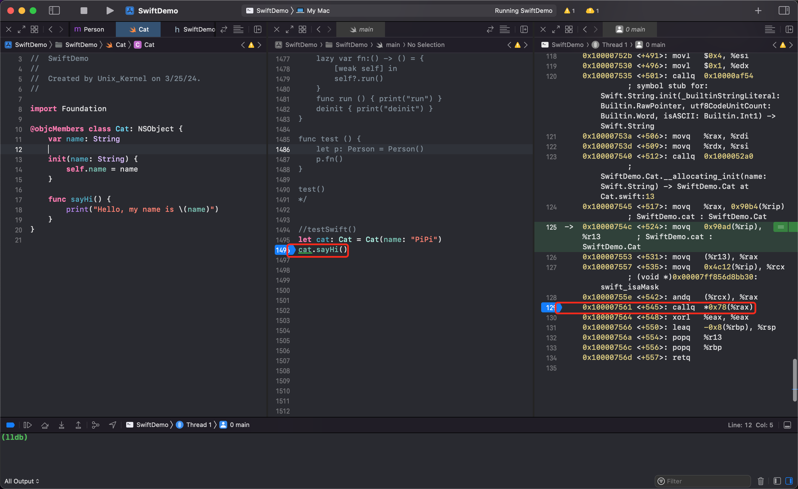
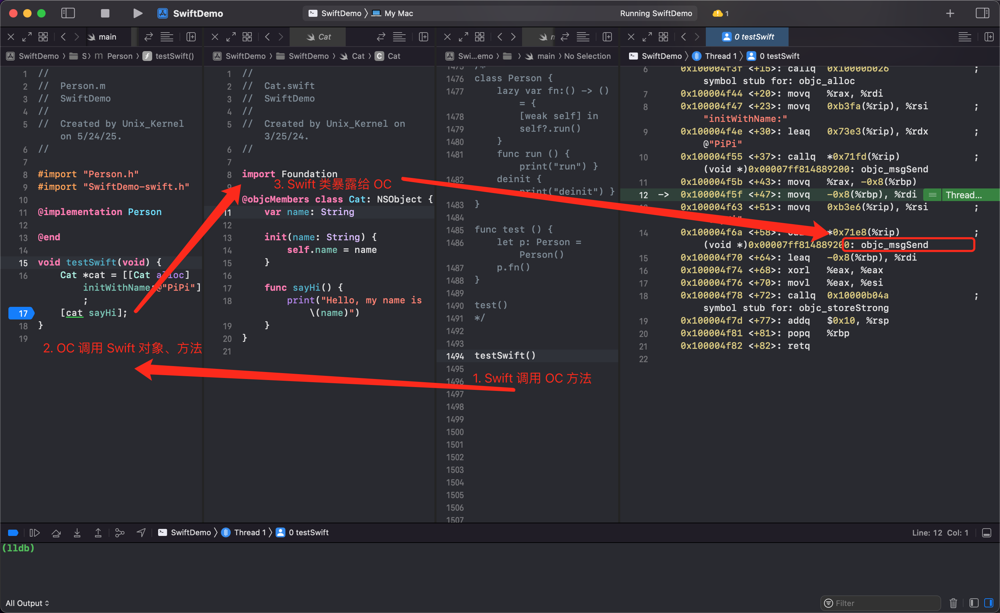
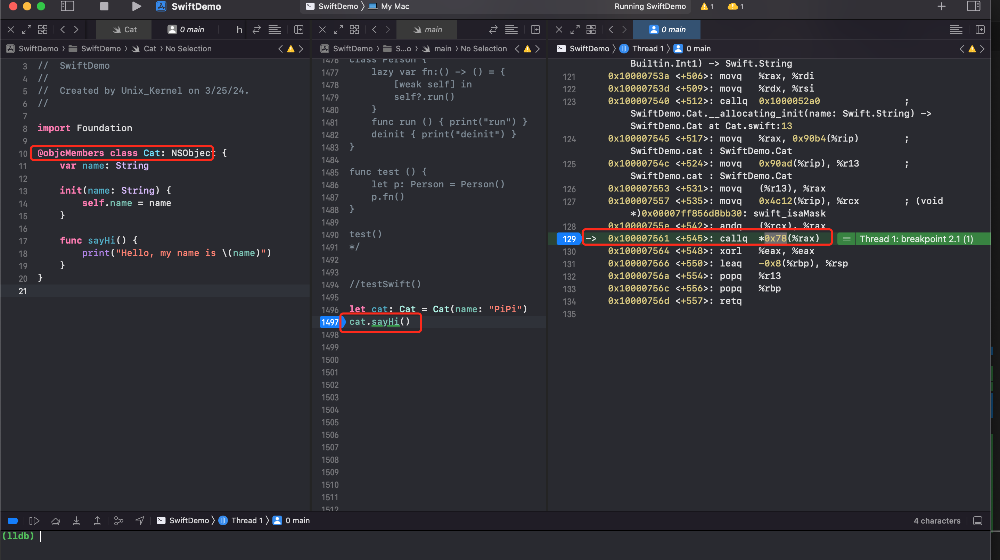
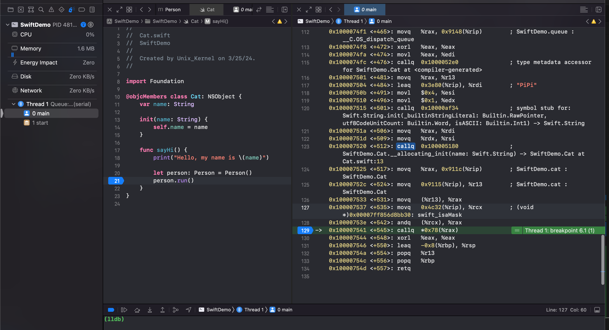
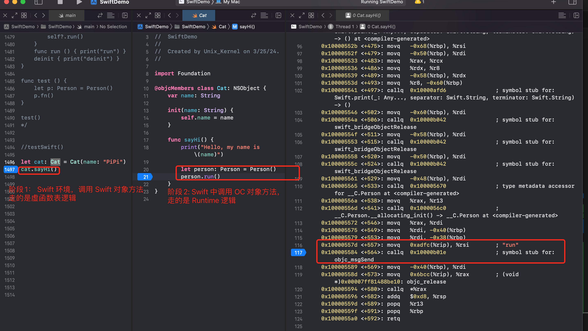
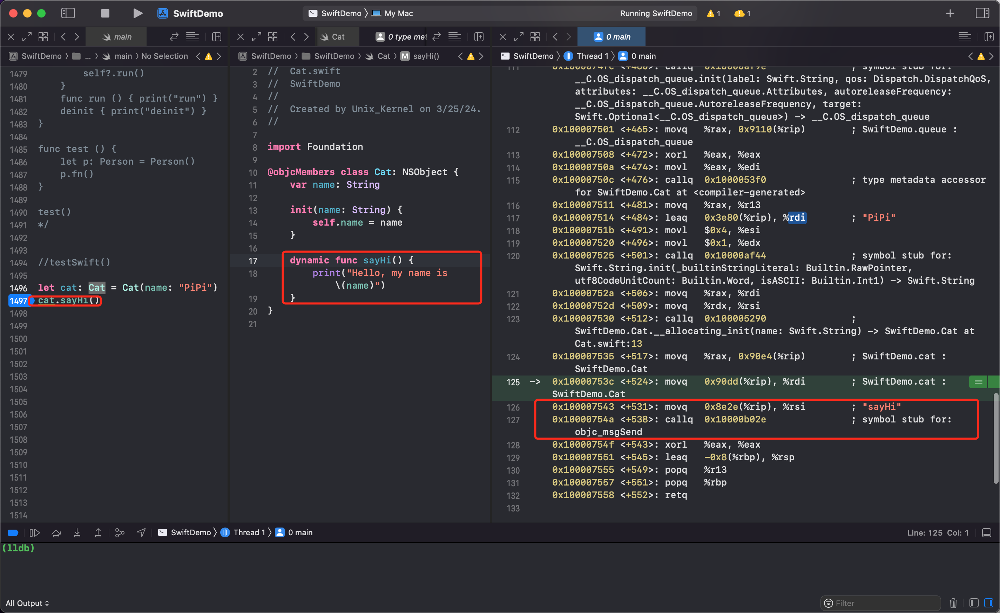

# 从 OC 到 Swift 

## OC 与 Swift 混编模式下，方法调用原理探究

OC 与 Swift 混编

`Person.h`

```objective-c
#import <Foundation/Foundation.h>

NS_ASSUME_NONNULL_BEGIN

@interface Person : NSObject

- (instancetype)initWithCat:(id)cat;

- (void)showPower;

@end

NS_ASSUME_NONNULL_END
  
#import "Person.h"
#import "TestiOSWithSwift-Swift.h"

@interface Person()

@property (nonatomic, strong) Cat *cat;
@end
@implementation Person

- (instancetype)initWithCat:(id)cat {
    if (self = [super init]) {
        _cat = cat;
    }
    return self;
}

- (void)showPower {
    NSLog(@"I have a cat");
    [self.cat sayHi];
    [self.cat run];
}

@end
```

`Cat.Swift`

```swift
import Foundation

@objcMembers class Cat: NSObject {
    var name: String
    init(_ name: String = "Tom") {
        self.name = name
    }
    
    func  sayHi () {
        print("My name is \(name)")
    }
    
    func test1(v1: Int) {
        print("test1")
    }
    
    func test2(v1: Int, v2: Int) {
        print("test2")
    }
    
    func test2(_ v1: Double, _ v2: Double) {
        print("test2 _")
    }
    
    func run () {
        perform(#selector(test1))
        perform(#selector(test1(v1:)))
        perform(#selector(test2(v1:v2:)))
        perform(#selector(test2(_:_:)))
    }
}
```

点击屏幕触发事件，在 `ViewController.swift`

```swift
override func touchesBegan(_ touches: Set<UITouch>, with event: UIEvent?) {
        var cat: Cat = Cat("屁屁")
        var person: Person = Person(cat: cat)
        person.showPower() 
}
```

问题：

1. 为什么 Swift 暴露给 OC 的类最终要继承自 NSObject？

   因为在 OC 中，方法消息走的是消息传递，也就是 Runtime 的机制，Runtime 的实现依赖于 isa 指针，所以类必须继承自 NSObject。

2. Swift 代码中调用 OC 对象的方法 `person.showPower() ` 底层是怎么调用的？

   底层实现还是需要用汇编来验证。断点加在 `person.showPower() ` 处

   

   可以看到即使在 Swift 代码中，调用 OC 对象方法，本质上还是走 Objc Runtime 的一套流程。50行代码，将 showPower 的地址赋值给 `rsi` 寄存器，然后调用 `objc_msgSend` 方法。

   LLDB 下 输入 `si` 窥探下实现。

   

   可以看到一个很大的地址 `0x00007ff80002d7c0` 就是动态库的符号方法地址。同时 Xcode 很智能，右侧给出了函数名称。

3. OC 调用 Swift 底层又是如何调用的？在 OC 类 Person 中，底层调用 Swift Cat 类的 sayHi 方法。

   断点加在 `[self.cat sayHi]` 处，可以看到本质上还是 Runtime objc_msgSend 那一套。

   

4. `cat.run()` 底层是怎么调用的？

   如果一个 Swift 类，不继承自 NSObject，那么方法调用的本质就是走虚表那套逻辑，找到指针的前8个字节，根据前8个字节找到类信息，然后在类信息中，前面一些内存地址存储类型信息，后续根据偏移在方法列表中，找到需要调用的函数地址。类似下面的图。

   

   那 Swift 类继承自 NSObject 后，依然在 Swfit 中调用方法，背后的原理是什么？

   在 ViewController.swift 中 `cat.sayHi()` 下断点

   

   

## Swift 方法如何走 Runtime 消息机制

可以看到，即使一个 Swift 类继承自 NSObject，但依旧在 Swift 中调用对象方法，本质上还是走虚表那套方法调用流程，不会走 Runtime 消息机制。

如果想让 Swift 方法调用走 Runtime 消息机制，可以在方法前加  `@objc dynamic`

```swift
dynamic func  sayHi () {
	print("My name is \(name)")
}
```

断点查看，发现在 Swift 代码中调用同样的 Swift 对象方法，此时走了 Runtime 消息机制。  


## Swift OC 混编，内存布局会改变吗

如果一个 Swift 类继承自 NSObject，内存布局会改变

```swift
class Person {
    var age: Int = 28
    var height: Int = 175
}
let p: Person = Person()
print(Mems.memStr(ofRef: p))
// console
0x0000000100010540 0x0000000000000003 0x000000000000001c 0x00000000000000af
```

可以看到一个 Swift 类，前8个字节用来存放类信息的指针，其次8个字节用来存放引用计数信息，后16个字节用来存放28和175，就是存储属性信息

调整下：

```swift
import Foundation
class Person: NSObject {
    var age: Int = 28
    var height: Int = 175
}
let p: Person = Person()
print(Mems.memStr(ofRef: p))
// console
0x011d8001000104e9 0x000000000000001c 0x00000000000000af 0x0000000000000000
```

可以看到当 Swift 类继承自 NSObject 后，前8个字节存放的是 isa 指针，其次的16个字节存放存储属性信息，最后的8个字节用来内存对齐。


## 混编
### OC 调用 Swift
OC 项目，使用 Swift 开发默认会创建 `项目名-Swift.swift` 文件。Swift 类都可以在该文件中找到

默认情况下生成的 Swift class 是不可以直接在 OC 中使用的，如果需要**访问需要在 class 前加 `@objc` 且继承自 NSObject**，编译器生成的代码如下：


class 不仅需要创建对象，还需要访问属性和方法，可以在属性或者方法前加 `@objc`，效果如下


但这样很麻烦，需要给每个属性、方法添加 `@objc`。有简便方法，可以直接在 class 前加 `@objcMembers`，这样该 class 所有的属性、方法都可以在 OC 中访问


**Swift 写的 extension，在`项目名-Swift.swift` 文件中可以看到，是被编译器编译为 OC 的分类 Category**。
```swift
@objcMembers class Car : NSObject {
    var price: Double
    var band: String
    init(price: Double, band: String) {
        self.price = price
        self.band = band
    }
} 

extension Car {
    func test() {
        print("Car test")
    }
}
```

```objective-c
@interface Car : NSObject
@property (nonatomic) double price;
@property (nonatomic, copy) NSString * _Nonnull band;
- (nonnull instancetype)initWithPrice:(double)price band:(NSString * _Nonnull)band OBJC_DESIGNATED_INITIALIZER;
@end

@interface Car(SWIFT_EXTENSION(TestSwift))
- (void)test
@end

```

可以通过 `@objc(name)` 重命名 Swift 暴露给 OC 的符号名（类名、属性名、函数名等）


### Swift 中访问 OC 的对象、方法
要在 Swift 中访问 OC 类，需要创建桥接文件，OC 工程首次创建 Swift 文件时，Xcode 默认创建桥接文件 `项目名-Bridging-Header.h`。如果是手动创建的，则需要配置（在项目的 Build Settings 中，找到 Objective-C Bridging Header 设置项，并指定桥接头文件的路径。确保桥接头文件的路径正确无误，并且文件名和扩展名都正确）。

在桥接文件中（`项目名-Bridging-Header.h`） 写好需要在 Swift 中使用的 objective-C 类。

Swift 中不允许访问 objective-c 的方法或者需要换个方法名去调用，该怎么实现？


`- (void)showPower NS_SWIFT_NAME(diaplayPower());` oc 对象方法名，在 Swift 中使用时，想换个名字，可以用 `NS_SWIFT_NAME(新的方法名())`
`- (void)displayPower NS_SWIFT_UNAVAILABLE("请使用 showPower");` oc 对象方法名，不想在 Swift 使用时，可以加 `NS_SWIFT_UNAVAILABLE(原因)`

### 符号名映射
`@_silgen_name` 是 Swift 中用于底层符号控制的工具，适合需要直接操作函数符号的场景

- 符号名称映射
    将 Swift 函数直接映射到指定的 C 函数名（或其他语言符号），绕过 Swift 默认的名称修饰（name mangling）

    声明 `@_silgen_name("my_c_function") func mySwiftFunction()` 后，意味着在 Swift 代码中调用 `mySwiftFunction` 会直接链接到 C 函数 `my_c_function` 中
- 与系统 API 或 C 函数交互
    直接调用系统库函数或 C 函数，无需通过 Swift 的桥接机制（如 @_cdecl 或 Objective-C 兼容层）。
    适用于需要精确控制符号名称的场景（如调用 libc 函数、系统调用等
- 导出 Swift 函数供外部使用
    强制 Swift 函数在编译后使用特定名称导出，方便其他语言（如 C、Python）通过动态链接调用。


## QA
### 为什么 Swift 暴露给 OC 的类，最终都要继承自 NSObject？
什么时候会用到一个类？肯定是抽象一个问题为类吧，那么也一定会访问该类的属性或者方法吧。但在 OC 的世界中，一切皆对象，也遵循 NSObject 的内部布局，也会走 Runtime 的标准流程。

1. OC 运行时依赖
- 必须是 OC 对象：Objective-C 的 id 类型指向的对象，本质是 objc_object 结构体，其核心是通过 isa 指针关联到类（objc_class）
- 必须支持运行时、消息系统的：Objective-C 的方法调用依赖运行时动态查找方法实现（通过 `objc_msgSend`），而这一机制需要类继承自 NSObject

如果 Swift 类不继承 NSObject，则：
- 它的实例在内存中缺少 isa 指针，无法被 Objective-C 运行时识别为有效对象。
- Objective-C 代码无法通过 id 类型接收该对象，也无法调用其方法。

2. NSObject 基类提供的基础能力
NSObject 是 Objective-C 的根类，定义了对象的基本行为：
- 内存管理：实现引用计数（retain/release）和 weak 指针、 dealloc 方法
- 运行时元数据：提供 class、respondsToSelector: 等反射方法
- 协议支持：实现 NSObjectProtocol（如 isEqual:、hash、description）。
若 Swift 类不继承 NSObject，则无法直接使用这些基础功能，导致与 Objective-C 交互时出现兼容性问题。


3. 互操作性的桥梁
- 当 Swift 类继承 NSObject 时，编译器会生成一个 Objective-C 兼容的类结构（包括 isa 指针和元数据）
- 若使用 @objc 修饰非 NSObject 子类，编译器会报错


### `p.run()` 底层是怎么调用的？
Demo1: Swift 调用 Swift 对象方法



纯 Swift 环境中，调用对象的方法，走的是虚表的逻辑。最终底层会调用 `callq  *0x78(%rax)`

可以看到：Swift 调用 Swift 对象和方法，断点处显示直接调用方法地址，lldb 模式下输入 `si` 可以看到汇编代码停在了 **SwiftDemo`Cat.sayHi():** 的地方。所以走的是虚函数表逻辑。

Demo2: OC 调用 Swift 对象方法
1. Swift 类继承自 NSObject，在前面加 `@objcMembers` 暴露给 OC 环境
2. Swift 环境调用 OC 对象和方法
3. OC 方法中调用 Swift 对象和方法
4. 给 OC 环境中，调用 Swift 对象方法的地方下个断点，查看走的是 OC 的 Runtime 还是 Swift 的虚函数表的逻辑
断点截图如下：


可以看到在 OC 环境中，调用 Swift 对象的方法，本质上走的是 Runtime 的流程，汇编可以看到走的是 `objc_msgSend` 流程，效果类似 `objc_msgSend(p, @selector(run))`

结论：OC 类暴露给 Swift 环境后，调用 OC 对象的方法，本质走的是 Runtime 流程。

### 被 @objcMembers 修饰的 Swift 对象，在 Swift 中调用

Demo3: 暴露给 OC 的 Swift 对象，被 Swift 环境调用
1. 继承自 NSObject 的 Swift 类
2. 被 `@objcMembers` 修饰
3. 在 Swift 环境中调用暴露给 OC 的 Swift 对象方法
4. 断点查看方法调用的本质


可以看到，在 Swift 环境中，即使某个 Swift 类暴露给了 OC，调用其对象方法的本质，依旧是走虚函数表。因为此时用不到 Runtime 的能力

Demo4: 在 Demo3 的基础上，swift 方法内部调用 OC 对象方法

也就是说：
1. Cat 类继承自 NSObject，被 `@objcMembers` 修饰
2. 在 Swift 中调用 Cat 对象的 sayHi 方法
3. 在 sayHi 方法内部，调用 OC Person 对象的 run 方法

下断点可以看到：



分为2个阶段：
1. 第一阶段：在 Swift 环境调用虽然暴露给 OC 的 Swift 对象方法，但因为没有和 OC 直接交互，所以走的是 Swift 虚函数表逻辑
2. 第二阶段：在 Swift 环境调用 OC 对象方法，因为底层是 OC 方法调用，所以走的是 OC Runtime 逻辑

思考：想让 Swift 方法也走 OC 的 Runtime，可以利用 **`dymanic`** 关键词修饰方法。如下：




## dynamic 的作用
在 Swift 中，dynamic 关键字用于强制方法或属性通过 Objective-C 运行时（Runtime）进行动态派发，即使该方法或属性在纯 Swift 代码中被调用。它的核心应用场景与 Objective-C 运行时的动态特性（如 KVO、方法交换、动态解析等）紧密相关

核心作用：绕过 Swift 的静态优化
Swift 默认会尝试优化方法派发（如使用虚函数表或直接派发），而 dynamic 会强制方法或属性始终通过 Objective-C 的 objc_msgSend 机制调用，确保动态性。
启用 Objective-C 运行时特性

若需要实现以下功能，必须使用 dynamic：
- 键值观察（KVO）：标记为 dynamic 的属性会自动支持 KVO。
- 方法交换（Method Swizzling）：运行时替换方法实现。
- 动态方法解析：通过 resolveInstanceMethod: 动态添加方法实现。
- 消息转发：通过 forwardingTargetForSelector: 或 forwardInvocation: 处理未实现的方法。


### 支持 KVO
Swift 中默认的存储属性不支持自动 KVO 通知，但通过 dynamic 标记属性后，属性访问会通过 Objective-C 运行时，从而触发 KVO 机制。
```swift
@objcMembers class Cat: NSObject {
    dynamic var name: String  // 支持 KVO
    init(name: String) { self.name = name }
}
```
在 OC 中监听 name 变化
```Objective-c
Cat *cat = [[Cat alloc] initWithName:@"PiPi"];
[cat addObserver:self forKeyPath:@"name" options:NSKeyValueObservingOptionNew context:nil];
```

### 方法交换
若要在运行时替换方法实现（如 AOP 编程、调试 Hook），必须确保目标方法是动态派发的。

```swift
@objcMembers class Cat: NSObject {
    dynamic func sayHi() { print("Original") }
}
```
在 Objective-C 中交换方法实现
```Objective-c
Method originalMethod = class_getInstanceMethod([Cat class], @selector(sayHi));
Method swizzledMethod = class_getInstanceMethod([Cat class], @selector(swizzled_sayHi));
method_exchangeImplementations(originalMethod, swizzledMethod);
```

### 动态解析未实现的方法
当调用一个未实现的方法时，可通过 resolveInstanceMethod: 动态添加实现。
```swift
@objcMembers class Cat: NSObject {
    dynamic func sayHi() { print("Hello") }  // 假设此方法未实现，运行时动态添加
}
```
Objective-C 运行时动态解析
```Objective-c
+ (BOOL)resolveInstanceMethod:(SEL)sel {
    if (sel == @selector(sayHi)) {
        class_addMethod([self class], sel, (IMP)dynamicSayHi, "v@:");
        return YES;
    }
    return [super resolveInstanceMethod:sel];
}

void dynamicSayHi(id self, SEL _cmd) {
    NSLog(@"Dynamic Hello");
}
```

### 动态调用
当 Swift 类的方法需要被 Objective-C 或其他动态语言（如通过 performSelector:）调用时，若方法未被标记为 dynamic，可能因编译器优化导致动态调用失败。
```swift
@objcMembers class Cat: NSObject {
    dynamic func sayHi() { print("Hello") }
}
```
Objective-C 中动态调用
```Objective-c
Cat *cat = [[Cat alloc] init];
[cat performSelector:@selector(sayHi)];  // 需 dynamic 支持
```


## 数据类型转换
在 Swift 和 Objective-C 的类型桥接机制中，String 与 NSString 可以互相转换，而 String 不能直接与 NSMutableString 互相转换，但 NSMutableString 可以转为 String。类似的情况也出现在 Array/NSArray/NSMutableArray 和 Dictionary/NSDictionary/NSMutableDictionary 之间

### 核心原因
可变性的语义差异：
- Swift 的值类型（String、Array、Dictionary） 被设计为不可变的值语义。每次修改会产生新实例（Copy on Write）。比如  `var str = "A"; str += "B"`
会创建新字符串 'AB'，而非修改原内存
- OC 的类型 NSString 是不可变的引用类型，NSMutableString 是可变的引用类型，允许直接修改内容
这种差异导致桥接时需要严格处理可变性，确保类型安全和语义一致。


### Swift string 与 OC NSString
双向隐式桥接。因为两者都是不可变的，语义一致，没有副作用，都可以直接互相转换。

```swift
// Swift -> OC
let swiftStr1: String = "Hello"
let nsStr1: NSString = swiftStr1 as NSString
// OC -> Swift
let nsStr12: NSString = "World"
let swiftStr2: String = nsStr12 as String 
```
### Swift string 与 OC NSMutableString

Swift string 与 OC NSMutableString 是单向桥接的。OC NSMutableString 可以转为 Swift String。但 Swift String 不能转为 OC NSMutableString 

原因：OC NSMutableString 是可变类型，转为 Swift String 时会创建一份不可变的副本，避免被 Swift String 修改造成意外修改。
若允许 Swift String 直接转换为 OC NSMutableString，则可能通过 OC 代码修改 String 的值，破坏 Swift 值语义。
```swift
// Objective-C → Swift（允许）
let mutableStr: NSMutableString = "Hello".mutableCopy() as! NSMutableString
let swiftStr: String = mutableStr as String // 隐式桥接，生成不可变副本

// Swift → Objective-C（禁止隐式桥接）
let swiftStr = "Hello"
let mutableStr = swiftStr as NSMutableString // ❌ 编译错误
```

### 类似情况
- Swift Array 与 OC NSArray 可以互相转换。
- OC 的 NSMutableArray 可以转换为 Swift Array。但是 Swift Array 不能转换为 OC NSMutableArray

### 底层原理
1. 类型桥接的实现方式：Swift 编译器通过 `_ObjectiveCBridgeable` 协议实现与 OC 类型的桥接。
例如 String 实现了 `_ObjectiveCBridgeable`，使其能与 NSString 自动转换

2. 可变类型桥接限制
Swift String：
- 值类型：Swift String 是结构体，遵循值语义。每次赋值或者修改都会生成新的独立副本，确保数据不可变性和线程安全
- 不可变：即使用 var 声明，修改 String 也会通过创建新实例实现，而非直接修改内存
Objective-C 的 NSMutableString
- 引用类型（Reference Type）：NSMutableString 是类（class），遵循引用语义。变量持有的是指向内存地址的指针。
- 可变（Mutable）：允许直接修改内存中的内容（如追加、删除字符），所有持有该引用的代码都会感知到变化。

3. 为什么 String 不能直接桥接为 NSMutableString？

- 原因 1：值语义与引用语义的冲突
若允许将 Swift 的 String 直接桥接为 NSMutableString，则相当于将一个值类型强制转换为可变的引用类型。
风险示例：
```swift
let swiftStr = "Hello"
let mutableStr = unsafeBridgeToNSMutableString(swiftStr) // 假设存在这种桥接
mutableStr.append("!") // 修改 mutableStr
print(swiftStr) // 若桥接是共享内存，此处会输出 "Hello!"，违背值语义！
```

这会导致 Swift 的 String 失去其不可变性保证，破坏类型安全。

- 原因 2：内存管理的不兼容
Swift 的 String 可能存储在栈内存或静态区（尤其是短字符串），而 NSMutableString 必须分配在堆内存。
直接桥接可能导致内存访问错误（如悬垂指针）。

- 原因 3：设计哲学的保护
Swift 强调安全性，禁止隐式共享可变状态。若允许直接桥接，开发者可能无意中在多个地方修改同一块内存，导致难以调试的问题。

QA: 如何显式实现 String → NSMutableString？
若需要将 Swift String 转为 NSMutableString，必须显式创建新对象，而非直接桥接：
```swift
let swiftStr = "Hello"
let mutableStr = NSMutableString(string: swiftStr) // 显式拷贝
mutableStr.append("!") // 安全修改
```

在 Swift 和 Objective-C 的互操作中，`String` 和 `NSMutableString` 之间的转换规则是由两者的**类型语义**和**内存管理机制**共同决定的。以下是具体原因和底层逻辑：

---

### **1. 类型语义的根本差异**
#### **Swift 的 `String`**
- **值类型（Value Type）**：  
  Swift 的 `String` 是结构体（`struct`），遵循值语义。每次赋值或修改都会生成新的独立副本，确保数据不可变性和线程安全。
- **不可变（Immutable）**：  
  即使使用 `var` 声明，修改 `String` 也会通过创建新实例实现，而非直接修改内存。

#### **Objective-C 的 `NSMutableString`**
- **引用类型（Reference Type）**：  
  `NSMutableString` 是类（`class`），遵循引用语义。变量持有的是指向内存地址的指针。
- **可变（Mutable）**：  
  允许直接修改内存中的内容（如追加、删除字符），所有持有该引用的代码都会感知到变化。

---

### **2. 为什么 `String` 不能直接桥接为 `NSMutableString`？**
#### **原因 1：值语义与引用语义的冲突**
- 若允许将 Swift 的 `String` 直接桥接为 `NSMutableString`，则相当于将一个值类型强制转换为可变的引用类型。  
  **风险示例**：
  ```swift
  let swiftStr = "Hello"
  let mutableStr = unsafeBridgeToNSMutableString(swiftStr) // 假设存在这种桥接
  mutableStr.append("!") // 修改 mutableStr
  print(swiftStr) // 若桥接是共享内存，此处会输出 "Hello!"，违背值语义！
  ```
  这会导致 Swift 的 `String` 失去其不可变性保证，破坏类型安全。

#### **原因 2：内存管理的不兼容**
- Swift 的 `String` 可能存储在栈内存或静态区（尤其是短字符串），而 `NSMutableString` 必须分配在堆内存。  
  直接桥接可能导致内存访问错误（如悬垂指针）。

#### **原因 3：设计哲学的保护**
- Swift 强调安全性，禁止隐式共享可变状态。若允许直接桥接，开发者可能无意中在多个地方修改同一块内存，导致难以调试的问题。

---

### **3. 为什么 `NSMutableString` 可以转为 `String`？**
当 `NSMutableString` 桥接到 Swift 时，**会生成一个不可变的副本**，切断与原对象的关联：
```swift
let mutableStr: NSMutableString = "Hello".mutableCopy() as! NSMutableString
mutableStr.append("!") // 修改原对象

let swiftStr = mutableStr as String // 桥接生成新副本
print(swiftStr) // "Hello!"
mutableStr.append("?") // 继续修改原对象
print(swiftStr) // 仍然是 "Hello!"，不受影响
```
- **行为安全**：生成的 `String` 是独立的不可变副本，与原 `NSMutableString` 解耦。
- **符合语义**：Swift 的 `String` 仍然是值类型，后续修改不会影响副本。

---

### **4. 如何显式实现 `String` → `NSMutableString`？**
若需要将 Swift `String` 转为 `NSMutableString`，必须**显式创建新对象**，而非直接桥接：
```swift
let swiftStr = "Hello"
let mutableStr = NSMutableString(string: swiftStr) // 显式拷贝
mutableStr.append("!") // 安全修改
```
- **显式拷贝**：通过 `NSMutableString` 的构造器生成独立可变对象，避免共享内存。

---

### **5. 类似场景：`Array` ↔ `NSMutableArray`**
同样的规则适用于集合类型：
- **Swift `Array`**：  
  值类型，桥接到 `NSArray`（不可变），但无法直接桥接为 `NSMutableArray`。
- **`NSMutableArray` → `Array`**：  
  生成不可变副本，与原对象解耦。

```swift
let swiftArray = [1, 2, 3]
let mutableArray = NSMutableArray(array: swiftArray) // 显式拷贝
mutableArray.add(4) // 安全修改
```

Swift 通过严格的类型桥接规则，确保值类型的不可变性和引用类型的可控性。这种设计虽然牺牲了部分灵活性，但从根本上避免了数据竞争、意外修改等风险，符合其安全至上的哲学。


| Swift 数据类型 | 单向转换 or 双向转换 | OC 数据类型         |
| -------------- | -------------------- | ------------------- |
| String         | <-------->           | NSString            |
| String         | <--------            | NSMutableString     |
| Array          | <-------->           | NSArray             |
| Array          | <--------            | NSMutableArray      |
| Dictionary     | <-------->           | NSDictionary        |
| Dictionary     | <--------            | NSMutableDictionary |

