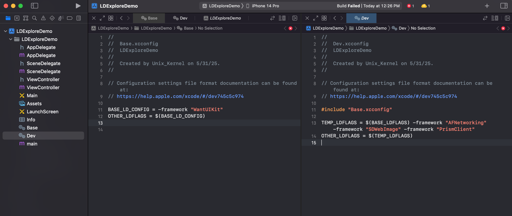
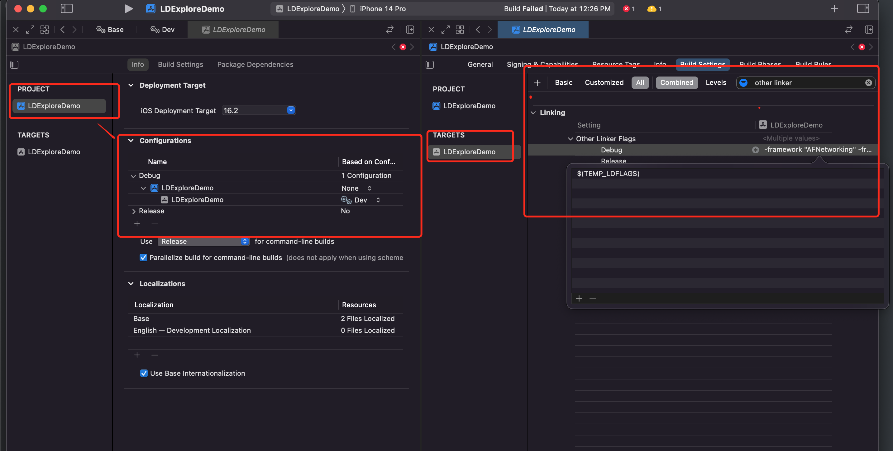
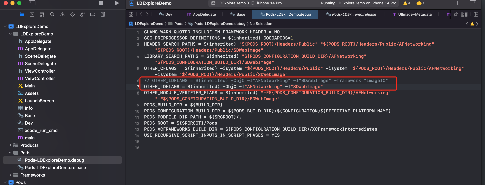

# 工程化

## 多环境配置
Project、Target、Scheme 主要管理什么？
- Project：包含了项目所有的代码、资源文件，所有信息
- Scheme：对于指定 Target 的环境配置
- Target：对于指定代码和资源文件的具体构建方式

多环境配置的3种方式：
- 多 target 配置
- Scheme 多 target 进行环境配置
- xconfig 文件配置


##  多环境配置的不同方式

### 多 Target 的方式

#### 方案

针对需要多配置的项目，在 Xcode 中，对其进行复制，存在多个 Target。 **多 Target（Targets）** 是管理不同应用变体（如免费版/付费版、测试版/生产版、多客户定制版）的高效方式。

所以，**为了区分不同的环境，做一些逻辑的控制。所以需要搭配不同的宏定义，来实现控制逻辑的效果。**

注意：duplicate 之后，target 虽然多了一份，但是代码和资源不变


#### 关键步骤


##### 管理配置文件

1. **独立的 Info.plist**

   - 复制原 `Info.plist` 并重命名（如 `Pro-Info.plist`）

     当对某个 Target “Duplicate” 之后，会产生一份新的 plist 文件

     

   - 在新 Target 的 `Build Settings` → `Packaging` → `Info.plist File` 指定新路径

2. **环境配置分离**

   - 创建 `Config-Pro.xcconfig` 文件定义专属配置：

     ```shell
     // Config-Pro.xcconfig
     API_URL = https://api.pro.com
     APP_NAME = Pro App
     ```

   - 在 Target 的 `Build Settings` → `Base Configuration` 指定配置文件


##### 宏定义

- OC：Build Settings -> Preprocessor Macros 里面的 Debug/Release 模式下添加自定义宏。比如在 debug 模式下 `IsOCDebug = 1` 
- Swift：Build Settings -> Other Swift Flags 里的 Debug/Release 模式下添加自宏定义。注意命名有格式要求：`-D + 宏名称`

​	

#### 思考

该方式还是存在弊端：

- 工程存在多份 info.plist（实际上 plist 文件很少改动，所以没有这种需求）
- 配置比较零散、比较乱


### 多 Scheme 的方式

#### 方案

针对多 Target 方案存在的问题，可以用**「多 Scheme + 多 Configuration 」**的方式解决。


#### 关键步骤

##### 创建 Configuration

针对一个 Target 可以添加多个 **Configuration**，步骤如下:

先选中 Project，然后在右侧选择 Info 选项卡，在 Configurations Section ，点击 "+" ，即可创建新的 Configuration。


创建好之后，该 Target 存在3份 Configuration 了。不同的 Configuration 有什么作用呢？设置宏定义的时候可以针对不同的 Configuration 进行设置。


针对 OC、Swift 分别设置了很多宏定义，接下去需要跑 Beta 配置的代码，怎么办？


点击 Edit Scheme，在 Run 里面选择对应的 Configuration。

但这样好像蛮烦的，每次运行不同配置的代码，都需要手动切换 Configuration。有没有什么办法解决切换问题呢。


##### 创建实体 Scheme

创建 Scheme 步骤：Xcode -> New Scheme，再弹出的方框内，选择对应的 Target，然后输入需要创建的 Scheme 名称。此次我们创建了：Debug、Beta 2个新的 Scheme。


创建好之后，可以看到实体 Configuration 和虚拟 Scheme 存在多对多的关系。但我们可以基于此，选择实体的 Scheme，然后在 Run 里面 “Build Configuration” 里面选择对应的 Configuration 与之对应。


##### plist 暴露自定义字段

1. 创建之后就可以根据 Configuration 设置值，在 `Build Settings -> User-Defined` 下添加自定义的字段，同时可以根据 Configuration 设置不同的值。
2. 设置后的值怎么使用？将自定义的变量用 plist 存储。之后读取再使用。

完整如下图：


切换不同的 Scheme，可以运行不同的效果，当前 case 下，选择 Debug Scheme，输出不同结果 `HOST_URL: http://www.debug.baidu.com`


#### 思考

目前的方案已经优雅不少，该方式还是存在弊端：自定义宏的时候需要选择不同的 Scheme，过程繁琐


### Xcconfig

#### 方案

使用过 CocoaPods 的都会留意到工程存在 `*.Pro.xcconfig` 文件。里面是一些工程相关的配置。所以我们也可以用该方式处理工程问题。


#### 关键步骤

Xcode 自带的  Configuration Settings File 可以支持自定义一些宏，还可以修改 Build Settings 里面的选项。

第一：创建步骤如下：


文件命名为：`文件夹名称-项目名称.scheme名称.xcconfig`，比如 `Config-Xcconfig.debug.xcconfig`

几个 Scheme 就创建几个对应的 Xcconfig 文件。


第二：修改和完善创建的 Xcconfig 配置文件里的内容。之后在 Xcode 的 Project 选项下，找到 Configurations，选择对应的 Target，然后选择右边对应的 Xcconfig 文件。如下图


我们只在 `Config-Xcconfig.debug.xcconfig` 文件中添加了 `OTHER_LDFLAGS = -framework "AFNetworking"`，Xcode 切换到 debug scheme 下，然后 Command + B 编译。


验证结果：

- 编译前切换到 Build Settings 后，查看 ”Other Linker Flags“ 的 Debug 项为空
- 编译后切换到 Build Settings 后，查看 ”Other Linker Flags“ 的 Debug 项为 `-framework ”AFNetworking“`

因为 Xcconfig 文件，具有操作和修改 Build Settings 的能力，所以用好 Xcconfig 文件，不只可以实现替代宏定义和切换繁琐的问题，还可以实现很多其他手动修改 Build Settings 的问题。


说明：在 Xcode Build Settings 手动配置的信息，和通过 Xcconfig 方式编写的信息，不会冲突。

对于 xcconfig 文件，我们其实并不陌生、因为在使用 Cocoapods 的时候就已经在使用这个文件了，只是很多人不知道其中变量的含义。


#### 注意

在 `.xcconfig` 里添加的内容，根据使用场景的不同，细节存在差异：

1. 仅编译时使用（无需 plist 声明）：**不需要在 plist 中声明 `HOST_URL`，值会直接注入编译环境**

2. 运行时通过 Info.plist 访问（需 plist 声明）：

   - 在 `.xcconfig` 文件里添加了：`HOST_URL=127.0.0.1`
   - 在 plist 中需要加一栏：key 为 `HOST_URL`，value为 `${HOST_URL}`

   

   - 代码中使用

     ```swift
     let host = Bundle.main.object(forInfoDictionaryKey: "ServerHost") as! String
     let apiKey = Bundle.main.object(forInfoDictionaryKey: "ApiSecretKey") as! String
     print("Host: \(host), API Key: \(apiKey)")
     ```


QA：思考一个问题：为什么在 `xcconfig` 文件中设置的值，最后会显示在 Xcode 的 Build Settings 的 GUI 面板上？

这便是接下去的内容：「Xcode 配置的层级机制」


## Xcode 配置的层级机制

### 层级机制

Xcode 的 Build Settings 是一个**多层叠加系统**，优先级从高到低如下：

**Target 设置  >  Project 设置 >  .xcconfig 文件  > Xcode 默认值**

Apple 在 [Build Settings Reference](https://help.apple.com/xcode/mac/current/#/itcaec37c2a6) 中明确说明：

> **继承规则**：
>
> - Target 设置继承 Project 设置，Project 设置继承底层默认值。
> - 若 Target 显式定义某配置项，则覆盖 Project 中的相同项16。

**关键推论**：

> Target 作为具体构建目标，其配置需独立于 Project 的通用设置。若二者冲突，**Target 优先级更高**。

根据 [Xcode Build System Guide](https://developer.apple.com/library/archive/documentation/DeveloperTools/Conceptual/XcodeBuildSystem/)：

> - `.xcconfig` 是**基础配置层**，通过 `baseConfigurationReference` 字段被 Project/Target 引用23。
> - 若 Project 或 Target 显式设置了某值（即使为空），**将覆盖 .xcconfig 中的定义**24。


典型案例：当 `project.pbxproj` 中定义 `OTHER_LDFLAGS = ""`（空字符串）时，它会覆盖 `.xcconfig` 中的非空值，导致链接标志失效

说明： xcconfig 优先级低于前2者。

结论：配置的优先级顺序为：**Target 设置  >  Project 设置 >  .xcconfig 文件  > Xcode 默认值**


### 为什么 xcconfig 的结果会显示在 Build Settings 中

1. **配置文件的显式声明**
   `.xcconfig` 文件是 Build Settings 的合法数据源。通过以下方式关联：

   ```
   OTHER_LDFLAGS = -framework "AFNetworking"
   ```

   Xcode 会将其视为项目配置的一部分，并在 GUI 中显示。

2. **Build Settings 的“继承”特性**
   Xcode 的 Build Settings 界面本质是一个**实时计算的合并视图**，它会展示：

   - 所有直接通过 GUI 设置的值
   - 从 `.xcconfig` 导入的值
   - 继承的默认值（如 `$(inherited)`）

3. 如果使用 CocoaPods  安装的依赖，则会生成2个 CocoaPods 生成的 `.xcconfig` 文件。如果开发者自己再创建 `.xcconfig` 则需要处理2者的逻辑，因为 Xcode 一个工程只可以选择一个 `.xcconfig` 文件


### Xcode Project Management Guide

这份[文档](https://developer.apple.com/library/archive/documentation/DeveloperTools/Conceptual/XcodeBuildSystem/000-Introduction/Introduction.html#//apple_ref/doc/uid/TP40006904-CH1-SW1)深入讲解了 Xcode 项目结构、Build Settings 的继承关系、环境变量（如 `$(SRCROOT)`）等，适合想系统理解设置机制的人

聊起工程化，不得不查看 CocoaPods 的 [Podfile 配置指南](https://guides.cocoapods.org/syntax/podfile.html)


### 实践验证

#### Demo1

第一步：新建 Xcode iOS 工程。

第二步：新建的工程配置了一份基础的 `Base.xcconfig` 来配置基础的编译信息。`Dev.xcconfig` 包含 `Base.xcconfig` 信息，在此基础上增加了一些编译参数。

`Base.xcconfig` 配置如下：

```shell
BASE_LD_CONFIG = -framework "WantUIKit"
OTHER_LDFLAGS = $(BASE_LD_CONFIG)
```

`Dev.xcconfig` 配置如下：

```shell
#include "Base.xcconfig"
TEMP_LDFLAGS = $(BASE_LDFLAGS) -framework "AFNetworking" -framework "SDWebImage" -framework "PrismClient"
OTHER_LDFLAGS = $(TEMP_LDFLAGS)
```



第三步：

- 当前 xcconfig 是为 Dev 模式下设置的。所以项目的 scheme 选择 `Debug` 模式。
- 选中 `PROJECT`，然后在 `Configurations` 下给 `Debug` 配置 `Dev.xcconfig` 文件。


结果：编译工程，可以看到报错了。符合预期



原因：本 Demo 的目的就是通过 `xcconfig` 文件和继承关系来验证对 Xcode Build Settings 中的 `Other Linker Flags` GUI 面板来验证 xcconfig 及其层级关系会正确影响到最终的编译参数上。

注意：为什么不用 `$(inherited)`？

`$(inherited)` 的作用范围：

- 仅继承来自 **Xcode 构建系统层级**的值（Target 设置 → Project 设置）
- 不继承 **同一配置文件链** 中通过 `#include` 引入的值

所以此时用**中间变量**的方法。


#### Demo2

验证 `$(inherited)`  的继承效果。

第一步：创建工程，配置 Podfile 文件。Podfile 文件内容如下

```shell
source 'https://mirrors.tuna.tsinghua.edu.cn/git/CocoaPods/Specs.git' # 清华源

platform :ios, '16.2'
inhibit_all_warnings!  # 屏蔽第三方库警告

target 'LDExploreDemo' do
  # Pods for InstallDyanmicAndStaticFramework
  pod 'SDWebImage'
  pod 'AFNetworking'
end
```

第二步：`pod install` 后，可以看到自动生成的 xcconfig 文件内容如下。

为了测试 xcconfig 配置信息的继承，故意把生成的原始信息注释掉。去掉了 `-framework "ImageIO"`



第三步：创建 `Base.xcconfig` 文件。引入 Cocoapods 自动生成的 `Pods-LDExploreDemo.debug.xcconfig` 然后声明 `OTHER_LDFLAGS = $(inherited) -framework "ImageIO"`由2部分组成，一部分是 `$(inherited)` 一部分是新加的 `-framework "ImageIO"`

第三步：创建 `Dev.xcconfig` 文件。引入第三步创建的 `Base.xcconfig` 文件。声明 `OTHER_LDFLAGS = $(inherited)` 为继承来的配置。

第四步：项目的 `AppDelete.m` 中引入 `#import <AFNetworking/AFNetworking.h>`，然后创建对象并验证证

 ````objective-c
 AFSecurityPolicy *policy = [AFSecurityPolicy defaultPolicy];
 NSLog(@"%@", policy);
 ````


说明：

- Cocoapods install 后，自动创建链接器所需参数。都在 `Pods-项目名.debug.xcconfig` 配置文件中
- 我们可以自己创建的 `*.xcconfig` 是可以引入自动生成的配置文件的。并在此基础上可以修改。然后在 Xcode Project Configuration 里可以指定为新创建的 xcconfig 文件
- 并且是可以生效的
