# fastlane

> CI 是什么？CD 是什么？fastlane 属于 CI 吗？Jenkins 是 CD 吗？
>
> CI 和 CD 的能力边界是什么？
>
> iOS 领域利用 CI、CD 可以做些什么事情、

## 一、需求背景

如何与 Apple 打交道？

- 独一无二的 Apple ID
- Xcode 项目与 Bunlde ID
- 证书与设备
- 配置应用权限
- 测试
- 准备向 App Store 提交应用
- App 支持什么语言？在哪些国家发售？是否存在虚拟商品？是否存在违反 App Store 政策的情况？是否已经上传了应用截图？
- 上传
- 批准上架/拒绝
- 重复上述操作

这些需求催生了 Fastlane


## 二、Fastlane

所以 Fastlane 通过**自动化**和**标准化** iOS 应用的构建、测试、签名和发布流程，极大地**提升了开发效率**，**减少了人为错误**，并**简化了团队协作**。无论是个人开发者还是大型团队，都能从中受益，更专注于产品创新和用户体验优化

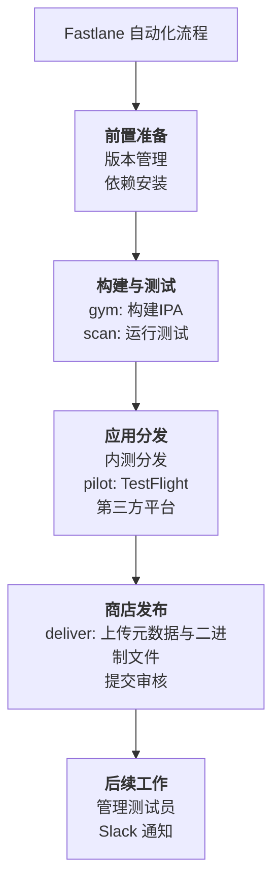


### 1. 证书
- iOS 数字证书是用来证明 iOS App 可执行文件的合法性和完整性的。对于想安装到真机或发布到 App Store 的 App，只有经过签名验证（Signature Validated）才能确保来源颗心，并且保证 App 内容是完整的、未经篡改的。
- 数字证书是一个经证书授权中心数字签名的包含公开密钥拥有者信息以及公开密钥的文件。具有时效性，只在特定的时间段内有效。

开发证书分为2类：
- 开发证书（iOS Development）：用于开发和调试应用程序，可用于真机调试
- 发布证书（iOS Distribution）：发布证书用于打包上传到 App Store，用于验证开发者身份

推送证书，如果项目中集成了推送功能，需要配置推送证书：
- 开发证书（Apple Development iOS Push Services）
- 发布证书（Apple Production iOS Push Services）
- 需要将生成的 p12 文件上传到服务器后台（极光、友盟、或者自己的推送服务器后台）


QA：存在一个情况，点击一个网页，下载 iOS App 到本地，点击启动的时候，会让你从「设置 -> 通用」中去信任证书。这个的工作原理是什么？

这是一个典型的“无线设备管理”（MDM）注册和内部应用分发组合流程。
原理详解：
第一步：伪装与诱导 (Phishing)

- 接收短信：您收到一条看似普通的短信，内容可能是“刷单兼职”、“交友约会”、“彩票赌博”、“色情内容”或“高额借贷”等，并附带一个短链接（用于隐藏真实URL）。
- 点击链接：您点击后，会跳转到一个精心设计的网页。这个网页模仿成某个 App 的下载页面，有一个非常醒目的“点击安装”或“立即跳转”按钮。

第二步：利用技术漏洞 (Abusing the System)
- 触发下载：点击按钮后，服务器会尝试让您的设备下载一个 .mobileconfig 文件。这是正规MDM流程的第一步，但在这里是恶意利用。
- 系统弹窗：iOS系统会弹出标准提示框，显示“正在下载描述文件”，并询问您是否允许。这个弹窗是系统级的，无法伪造，所以具有很强的欺骗性。

第三步：利用信息差与恐吓 (Social Engineering)
- 引导“信任”：网页上会有非常详细的图文或视频教程，指导您下一步该怎么做。通常会编造理由，如：
    - “这是为了验证您的设备安全性，防止作弊。”
    - “必须完成此步骤才能使用App。”
    - “这是官方要求的签名验证流程。”
- 安装描述文件：您根据指导，进入 “设置” -> “已下载的描述文件”，点击“安装”。这个描述文件里包含了一个 payload，其唯一目的就是向攻击者的服务器注册并上报您设备的UDID。
- 信任企业证书：安装完成后，您还需要像之前了解的那样，去 “设置” -> “通用” -> “VPN与设备管理” 中，信任一个来自“某公司”的企业级应用证书。

第四步：达成目的 (The Payoff)
- UDID 上报：在您完成上述所有步骤的过程中，特别是安装描述文件后，您设备的 UDID (Unique Device Identifier) 以及其他一些设备信息（如型号、系统版本）已经无声无息地被发送到了灰产控制的后台服务器。
- 白名单机制：灰产掌握着一个或多个（因为常被苹果吊销）企业证书。他们收到您的UDID后，会将其添加到他们企业开发者后台的设备白名单中。只有这样，由他们企业证书签名的最终App（赌博、色情App等）才能在您的设备上安装和打开。
- 完成欺诈：此时，您再回到最初的网页，或者重新点击短信链接，就会发现可以正常下载那个最终的非法App了。因为您的设备UDID已经被加入白名单，企业证书已经生效。


这属于 MDM 吗？不属于真正的MDM，而是“MDM钓鱼”。
正规MDM：目的是持续管理设备，如远程安装/卸载应用、配置策略、擦除数据等。需要用户明确知道设备被公司管理。
灰产MDM：目的极其单一——窃取UDID。它们没有任何后续的管理意图和能力。它们只是滥用了.mobileconfig配置文件能够在安装时自动向指定服务器上报设备信息（包括UDID） 的这一功能。
您可以理解为，骗子只偷走了MDM流程的“身份证登记处”，而完全抛弃了后面的“管理员办公室”。

### 2. 配置文件（Provsioning Profiles）
配置文件也分为2种：
- 开发（Development）
- 发布（Distribution）
- 配置文件（Provsioning Profiles）中包含了证书、App ID、设备（Devices），后缀名为 `.mobileprovision`
- 配置文件在开发者账号体系中扮演着配置和验证的角色。是真机调试和打包上架的必须文件


Xcode 中，对于项目是可以看到配置文件的。我们可以鼠标按住，拖动到桌面文件夹下。
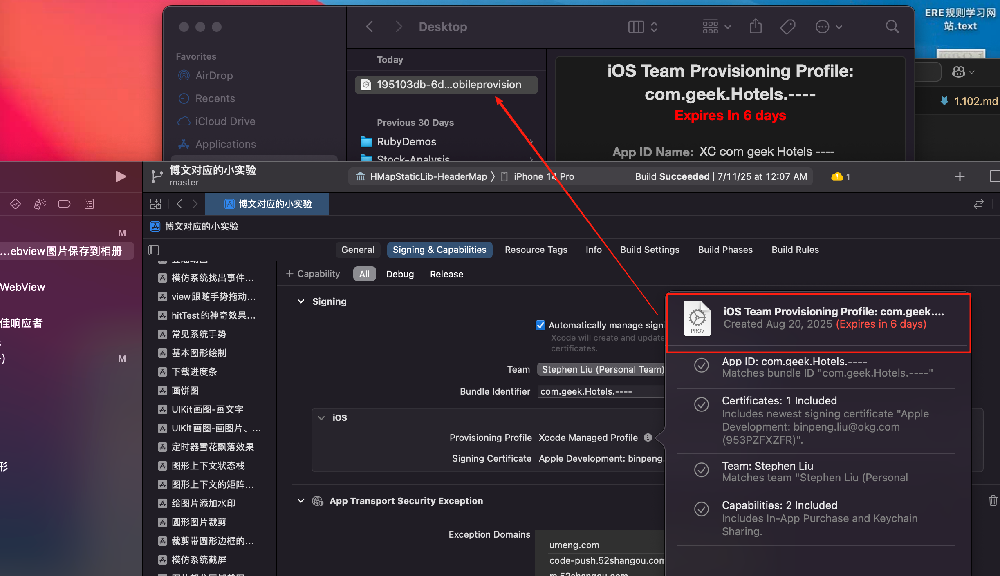
此外，`mobileprovision` 文件是不可读的。可以通过 **security cms -D -i 195103db-6d6f-4da1-bd0e-66d5db88176f.mobileprovision -o profil
e.plist** 指令，dump 成为一个 plist 格式的文件。如下图所示：
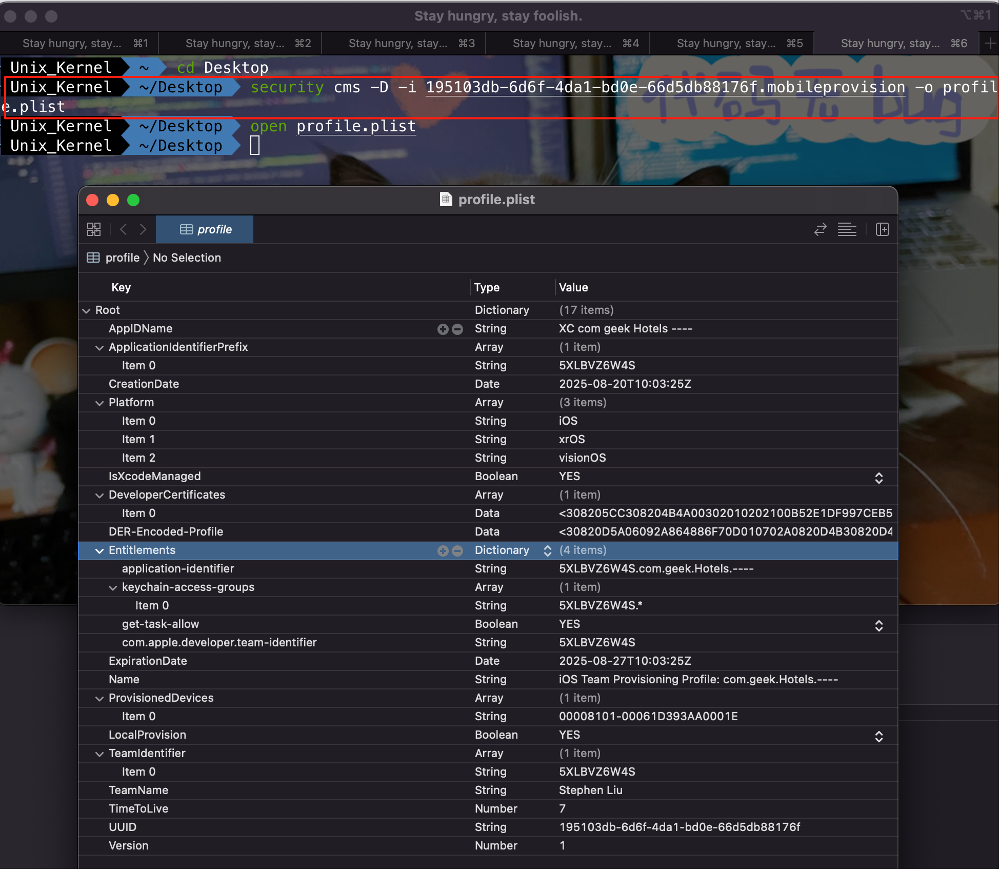

指令解读：
- security：是 macOS 自带的安全相关的命令行工具，用于处理证书、配置文件、密钥等的处理
- cms：表示使用 CMD(Cryptographic Message Syntax，密码消息语法)相关功能，用于处理消息签名和加密消息
- -i：指定输入文件
- -o：指定输出文件

重要信息：
- DeveloperCertificates: 允许使用的开发者证书
- Entitlements：允许使用的权限列表
- ProvisionedDevices：允许安装的设备列表（ProvisionsAllDevices，代表授权任意设备）


### 3. 授权文件（Entitlements）
声明了 App 所需的权限


### 4. 签名 codesign

#### 1. 基础签名

- **-s**：--sign identity 指定签名所用的证书（- 代表 ad-hoc 签名）
- **--entitlements**：entitlements_file 指定签名所需要的 entitlements 文件
- **-f**： --force 强制替换现有签名
- **-preserve-metadata=identifier,entitlements**: 重用就签名的一些信息
- **-deep**： 递归对该 bundle 内包含的其他文件签名


注意：为什么不推荐使用 `--deep`？

在没有 `--deep` 的情况下，codesign 命令只会对指定的主目标（main target）（例如 .app 包或 .framework）进行签名。它不会自动递归地签名的 .app 包内部的任何嵌套的组件（如嵌入的 .framework 或 .dylib）。

--deep 选项的设计初衷是试图递归地签名一个 bundle 内部的所有嵌套代码。例如，如果你的 MyApp.app 内部嵌入了 ThirdParty.framework，使用 `codesign --deep -f -s "Your Identity" MyApp`.app 会同时签名 MyApp.app 和其内部的 ThirdParty.framework。

错误的签名顺序（主要问题）：
- 代码签名不仅是对二进制文件盖章，它还计算并存储每个组件的哈希值到其 _CodeSignature/CodeResources 文件中。
- 当你签名一个 .app 时，它也会计算其内部所有文件（包括嵌套的 .framework）的哈希值。如果这些嵌套的组件在 .app 被签名之后又被修改了，其哈希值就会改变，导致签名无效。
- `--deep` 的工作方式是：先递归地签名最内层的组件（如 ThirdParty.framework），然后签名外层的容器（MyApp.app）。

这看起来是正确的，对吗？ 但实际上，在签名外层 .app 时，它记录的仍然是内层组件签名前的哈希值。而内层组件在签名后其内容（因为附加了签名信息）已经发生了变化，这就导致了内外记录不一致，从而使整个签名变得无效且不可靠。

与现代构建系统不兼容：
- Xcode 和标准的构建流程（如 xcodebuild）的正确做法是：先单独签名每一个嵌套的组件（Embedded Framework），最后再签名主应用。这确保了每个组件都有自己独立的有效签名，并且主应用在签名时记录的是所有嵌套组件的最终状态。
- `--deep` 破坏了这种明确的、分阶段的签名流程，试图用一步代替多步，反而引入了混乱。


#### 2. 动态库签名

动态库可以上架，是因为对动态库可以进行签名。来一个 Demo 工程。一个 iOS 工程，以动态库的形式使用 SDWebImage

##### 1. Demo1

1个 iOS App 工程，使用动态库的方式，依赖了 AFNetworking。选择模拟器进行编译，查看日志：

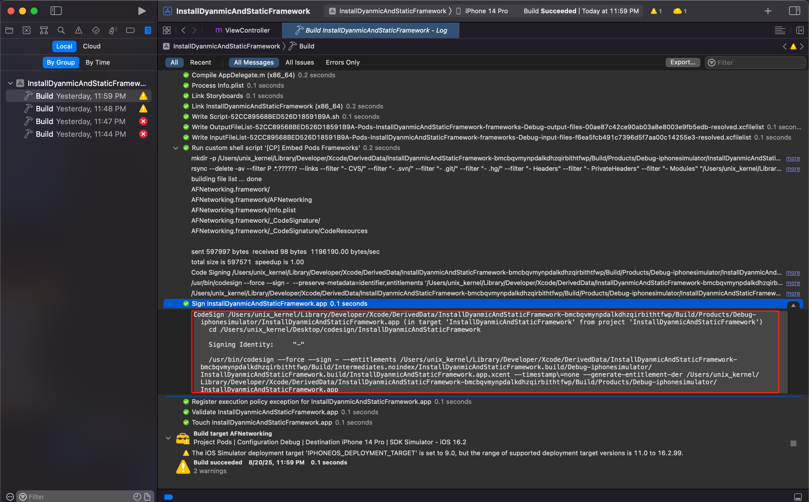

日志分析：
1. 日志中的 `--sign` 后一般接的是证书的名称，但是当前日志中是 `-`，代表使用自动签名模式（Automatic Signing）。
    - **--sign 参数**：这是 codesign 命令的核心参数，用于指定用于签名的身份（Identity）。这个身份通常对应着钥匙串（Keychain）中的一个证书（Certificate）及其关联的私钥。
    - **-**：这是一个特殊的标识符，在这里它不代表一个具体的证书名称。它的含义是：“使用临时生成的、匿名的 Ad-Hoc 签名身份来进行签名，而不需要指定一个具体的、来自苹果开发者账户的证书。”
    在模拟器（Simulator）上运行（正如你的日志中 Debug-iphonesimulator 所示）：
    根本原因：iOS 模拟器不像真机设备那样需要验证苹果官方的代码签名证书来确保安全。模拟器的运行环境更加宽松，其主要目的是为了快速调试。为了方便：使用 Ad-Hoc 签名可以省去为模拟器编译时配置和选择开发证书的步骤，极大地加快了编译和调试的速度。Xcode 默认就会为模拟器构建采用这种方式。

2. 日志中的 `--entitlements /Users/unix_kernel/Library/Developer/Xcode/DerivedData/InstallDyanmicAndStaticFramework-bmcbqvmynpdalkdhzqirbithtfwp/Build/Intermediates.noindex/InstallDyanmicAndStaticFramework.build/Debug-iphonesimulator/InstallDyanmicAndStaticFramework.build/InstallDyanmicAndStaticFramework.app.xcent` 代表 Xcode 开启的 App 能力信息。`--entitlements` 参数后面跟随的是一个 `.xcent` 文件的路径，这个文件包含了应用程序的权限（Entitlements）配置信息，也就是 “App 能力信息”

对其查看，内容如下：
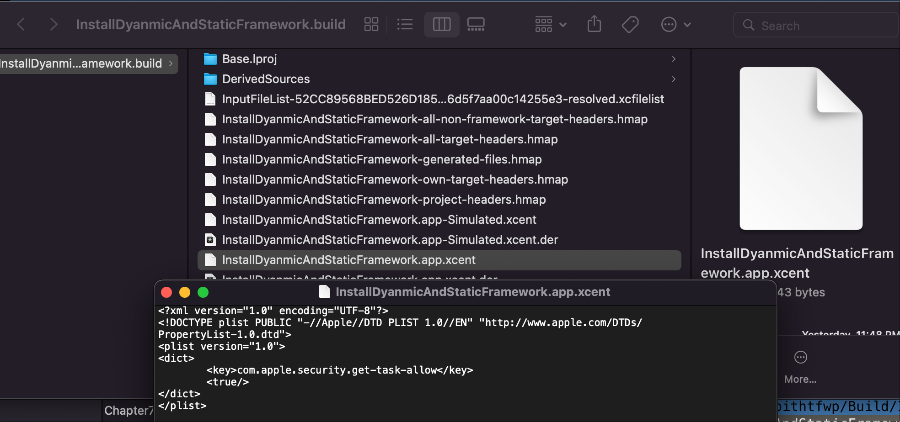

`security find-identity -v -p codesigning` 指令用于 macOS 系统中用于查看可用代码签名证书的命令，主要用于开发者在进行代码签名操作前确认可用的证书信息

##### 2. Demo2

1个 iOS App 工程，使用动态库的方式，依赖了 AFNetworking。选择真机进行编译，查看日志：
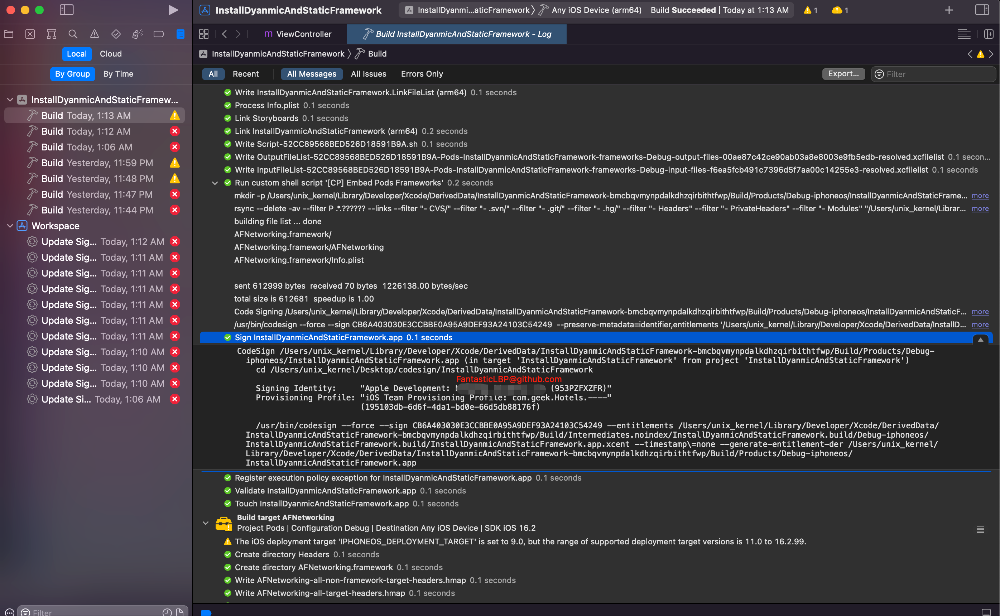
日志分析：
1. 日志中的 `Signing Identity:     "Apple Development: FantasticLBP@github.com (953PZFXZFR)"` 变成了开发者证书。多了一个配置文件。
2. 使用的动态库 AFNetworking 是如何签名的？
选择 Pods 的 Product 里面的 AFNetworking 动态库，右击 “show in finder”。看到并没有一个 **`_CodeSignature`** 的文件夹，也就是没有签名信息。然后用指令 ` objdump --macho --private-headers /Users/unix_kernel/Library/Developer/Xcode/DerivedData/InstallDyanmicAndStaticFramework-bmcbqvmynpdalkdhzqirbithtfwp/Build/Products/Debug-iphoneos/AFNetworking/AFNetworking.framework/AFNetworking` 进行查看，发现也不存在 **`LC_CODE_SIGNATURE`** 存储签名信息的 load command。
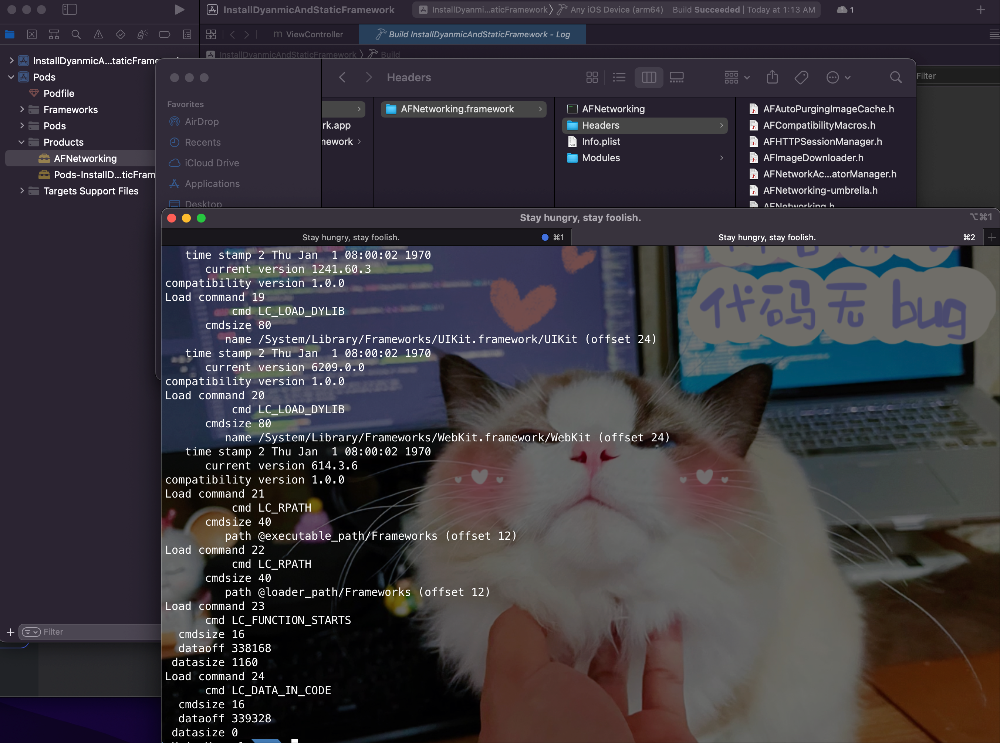

可能会问，如何确定是动态库？使用 `file AFNetworking` 指令即可验证
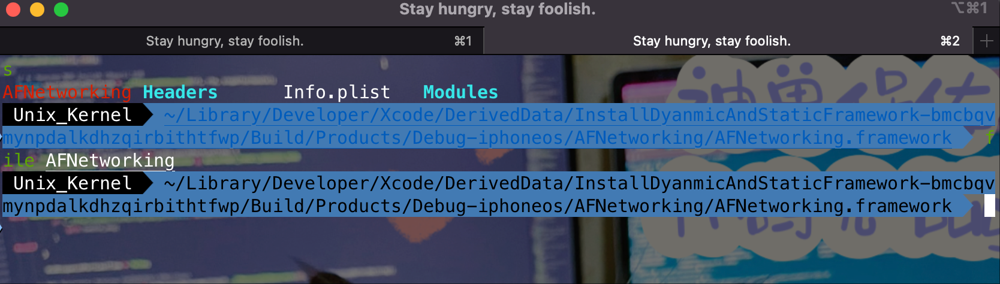

问题：动态库 AFNetworking 没有经过签名，为什么拷贝到 App 里面后，可以上架？
其实 Cocoapods 自动生成了脚本，在主工程的 `Build Phases -> Embed Pods Frameworks` 下。且 `Input File Lists` 配置的文件内容，就是所依赖库的文件路径。会被当作参数传递给 `Embed Pods Frameworks` 脚本。

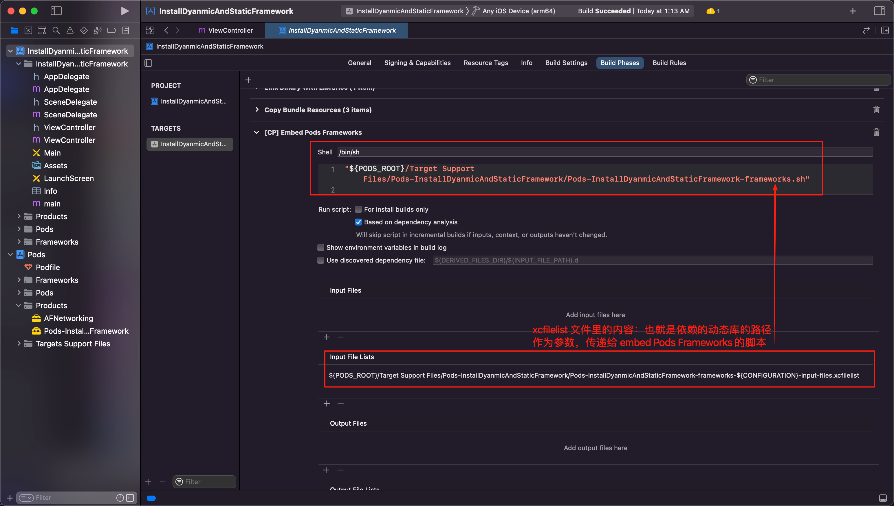
观察编译日志，会发现 「Run custom shell script '[CP] Embed Pods Frameworks'」这里，先对 Frameworks 目录进行了创建和拷贝。然后对 AFNetworking 进行签名。
在主工程的 Products 目录下，选择 App，show in finder，然后显示包内容。查看 `Frameworks` 文件夹下的 `AFNetworking.framework` 已经存在了 `_CodeSignature` 文件夹，也就是已经签名完成。继续查看 Load Command，发现也存在了 **LC_CODE_SIGNATURE** Load Command。
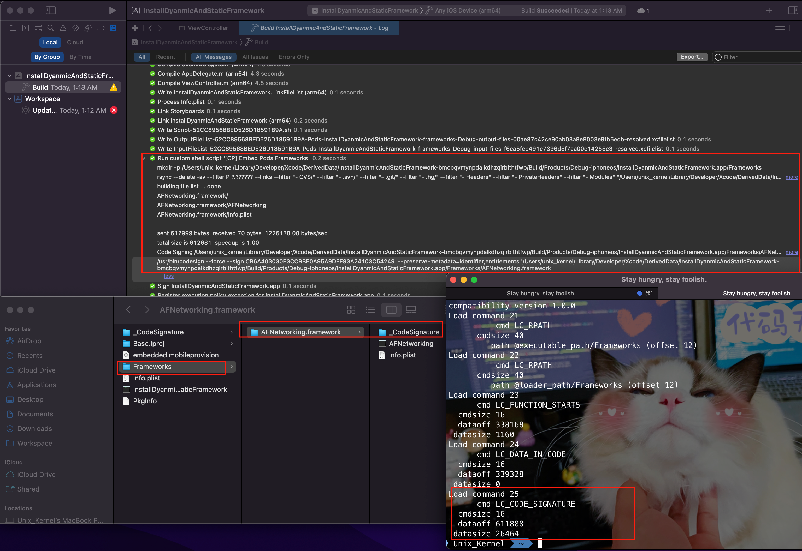

同时，也可以看到是先对动态库签名，再对 App 签名。

#### 3. 如何查看签名信息

[jtool2](https://github.com/excitedplus1s/jtool2) 工具可以方便的查看签名信息。jtool2 类似于 otool，但添加了许多 Mach-O 相关的命令，功能更完善。它支持多种运行平台

安装方式为：`brew install --no-quarantine excitedplus1s/repo/jtool2`
使用方式为：**`jtool2 --sig -vv ${MachOFile}`**

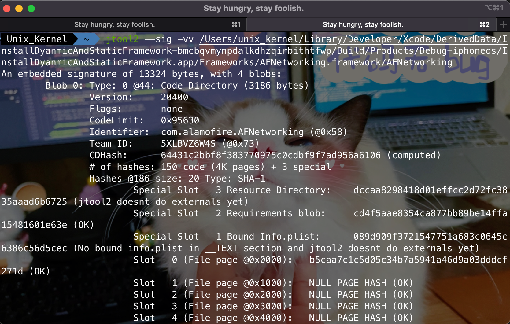


### 5. fastlane 相关概念

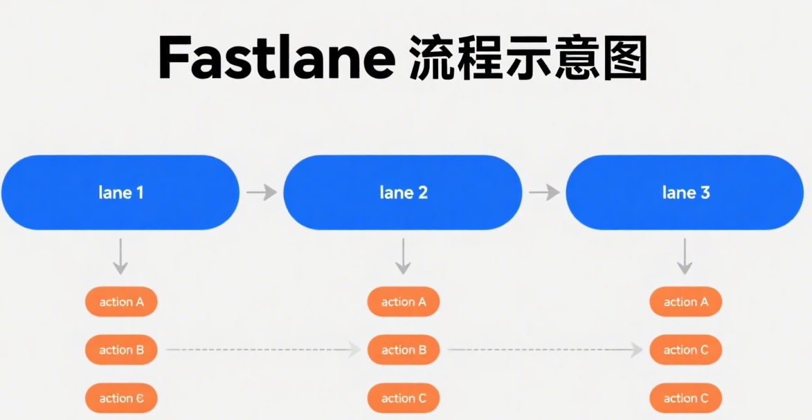
- fastlane 本质就是一套命令行工具，专为用来简化并实现我们与 Apple 交互时的自动化
- fastlane 的每一个单独工具都是为了解决常见的 App Store 或其他问题而设计的
- fastlane 通过脚本方式集合了一系列常见的行为，叫做 lane。也就意味着可以通过 lane 来对自己的 App 做一些量身定制的需求
- fastlane 包含大量的 action
- action 表示特定的应用商店或者其他开发者工作流任务
- lane 表示工作流程

- Appfile： 存储有关开发者账号相关信息
- Fastfile：核心文件，主要用于命令行调用和处理具体的流程，lane 相对于一个方法或者函数。

#### 1. action

- cert: 创建和维护签名证书
- sigh：配置文件
- gym：构建打包应用程序
- deliver：上传应用程序和屏幕截图到 App Store Connect
- pilot：为 TestFlight 上传构建并处理其管理
- scan：自动化测试
- match：团队中同步证书和配置文件
- boarding：测试邀请
- pem：管理推送配置文件
- produce：在 App Store Connect 创建新的 App


使用方式有3种：
- 第一种：命令行方式。比如 
    ```
    fastlane scane --workspace "fastlaneDemo.xcworkspace" --scheme "fastlaneDemo" --device "iPhone 8" --clean
    ```
- 第二种：Fastfile 方式。采用 FastLane 约定的格式去编写逻辑。比如
    ```
    default_platform(:ios) 
    
    platform :ios do
    
    lane :builds do
        # 单元测试
        scan(
        workspace: "fastlaneDemo.xcworkspace",
        scheme: "fastlaneDemo",
        devices: ["iPhone 14 Pro Max", "iPhone 14", "iPhone SE (3rd generation)"],
        clean: true,
        code_coverage: true,
        output_types: "html,junit",
        output_directory: "./fastlane/test_output"
        )
        # 证书
        cert
        # 配置文件
        sigh
        # 打包
        gym(
        workspace: "fastlaneDemo.xcworkspace",
        scheme: "fastlaneDemo",
        clean: true,
        output_directory: "./fastlane/build_output",
        output_name: "fastlaneDemo.ipa",
        silent: false,      
        include_symbols: true,
        include_bitcode: true
        )
    end 
    end
    ```
- 第三种：使用特定的 Fastlane 文件。比如使用脚本 `Fastlane scan init` 会生成关于 scan 相关逻辑的脚本文件 `Scanfile`  
    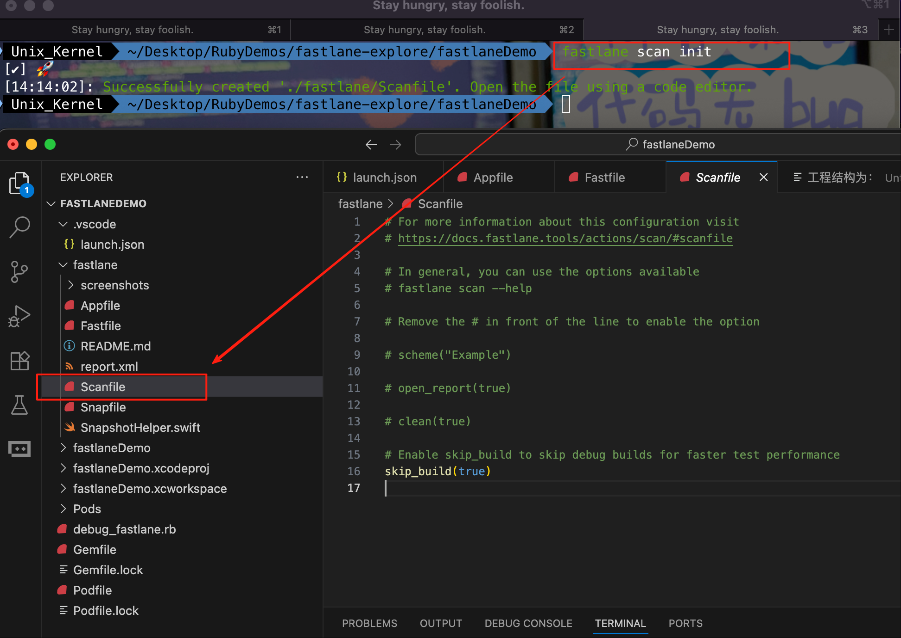 

建议使用方式二、三，不建议使用方式一。关于 fastlane 脚本编写文档查看 [fastlane docs](http://docs.fastlane.tools)

使用方式：
Scanfile 是 专门用于配置 scan 动作（即运行测试） 的配置文件。它的唯一目的是为 scan 提供默认参数。你可以在里面设置 scheme、output_directory、code_coverage 等测试相关的选项。当你在命令行直接运行 fastlane scan 或在 Fastfile 的 lane 中调用 scan 时，它会自动读取 Scanfile 中的配置。


| 文件            | 角色                    | 用途                                                         | 示例内容                                                     |
| :-------------- | :---------------------- | :----------------------------------------------------------- | :----------------------------------------------------------- |
| **`Fastfile`**  | ****指挥官\**/\**剧本** | **定义 lanes（工作流）**。这是 Fastlane 的核心，你在这里组合不同的动作来创建自动化流程。 | `lane :test { scan }` `lane :beta { cert; sigh; gym; upload_to_testflight }` |
| **`Scanfile`**  | **专项配置员**          | 只为 **`scan`** 动作提供默认配置参数。                       | `scheme("MyApp")` `clean(true)` `output_directory("./test_results")` |
| **`Gymfile`**   | **专项配置员**          | 只为 **`gym`** 动作（构建 IPA）提供默认配置参数。            | `workspace("MyApp.xcworkspace")` `export_method("app-store")` `output_directory("./builds")` |
| **`Matchfile`** | **专项配置员**          | 只为 **`match`** 动作（证书管理）提供默认配置参数。          | git_url("https://github.com/.../certs")` `app_identifier("com.yourapp") |

总结：

- **`Fastfile`** 就像是一个**总剧本**，里面写着：第一场戏（`lane :test`）是跑步测试，第二场戏（`lane :beta`）是打包上传。
- **`Scanfile`**、**`Gymfile`** 等就像是每个**演员（scan, gym 动作）的个人小抄**，上面写着他们的默认表情、站位等细节。
- 当“总剧本”喊到某个演员时，演员就会按照自己“小抄”上的默认设置来表演，除非剧本特意指定了另一种表演方式。


QA：按照上面的思路和角色分工、能力边界，将下面的代码优化

```ruby
platform :ios do
  
  lane :builds do
    # 单元测试
    scan(
      workspace: "fastlaneDemo.xcworkspace",
      scheme: "fastlaneDemo",
      devices: ["iPhone 14 Pro Max", "iPhone 14", "iPhone SE (3rd generation)"],
      clean: true,
      code_coverage: true,
      output_types: "html,junit",
      output_directory: "./fastlane/test_output"
    )
    # 证书
    cert
    # 配置文件
    sigh
    # 打包
    gym(
      workspace: "fastlaneDemo.xcworkspace",
      scheme: "fastlaneDemo",
      clean: true,
      output_directory: "./fastlane/build_output",
      output_name: "fastlaneDemo.ipa",
      silent: false,      
      include_symbols: true,
      include_bitcode: true
    )
  end 
end
```

优化：

- 文件一：`./fastlane/Scanfile` 只存放测试相关的配置

  ```ruby
  # Scanfile 专用配置
  workspace("fastlaneDemo.xcworkspace")
  scheme("fastlaneDemo")
  devices(["iPhone 14 Pro Max", "iPhone 14", "iPhone SE (3rd generation)"])
  clean(true)
  code_coverage(true)
  output_types("html,junit")
  output_directory("./fastlane/test_output")
  skip_build(true)
  ```

- 文件二：`./fastlane/Gymfile`  存放构建相关的配置

  ```ruby
  # Gymfile 专用配置
  workspace("fastlaneDemo.xcworkspace")
  scheme("fastlaneDemo")
  clean(true)
  output_directory("./fastlane/build_output")
  include_symbols(true)
  include_bitcode(true)
  ```

- 文件三：`./fastlane/Fastfile` 存放 lane 相关逻辑

  ```ruby
  # Fastfile - 定义 lanes
  default_platform(:ios)
  
  platform :ios do
    # 定义一个名为 builds 的 lane
    lane :builds do
      # 运行测试，所有配置会自动从 Scanfile 读取
      scan
      # 管理证书
      cert
      sigh
      # 构建 ipa，所有配置会自动从 Gymfile 读取
      gym
    end
  end
  ```

分析：

1. **清晰与模块化**：每个文件职责单一，易于维护。

2. **复用性**：你可以在 `Fastfile` 中创建多个不同的 lane（如 `lane :tests`、`lane :adhoc`），它们都可以共享 `Scanfile` 和 `Gymfile` 中的通用配置，无需重复代码。

3. **可覆盖性**：在 `Fastfile` 的 lane 中调用 `scan` 或 `gym` 时，你可以随时覆盖对应 `*.file` 中的默认设置。例如：

   ```ruby
   lane :special_build do
     gym(
       output_name: "SpecialRelease.ipa" # 覆盖 Gymfile 中的默认命名规则
     )
   end
   ```

   

#### 2. Matchfile

终端使用 `fastlane match init` 指令创建 Matchfile，同时根据提示选择一些模版和输入信息。

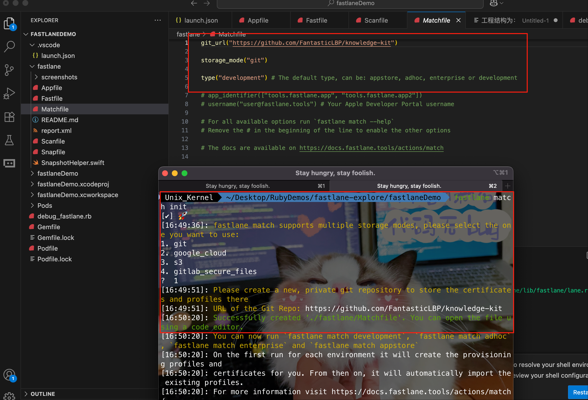


- `git_url`：

  是 `match` 最核心的配置，指定了存储加密证书和配置文件的 Git 仓库地址。`match` 不会将敏感的证书文件（`.cer`）、私钥文件（`.p12`）和配置文件（`.mobileprovision`）保存在本地或只留在苹果开发者门户。

  相反，它会将这些文件**加密后**推送到这个指定的 Git 仓库（`https://github.com/FantasticLBP/knowledge-kit`）中。

  当任何开发者或 CI/CD 系统需要这些文件时，`match` 会从这个仓库克隆或拉取最新的加密文件，然后在本地解密并安装到钥匙串和 Xcode 中。

  这个仓库应该是**私有的（Private）**，因为里面存储的是你应用的敏感安全凭证

- `storage_mode("git")`:

  明确指定 `match` 使用 Git 作为存储后端。

  match` 支持多种存储方式，`git` 是**默认且最常用**的一种。

  其他可选模式包括 `s3`（Amazon S3）和 `google_cloud`（Google Cloud Storage）。这些通常在更复杂或企业级的 CI/CD 环境中使用，以提高大文件的下载速度

- `type("development")`

  设置 `match` 的**默认操作类型**为 `development`（开发证书和配置文件）

  这个参数定义了你要管理哪类证书。iOS 开发中有几种主要类型：

  - `"development"`：用于开发阶段，可在真机上调试应用。
  - `"appstore"`：用于提交到 App Store 或 TestFlight。
  - `"adhoc"`：用于分发给有限数量的测试设备（最多 100 台）。
  - `"enterprise"`：用于企业账号的内部分发。

  在这里设置为 `"development"` 意味着：

  - 当你直接运行 `fastlane match`（而不指定类型）时，它会默认操作开发证书。
  - 当你运行 `fastlane match development` 时，它也会使用这个配置（尽管命令行参数已经指定了类型，但其他相关配置会从这里读取）。

这个 `Matchfile` 配置告诉我们：

1. **存储位置**：所有加密的证书和配置文件都将被同步到 `https://github.com/FantasticLBP/knowledge-kit` 这个 Git 仓库中。
2. **存储方式**：使用 Git 进行版本管理和同步（这是标准做法）。
3. **默认环境**：默认情况下，操作的是用于**开发环境**的证书和配置文件。

**一个典型的工作流程：**

1. 团队成员 A 首次运行 `fastlane match development`。
2. `match` 会检查指定的 Git 仓库中是否已有开发证书。
   - 如果**没有**，它会连接到苹果开发者门户，创建新的开发证书和配置文件，加密后推送到 Git 仓库。
   - 如果**已有**，它会将加密文件拉取到本地，解密后安装到 Xcode 和钥匙串中。
3. 团队成员 B 加入项目，同样运行 `fastlane match development`。
4. `match` 从同一个 Git 仓库拉取**完全相同的**证书和配置文件，确保团队环境一致。


## 三、持续集成

Cotinuous Integration，持续集成意味着每次代码的变更都在构建服务器上运行测试，并在指定场景下触发。这样如果开发者将测试失败的代码推送到代码库，也称为破坏构建，CI 会触发警告。

- 主动式 CI：CI 提供商
- 托管式 CI：github action
- 手动式 CI：自己管理，Travis CI、Jenkins


- Travis CI：小型开源项目，付费、简单、方便、
- Jenkins：大型企业、丰富的自定义选项、定制化，不能做到开箱即用，免费

### 1. docker

>  问：为什么一定要 docker？不能在服务器上按照本地的配置安装所需的各个软件吗
>
> 答：在一个团队中，每个开发者的本地环境都可能略有不同（macOS 版本、Xcode 通过 App Store 安装还是手动安装、Homebrew 的使用方式等）。
>
> - **问题**：新同事加入，需要花费**一整天甚至更长时间**来按照文档一步步配置环境，任何一步的疏漏都会导致环境配置失败。
> - **后果**： onboarding 成本极高，而且无法保证所有人的环境真正一致，为后续的协作埋下了隐患。
>
> 为什么“手动安装一下”不是最优解？它的成功依赖于：
>
> - **人的记忆和文档**：需要有人（或文档）准确地记录下所有依赖的**精确版本**（不仅仅是 `fastlane`，还包括它的依赖，以及依赖的依赖）。这份文档需要随着项目的每一次依赖变更而**实时更新**，这几乎是不可能的任务。
> - **手动操作的准确性**：需要操作人员完全正确地执行安装步骤，不能有任何错漏。这是一个枯燥且容易出错的过程

#### 1. 定义

**Docker 概述**: Docker 是一种成熟高效的软件部署技术，利用容器化技术为应用程序封装独立的运行环境。每个运行环境即为一个**容器**，承载容器运行的计算机称为**宿主机**。

容器。容器虚拟化指的是操作系统而不是硬件，容器之间是共享同一套操作系统资源的。

- 镜像（image）：提供容器运行时所需的程序、库、资源、配置等文件，还包含了一些为运行时准备的一些配置参数（如匿名卷、环境变量、用户等）
- 容器（Container）：镜像运行时的实体，如果需要在其它服务器上使用这个镜像，我们就需要一个集中的存储、分发镜像的服务，Docker Registry 就是这样的服务
- 仓库（Repository）：镜像构建完成后，可以很容易的在当前容器上运行

虚拟机：虚拟出一套硬件后，在其上运行一个完整的操作系统。


**容器与虚拟机的区别**:

* **Docker容器**: 多个容器共享同一个系统内核
* **虚拟机**: 每个虚拟机包含一个操作系统的完整内核
* **优势**: 所以 Docker 容器比虚拟机更轻量、占用空间更小、启动速度更快

**镜像 (Image)**:

* **定义**: 镜像是容器的模板，可类比为软件安装包
* **类比**: 类似于制作糕点的模具，可用于创建多个糕点（容器），并可分享给他人

**容器 (Container)**:

- **定义**: 容器是基于镜像运行的应用程序实例，可类比为安装好的软件。
- **类比**: 类似于模具制作出的糕点。

**Docker仓库 (Registry)**:

* **定义**: 用于存放和分享Docker镜像的场所
* **Docker Hub**: Docker的官方公共仓库，存储了大量用户分享的Docker镜像。


Docker 理解为：标准化、一摸一样的工具箱和工作环境。保证无论哪个工人来，用的工具和环境都完全一样，避免“在我这儿是好的”问题。

- 环境标准化：创建一个包含特定版本 Ruby、Fastlane、Xcode 命令行工具、Cocoapods 的镜像
- 隔离一致性：确保开发、测试、生产环境的构建完全一致，消除“环境依赖”问题
- 快速搭建与清理：轻松为 Jenkins 提供纯净、可随时销毁和重建的构建环境。

**价值：开发者需要花费大量时间排查环境差异，而不是专注于修复真正的业务逻辑 Bug，严重拖慢开发效率。**


#### 2. docker 的核心角色与能力

docker 在 iOS CI/CD 管道中（通常与 Jenkins、Gitlab CI、Github Actions 等工具配合）中主要负责“管理阶段”和“环境保障”

1. 环境标准化与一致性

   - 问题：传统的 CI 机器（无论是物理机还是虚拟机）环境复杂，不同项目所依赖的 Ruby、NodeJS、Python、Fastlane、Cocoapods 等工具版本可能冲突。造成“在我本地是好的，在 CI 机器上发布后就失败了”。（CI 机器上并不一定只部署一个 iOS 的 CI 项目，可能其他项目也部署了，可能由于 Ruby 安装了2.0，但是 iOS 的 CI 服务需要 Ruby 3.0+，这样就造成了本地 CI 服务正常，部署到 CI 服务器之后就有了问题）
   - Docker 解决方案：构建一个专门的  Docker 镜像，预安装项目所需的所有命令行工具和依赖的特定版本，专门负责 CI 逻辑（如 Ruby 3.1.2、Fastlane 2.2.1、Cocoapods 1.22.1、Xcode 16）
   - 结果：每一次 CI 构建都会从一个纯净、一致、已知状态的镜像环境启动，彻底消除了环境差异导致的构建失败，保证了构建结果的可靠性和可重现性。

2. 依赖隔离

   多个 iOS 项目可能在同一台 CI 服务器上运行。使用 Docker 可以将每个项目需要的构建环境相互隔离。避免了项目之间的依赖冲突（例如，项目 A 需要 Cocoapods 1.10，项目 B 需要 Cocoapods 1.11）

3. 快速的构建环境准备：

   相比启动一个完整的虚拟机，启动一个 Docker 容器是秒级的。这大大减少了 CI 流水线等待构建环境就绪的时间，加快了整个构建流程的反馈循环

4. 版本控制与可追溯性：

   DockerFile 是文本文件，可以放入 git 仓库进行版本管理。对构建环境的任何更改（例如升级 Fastlane 版本）都像代码更改一样，可以通过 Pull Request 进行审查、测试和记录，实现了基础设施即代码 (IaC)。

5. 作为轻量级的“任务运行器”

   在 CI 流程中，Docker 容器通常被当做一个一次性的、执行特定任务的“沙盒”，比如：执行 pod install、执行 lint 或代码分析、运行 fastlane。


#### 3. docker 的能力边界

尽管 docker 很强大，但在 iOS 开发领域，它有非常明确且无法跨越的边界：

1. 无法直接构建 iOS 应用（最关键的边界）

   - 根本原因：iOS 最终编译、链接和打包必须依赖 MacOS 内核和 Xcode、Clang、SwiftCli
   - Docker 局限性：标准的 Docker 容器基于 Linux 内核。它无法运行 MacOS 系统或 Xcode 这样的 GUI 应用（所以无法执行 xcodebuild 指令）
   - 结论：无法在 linux docker 容器内编译出 `.ipa` 文件

2. 无法运行 MacOS 镜像

   Apple 的许可协议和硬件限制，导致不存在官方的 MacOS  Docker 镜像。虽然有类似 LinuxKit 这样的非官方项目，但不够稳定，不能用于生成环境，风险较大


#### 4. 最佳搭配

明确了 docker 的作用和能力边界后，一个典型的 iOS CI/CD 架构就清晰了：**“在 Linux Docker 容器中准备环境和运行脚本，在 MacOS 主机/节点上进行最终编译”**

- CI Server（Jenkins Controller）：可以运行在任何系统上，负责任务调度
- MacOS Build Agent/Node：一台或多台安装了 Xcode 的 MacOS 系统的电脑，它被注册到 CI Server 上，专门用于执行需要的 xcodebuild 任何
- Docker 的使用：
  - CI 流水线启动后，CI Server 会现在 Linux Docker 容器中完成所有它能做的工作：代码拉取、依赖安装（pod install）、运行单元测试（如果测试不依赖 MacOS 框架）、执行静态分析等
  - 当需要进行 Xcode 的步骤（如编译、打包、签名）时，CI Server 会将工作委托给一台 MacOS Build Agent
  - MacOS Agent：接收任务，它可能本身会通过一个 Docker 来获取一个一致的环境（用于运行 fastlane 等工具），或者直接使用本地安装的工具，然后调用 xcodebuild  和 fastlane 完成最终的构建和打包
  - 


### 2. fastlane

fastlane 可以理解为**专业高效的“工人”**。它精通所有 iOS 打包、签名、测试、上传的具体细节，干活又快又好。

是一个自动化命令工具集。

### 3. jenkins

统筹全局的“项目经理”，它不亲手干活，也不提供工具，但负责安排任务、监控进度、触发流程（比如代码一来就让工人工作），并向大家汇报结果。

- 调度与触发：监听 git 代码推送，定时或者其他事件触发整个流水线
- 流程编排：定义 pipeline 流水线，决定先做什么后做什么
- 资源管理：分配和管理执行任务的服务器（成为 Agent/Node）
- 状态监控与报告：集中展示构建结果、测试报告、日志、并发送通知


### 4. 黄金搭档

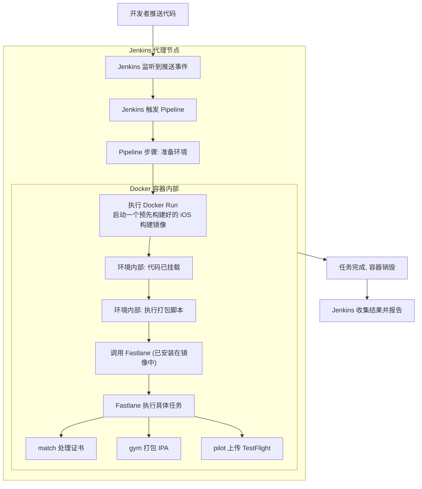

上图展示了3者的协作模式：**jenkins 是大脑，负责指挥；Docker 是隔离且一致的环境，负责提供舞台；Fastlane 是主角，在这个环境里执行具体的构建任务**

为什么需要3者结合？

- 环境一致性问题（Docker 的核心价值）
  - 问题：没有 Docker 时，Jenkins 所在的 Mac 服务器需要手动安装 Ruby、Fastlane、Xcode 版本等。一旦服务器需要重置或升级，环境配置会很麻烦，且难以保证与本地开发环境一致
  - 解决方案：使用 Docker 镜像来定义构建环境。`Dockerfile` 中明确指定了所有依赖的版本。无论是在开发者的笔记本上，还是在 Jenkins 服务器上，构建环境都是**完全一模一样的**，彻底杜绝了“环境问题”。
- 专业化与高效（Fastlane 的核心价值）
  - 问题：没有 Fastlane，你需要在 Jenkins 上编写复杂的 xcodebuild 脚本，处理代码签名等逻辑
  - 解决方案：Fastlane 用简洁的 Ruby 语法封装了所有复杂命令，提供了“开箱即用”的行动（action），极大简化了自动化脚本的编写和维护。
- 调度与可视化（Jenkins 的核心价值）
  - 问题：只有 Fastlane 和 Docker，你只能在本地手动执行指令，无法自动化出发，团队协作和监控
  - 解决方案：Jenkins 提供了强大的 Web 界面、流水线编排能力、权限管理和通知机制，让整个流程自动化、可视化、可协作


比如一个典型的场景：

程序写好的代码提交到 github，提交了 MR：

- 如果是合并到开发 feature 分支触发 pipeline 流水线任务，检查工程编译情况，编译成功则可以合并
- 如果是合并到开发 develop 分支触发 pipeline 流水线任务，检查工程编译情况，编译成功后触发单元测试和精准测试

如果成功则给 merge request 的提交者和被 reviewer发送邮件，通知测试结果。并且 mr +3 后才可以合并。合并的结果也会通知

```shell
// Jenkinsfile
pipeline {
    agent any
    
    environment {
        DOCKER_IMAGE = 'your-custom-ios-builder-image:1.0'
        PROJECT_URL = 'https://github.com/your/ios-project.git'
        // 从环境变量获取GitHub相关信息
        GITHUB_REPO = 'your-org/your-repo'
        GITHUB_API_URL = 'https://api.github.com'
    }
    
    parameters {
        // 添加参数用于手动触发时指定PR号
        string(name: 'PR_NUMBER', defaultValue: '', description: 'GitHub PR Number (for manual triggers)')
    }
    
    stages {
        stage('Checkout and Validate') {
            steps {
                script {
                    // 检出代码
                    checkout scm
                    
                    // 获取当前分支信息
                    env.BRANCH_NAME = env.BRANCH_NAME ?: sh(script: 'git rev-parse --abbrev-ref HEAD', returnStd: true).trim()
                    
                    echo "Building branch: ${env.BRANCH_NAME}"
                    
                    // 检查MR审批状态（如果是PR构建）
                    if (env.CHANGE_ID) {
                        checkMRApproval()
                    } else if (params.PR_NUMBER) {
                        env.CHANGE_ID = params.PR_NUMBER
                        checkMRApproval()
                    }
                }
            }
        }
        
        stage('Build') {
            steps {
                script {
                    docker.image(env.DOCKER_IMAGE).inside {
                        sh 'fastlane ios build'
                    }
                }
            }
        }
        
        stage('Test') {
            when {
                // 只在develop分支上运行测试
                expression { 
                    return env.BRANCH_NAME == 'develop' || env.BRANCH_NAME.startsWith('release/')
                }
            }
            steps {
                script {
                    docker.image(env.DOCKER_IMAGE).inside {
                        // 运行单元测试
                        sh 'fastlane ios run_unit_tests'
                        // 运行精准测试
                        sh 'fastlane ios run_precision_tests'
                    }
                }
            }
        }
    }
    
    post {
        always {
            script {
                // 记录构建结果
                currentBuild.description = "Branch: ${env.BRANCH_NAME}, Result: ${currentBuild.currentResult}"
                
                // 保存测试报告（如果有）
                junit 'fastlane/test_output/report.xml' allowEmptyResults: true
            }
        }
        
        success {
            script {
                // 根据不同分支类型发送不同通知
                if (env.BRANCH_NAME == 'develop' || env.BRANCH_NAME.startsWith('release/')) {
                    // develop/release分支 - 发送详细测试报告
                    sendTestSuccessNotification()
                } else if (env.BRANCH_NAME.startsWith('feature/')) {
                    // feature分支 - 发送构建成功通知
                    sendBuildSuccessNotification()
                }
                
                // 如果是PR构建，更新PR状态
                if (env.CHANGE_ID) {
                    updateGitHubStatus('success', 'CI/CD pipeline completed successfully')
                }
            }
        }
        
        failure {
            script {
                // 发送失败通知
                sendFailureNotification()
                
                // 如果是PR构建，更新PR状态
                if (env.CHANGE_ID) {
                    updateGitHubStatus('failure', 'CI/CD pipeline failed')
                }
            }
        }
    }
}

// 检查MR是否已获得足够审批
def checkMRApproval() {
    echo "Checking MR approval status for PR #${env.CHANGE_ID}"
    
    // 使用GitHub API检查PR审批状态
    def approvalResponse = sh(script: """
        curl -s -H "Authorization: token \${GITHUB_TOKEN}" \
        -H "Accept: application/vnd.github.v3+json" \
        ${env.GITHUB_API_URL}/repos/${env.GITHUB_REPO}/pulls/${env.CHANGE_ID}/reviews
    """, returnStd: true)
    
    def reviews = readJSON text: approvalResponse
    def approvedCount = 0
    
    // 计算批准的评审数量
    reviews.each { review ->
        if (review.state == 'APPROVED') {
            approvedCount++
        }
    }
    
    echo "Found ${approvedCount} approvals (need at least 3)"
    
    // 如果审批不足，则失败构建
    if (approvedCount < 3) {
        error "PR #${env.CHANGE_ID} does not have enough approvals (${approvedCount}/3)"
    }
}

// 发送测试成功通知
def sendTestSuccessNotification() {
    def changeAuthor = env.CHANGE_AUTHOR ?: "提交者"
    def reviewers = env.CHANGE_TARGET ?: "评审者"
    
    // 获取测试覆盖率报告
    def coverageReport = sh(script: "cat fastlane/test_output/coverage.txt 2>/dev/null || echo '无覆盖率数据'", returnStd: true).trim()
    
    emailext (
        subject: "✅ 测试通过: ${env.JOB_NAME} #${env.BUILD_NUMBER}",
        body: """
        <h2>测试通过通知</h2>
        <p>项目 ${env.JOB_NAME} 的测试已通过。</p>
        
        <p><b>构建详情:</b></p>
        <ul>
            <li>构建编号: ${env.BUILD_NUMBER}</li>
            <li>分支: ${env.BRANCH_NAME}</li>
            <li>构建结果: ${currentBuild.currentResult}</li>
            <li>构建日志: <a href="${env.BUILD_URL}console">查看详情</a></li>
        </ul>
        
        <p><b>测试覆盖率:</b></p>
        <pre>${coverageReport}</pre>
        
        <p>此MR已获得足够审批，可以合并。</p>
        """,
        to: "${changeAuthor},${reviewers}",
        mimeType: 'text/html'
    )
}

// 发送构建成功通知
def sendBuildSuccessNotification() {
    emailext (
        subject: "✅ 构建成功: ${env.JOB_NAME} #${env.BUILD_NUMBER}",
        body: """
        <p>项目 ${env.JOB_NAME} 的构建已成功完成。</p>
        <p><b>构建详情:</b></p>
        <ul>
            <li>构建编号: ${env.BUILD_NUMBER}</li>
            <li>分支: ${env.BRANCH_NAME}</li>
            <li>构建结果: ${currentBuild.currentResult}</li>
            <li>构建日志: <a href="${env.BUILD_URL}console">查看详情</a></li>
        </ul>
        <p>编译检查通过，可以继续代码审查流程。</p>
        """,
        to: env.CHANGE_AUTHOR ?: 'team@example.com',
        mimeType: 'text/html'
    )
}

// 发送失败通知
def sendFailureNotification() {
    def recipients = env.CHANGE_AUTHOR ? "${env.CHANGE_AUTHOR},team@example.com" : 'team@example.com'
    
    emailext (
        subject: "❌ 构建失败: ${env.JOB_NAME} #${env.BUILD_NUMBER}",
        body: """
        <p>项目 ${env.JOB_NAME} 的构建失败。</p>
        <p><b>构建详情:</b></p>
        <ul>
            <li>构建编号: ${env.BUILD_NUMBER}</li>
            <li>分支: ${env.BRANCH_NAME}</li>
            <li>构建结果: ${currentBuild.currentResult}</li>
            <li>构建日志: <a href="${env.BUILD_URL}console">查看详情</a></li>
        </ul>
        """,
        to: recipients,
        mimeType: 'text/html'
    )
}

// 更新GitHub状态
def updateGitHubStatus(state, description) {
    sh """
        curl -s -X POST -H "Authorization: token \${GITHUB_TOKEN}" \
        -H "Accept: application/vnd.github.v3+json" \
        ${env.GITHUB_API_URL}/repos/${env.GITHUB_REPO}/statuses/${env.GIT_COMMIT} \
        -d '{"state":"${state}","target_url":"${env.BUILD_URL}","description":"${description}","context":"ci/jenkins"}'
    """
}
```


## 四、CI & CD 区别

在 iOS 开发中，CI 和 CD 是两个紧密相关但目标不同的阶段。

### 1. CI 

#### 1. CI 是什么？

持续集成是一种开发实践，要求开发者频繁地将代码集成到共享的主干分支（比如 main 或者 develop 分支）。每次集成都通过一套自动化流程来验证，以便快速发现并修复错误。

CI 的核心是代码集成时的质量守护与保证。代码在合并到主线代码之前，一切旨在验证代码质量、发现潜在的缺陷的自动化能力。


#### 2. iOS 领域 CI 都可以做些什么？

对于 iOS 项目，CI 流程通常由1次代码推送触发（比如 Git push 或者 PR），并自动执行以下任务：

- 自动编译：使用 **xcodebuild** 指令编译项目。这一步可以快速发现编译错误（如语法错误、依赖缺失）

  什么是依赖缺失错误？**依赖缺失错误**指的是项目无法找到或访问其所需的外部代码库、框架或资源文件。比如：

  - `ld: library not found for -lPods-YourProjectName` 报错
  - `#import <SomePod/SomeClass.h> // 错误：'SomePod/SomeClass.h' file not found` 报错

- 运行自动化测试：有些团队卡口比较严，单测覆盖率达到95%以上才可以合并，本次开发的代码，必须全部测试通过才可以合并

  - 单元测试：验证每个类的方法是否符合预期
  - UI 测试：模拟用户操作，验证界面流程是否正常
  - 快照测试：验证 UI 界面是否与预期的截图一致，UI 还原度是否足够，像素级别。

- 代码质量检查：

  - 运行 OCLint、SwiftLint 等工具，强制报纸代码风格统一
  - 进行静态分析，查找潜在的 bug 和安全漏洞

- 生成报告：产出测试覆盖率报告、测试结果报告、精准测试覆盖率报告（覆盖率为93%，不足约定的95%及格线，对测试覆盖率进行分析。定位具体原因：防御性编程和兜底逻辑代码太多，部分 case 没办法走到？还是某些逻辑的实现依赖外部状态？想办法掌握具体的原因。如果是 QA 没有测试回归到，则 push QA 去测试和模拟，极力去保证每行代码测试到，甚至可以通过测试覆盖率反过来推导补充测试 case。如果真的不能测试到，起码要明确那些未被测试的代码具体是什么，做了哪些事情），携带编译日志以便分析、定位问题

#### 3. CI 的核心目标与价值

- 快速反馈：在几分钟内告诉开发者这次提交是否破坏了现有功能
- 保证代码质量：确保合并到主分支的代码一定是编译通过的、精准测试覆盖率达标、UI 测试覆盖率达标的，健康的
- 减少集成冲突：频繁集成使得大型团队协作时的合并冲突更早暴露、更容易解决

**CI 阶段的终极目标：回答一个问题：这次代码是否是安全，是否可以合并到主分支？**

### 2. CD 是什么？

CD 是 CI 的下一步，2者是合作关系，CD 是 CI 的下游，CI 是 CD 的上游。CD 关注的是如何将已验证的代码打包，交付给用户和市场。分为2个概念：

#### 1. 持续交付

指的是通过自动化流程，让代码库随时处于可部署的状态。它要求除了部署到生产环境这一步外，其余流程（构建、测试、打包）全部自动化

在 iOS 开发中的体现：

- 当 CI 流程（编译、测试）通过后，自动触发 CD 流程

- 使用 fastlane match 管理证书和配置文件，确保签名一致

- 使用 fastlane gym 编译打包生成 `.ipa` 文件

- 将 `.ipa` 文件自动上传到分发平台

- 持续交付允许在最后一刻（部署到 App Store）手动点击确认，这是个安全网

  

#### 2. 持续部署

是什么？这是更进一步的实践，它要求所有通过 CI 的变更自动部署到生产环境，无需任何人干预。

在 iOS 开发中的体现：

- 在持续交付的基础上，流程不会停止
- 自动使用 fastlane deliver 将构建好的版本提交到 App Store Connect
- 自动完成元数据上传，截图管理
- 由于 App Store 的审核机制，**iOS 应用无法实现真正意义上的“持续部署”**。即使你自动提交了，也需要等待苹果的人工/自动审核。但你可以实现“自动提交审核”。

**CD 回答的问题是：我们能否快速、可靠地通过测试的版本交付给用户？**


### 3. 区别

| 维度         | **CI - 持续集成 (Continuous Integration)**                   | **CD - 持续交付/部署 (Continuous Delivery/Deployment)**      |
| ------------ | ------------------------------------------------------------ | ------------------------------------------------------------ |
| **核心目标** | **快速发现集成错误，保证代码质量**。<br>确保新提交的代码能够与主线代码成功合并、正常工作 | **快速、可靠地将测试通过的代码持续交付给用户**<br>自动发布流程、减少手动操作带来的错误和延迟 |
| **关注点**   | **构建和测试**<br>- 代码能否编译成功？<br/>- 单元测试能否通过？<br/>- UI 测试能否通过？<br/>- 代码风格是否规范 | **分发和部署**<br> - 如何打包成 IPA 文件？<br/> - 如何分发给 QA？<br/>- 如何提交到 TestFlight 或 App Store？ |
| **典型任务** | - 触发时机：代码推送（git push）或提 PR 时<br> - 编译项目<br/> - 运行单元测试<br/> - 运行 UI 测试 <br/>- 执行 Lint 工具（如 SwiftLint） <br/>- 生成代码覆盖率报告 | - 触发时机：CI 阶段通过后，或定时触发，或手动触发<br/> - 生成签名证书和配置文件（`match`） <br/>- 打包生成 IPA 文件（`gym`） <br/>- 分发到测试平台（如 `firebase`、`testflight`） <br/>- 提交到 App Store Connect（`deliver`） |
| **产出物**   | **测试报告、精准测试覆盖率**<br>告诉你代码质量、工程健康度   | **可安装的 IPA 包、发布提交结果**<br>一个可交付给用户的产品  |
| **比喻**     | **一个自动化的质量检测流水线**<br>每提交一个零件，就检查尺寸、规格是否合格（每一段代码） | **一个自动化的包装和物流系统**<br>将合格的零件包装成产品，打包、运输、分发到商店。 |

总结：**CI 和 CD 是软件开发生命周期的2个部分。先 CI 再 CD。CI 是 CD 的基础，代码必须先经过 CI 的各类测试（编译成功、单测试覆盖率保证、精准测试覆盖率保证、Lint 成功）保证质量，才可以交给 CD 流程，进行打包和分发（实现价值）**。


### 4. CI 和 CD 的能力边界是什么？

用个例子来描述：

CI 是质检车间：

- 输入：新来的原材料（代码提交）
- 过程：自动化流水线进行一系列的质量检查（编译、测试、扫描）
- 输出：通过质检的半成品（编译通过的、测试覆盖率达标的可工作的代码）和一份质检报告
- 边界：一旦产品贴上“质检合格”的标签，CI 阶段就结束了。不再关心这个半成品接下来的任何状态


CD 是包装与物流中心：

- 输入：（CI 车间的输出作为输入）从 CI 车间送来的“合格半成品”
- 过程：将其打包成最终产品（签名、打包 IPA）、贴标签（版本号），然后根据指令分发到不同的目的地（TestFlight、App Store）
- 输出：交付到用户（QA、用户）手中的产品
- 边界：假设所有的输入都是合格的。核心价值是高效、可靠、无差错地完成分发流程。


整体流程为：

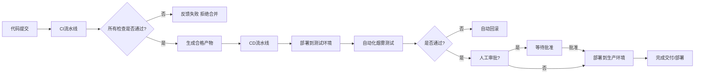

总结：

**CI 和 CD 是软件开发生命周期的2个部分。先 CI 再 CD。CI 是 CD 的基础，代码必须先经过 CI 的各类测试（编译成功、单测试覆盖率保证、精准测试覆盖率保证、Lint 成功）保证质量，才可以交给 CD 流程，进行打包和分发（实现价值）**

**CI 是质量的守门员，其边界在于代码集成阶段的验证和保证；CD 是价值的输送带，其边界在于发布流程的自动化。2者职责分明，先后衔接，各司其职。共同构建了现代软件工程的敏捷、高效的交付流程**


