# AI 对端上的赋能


## 一、实时特征回流
传统智能的问题、弊端是什么？


- 推荐系统需要收集用户的行为，将这些行为作为用户的意图表征，表征他的偏好，回流到服务端。
- 服务端拿到这个数据，在发起一次实时请求的时候，会根据用户的行为特征，去商品池里面召回一批用户喜欢的商品，再返回给端上，给用户做展示
- 同时，这个用户的行为数据，还会作为训练模型的一个样本


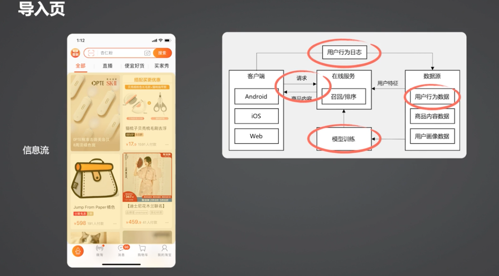
可以发现传统的推荐系统存在一些瓶颈：
- 实时性不足
    行为数据回流的时效性，会影响算法对于用户意图变化的感知，会影响推荐的准确性。
    现有的系统，在手淘这种亿级用户体量下面，想要做到用户数据的实时回流，技术上面挑战很大。
    另外涉及到用户隐私方面的风险考虑，以及在服务端的存储瓶颈相关的考虑，是不能把用户所有的行为都回流到云端
- 数据丰富度有限
   在服务端，整个用户行为数据的丰富度非常有限的。
   同时我们的一次推荐内容的更新，也是受限于一次新的请求时机的发起。
   即使我们发现用户的意图，通过数据发现了意图的变化，但是也很难实时对用户的前台界面去做一次干预，去及时调整推荐的内容
- 但用户算力/存储瓶颈
- 千人一面的模型
    目前服务端的算法模型更多的还是千人一面。受到算力和存储的瓶颈，很难针对每一个用户去建立一个属于他自己的模型。
    去做更加精准的预测。

针对上面的这些问题，就是端上的智能可以去发挥的空间所在。


前面说过，用户的数据回流时效性会影响推荐的准确度。那么是不是可以把用户的特征、用户的数据，做到最实时的回流？
这里，我们做了一些这样的尝试：
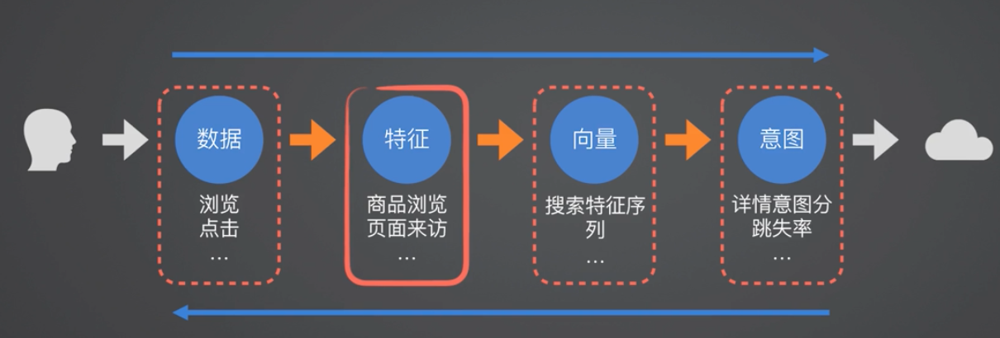

- 首先可以把用户的最原始的行为数据回流。比如用户在逛手淘的过程中产生的一些浏览、点击等行为回流到服务端
- 同时，也可以把用户的这些原始行为数据做一定的聚合，生成一个信息量含量更高，但是数据量更小的用户特征数据（数据聚合）
比如把用户在商品详情页的一系列的特征，聚合成用户对商品详情的更精炼的一些数据，比如用户有没有对商品点击过收藏、有没有点击过加购，聚合成
一条商品详情的浏览特征
- 也可以对这个特征继续做精加工处理，变成一个算法模型可直接使用的特征向量。当然了，它也可以表征用户的行为和意图
- 还可以把这个向量做进一步精加工处理，生成一些用户的意图打分。比如用户对于某个商品详情的意图分，是强还是弱，用分数去表明。

比如用户在手淘里面浏览的过程当中，用户逛着逛着是不是不感兴趣了？是不是疲劳了？这也可以用来表征用户的一个“跳失意图”。

这几种数据都可以回流到服务端的，图上数据可以看到：
- 从左往右：数据的加工度越来越高的、数据量是越来越少的
- 从右往左：数据量大，信息密度低

回流到服务端的时候，对于这4种不同类型的数据，一一做过尝试：
- 首先，如果直接回流用户的原始数据，那么这个数据量会非常大，服务端的存储存在压力。另一方面也会涉及到用户的隐私风险
- 其次，我们也尝试过，将用户的行为数据聚合成一条向量直接回流到服务端，数据量虽然小了，但是会丢失一些信息。另外向量这种数据格式，通用性会非常的受限。智能针对特定的模型去回流特定的向量。
- 另外，也尝试过直接回流用户的意图分，比如回流一条对于商品详情页的意图分，在整个手淘的流失的意图，这个数据是有效的，但是它丢失的信息也是非常多的

所以最后选择的是将用户的数据在端上做一定的标准的加工化处理，聚合成特征回流到服务端，这是实践过比较好的，既能保证数据的有效性又能保证实时性的一种方式。


### 1. 实时特征回流

- 数据本地加工，做标准化处理，然后按照需要将需要的那部分数据回传到服务端

解决了什么问题？
- 提升了数据的丰富度，能够在服务端拿到用户更多的、更细粒度的一些行为数据。能够让服务端的数据输入变得更丰富
- 通过对数据加工之后，建立一条实时的特征回流通道，保证了从端到云上的数据实时性

遗留了什么问题？
- 通过实时的回流方式，解决了用户实时感知的在实时性方面的问题
- 但即使感知到了用户意图发生了变化，，也缺少一个实时在前台去干预用户的方式


### 2. 信息流的“回退推荐”
针对实时特征无法具备实时干预能力的问题，在信息流方面做了一种叫“回退推荐的策略”

想象这样一个场景：用户在商品列表页，对某个商品感兴趣，点击某个商品到达详情页，在详情页看了一番之后，用户点击了收藏或者加入到购物车了。有收藏、加购行为表示用户对这个商品是很感兴趣的。

此时，从商品详情页到回退到外面这个商品列表页的时候，会根据用户刚刚的浏览、加购行为，推荐一个相似的商品。

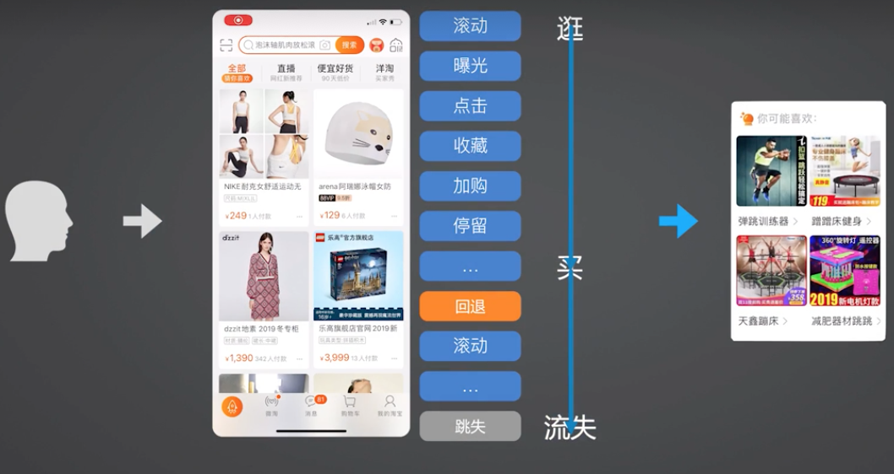

会根据用户刚刚浏览的这些行为，去给他推荐一个相似的商品。这个过程会发生很多行为，通过滚动、曝光等行为可以推测用户在信息流的浏览意图是逐渐从逛切换到了买。

如果页面回退，我们不做干预的情况下，他可能继续往下去浏览，购买这个行为的意图差“临门一脚”就可以转换为一次成交购买。如果不加以干预，可能逛着逛着就丧失购买意愿了，流失一笔潜在交易。

选择的策略是：在页面回退的时候，在原来的商品卡片周围，立即推荐一个相似的商品，希望能继续促成，希望能够留住他刚刚这次对商品购买的强意图。这个就是回退推荐。

本质上就是抓住了用户从逛到买的这个强意图聚焦。针对强意图的聚焦，做了一次成交转换的促成。

商品卡片的回退推荐策略落地上线后，效果是非常好的。比普通商品卡片的转换率高五六倍左右。


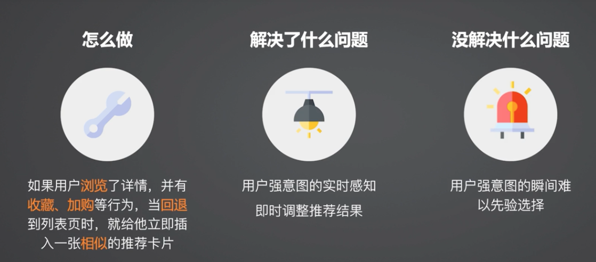

存在什么问题？
类似程序员和产品设计沟通出的一种机制，可以理解为命令式编程，是人为先验地找到了一个能够代表用户意图的时机，也就是在回退时机。这种时机靠人去发现梳理，往往是很难覆盖全面的。依赖于对于用户强意图的梳理、选择。那么有没有一种方式可以自动的去预测用户意图的变化？


## 二、应用场景

### 1. 信息流的端侧重排

在信息流上面做了另外一个尝试：在本地进行了一次端上的重排。

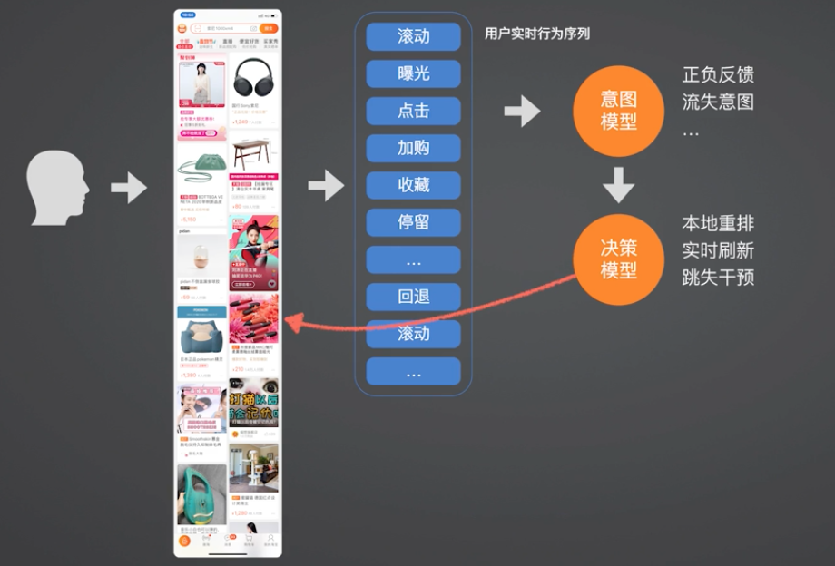


一个用户在逛信息流的过程中，会产生滚动、曝光、点击、加购、收藏、停留、回退、滚动这些行为。从用户的实时的行为序列中，其实是表征了用户背后的一个隐式的意图表达。

可以把用户的实时行为序列去输入到一个意图的模型当中，去计算用户当前的意图是什么？他偏好哪些、不喜欢哪些？得到用户的正负一些意图反馈。去判断用户当前是不是正在一个疲劳的状态，去计算他即将要跳失的可能性。

然后将这些用户意图，输入到一个本地的实时决策模型中去，去决定接下去要给这个用户去做什么事情。例如用户是不是对于接下来要滚动浏览的商品兴趣是不是发生了变化的时候，能够根据用户的实时意图，去做一次实时的调整，永远把用户最喜欢的内容放在他排序更靠前的位置。

或者当发现对这批商品都不感兴趣的时候，就理解去重新更新一次商品。或者当发现用户即将跳失之前，去做一些强干预，去挽留他继续留在这个页面上。比如通过一些权益去做挽留。

做完决策后，就可以将这个决策结果通知到前台，去做相应的响应。

还存在一些问题：
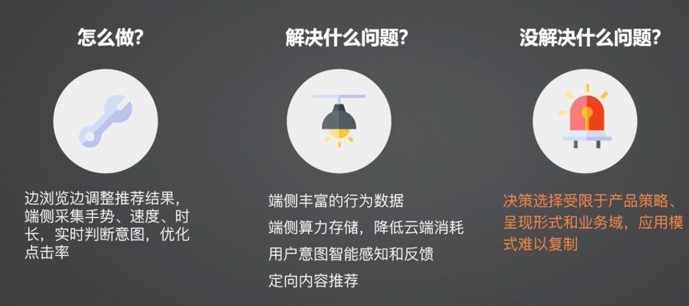

决策选择还是受限于产品策略。程序员还需要和产品去约定设计产品策略。开发和产品共同约定，在用户的某一时机之下，接下来对应的一个处理是什么。它的整个呈现形式和所处业务域还是存在紧密关系的。

这种应用形式，应用在信息流上是非常好的，但是很难迁移到其他业务域。

### 2. 智能 Push

在这样的背景之下，接下来开始下一个尝试，去做一个更加通用的、端上的智能应用。去 Push 业务。

传统业务上，Push 是服务端发起的。服务端存在一个任务，不断计算：我需要给什么样的一批用户、推送一批什么内容。服务端跑了这个任务后，会圈选一批人群，定一个任务，给这些人要去发一个推送。客户端收到这个推送，展示这个推送的消息内容。

服务端发起的 Push 有啥问题？
- 缺乏感知能力，难以精细化运营
    服务端不知道用户当前 App 的状态，用户在手淘内还是不在。没有办法知道用户的实时状态，很难针对用户的实时状态去做精细化运营。
- 被动触达，错失最佳营销时机
    更希望的是针对用户的某一个精细化行为，去做一次响应的时候，服务端 Push 是做不到的。


完整流程：
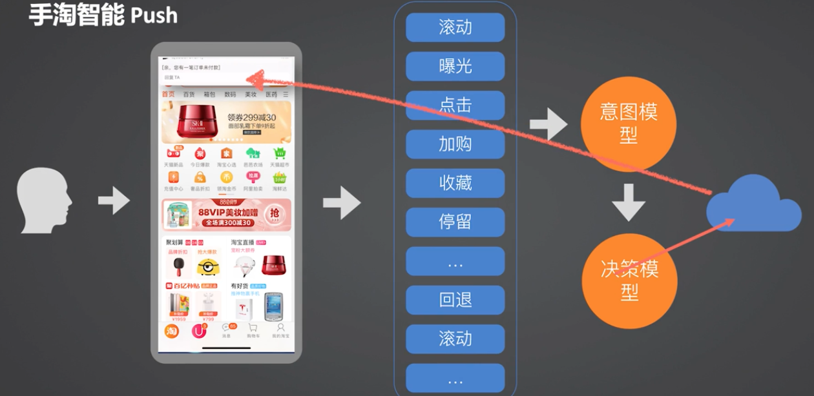

用户进入手淘后，会不断收集端上的行为（滚动、曝光、点击、加购、收藏、停留）数据，然后会把行为数据输入到另一个意图模型中，去判断他当前的一些实时意图。不断的根据行为做分析。也会输入到另一个决策模型中去，但这个（智能 Push）场景下的决策模型和前面的端上重排场景的决策模型是不一样的。这个决策模型会**判断用户当前的状态适不适合接受一次干预**，或者适不适合接受某一次营销的推荐。当我们发现用户当前处于一个相对空闲的状态，这个时机更适合接受一条干预的时候，我们就会把这个信号通知到服务端。这时候服务端在海量的内容中去筛选出一条对应着用户当前的意图，有效的一条信息，再推送给客户端。

这种从客户端发起的 Push 推送相比于服务端推送来说，对于用户当前的实时状态有着非常强的感知的，用户发生的任何一个行为在端上的决策模型中，可以以毫秒级的速度获取到，当我们真的需要去对用户做一次精准的干预的时候，这种方式相比于服务端推送来说，是有着非常大的优势的。

- 从“平台视角”向“用户视角”的转变
    传统的服务端推送是站在平台视角，来去筛选内容、筛选用户去发送消息的。而“端智能 Push”更多站在用户视角，去分析用户在什么时机下适合接受干预。
- 解决了什么问题
    对端上单用户的算力空间的充分利用；同时智能 Push 分离了用户的感知决策。用户的感知可以作为一个独立的模块存在。用户的决策：接下来要做什么响应。也是一个比较独立的模块。在应用性上具备初步的可移植性。可以在多个应用场景，不只是信息流这样一个较为垂直的业务域上去使用。
- 没有解决什么问题？
    决策依然需要先验制定。

我们对于 AI 的期待是美好的，期望 AI 可以帮助我们决定下一步做什么。然而通过这些案例可以发现，现阶段，我们还是只能做到在一个已经决策好的产品框架下面去做。是需要先有一系列的决定（在什么样的情况下面，可以有哪些响应），那么 AI 是帮助这样一个决策的结果更加精准。

### 3. 智能预加载

根据用户身份、角色、常见行为路径，预测接下去要使用的功能，对可能要进入的页面进行预热、预加载，在用户访问这个页面之前，把页面准备好，来做到秒开的效果。

也就是说，如果能精准预测用户下一步将要去往哪里，对于性能来说，提升是会非常明显的。

那么最关键问题就是：**如何预测用户下一步将要去往哪里**？

### 4. 手势热点识别

判断用户热点的操作区域是什么？针对这块区域来做一些定制化的特定推荐。

### 5.智能营销投放

用算法的更加精准的预测，去替代 以往的业务规则的人群圈选。


对于端智能来时，它属于基础能力。它用在哪里，才是能不能用好的一个关键，也就是业务价值能不能提升。

从过去的应用来说，我们认为端智能对于客户端的改变主要体现在：

- 更多的数据
    在端上做算法模型的预测，可以拿到用户在端上更富丰富、更细粒度的数据，去避免在服务端取不到这样丰富数据的缺陷。
- 更实时的响应
    相比于服务端，很多系统称具有小时、分钟、秒级别的实时响应，在端上的实时性是带来本质性的变化。
- 更低的消耗
    闲置算力去运算和存储资源，带来本质上的实时性的提升。同时也节约了服务端资源的消耗。


## 三、端智能整体架构
要素：算法、数据、调度框架、运行环境
架构如下：
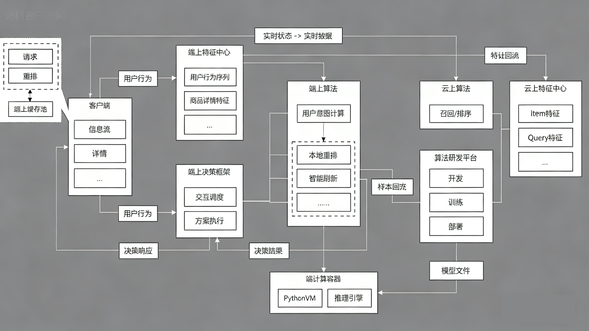

1. 围绕着端上的算法分为2种模型：
- 用户意图计算模型：不断分析用户当前所处状态
- 决策模型：会根据用户意图计算的结果，去判断下一步要做什么样的处理。比如一次本地重排、还是去做一次数据的重新刷新

2. 作为端上的算法输入，建立了一个端上的特征中心，用来提供给端上的算法使用：提供标准的用户行为数据、以及一些特征服务。

3. 还建立了端上的用户决策框架：接受用户的每条行为数据，然后根据这些行为去决定接下来什么时机要去唤起一个什么样的模型。拿到这个模型的响应结果后再一路回传到我们的客户端应用层。应用层根据这个结果来做前台界面上的渲染。

4. 围绕着端上的算法所在的执行环境，是在底层有一个端计算的容器，提供 Python 的运行环境以及 MNN 轻量级的推理引擎

5. 对于整个算法研发的 workflow，配套的做了一个端计算的一体化研发平台。算法同学在这个平台完成开发到发布、再到 AB 实验以及模型训练的一系列工作。

模型从这个平台发布后，是会下发到客户端，然后在端上跑。

### 1. 端上算法方案

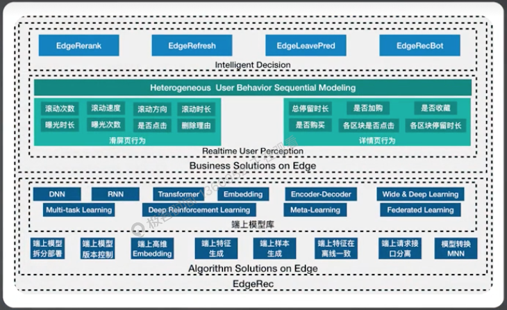

- Algorhitms Solution On Edge：
    - 提供了模型、特征和样本这三大机器学习算法基础组件的端上通用方案
- Business Solution On Edge：
    - 端上推荐算法解决方案，提供了端上实时用户感知和端上智能决策2大模块
    - 通过多任务学习，端上智能决策支持了端上重排、端上智能刷新、端上会话式推荐和端上跳失点预测等任务
- 千人千模：
    - 每个用户训练和部署自己的个人化模型
    - Meta-learning + Federated Learning

### 2. 端上特征中心
为端智能应用而设计，提供端侧算法所使用的标准化的全域用户行为数据和特征服务
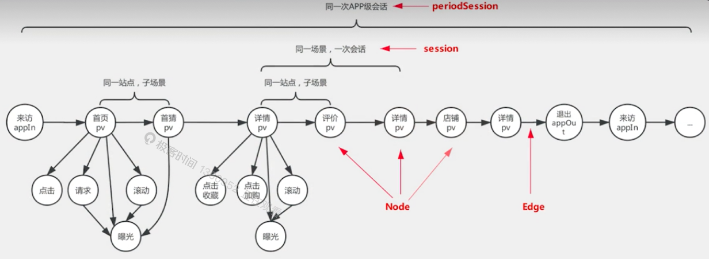
- 定义端侧用户行为标准
    该特征中心会定义端上用户的行为标准，产生什么样的用户行为，比如用户的浏览行为。这个浏览行为会有一些我的浏览区域、浏览停留时长等等标准化属性。其次，也会有一些像用户手势行为。比如滚动、点击等等。
- 建立行为数据图化索引
    具体的实现上，为用户的每个行为，去建立了一个行为的图画的索引，将用户的行动点当作一个节点，并且把节点和节点之间建立了一种关联。这样子能够在端上，让算法可以快速拿到这个数据。
- 数据标准化
    同时，采集到这个数据之后。也会对数据做标准化处理。把它经过标准化的字段解析和我们的特征加工，给算法提供简单、易用、可用的数据
- 通用特征接口服务


数据分层架构：
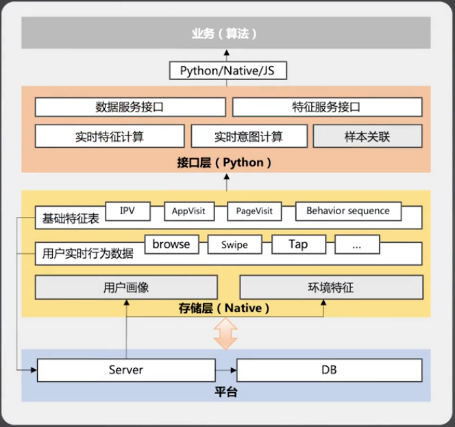

- 存储层：将采集到的用户行为数据按照约定的标准，在客户端本地做持久化存储。同时对用户数据进行一次加工处理，生成一份信息密度比较高的基础特征表。比如对详情页的浏览行为、App 页面间操作路径的数据、页面浏览的时序特征，这些数据都会存储在客户端本地。
- 接口层：实时接口层，提供了 Python 层面的接口服务，给算法侧使用。可以做到数据的实时查询，将下层的通用数据、用户行为数据、环境信息等打包好给算法侧使用。
  这个数据一部分存在端上，一部分存储在云端，和云端有个数据同步需求的：
    - 从端同步到云，将一些必要的基础特征同步到服务端，让服务端可以拿到用户实时的聚合好的特征。
    - 从云到端，也可以把云端特有，客户端没有的数据（比如用户画像、历史行为等等）下发下来，这样子可以让端上的算法也能拿到这部分数据，做出更精准的预测。


### 3. 端上的决策中心
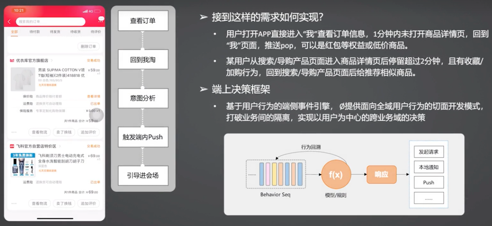
比如：用户在：我的淘宝 -> 我的订单 -> 订单详情页查看了某个订单详情，然后回退到“我的淘宝”页，这时候会对用户的意图进行分析，判断当前是不是处于一个空闲的状态。如果发现是空闲状态，则给他发送一条 Push 消息，引导进入双11主会场。这个就是一个智能 Push 的案例。

还有其他的需求：
- 用户打开 App 直接进入“我的淘宝”查看订单信息，1分钟内未打开商品详情页，回退到“我的淘宝”页面，推送弹窗，可以是红包等权益或者低价商品
- 用户从搜索/导购产品页面进入商品详情页后停留超过2分钟，且有收藏/加购行为，回退到搜索/导购产品页面后会推荐相似商品

这些需求，纯客户端视角下很难完成。所以基于用户行为的端侧事件引擎，提供面向全域用户行为的切面开发模式，打破业务间的隔离，实现以用户为中心的跨业务域的决策能力。

这样一个切面能力的好处就是：
- 业务开发同学不需要去关心前面的这一串行为是啥时候触发的、怎么发生的。这个行为的匹配由端上的决策框架去做。
- 实际的开发同学，只需要去关注在切面发生的时候，我需要去做哪些处理。比如：弹层


这种面向用户行为的切面的编程方式，既可以用在运营规则上，也可以用在算法模型上。后续的响应，可以是弹出弹层、发送 Push、发送1次请求等。

### 4. 端计算容器
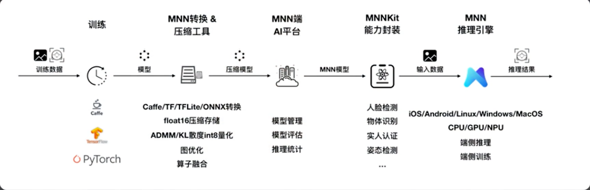
端上的算法模型需要跑在容器里，手淘用的是一个轻量级的推理引擎 MNN。MNN 提供了算法在端上跑模型所需要的算子。

## 四、云端一体协同
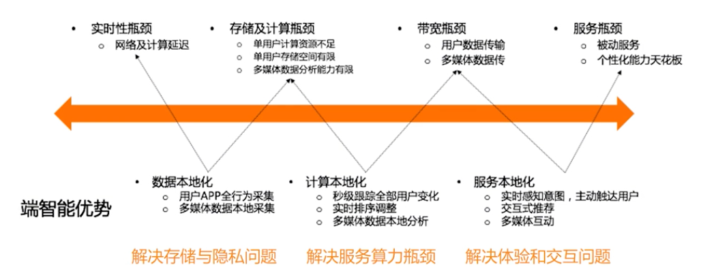
上图是端计算的优势和云计算的劣势。
未来的端计算并不是完全割裂的。端和云协同才可以迸发最大的效果。

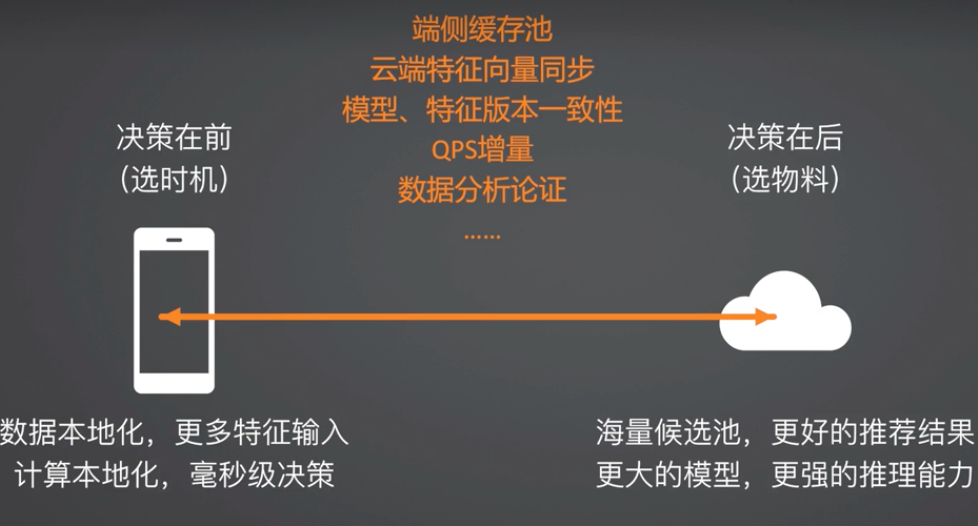
可以看到端和云拥有各自擅长的领域。

在做云端协同的过程中，会遇到不少问题。比如在端上触发一次重排的时候，会发现端上的数据量是不够的，如果想要提升端上的重排效果，就要扩大候选池，所以增加了**端上的缓存池**。在端上的模型在本地运行过程中，由于模型本身是在服务端训练的，它的模型和特征向量的同步一致性是需要细节方面处理好的。
同时由于在端上选择用户时机去做一些干预，实际上对于服务端是带来一些 QPS 增量，如何解决处理使其不是负担也需要处理。

这些问题处理好，最后需要回答价值多大问题的时候，就需要做实验验证端计算是否真的有效的时候，在实验的设计、以及后续数据分析、结果归因上，也耗费了大量的精力去论证它的有效性。这些是踩坑之处。


QA: 决策框架与 MNN 推理引擎的区别是什么？

| 维度         | MNN (推理引擎)                                            | 决策框架                                                     |
| :----------- | :-------------------------------------------------------- | :----------------------------------------------------------- |
| **技术定位** | **底层计算基础设施**                                      | **上层业务调度与编排系统**                                   |
| **核心职能** | **“算”** - 高效执行模型计算，输出预测结果（如用户意图分） | **“判”与“调”** - 判断在什么时机、调用哪个模型、并根据结果执行哪个业务动作 |
| **类比**     | **笔墨和运笔技法**（负责把字写出来）                      | **书法家的头脑和章法**（决定何时写、写什么字、怎么写布局）   |
| **关注点**   | 计算性能、算子支持、模型兼容性、功耗                      | 业务逻辑、决策流程、时机控制、动作执行                       |
| **输出物**   | 模型的数值化输出（如分数、概率）                          | 一个具体的业务指令（如：重排、刷新、弹窗）                   |

为了更好地理解，我们可以看一个它们如何协同工作的例子，比如“端侧重排”：

1. **决策框架感知时机**：决策框架监控到用户发生了一系列行为（滑动、点击、停留），判断**此时需要重新计算用户意图**。
2. **决策框架调用MNN**：决策框架**调度**“用户意图计算模型”开始工作，并将必要的特征数据准备好。
3. **MNN执行计算**：**MNN引擎**加载并运行该模型，进行高速数学计算，最终输出一个**用户当前的意图分数**。
4. **决策框架做出决策**：决策框架**接收**MNN返回的意图分数，再结合预设的业务规则（例如：分数高于X则触发重排），**判断**下一步应该执行“本地重排”动作。
5. **决策框架执行响应**：决策框架**通知**前端的渲染模块，对商品列表进行重新排序。


## 五、AI 在有赞落地了什么场景

### 1. 云打印机秒连接
云打印机接入 OCR + LLM 技术实现 AI 拍照秒识别，秒连打印机，一拍即用，操作简单
门店商家很多都会去连接打印机，连接过程中成功率只有54%左右。分析了相关原因，发现有2个主要原因：
- 商家找不到打印机的连接入口
- 打印机的配置过程中需要输入相关的编号和密钥。很容易输错

正好 AI 来了，AI 可以结合到打印机的铭牌，做一些智能识别跟参数的推理，然后拿到相关的结果，就可以智能的去调云打印机相关服务厂商的接口，就可以非常完美的解决这个问题。

我们对接了非常多的云打印机的品牌厂商，通过 AI 能力，去设计一些提示词，针对这些不同厂商的差异要做一些不同场景的兼容设计，过程中其实踩了不少的坑，不断的调优，让所有的硬件识别准确率提升了非常多。

我们的产品改造完之后，在商家平台网页端，硬件添加入口，让商家上传铭牌照片就可以了。原来的十步变成1步。连接成功率也从原来的不到70%提升到97%。
思路，以后的业务需求，可以尝试跳出 Web 前端能力、Native 能力，从 AI 侧看看有没有更多的可能和思路。


### 2. 基于图像识别算法的零售移动智能收银方案

#### 1. 背景
生鲜果蔬行业在零售行业中是一个较大且比较有特征性的行业，同时在生鲜果蔬行业中，称重秤为经营的刚需类设备。目前商家主要使用条码秤，通过 PLU（Price Lookup Code） 码进行商品的管理，每个 PLU 码对应一个商品，我们可以想象下在超市购买水果的时候会碰到下面这个流程：

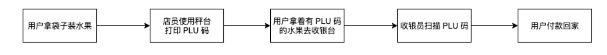

所以在门店商品种类比较多时（一个典型生鲜果蔬类商家商品种类大多超过 200 个，随机调研了 5 家有赞果蔬商家，平均 SKU 数量 500+），PLU 码较难记忆清楚，在打秤时需临时查询，称重耗时比较长，为了避免高峰时期排队现象，需在门店增加秤台和打称员，导致商家人力成本较高。

因此就前面所提到的场景，我们需要通过更加智能的方式帮助商家加购，那么基于机器学习的图像识别能力就被提上了议程。我们通过条码秤关联的摄像头进行实时拍摄，基于机器学习技术和图像识别技术，将店员放置在秤盘上的商品进行识别，并给出相关商品的列表，减少收银员收银场景中的操作次数，减少商家对新收银员的PLU码的培训并降低熟悉相关商品的培训成本，从而在整体上降低收银员的门槛以及商家的人力成本。所以我们可以得到我们期望的购买流程：

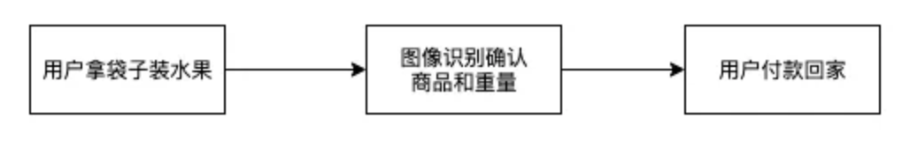

#### 2. 架构设计
我们针对于商家的痛点和可行的解决方案绘制了下面的流程图：
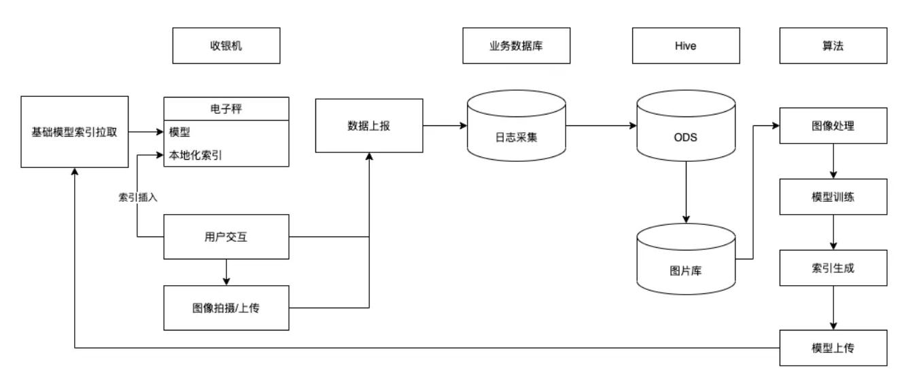

整个流程中的基础能力：
- 实现摄像头对于商品的拍摄
- 针对于拍摄能力支持图像转换成为商品的能力
- 将识别结果进行列表化展示
- 将用户点击之后的结果进行上报，用于商家个性化画像的绘制，以及机器学习模型的加深
- 支持机器学习模型的动态下发


#### 3. 框架选择
首先是整个环节的核心点，对于商家商品的关联以及数据模型进行机器学习并完成定时的增量更新流程。通过对比市面上已有的框架，因为 TensorFlow 有 lite 版本单独支持移动端能力，同时结合有赞算法团队已有的技术沉淀，所以敲定使用 TensorFlow 作为机器学习的基础框架。完成了框架的确定，就需要考虑业务场景上的实现了。


#### 4. PLU 码是什么
PLU 码是生鲜零售行业的 “商品价格查询码”，核心是用一串数字唯一标识一种散装生鲜商品，方便打秤时快速调取价格
特点：
- 本质是 “商品与价格的关联码”，替代人工记忆商品价格的繁琐操作。
- 通常由 4-5 位数字组成，可分为行业通用码和商家自定义码。
- 仅用于散装生鲜（如蔬菜水果、散装零食），预包装商品多用地条码。

比如我买了10斤红富士苹果，怎么体现？PLU码会携带重量、价格信息吗？收银员拿到这个 PLU 码之后的处理流程是什么样的？
PLU 码不只为生鲜类目（主要服务散装非标品），本身不携带重量/价格信息，仅关联 “商品 + 单价”信息。10 斤红富士需通过 PLU 码调单价 + 秤称重算总价，收银员核心流程是 “输码 - 调价 - 称重 - 结算”。

##### 1. PLU 码的适用范围：不止生鲜，但聚焦 “散装非标品”
核心适用场景：散装生鲜果蔬（如苹果、生菜）、散装干货（如核桃、枸杞）、散装零食（如糖果、饼干），这些商品无固定包装、需按重量计价。
非适用场景：预包装商品（如盒装牛奶、袋装面包），这类商品有固定重量 / 价格，用地条码（EAN 码）而非 PLU 码。
简单说：PLU 码是 “散装称重商品的专属身份码”，生鲜是主要使用场景，但不是唯一场景。

##### 2. 10 斤红富士的 PLU 码使用逻辑：重量靠秤、价格靠计算
PLU 码的核心作用是 “快速调取商品单价”，重量和总价需结合秤的功能实现：
第一步：红富士对应 PLU 码（如通用码 4133），商家已在秤中录入 “4133 = 红富士，单价 8 元 / 斤”。
第二步：你买 10 斤红富士，打秤员将苹果放在秤上，输入 PLU 码 4133。
第三步：秤自动读取 “10 斤” 重量，按 “单价 8 元 / 斤 ×10 斤” 算出总价 80 元。

关键：PLU 码只负责 “告诉秤这是什么商品、多少钱一斤”，重量是秤测量的，总价是系统实时计算的，三者独立但联动。

##### 3. 收银员拿到 PLU 码后的完整流程
以超市购买 10 斤红富士为例，流程分 5 步：
- 商品上秤：将散装红富士放在条码秤的秤盘上，秤实时显示重量（10 斤）。
- 输入 PLU 码：收银员手动输入 4133（红富士 PLU 码），或通过扫码枪扫预存的 PLU 码贴纸。
- 系统调参计算：秤通过 PLU 码调取预设单价（8 元 / 斤），自动计算总价（8×10=80 元）。
- 打印价签：秤打印含 “PLU 码、商品名、重量、单价、总价、日期” 的价签，贴在商品上。
- 收银结算：你拿着贴有价签的商品到收银台，收银员扫价签上的条码（或手动输入 PLU 码），收银系统确认价格后完成支付。

#### 5. 商品关联
完成了框架选择，接下来就需要确定如何将商品关联到数据模型上了。

有赞的商品有很多的字段，比如说：编码、条码、规格、属性等等。“有赞商品的编码、条码等唯一标识字段，零售场景已支持识别，但这类标识仍需人工关联 PLU 码才能完成称重结算，未能解决‘PLU 码难记忆、打秤查询耗时’的核心痛点。本次 AI 图像识别的核心目标，是通过商品视觉特征直接匹配类目，替代人工查询 PLU 码的操作，实现‘称重 - 识别 - 收银’一体化，而非替代已有条码识别能力

我们选择能够区分商品本身存在的差异化的方案——商品类目。

有赞的商品类目最大为 4 级，最后基本上已经能够细分到水果的某一个种类中。举个例子：一个苹果，在有赞类目中的选择需要被选择成为 `食品酒水 > 水产肉类/新鲜蔬果/熟食/现做食品 > 新鲜水果 > 苹果`，同时考虑到苹果中仍然存在不同的品种。所以我们在商品类目中追加了水果种类用于区分不同的苹果品种，比如说：金帅、国光、冰糖心……


#### 6. 反馈闭环
在确定了核心能力的解决方案后，接下来需要解决的是如何将商家本地的数据进行上传，并对于已有模型进行强化。为了更加及时的获得用户本地的选择情况，我们选择了有赞埋点平台作为技术支撑，通过离线缓存，并结合闲时上报的能力，将用户选择图片的整体筛选情况，基于店铺/角色等维护进行拆分，并将最终的选择数据导入 ODS 库中。并在算法前结合用户选择时机的拍摄图片上传 + 用户选择商品情况进行结合，进一步针对于对应店铺的模型进行加强。从而在不断的强化商家模型，从而提高用户准确性。

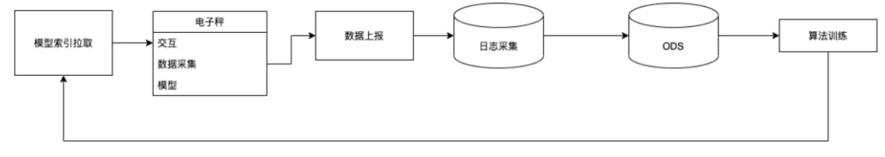

#### 7. 流程优化
要达到好用的程度。所以我们需要对于数据统计流程/用户交互流程进行更加深入的优化

##### 1. 自动化类目关联
考虑到许多商家在使用零售的过程中，如果需要挂载到对应的类目中成本较高，为了减少商家的操作成本。我们基于商家的商品标题 + 图片提供了默认类目和种类的选择。极大程度上降低了用户的操作成本。


##### 2. 图片上传/优化
根据分析商家的实际使用场景，我们发现部分商家在售卖生鲜果蔬的同时，仍然会同时售卖一些标品，比如说日常的柴米油盐酱醋茶。所以导致商家在正常选择商品时候，设备相机仍然会采集相关照片。从而导致商家返回中会存在一部分无效图片，从而影响后续的数据分析，所以我们需要在进行机器学习算法前进行空盘图片的判断，从而避免无效数据对于数据集的影响。

同时由于电子秤的硬件特性：当物品放置到称上的时候，电子秤中的读数从 0 变化到物品实际重量的流程是非线形的，这就导致了，如果我们在这过程中进行数据采集，可能会采集物品非稳定的状态。所以我们约定在电子秤的读数停止变化的时候才进行数据采集，从而保证数据的有效性。

除此之外，由于设备的服务商的不同，导致不同服务商对于设备摄像头的调校结果也不相同。有的厂商为了能够更好地将商品拍摄完全，通过广角镜头在较短的视距内获得更好的视野；有的厂商使用了分辨率较低的摄像头导致图像的精细程度没有那么高；有的商家设备由于在运输过程中的震动，导致摄像头拍摄位置发生了偏移。以上种种问题，我们都需要通过一些图形学的解法，将所有的逻辑处理成为统一的结果。所以在最终进入机器学习的算法前，我们需要通过图像处理，对图片进行裁切、锐化、畸变矫正。从而保证了不同设备的数据一致性。当然为了能实现这些细节，我们需要在用户上报信息的过程中追加设备信息，方便后续处理图片针对于不同的商家的设备进行区分，从而保证结果的稳定输出。

##### 3. 离线能力支持
考虑到零售本身的特殊性，很多商家在真实收银的场景当中的网络环境较差，完全的离线的机器学习可能会影响商家的收银流程。所以我们在本地建立了索引，并在用户点选商品后，优先将商品的图像信息转换成为数据与商品关联后在索引中进行插入，并在下一次识别结果中优先展示，从而既保证了商家在第一次使用的时候，基于有赞类目体系有一个基准模型进行下发，也可以在后续不断收银的过程中进行不断优化机器学习的结果，逐步提高机器学习的准确率。


## 六、QA

### 1. 什么是索引？

#### 通俗化解释

想象一下，你是一个新店员，老板给你做培训：

1. 老板指着一个苹果说：“这个叫‘红富士’，PLU码是4133。”
2. 你的大脑：并不会像相机一样存下苹果的完整图片，而是会提取关键特征——“圆圆的、红色带黄条纹、有个把儿”。你把这些特征和“红富士/4133”这个信息关联起来，记在脑子里。
这个过程就是 “将商品的图像信息转换成为数据与商品关联”。
- 商品的图像信息：一张苹果的彩色图片（原始数据，体积大，难以直接比较）。
- 转换成为数据：通过一个复杂的AI模型（通常是卷积神经网络），从图片中提取出最能代表这个苹果的、最本质的特征向量。这个向量就是一长串数字（比如128或256个数字组成的一个列表），可以理解为这个苹果的 “数字指纹” 或 “特征DNA”。
- 与商品关联：将这个“数字指纹”（特征向量）与商品信息（如PLU码“4133”、商品名“红富士”）绑定在一起。
所以，简单来说：它不是存储图片本身，而是存储从图片中提取的、机器可理解的“本质特征”，并把这个特征和商品身份挂钩。

#### 索引是什么？为什么是核心？

现在，你大脑里已经记住了好几种商品的特征。当顾客又拿来一个水果时，你需要快速判断它是什么。

**“索引”就是你所记忆的、所有商品的“特征-DNA -> 商品信息”的快速查询表。**

在计算机中，**它就是一个专门为"相似性搜索"优化的特殊数据库表。**

| ID   | 商品名称   | PLU码 | 特征向量                   |
| :--- | :--------- | :---- | :------------------------- |
| 1    | 红富士苹果 | 4133  | [0.12, 0.95, -0.43, 0.67]  |
| 2    | 香蕉       | 4017  | [-0.34, 0.21, 0.88, -0.12] |
| 3    | 西兰花     | 4620  | [0.76, -0.55, 0.09, 0.33]  |

**这个表格本身就是"索引"**——它把商品和它们的"数字指纹"（特征向量）关联起来了。

### 关键问题：如何快速查找？

您完全正确——**就是通过计算距离，距离越近越匹配！**

#### 距离计算的直观理解

把特征向量想象成在多维空间中的"坐标点"：

- 红富士苹果：坐标 `[0.12, 0.95, -0.43, 0.67]`
- 香蕉：坐标 `[-0.34, 0.21, 0.88, -0.12]`
- 西兰花：坐标 `[0.76, -0.55, 0.09, 0.33]`

当新来一个水果，AI也把它转换成一个坐标，比如 `[0.15, 0.89, -0.38, 0.71]`。

**系统会计算这个新坐标与索引中所有商品坐标的"距离"**：

```shell
新水果 vs 红富士苹果：距离 = 0.08  (很近！)
新水果 vs 香蕉：距离 = 1.42       (很远)
新水果 vs 西兰花：距离 = 1.15     (较远)
```

#### 实际的查找过程

1. **遍历计算**：系统会遍历索引中的每一条记录，计算新向量与该记录特征向量的距离
2. **排序**：按距离从近到远排序所有商品
3. **返回Top K**：返回距离最近的3-5个商品作为候选结果

