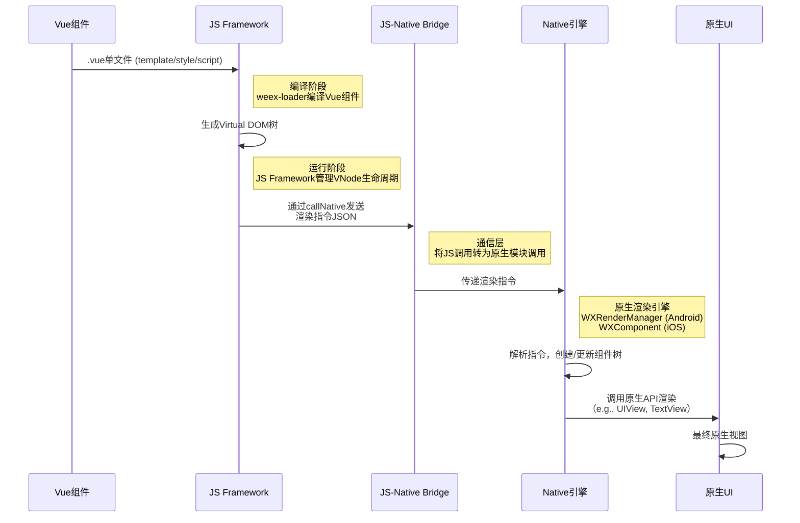
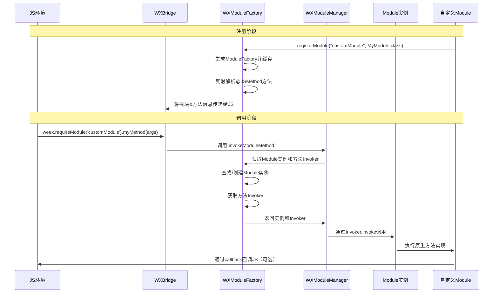
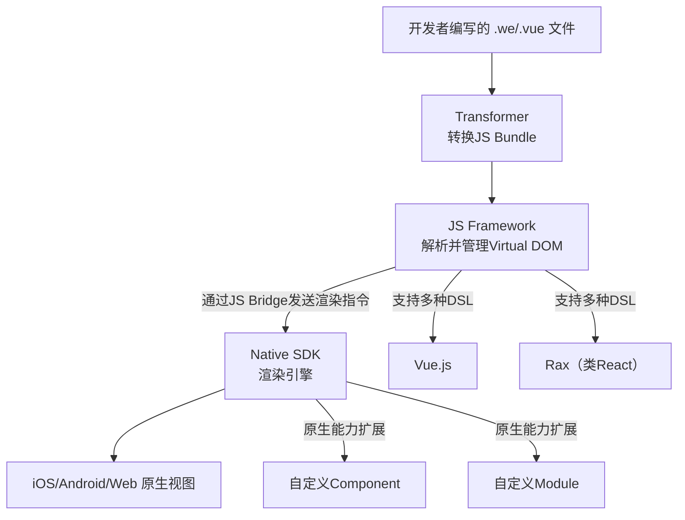

# Weex 底层原理与 APM

> 从 Vue 组件库（Vue Lib）到 Weex 渲染为 iOS 原生 UIKit 元素，核心是 “Virtual DOM → 跨线程通信 → Native DOM 构建 → 布局计算 → 原生 View 渲染 → 事件反向绑定” 的完整链路。Weex 作为中间层，主要完成 7 大核心工作，接下去看看详细内容

## 一、核心步骤

从 Vue Lib 到 Weex 原生 UIKit 元素的完整流程。

首先，用户的需求是 “列举 Weex 做的事情” 并 “结合最新源码标位置”，所以思考过程要先拆解流程：从 Vue 编译产物处理、JS-Native 通信、Virtual DOM 解析、DOM 构建与布局计算、渲染指令生成、原生 View 创建与更新，这几个核心步骤。每个步骤都要对应 Weex 的具体工作，还要找到最新源码中的对应类和方法。

第一步，应该是 Vue 编译产物的适配。因为 Vue 写的代码要被 Weex 识别，Weex 需要处理 Vue 的模板编译结果（比如 render 函数生成的 Virtual DOM），还要注入 Weex 的 JS Runtime API。这里要找最新源码中 JS Runtime 的初始化类，比如 WXJSContext 或 WXBridgeCore，因为 JS 环境的搭建是第一步。

第二步，JS-Native 通信的建立。Vue 的 Virtual DOM 变化需要传递给 Native，所以 Weex 的 Bridge 核心要注册通信方法（比如 callNative），这里对应 WXBridgeCore 的 invokeNative 方法，之前讨论过 bridge 队列，这里要结合最新源码中通信任务的调度。

第三步，Virtual DOM 的解析与 DOM 树构建。Weex 需要把 Vue 的 Virtual DOM（JSON 结构）解析成 Native 侧的 DOM 节点（WXDOMNode），这部分现在在 WXDOMCore 中，比如 createNode 方法，处理节点创建、属性更新，还要维护 DOM 树结构。

第四步，样式解析与 Yoga 布局计算。Vue 的样式（比如 flex）要被 Weex 解析，转换为 Yoga 的布局属性，然后在 dom 线程计算布局，这部分在 WXDOMCore 的_scheduleLayout 方法，调用 Yoga 的 calculateLayout。

第五步，渲染指令生成与传递。DOM 和布局计算完成后，要把结果封装成渲染指令（节点 ID、frame、类型等），通过主线程传递给渲染核心，这里是 WXDOMCore 的_notifyRender 方法，切换到 main queue。

第六步，原生 UIKit 元素的创建与更新。渲染核心（WXRenderCore）接收指令，创建对应 UIKit 控件（UILabel、UIImageView 等），或复用已有 View，更新 frame 和样式，这部分在 WXRenderCore 的 render 方法，还有具体的 View 工厂类（比如 WXViewFactory）。

第七步，事件绑定与反向通信。原生 UI 的事件（比如点击）要传递回 Vue，Weex 需要注册 Native 事件，通过 Bridge 回调 JS，这里对应 WXEventDispatcher 和 WXBridgeCore 的 callbackJS 方法。

具体的逻辑不做深入探讨，可以查看源码研究。


## 二、Yoga

### 1. 支持"增量布局更新"

当组件样式变化时，Yoga 仅重新计算受影响的组件树分支，而非全量重算，大幅减少 RN 应用的布局耗时和卡顿』Yoga 是如何实现仅计算受影响的组件树分支的？类似有个打标记，标记为 dirty？

Yoga 实现增量布局的核心就是 「Dirty 标记机制」+「组件树依赖传播」—— 通过标记 “受影响的节点”，并仅处理这些节点及其关联分支，避免全量重算。

#### 1. YogaNode 与 Dirty 状态标识
Yoga 中每个组件对应一个 YogaNode（布局计算的最小单元），每个节点都包含 3 个关键状态标记（用于判断是否需要重算）：
- dirtyFlags（核心标记）：记录节点的 “脏状态类型”，主要分两类：
    - LAYOUT_DIRTY：节点自身样式（如 width、flex）或子节点布局变化，需要重新计算自身布局；
    - MEASURE_DIRTY：节点的测量相关属性（如 measureFunction 自定义测量逻辑）变化，需要先重新测量尺寸，再计算布局。
- isLayoutClean：布尔值，快速判断节点是否 “干净”（无脏状态），避免重复检查 dirtyFlags；
- childCount + children 指针：维护子节点列表，用于后续遍历依赖分支。


#### 2. 脏状态触发与传播：从 “变化节点” 到 “根节点” 的冒泡
当组件样式变化时（如 RN 中修改 style={{ flex: 2 }}），Yoga 会触发以下流程：

- 步骤 1：标记自身为 Dirty
直接修改变化节点的 dirtyFlags |= LAYOUT_DIRTY（或 MEASURE_DIRTY），同时设置 isLayoutClean = false。

- 步骤 2：向上冒泡通知父节点
由于父节点的布局（如尺寸、位置）依赖子节点的布局结果（比如父节点是 flex:1，子节点尺寸变化会影响父节点的剩余空间分配），因此会递归向上遍历父节点，直到根节点，将所有 “依赖节点” 都标记为 LAYOUT_DIRTY。
关键优化：父节点仅标记 “需要重算”，但不会立即计算，避免中途重复触发计算。

- 步骤 3：跳过已标记的节点
若某个节点已被标记为 Dirty，后续重复触发时会直接跳过（避免重复冒泡），提升效率。

#### 3. 布局计算阶段：只处理 Dirty 分支，跳过干净节点（DFS）
当 Yoga 触发布局计算（如 RN 渲染帧触发、组件挂载完成）时，会从根节点开始遍历组件树，但仅处理 “Dirty 节点及其子树”：

- 步骤 1：根节点判断状态
若根节点是干净的（isLayoutClean = true），直接终止计算（全量跳过）；若为 Dirty，进入分支处理。

- 步骤 2：递归处理 Dirty 分支
对每个节点，先检查自身状态：
- 若干净：直接复用上次缓存的布局结果（x/y/width/height），不重算；
- 若 Dirty：
    - 先处理子节点：如果子节点是 Dirty，先递归计算子节点布局（保证父节点计算时依赖的子节点数据是最新的）；
    - 再计算自身布局：根据 Flex 规则（如 flexDirection、justifyContent）和子节点布局结果，计算自身的最终尺寸和位置；
    - 清除 Dirty 标记：计算完成后，设置 dirtyFlags = 0、isLayoutClean = true，标记为干净。

- 步骤 3：增量更新的核心效果
比如修改一个列表项的 margin，只会标记该列表项 → 父列表容器 → 根节点为 Dirty，其他列表项、页面其他组件均为干净，会直接跳过计算，仅重算 “列表项→父容器” 这一小分支。

### 2. Flex 布局逻辑如何到 Native 系统

Flex 布局逻辑，或者说 DSL，是如何翻译为 iOS 的 AutoLayout 和 Android 的 LayoutParams 的？

Yoga 先将 Flex DSL 解析为统一的「布局计算结果」（节点的 x/y/width/height、间距、对齐方式等），再根据平台差异，将计算结果 “映射” 为对应平台的原生布局规则——iOS 映射为 AutoLayout 约束，Android 映射为 LayoutParams + 原生布局容器属性。

#### 1. 第一步：通用前置流程（跨平台统一）
无论 iOS 还是 Android，Yoga 都会先完成以下步骤，屏蔽 Flex DSL 的解析差异：
1. 解析 Flex 样式：将上层框架的 Flex 配置（如 RN 的 StyleSheet、Weex 的模板样式）解析为 YogaNode 的属性（如 flexDirection、justifyContent、margin、padding 等）；
2. 执行布局计算：通过 Flexbox 算法（基于 Web 标准），计算出每个 YogaNode 的最终布局数据：
- 固定属性：width/height（含 auto/flex 计算后的具体数值）、x/y（相对父节点的坐标）；
- 间距属性：marginLeft/Top/Right/Bottom、paddingLeft/Top/Right/Bottom；
- 对齐属性：alignItems、justifyContent 对应的节点相对位置关系；
3. 输出标准化布局数据：将上述结果封装为平台无关的结构体，供后续平台映射使用。

#### 2. 第二步：iOS 端：映射为 AutoLayout 约束（NSLayoutConstraint）
AutoLayout 的核心是「基于约束的关系描述」（而非直接设置坐标），因此 Yoga 会将 “计算出的具体尺寸 / 位置” 转化为 UIView 的约束（NSLayoutConstraint），核心映射规则如下：一一翻译 css 规则到 iOS AutoLayout 写法：

| Flex 核心属性                                         | 对应的 AutoLayout 约束逻辑                                   |
| ----------------------------------------------------- | ------------------------------------------------------------ |
| `width: 100`                                          | 映射为 `view.widthAnchor.constraint(equalToConstant: 100)`   |
| `height: auto`                                        | 先通过 Yoga 计算出具体高度（如文字高度、子节点包裹高度），再映射为 `heightAnchor` 约束；若为 `flex:1`，则映射为 `heightAnchor.constraint(equalTo: superview.heightAnchor, multiplier: 1)`（占满父容器剩余高度） |
| `marginLeft: 20`                                      | 映射为 `view.leadingAnchor.constraint(equalTo: superview.leadingAnchor, constant: 20)` |
| `marginTop: 15`                                       | 映射为 `view.topAnchor.constraint(equalTo: superview.topAnchor, constant: 15)` |
| `justifyContent: center`（父节点 flexDirection: row） | 父节点约束：`view.centerXAnchor.constraint(equalTo: superview.centerXAnchor)`；若有多个子节点，通过调整子节点间的 `spacing` 约束实现均匀分布 |
| `alignItems: center`（父节点 flexDirection: column）  | 子节点约束：`view.centerYAnchor.constraint(equalTo: superview.centerYAnchor)` |
| `flex: 1`（子节点）                                   | 映射为 `view.widthAnchor.constraint(equalTo: superview.widthAnchor, multiplier: 1)`（横向占满）+ 父节点的 `distribution` 约束（分配剩余空间） |

补充信息：

- Yoga 会为每个 `UIView` 关联一个 `YogaNode`，布局计算完成后，通过 `YogaKit`（或上层框架如 RN 的原生层）自动生成约束；
- 支持 “约束优先级” 适配：比如 `flex:1` 对应的约束优先级会高于固定尺寸约束，确保 Flex 规则优先生效；
- 混合布局兼容：若原生视图已有部分 AutoLayout 约束，Yoga 会生成 “补充约束”，避免冲突（通过 `active`属性控制约束启用 / 禁用）。


##  三、Weex 剖析



下面针对核心机制详解与源码定位

### 1. 编译阶段：从 Vue 到 Virtual DOM

- 处理 Vue 单文件：开发者的`.vue`文件通过 Webpack 和 `weex-loader` 编译成 JavaScript Bundle。这个 Bundle 包含了渲染页面所需的所有信息
- 生成Virtual DOM：在JS运行时，Vue.js（或 Rax）的渲染函数会生成一棵 Virtual DOM树（VNode）。Weex 的 JS Framework 会拦截常规的 DOM 操作，将其导向 Weex 的渲染管道

源码相关：编译过程主要涉及 `weex-loader` (在 `weex-toolkit` 项目中)，而 JS Framework 对 VNode 的处理在 `js-framework` 目录下。重点关注 `src/framework.js` 中的 `Document` 和 `Element` 类，它们模拟了 DOM 结构

### 2. 指令生成与通信

- 序列化为渲染指令（json 数据）：JS-Framework 不会直接操作 Dom，而是把对 Dom 的操作，描述成对 VNode 对象的创建、更新、删除等，序列化成一种特殊的 JSON 格式的渲染指令。比如

  ```json
  {
    "module": "dom",
    "method": "createBody",
    "args": [{"ref": "1", "type": "div", "style": {...}}]
  }
  ```

- JS-Native 桥接：这些指令通过 callNative 方法，从 JS 端发送到 Native 端，同时 Native 端也可以通过 callJS 方法向 JS 端发送事件（比如用户点击）

### 3. 原生端渲染

- 指令解析与组件渲染：Native 端的渲染引擎（如 Android 的 WXRenderManger 和 iOS 的 WXComponentManager）接收并解析 JS 指令。Weex 维护了一个从 JS 组件到原生 UI 组件的映射表。（例如 <text> 映射到 iOS 的 UILabel）
- 布局与样式：Weex 使用的 Flexbox 布局模型做为统一的布局方案，Native 端需要将 JS 传递的 css 样式属性，转换为原生组件能够理解的布局参数与样式属性。
- 多线程模型：为了保证 UI 流畅，Weex 采用了多线程模型。DOM 操作和布局计算通常在单独的 DOM 线程进行，而最终创建和更新原生视图的操作必须在 UI 主线程上进行

### 4. 拓展机制

- 模块（Module）：用于暴露原生能力（如网络、存储）给前端调用，通过 callNative 触发，支持回调
- 组件（Component）：拓展自定义 UI 组件，允许开发者创建自定义的原生 UI 组件，并在 JSX 中使用
- 适配器（Adapter）：提供可替换的实现，如图片下载器


## 四、为什么自定义 Component 都需要继承自 WXComponent？ 

比如下面的代码

````objective-c
[self registerComponent:@"image" withClass:NSClassFromString(@"WXImageComponent") withProperties:nil];

@interface WXImageComponent : WXComponent

@end
````

答：**自定义原生组件必须继承自 WXComponent，本质是复用 Weex 封装的「JS - 原生交互、生命周期、样式布局、渲染基础」等通用能力，确保组件能接入 Weex 运行时生态**。

Weex Module 与 Componet 的区别

| 类型      | 核心作用               | 基类          | 示例                                                         |
| --------- | ---------------------- | ------------- | ------------------------------------------------------------ |
| Component | 原生 UI 渲染（有视图） | `WXComponent` | `WXImageComponent`（图片）、`WXTextComponent`（文本）、自定义按钮组件 |
| Module    | 功能扩展（无视图）     | `WXModule`    | `WXNavigatorModule`（导航）、`WXStorageModule`（存储）、自定义工具模块 |

实现 JS 与原生组件的「数据同步」（属性、事件、方法）

Weex 的核心是「JS 控制原生组件」，而 `WXComponent` 封装了 JS 与原生之间的通信协议，无需自定义组件手动处理：

- 属性同步（Props）：JS 端通过 `<my-component prop1="xxx" prop2="yyy">` 传递的属性，WXComponent 会自动解析、类型转换（如 JS 字符串 → 原生 NSString/NSNumber），并通过 `setter` 方法同步到自定义组件。

  示例：WXImageComponent 继承 `WXComponent` 后，只需重写 `-setSrc:(NSString*)src` 方法，就能接收 JS 传的 `src` 属性，无需关心「JS 如何把值传给原生」。

- 事件分发（Events）：原生组件的交互事件（如点击、加载完成），`WXComponent` 会按照 Weex 协议回传给 JS 端（如 `@emit('click')` )

  示例：自定义按钮组件继承后，只需调用 `[self fireEvent:@"click" params:@{@"x": @100, @"y": @200}]` ，JS 端就能通过 `@onclick`接收事件，无需自己实现事件通信。

- 方法调用（Methods）：JS 端通过 `this.$refs.myComponent.callMethod('xxx', params)` 调用原生组件方法，`WXComponent` 

   会解析方法名和参数，反射调用自定义组件的对应方法。

  示例：自定义播放器组件继承后，只需暴露 `-play`方法，JS 就能直接调用，`WXComponent`负责方法查找和参数传递。

## 五、JS 数据变化是如何驱动 Native UI 更新的

纯 Web 端的数据变化会通过 Proxy 去驱动关联的 UI 更新，这也是 Vue3 的工作原理，那么 JS 端的数据变化是如何驱动 Native UI 组件的更新的？

所有的 Native UI Component 都继承自 WXComponent，所以可以直接给 WXComponent 添加一个实现 DataBinding 的 Category，这就是 Weex 最新源码中的 `WXComponent+DataBinding.mm`

核心是：**解析 JS 端传递的「绑定表达式」（如 `{{a + b}}`），编译为原生可执行的回调 Block，当 JS 数据变化时，通过 Block 计算出组件所需的新值，自动更新组件的属性、样式、事件，或处理列表（`v-for`）、条件（`v-if`）、一次性绑定（`v-once`）等逻辑**

可能有些人要问了：为什么当 js 数据变化时，需要让 Native 计算组件所需的新值？这不就是 Native 做了一遍 Vue 响应式的逻辑吗？这种重复逻辑的价值是什么？

**Vue3 的 Proxy 只负责「JS 端数据变化的监听 + 依赖收集 + 触发更新通知」—— 它是 “响应式的触发器”，而非 “UI 更新的执行者”**

而 Weex 之所以需要 Native 托管，核心是因为「继承自 WXComponent 的 UI 组件是 Native 侧的原生组件，而非 DOM 组件」，JS 端没有任何能力（API）去访问、操作他们，Proxy 再强大，它也只是 Native 侧（Weex）和 Web 端（Vue）负责“喊一声，哎，数据变了，你们谁需要的自助，自己去处理感兴趣的 UI”，却摸不到 UI 组件，Web 端由 DOM API 去渲染绘制，Native 端更触碰不到，必须由 Native 自己来完成：听到通知 -> 计算新值 -> 更新控件的流程。


### 1. Proxy 都做了些什么？

Vue3 的核心实现里 Proxy 做了3件事：全程在 JS 侧，不涉及任何 UI 操作

监听数据操作：通过 Proxy 代理对象拦截数据的 getter、setter

- 通过 getter 收集依赖关系：当组件渲染时触发 getter，Proxy 会记录这个组件依赖了这个数据
- 通过 setter 触发更新通知：当数据被修改时触发 setter，Proxy 会告诉 Vue 运行时，“user.name” 变了，所有依赖它的组件该更新了

Proxy（代理）是 ES6 新增的内置对象，用于**创建一个对象的代理副本**，并通过「陷阱（Trap）」拦截对原对象的基本操作（如属性访问、赋值、删除等），从而自定义这些操作的行为。

```js
const proxy = new Proxy(target, handler);
```

- `target`：被代理的**原始对象**（可以是对象、数组，甚至函数）；
- `handler`：配置对象，包含多个「陷阱方法」（如 `get`、`set`），用于定义拦截逻辑；
- `proxy`：代理对象，后续对原始对象的操作需通过代理对象进行，才能触发拦截。

| 陷阱方法                            | 作用                    | 触发场景                                    |
| ----------------------------------- | ----------------------- | ------------------------------------------- |
| `get(target, key, receiver)`        | 拦截「属性访问」        | `proxy.key` 或 `proxy[key]`                 |
| `set(target, key, value, receiver)` | 拦截「属性赋值」        | `proxy.key = value` 或 `proxy[key] = value` |
| `deleteProperty(target, key)`       | 拦截「属性删除」        | `delete proxy.key`                          |
| `has(target, key)`                  | 拦截「`in` 运算符判断」 | `key in proxy`                              |

Tips: Proxy 代理的是「整个对象」，而非单个属性，且拦截的是「操作行为」（如 “访问属性” 这个动作），而非属性本身。

Vue 核心流程：**创建代理 → 依赖收集 → 数据修改 → 触发更新**。

#### 1. 创建代理（reactive 函数的核心）

`reactive` 函数接收一个原始对象，返回其 Proxy 代理对象，同时配置 `get`、`set` 等陷阱方法，为后续依赖收集和更新做准备

```javascript
function reactive(target) {
  return new Proxy(target, {
    // 拦截属性访问
    get(target, key, receiver) {
      // 1. 先获取原始属性值
      const value = Reflect.get(target, key, receiver);
      // 2. 收集依赖（关键：记录“谁在访问这个属性”）
      track(target, key);
      // 3. 若访问的是嵌套对象，递归创建代理（懒代理，优化性能）
      if (typeof value === 'object' && value !== null) {
        return reactive(value);
      }
      return value;
    },
    // 拦截属性赋值
    set(target, key, value, receiver) {
      // 1. 先设置原始属性值
      const oldValue = Reflect.get(target, key, receiver);
      const success = Reflect.set(target, key, value, receiver);
      // 2. 若值发生变化，触发依赖更新
      if (success && oldValue !== value) {
        trigger(target, key);
      }
      return success;
    },
    // 拦截属性删除
    deleteProperty(target, key) {
      const success = Reflect.deleteProperty(target, key);
      if (success) {
        trigger(target, key); // 删除属性也触发更新
      }
      return success;
    }
  });
}
```

- 用 `Reflect` 操作原始对象，Reflect 是 ES6 新增的内置对象，提供了与 Proxy 陷阱对应的方法，比如 `Relect.get`、`Reflect.set` 确保操作原始对象的行为一直，同时避免直接操作 target 所产生的问题
- 嵌套对象懒代理：Proxy 仅代理当前层级对象，当访问嵌套对象 （proxy.user.name）时，才递归对 user 对象创建代理，避免初始化时递归遍历所有属性，优化性能

#### 2. 依赖收集

Vue3 用「三层映射」存储依赖，确保精准定位

```javascript
// WeakMap：key 是被代理的原始对象（target），value 是该对象的属性-依赖映射
const targetMap = new WeakMap();

function track(target, key) {
  // 1. 若没有当前目标对象的映射，创建一个（Map：key 是属性名，value 是依赖集合）
  if (!targetMap.has(target)) {
    targetMap.set(target, new Map());
  }
  const depsMap = targetMap.get(target);

  // 2. 若没有当前属性的依赖集合，创建一个（Set：存储依赖函数，去重）
  if (!depsMap.has(key)) {
    depsMap.set(key, new Set());
  }
  const deps = depsMap.get(key);

  // 3. 将当前活跃的依赖函数（effect）添加到集合中
  if (activeEffect) {
    deps.add(activeEffect);
  }
}
```

会产生一个这样的结构

```json
{
	""
}
```

#### 3. 数据修改（触发 set/deleteProperty 的陷阱）

当通过代理对象修改属性（如 `proxy.name = 'newName'`）或删除属性（如 `delete proxy.age`）时，会触发对应的 Proxy 陷阱（`set` 或 `deleteProperty`）。

陷阱函数会先更新原始对象的属性值，再判断值是否真的发生变化（避免无效更新）

#### 4. 触发更新 （tigger 函数）

```javascript
function trigger(target, key) {
  // 1. 从 targetMap 中获取当前对象的属性-依赖映射
  const depsMap = targetMap.get(target);
  if (!depsMap) return;

  // 2. 获取当前属性的所有依赖
  const deps = depsMap.get(key);
  if (!deps) return;

  // 3. 执行所有依赖函数（触发更新）
  deps.forEach(effect => effect());
}
```

### 2. Proxy 不做的事情

- 不计算表达式（比如 user.name + "后缀"的结果，Proxy 不管）
- 不操作 UI（不管是 DOM 和 Native 控件，Proxy 都不碰）
- 不跨端通信

为什么 Native 组件不能让 Proxy “解决”？

核心矛盾：渲染载体不同。Proxy 之所以在 Web 端能 “间接驱动 UI”，是因为 Web 端有个「中间桥梁」—— DOM，且 JS 端有完整的 DOM API（比如 `document.getElementById`、`element.style.setProperty`）：

Web 端完整链路：Proxy 触发更新 → Vue 运行时计算表达式 → 虚拟 DOM diff → 调用 DOM API 操作 DOM → UI 更新

- **JS 端没有操作 Native 控件的 API**：浏览器给 JS 暴露了 DOM API，但 iOS/Android 系统不会给 JS 引擎暴露 “修改 `UILabel` 文本”“设置 `UIImageView` 图片” 的 API —— JS 端连 Native 控件的 “引用” 都拿不到，更别说更新了；
- **Native 控件不在 JS 运行时的内存空间**：JS 引擎（如 V8、JSC）和 Native 应用是两个独立的 “进程 / 虚拟机”，内存不共享 —— Proxy 所在的 JS 内存里，根本没有 Native 控件的实例，想操作都无从下手

Weex 的设计优雅之处在于：Native 托管“执行层”，Proxy 保留“触发层”。响应式工作继续复用现有逻辑，由 Proxy 完成，最后的执行层由 Native 实现，也就是 WXComponent+DataBinding

- **响应式系统（Proxy）的核心是 “发现变化”**：不管是 Web 还是 Weex，Proxy 都只干这件事；
- **UI 更新的核心是 “操作渲染载体”**：Web 端操作 DOM（JS 端能做），Weex 端操作 Native 控件（只能 Native 端做）；
- **WXComponent+DataBinding 的角色是 “Native 端的 UI 执行器”**：它不是替代 Proxy，而是 Proxy 触发更新后，负责把 “更新通知” 落地到 Native 控件上的唯一途径


## 六、Weex 自定义组件是如何工作的

上面分析了自定义组件的数据变化和表达式运算是 Native 负责的，执行层也就是 `WXComponent+DataBinding.mm` 这个类。

一言以蔽之就是：把 JS 端传递的“原始数据”，通过预编译的绑定规则（Block）计算出 Native 组件需要的最终值，并自动更新 UI 组件，同时适配长列表组件等复杂场景的 UI 优化。

该分类为所有继承自 WXComponent 的组件，注入“数据绑定能力”，无需手动实现。

### 1. 绑定规则的“编译存储”，把 JS 表达式转换为 Native 可执行的 block

数据绑定的「前置准备」：在组件初始化时，解析 JS 端传递的绑定规则（如 `[[user.name]]`、`[[repeat]]`），编译为 Native 可执行的 `WXDataBindingBlock`（代码块），并存储到组件的绑定映射表中（`_bindingProps/_bindingStyles/_bindingEvents` 等）

```objective-c
- (void)_storeBindingsWithProps:(NSDictionary *)props styles:(NSDictionary *)styles attributes:(NSDictionary *)attributes events:(NSDictionary *)events;
```

接收组件的 props/attrbutes/styles/events 中的绑定规则，解析并存储为可执行的 block。

1. **识别绑定表达式**：判断是否包含 `WXBindingIdentify`（`@"@binding"`）标记，比如 `{"src": {"@binding": "user.name"}}`；
2. **AST 解析**：通过 `WXJSASTParser` 把绑定表达式字符串（如 `"user.name + '后缀'"`）解析为 AST 节点（`WXJSExpression`）；
3. **生成执行 Block**：调用 `-bindingBlockWithExpression:` 把 AST 节点转成 `WXDataBindingBlock`（后续数据变化时直接执行该 Block 计算结果）；
4. 分类存储：按绑定类型（属性 / 样式 / 事件 / 特殊绑定）存入对应的映射表：
   - `_bindingProps`：属性绑定（如 `src`）；
   - `_bindingStyles`：样式绑定（如 `fontSize`）；
   - `_bindingEvents`：事件绑定（如 `onClick` 参数）；
   - 特殊绑定：`_bindingRepeat`（`[[repeat]]` 对应 `v-for`）、`_bindingMatch`（`[[match]]` 对应 `v-if`）、`_dataBindOnce`（`[[once]]` 对应 `v-once`）。

### 2. WXComponentManager 都做了什么

`WXComponentManager` 是 Weex iOS 端的 **组件全生命周期与任务调度核心**，所有与 Native 组件相关的操作（创建、更新、布局、销毁、事件绑定）都由它统一管理，同时承担「线程分工协调、UI 任务批量处理、性能监控」等关键职责，是连接 JS 指令、Native 组件、布局引擎和 UI 渲染的 “中枢大脑”。

#### 1. 组件线程管理

组件业务的 “专属执行环境”，作为组件线程的「创建者和维护者」，`WXComponentManager` 确保所有组件核心操作都在**全局唯一的组件线程**中执行，避免线程安全问题和主线程阻塞。

核心工作：

- 懒加载创建全局组件线程（`+componentThread`），启动 RunLoop 确保线程常驻（`_runLoopThread`）
- 提供线程调度接口：`WXPerformBlockOnComponentThread`（异步）、`WXPerformBlockSyncOnComponentThread`（同步），让外部模块（如 `WXBridgeManager`）能将组件任务提交到组件线程
- 线程断言约束：所有组件核心方法（如 `createBody`、`updateStyles`）开头都有 `WXAssertComponentThread`，强制组件操作在组件线程执

#### 2. 组件树构建与管理：组件的 “增删改查” 全生命周期

核心工作：

- 创建组件
  - 根组件创建（`createBody:`）：接收 JS 端根组件指令，创建页面根组件（如 `<div>` 根节点），绑定到页面根视图；
  - 子组件创建（`addComponent:type:parentRef:`）：根据 JS 端指令，创建子组件并关联父组件，存入 `_indexDict`（组件 ref → 实例映射，快速查找）。
- 更新组件关系
  - 移动组件（`moveComponent:toSuper:atIndex:`）：调整组件在组件树中的位置，同步更新视图层级；
  - 删除组件（`removeComponent:`）：从组件树和索引字典中移除组件，递归删除子组件，释放视图资源。
- 组件查询与遍历
  - 按 ref 查找组件（`componentForRef:`）：供 JS 端 `this.$refs` 访问原生组件实例；
  - 遍历组件树（`enumerateComponentsUsingBlock:`）：支持递归遍历所有组件（如性能统计、全局样式更新）

#### 3.  数据绑定辅助：绑定规则的提取与存储

配合 `WXComponent+DataBinding` 模块，`WXComponentManager` 在组件创建时，从 JS 端传递的 `props`/`styles`/`attributes` 中提取「绑定表达式配置」，为响应式更新铺路。核心工作：

- 提取绑定规则：
  - `_extractBindings:`：从样式 / 属性中提取 `[[repeat]]`/`{"@binding": "expr"}` 等绑定配置，移除原始字典中的绑定字段（避免干扰普通属性处理）
  - `_extractBindingEvents:`：从事件数组中提取绑定参数（如 `onClick` 的回调表达式）；
  - `_extractBindingProps:`：提取组件自定义 props 绑定（`@componentProps`）。
- 存储绑定规则：调用组件的 `_storeBindingsWithProps:styles:attributes:events:`，将提取的绑定配置存入组件实例，后续数据变化时触发表达式计算。

#### 4. 组件更新调度：样式 / 属性 / 事件的 “同步与执行”

当 JS 端触发组件更新（如修改样式、属性、绑定事件）时，`WXComponentManager` 负责「跨线程调度、数据预处理、UI 同步」，确保更新流程高效且安全。

- 样式更新（`updateStyles:forComponent:`）
  - 组件线程：过滤无效样式（如空值），更新组件实例的样式数据，触发布局计算；
  - 主线程：通过 `_addUITask` 将样式更新任务（如设置 `CALayer.backgroundColor`、`UILabel.font`）批量调度到主线程执行。
- **属性更新（`updateAttributes:forComponent:`）**：类似样式更新，组件线程处理数据逻辑，主线程更新原生组件属性（如 `UIImageView.image`、`UIScrollView.contentOffset`）。
- 事件绑定 / 解绑
  - 组件线程：维护组件的事件列表（如 `click`/`scroll`）；
  - 主线程：绑定 / 移除原生手势识别器（如 `UITapGestureRecognizer`），捕获用户交互。
- **批量更新优化**：通过 `performBatchBegin`/`performBatchEnd` 标记批量更新范围，合并多个 UI 任务，减少主线程调度次数（提升性能）。

#### 5. 布局调度与 UI 同步：从布局计算到 UI 渲染

Weex 采用 Flex 布局引擎（Yoga），`WXComponentManager` 负责布局计算的触发、组件 frame 分配、UI 任务批量执行，确保组件按预期位置渲染。

- 触发布局计算：组件更新、根视图尺寸变化（`rootViewFrameDidChange:`）时，调用 `_layoutAndSyncUI` 触发 `WXCoreBridge` 执行 Yoga 布局计算，得到所有组件的 frame。
- 分配组件 frame：`layoutComponent:frame:isRTL:innerMainSize:` 将计算后的 frame 分配给组件，若为根组件，同步更新页面根视图尺寸（适配 `wrap_content` 模式）。
- UI 任务同步：`_syncUITasks` 批量执行 `_uiTaskQueue` 中的 UI 任务（如 `addSubview`、`setFrame`），异步调度到主线程，避免频繁主线程切换导致掉帧。
- 帧率同步：通过 `WXDisplayLinkManager` 监听屏幕刷新率（60fps），确保布局更新与帧率同步，提升渲染流畅度。


#### 6. 生命周期与资源释放：页面卸载时的 “清理工作”

当 Weex 页面销毁（`WXSDKInstance` 卸载）时，`WXComponentManager` 负责清理组件资源，避免内存泄漏。

核心工作（`unload` 方法）：

- 停止布局调度：调用 `_stopDisplayLink`，停止帧率监听和布局计算；
- 解绑渲染资源：遍历所有组件，解除与底层渲染对象（`RenderObject`）的绑定；
- 释放 UI 资源：调度到主线程，销毁所有组件的原生视图（`_unloadViewWithReusing:`）；
- 清空状态：清空 `_indexDict`、`_uiTaskQueue`、`_fixedComponents` 等容器，解除与 `WXSDKInstance`的绑定。
- 清除事件绑定：清除所有的事件、手势等逻辑


## 七、WXModule 的注册机制及其调用流程



### 1. WXModule 的注册分为 Naitve 注册和 JS 注册

- **Native 注册**：在 Native 端，调用 `[WXSDKEngine registerModule:withClass:]` 方法（在 iOS 中） ，这个过程会将自定义 Module 的类和一个模块名称（例如 `TestModule`）建立映射关系，并生成一个 `ModuleFactory` 存储在一个全局的 Map（例如 `sModuleFactoryMap`）中。同时，如果该 Module 被标记为全局（global），SDK 会立即创建一个实例并缓存起来。
- **JS 注册**：Native 注册完成后，Weex 会将所有已注册 Module 的**模块名称**及其**暴露给 JS 的方法名列表**，通过 `WXBridge`（JS-Native 通信桥梁）传递给 JS 引擎。这样，JS 端就知道存在哪些模块以及每个模块有哪些方法可以调用。

### 2. 当 JS 调用 Module 方法时

- JS 发起调用：在 JS 代码中，通过 `weex.requireModule('moduleName')` 获取模块实例 。然后吊影其方法，比如 'staream.fetch()options, callack)'
- Bridge 桥接：JS 引擎通过 JSBridge 将这次调用（包括模块名、方法名、参数等信息）传递给 Native 段
- Native 端查找与执行：Native 端的 WXModuleManager 根据模块名从之前注册的工厂中获取创建的 Module 实例，并根据方法名找到对应的 MethodInvoker。MethodInvoker 会通过反射手段调用具体的 Native 方法
- 结果回调：如果有需要，Native 可以通过 WXModuleCallBack 或者 WXModuleKeepAliveCallBack 将结果回调给 JS。WXModuleCallback 只能回调1次，而 WXModuleKeepAliveCallback 可以多次回调

### 3. WXModuleProtocol 的作用

**`WXModuleProtocol` 是一个协议，定义了 Module 的行为规范**。你的自定义 Module 必须遵循此协议。它声明了 Module 需要实现的方法或属性，例如如何暴露方法给 JS（通过 `WX_EXPORT_METHOD` 宏）、方法在哪个线程执行（通过实现特定的方法返回目标线程，例如 `targetExecuteThread`）、以及如何通过 `weexInstance` 属性弱引用持有它的 WXSDKInstance 实例。
通过遵循 `WXModuleProtocol`，你自定义的 Module 就能被 Weex SDK 正确识别和调

### 4. WXModuleFactory 的作用

1. **存储配置**：在注册阶段，它会缓存 Module 的配置信息，例如模块名和对应的工厂类（`WXModuleConfig`）。
2. **方法解析**：通过反射，解析 Module 类中所有通过 `WX_EXPORT_METHOD` 或 `WX_EXPORT_METHOD_SYNC` 宏暴露的方法，并生成方法名与 `MethodInvoker`（封装了反射调用逻辑）的映射关系。
3. 提供实例：当 JS 调用 Module 方法时，`WXModuleManager` 会通过 `WXModuleFactory` 根据模块名获取或创建 Module 实例，以及对应方法的 `MethodInvoker`。


## 八、Weex 分为几个线程

### 1. 主线程

核心定位：应用的 UI 线程（与原生 App 主线程同源），负责 UI 渲染、用户交互响应，**禁止耗时操作**。

核心职责：

- 承载 Weex 页面的 **原生渲染容器**（如 Android 的 `WXFrameLayout`、iOS 的 `WXSDKInstanceView`），执行视图布局、绘制、动画触发；
- 处理用户交互事件（点击、滑动、输入等），并将事件转发给 JS 线程（如需要 JS 逻辑响应时）；
- 执行原生模块的 **主线程方法**（通过 `@WXModuleAnnotation(runOnUIThread = true)` 标记的方法，如弹 Toast、更新 UI 的原生能力）；
- 接收 JS 线程下发的 **UI 操作指令**（如创建视图、修改样式、更新属性），并映射为原生视图操作；

**关键约束**：所有直接操作原生视图的逻辑必须在主线程执行，否则会导致 UI 错乱或崩溃


### 2. JS 线程

核心定位：Weex 的 “业务逻辑线程”，独立于主线程，专门运行 JavaScript 代码，避免阻塞 UI。

核心职责：

- 加载并执行 Weex 业务代码（`.we` 编译后的 JS bundle），包括 Vue/React 组件初始化、数据绑定、生命周期管理；
- 处理 JS 层面的业务逻辑（事件响应、数据计算、接口请求预处理）；
- 调用原生模块时，通过 **JSBridge 转发请求**（区分同步 / 异步，同步请求会短暂阻塞 JS 线程，需谨慎使用）；
- 生成 UI 操作指令（如 `createElement`、`updateStyle`），通过跨线程通信发送给主线程执行；
- 接收主线程转发的用户交互事件（如点击回调），执行对应的 JS 事件处理函数；

关键优化**：最新版本中，JS 线程支持 **Bundle 预加载**、**懒加载组件**，减少启动耗时；同时通过 `JSContext`隔离多个 Weex 实例，避免线程内资源竞争。


### 3. 耗时线程

#### 1. 网络线程

核心定位：Weex 框架封装的 **专用网络线程**（跨端统一调度），避免网络请求阻塞主线程或 JS 线程。

核心职责：

- 处理 Weex 内置的网络请求（如 `weex.requireModule('stream')` 发起的 HTTP/HTTPS 请求）；
- 负责 JS Bundle 的下载（首次加载或更新时），支持断点续传、缓存管理；
- 处理网络请求的拦截、重试、超时控制（框架层统一实现，无需业务关心）；
- 将网络响应结果通过 JSBridge 回传给 JS 线程；

设计亮点：与原生系统的网络库解耦，但对外暴露统一的 JS API，线程调度由框架内部管理，业务无需手动切换线程

#### 2. 图片下载线程

核心定位：专门处理 Weex 图片的异步加载、解码，避免占用主线程资源导致 UI 卡顿。

核心职责：

- 加载网络图片、本地图片（通过 `img` 标签或 `weex.requireModule('image')`）；
- 图片解码、压缩（适配视图尺寸，减少内存占用）；
- 图片缓存管理（内存缓存 + 磁盘缓存，框架层统一维护）；
- 加载完成后，将图片 bitmap 提交到主线程渲染；

iOS 侧图片加载线程的核心管理类是 `WXImageComponent`。


Weex 线程职责边界清晰：**UI 操作归主线程，JS 逻辑归 JS 线程，耗时操作归工作线程 / 网络线程**，避免跨线程直接操作资源

## 九、JS 和 Native 通信

### 1. callJS 和 callNative

| 通信方向     | 发起方 | 接收方 | 核心目的                         | 典型场景                                               |
| ------------ | ------ | ------ | -------------------------------- | ------------------------------------------------------ |
| `callNative` | JS     | Native | JS 调用 Native 的模块 / 组件接口 | 渲染组件、弹 Toast、获取设备信息                       |
| `callJS`     | Native | JS     | Native 触发 JS 的回调函数        | 组件事件回调（如按钮点击）、数据同步（如网络请求结果） |

两者的底层依赖 **同一个 JS Bridge 通道**，只是「发起方」和「数据格式」不同，Weex 已封装好统一的通信框架，开发者无需关心底层传输细节

### 2. callNative 实现

`callNative` 是 JS 主动调用 Native 接口的过程，核心流程：**JS 构造标准化指令 → 序列化 JSON → 桥接通道发送 → Native 解析指令 → 执行对应接口 → 响应结果回传**。

怎么样？是不是感觉似曾相识，早期做 Hybrid 的时候，JS 和 Native 的通信也是一样的流程，感兴趣的可以查看[这篇文章](./1.44.md)。

是的，通信要解决的问题一直不变，所以方案也不变。

#### 1. 标准化指令格式

为了让 Native 能统一解析，Weex 规定 `callNative` 的指令必须包含 4 个核心字段（JS 端构造）：

```json
const callNative指令 = {
  module: "component",    // 模块名（如 component/modal/device）
  method: "create",       // 方法名（如 create/toast/getInfo）
  params: {},             // 入参（如组件样式、Toast 内容）
  callbackId: "cb_123"    // 回调 ID（用于 Native 回传结果）
};
```

- `module` + `method`：定位 Native 端的具体接口（如 `modal.toast` 对应 Native 的「弹 Toast」接口）；
- `params`：JS 传递给 Native 的数据（需是 JSON 兼容类型）；
- `callbackId`：唯一标识当前请求，Native 执行完成后通过该 ID 找到对应的 JS 回调函数。

#### 2. JS 端实现

JS 侧调用 Native 的核心是3个实例方法，对应3类场景

| 方法名          | 用途                                         | 对应 Native 接口                   |
| --------------- | -------------------------------------------- | ---------------------------------- |
| `callModule`    | 调用 Native 普通模块（如 `modal`/`storage`） | `global.callNativeModule`          |
| `callComponent` | 调用 Native 自定义组件方法                   | `global.callNativeComponent`       |
| `callDOM`       | 调用 DOM 相关 Native 方法（如创建元素）      | `global.callAddElement` 等独立方法 |

这3个方法都会通过 Native 注入的全局函数（global 上的方法）将调用传递给 Native 层

这3个方法在源码最后

```javascript
// 调用 DOM 相关 Native 方法
callDOM (action, args) {
  return this[action](this.instanceId, args)
}

// 调用 Native 自定义组件方法
callComponent (ref, method, args, options) {
  return this.componentHandler(this.instanceId, ref, method, args, options)
}

// 调用 Native 普通模块方法（最常用，对应原 callNative）
callModule (module, method, args, options) {
  return this.moduleHandler(this.instanceId, module, method, args, options)
}
```

##### 1. 普通模块调用 callModule → moduleHandler

`moduleHandler` 是普通模块调用的最终转发函数，源码中通过 `global.callNativeModule` 对接 Native：

```javascript
proto.moduleHandler = global.callNativeModule ||
    ((id, module, method, args) =>
      fallback(id, [{ module, method, args }]))
```

- 正常情况（客户端环境）：`global.callNativeModule` 是 **Native 注入到 JS 全局的函数**（iOS/Android 原生实现），直接接收 `instanceId`、模块名、方法名、参数，传递给 Native 层。
- 降级情况（无 Native 桥接）：调用 `fallback` 函数（初始化时由 `sendTasks` 参数传入，通常用于调试 / 模拟）。

##### 2. 自定义组件调用 callComponent → componentHandler

逻辑与 `moduleHandler` 一致，对接 `global.callNativeComponent`：

```javascript
proto.componentHandler = global.callNativeComponent ||
  ((id, ref, method, args, options) =>
    fallback(id, [{ component: options.component, ref, method, args }]))
```

##### 3. DOM 方法调用 callDOM → 独立全局函数映射

DOM 相关的 Native 方法（如 `addElement`/`updateStyle`）被单独映射到 `global` 上的独立函数（而非统一的 `callNative`），源码通过 `init` 函数初始化映射：

```javascript
// 源码第 116-138 行：DOM 方法与 Native 全局函数的映射
export function init () {
  const DOM_METHODS = {
    createFinish: global.callCreateFinish,
    addElement: global.callAddElement, // DOM 创建元素 → Native 的 callAddElement
    removeElement: global.callRemoveElement, // DOM 删除元素 → Native 的 callRemoveElement
    updateAttrs: global.callUpdateAttrs, // 更新属性 → Native 的 callUpdateAttrs
    // ... 其他 DOM 方法
  }
  const proto = TaskCenter.prototype

  // 给 TaskCenter 原型挂载 DOM 方法，直接调用 Native 注入的全局函数
  for (const name in DOM_METHODS) {
    const method = DOM_METHODS[name]
    proto[name] = method ?
      (id, args) => method(id, ...args) : // 正常情况：调用 Native 全局函数
      (id, args) => fallback(...) // 降级情况
  }
}
```

例如调用 `callDOM('addElement', args)` 时，最终会执行 `global.callAddElement(instanceId, ...args)`，直接对接 Native 的 DOM 模块。其实是注入到 JSContext 里的方法对象。

在 Weex 的 JS 运行环境中，`global` 是 **JS 全局对象（Global Object）**—— 它是所有 JS 代码的 “顶层容器”，所有未被定义在局部作用域的变量、函数，最终都会挂载到 `global` 上（类似浏览器环境的 `window`，Node.js 环境的 `global`）

**Native 向 JS 引擎的 “全局上下文” 注入 `callAddElement` 函数时，该函数会自动成为 `global` 对象的属性**——JS 侧的 `global.callAddElement`，本质就是访问这个被 Native 注入到全局的函数。

QA：global 是什么？ 

是 JS 全局对象。不管是浏览器、Node.js 还是 Weex 的 JS 引擎（JavaScriptCore/QuickJS），都有一个 **全局对象（Global Object）**：

- 它是 JS 运行环境的 “根”，所有全局变量、函数都是它的属性；
- 不同环境的全局对象名称不同：
  - 浏览器环境：叫 `window`（比如 `window.alert`、`window.document`）；
  - Node.js 环境：叫 `global`（比如 `global.console`、`global.setTimeout`）；
  - Weex 环境：叫 `global`（因为 Weex 不依赖浏览器，没有 `window`，直接用 JS 引擎原生的全局对象 `global`）。

```objective-c
// WXJSCoreBridge.mm
- (void)registerCallAddElement:(WXJSCallAddElement)callAddElement
{
    id callAddElementBlock = ^(JSValue *instanceId, JSValue *ref, JSValue *element, JSValue *index, JSValue *ifCallback) {
        NSString *instanceIdString = [instanceId toString];
        WXSDKInstance *instance = [WXSDKManager instanceForID:instanceIdString];
        if (instance.unicornRender) {
            JSValueRef args[] = {instanceId.JSValueRef, ref.JSValueRef, element.JSValueRef, index.JSValueRef};
            [WXCoreBridge callUnicornRenderAction:instanceIdString
                                           module:"dom"
                                           method:"addElement"
                                          context:[JSContext currentContext]
                                             args:args
                                         argCount:4];
            return [JSValue valueWithInt32:0 inContext:[JSContext currentContext]];
        }

        NSDictionary *componentData = [element toDictionary];
        NSString *parentRef = [ref toString];
        NSInteger insertIndex = [[index toNumber] integerValue];
        if (WXAnalyzerCenter.isInteractionLogOpen) {
            WXLogDebug(@"wxInteractionAnalyzer : [jsengin][addElementStart],%@,%@",instanceIdString,componentData[@"ref"]);
        }
        return [JSValue valueWithInt32:(int32_t)callAddElement(instanceIdString, parentRef, componentData, insertIndex) inContext:[JSContext currentContext]];
    };
    
    _jsContext[@"callAddElement"] = callAddElementBlock;
}
```

在 js 侧是通过  TaskCenter.js 的 init 方法中定义的，存在映射关系， `addElement: global.callAddElement,`


### 3. callJS 实现

`WXReactorProtocol` 协议：

- 定义 Native 调用 JS 的「标准接口」（如触发回调、发送事件），不关心底层用哪种 JS 引擎（JavaScriptCore / 其他）；
- 具体的桥接类（如 `WXJSCoreBridge`）遵守这个协议，实现接口方法 —— 即使未来替换 JS 引擎，只要遵守协议，上层代码（如 Native 模块、组件）无需修改。

```objective-c

@class JSContext;

@protocol WXReactorProtocol <NSObject>

@required

/**
Weex should register a JSContext to reactor
*/
- (void)registerJSContext:(NSString *)instanceId;

/**
 Reactor execute js source
*/
- (void)render:(NSString *)instanceId source:(NSString*)source data:(NSDictionary* _Nullable)data;

- (void)unregisterJSContext:(NSString *)instanceId;

/**
 When js call Weex NativeModule, invoke callback function
 
 @param instanceId : weex instance id
 @param callbackId : callback function id
 @param args       : args
*/
- (void)invokeCallBack:(NSString *)instanceId function:(NSString *)callbackId args:(NSArray * _Nullable)args;

/**
Native event to js
 
@param instanceId :   instance id
@param ref        :   node reference
@param event      :   event type
@param args       :   parameters in event object
@param domChanges :  dom value changes, used for two-way data binding
*/
- (void)fireEvent:(NSString *)instanceId ref:(NSString *)ref event:(NSString *)event args:(NSDictionary * _Nullable)args domChanges:(NSDictionary * _Nullable)domChanges;

@end
```

Native 模块（Module)/组件(Component) 完成任务后 ->  `WXBridgeManager.callBack(...)` → 构造 JS 脚本（调用 `TaskCenter.callback`） → `WXJSCoreBridge.executeJavascript(...)` → JS 引擎执行 → `TaskCenter.callback` 响应 

`WXJSCoreBridge` 本身不直接拼接回调脚本，而是提供 `executeJavascript:` 方法（源码第 102 行），作为 JS 脚本执行的底层入口；真正的脚本构造，在 `WXBridgeManager` 中

WXBridgeManager 事件回调

```javascript
- (void)fireEvent:(NSString *)instanceId ref:(NSString *)ref type:(NSString *)type params:(NSDictionary *)params
{
    [self fireEvent:instanceId ref:ref type:type params:params domChanges:nil];
}

- (void)fireEvent:(NSString *)instanceId ref:(NSString *)ref type:(NSString *)type params:(NSDictionary *)params domChanges:(NSDictionary *)domChanges
{
    [self fireEvent:instanceId ref:ref type:type params:params domChanges:domChanges handlerArguments:nil];
}
- (void)fireEvent:(NSString *)instanceId ref:(NSString *)ref type:(NSString *)type params:(NSDictionary *)params domChanges:(NSDictionary *)domChanges handlerArguments:(NSArray *)handlerArguments
{
	   // ...
    WXCallJSMethod *method = [[WXCallJSMethod alloc] initWithModuleName:nil methodName:@"fireEvent" arguments:[WXUtility convertContainerToImmutable:args] instance:instance];
    [self callJsMethod:method];
}

- (void)callJsMethod:(WXCallJSMethod *)method
{
    if (!method || !method.instance) return;
    
    __weak typeof(self) weakSelf = self;
    WXPerformBlockOnBridgeThreadForInstance(^(){
        WXBridgeContext* context = method.instance.useBackupJsThread ? weakSelf.backupBridgeCtx :  weakSelf.bridgeCtx;
        [context executeJsMethod:method];
    }, method.instance.instanceId);
}
```

WXBridgeContext.m 代码如下：

```javascript
- (void)executeJsMethod:(WXCallJSMethod *)method {    
   // ...
    [sendQueue addObject:method];
    [self performSelector:@selector(_sendQueueLoop) withObject:nil];
}

- (void)_sendQueueLoop {
    if ([tasks count] > 0 && execIns) {
        WXSDKInstance * execInstance = [WXSDKManager instanceForID:execIns];
        NSTimeInterval start = CACurrentMediaTime()*1000;
        
        if (execInstance.instanceJavaScriptContext && execInstance.bundleType) {
            [self callJSMethod:@"__WEEX_CALL_JAVASCRIPT__" args:@[execIns, [tasks copy]] onContext:execInstance.instanceJavaScriptContext completion:nil];
        } else {
            [self callJSMethod:@"callJS" args:@[execIns, [tasks copy]]];
        }
        // ...
    }
}

- (void)callJSMethod:(NSString *)method args:(NSArray *)args {
    if (self.frameworkLoadFinished) {
        [self.jsBridge callJSMethod:method args:args];
    } else {
        [_methodQueue addObject:@{@"method":method, @"args":args}];
    }
}
```

再到 WXJSCoreManager

```javascript
- (JSValue *)callJSMethod:(NSString *)method args:(NSArray *)args {
    WXLogDebug(@"Calling JS... method:%@, args:%@", method, args);
    WXPerformBlockOnMainThread(^{
        [[WXBridgeManager sharedManager].lastMethodInfo setObject:method ?: @"" forKey:@"method"];
        [[WXBridgeManager sharedManager].lastMethodInfo setObject:args ?: @[] forKey:@"args"];
    });
    return [[_jsContext globalObject] invokeMethod:method withArguments:[args copy]];
}
```

其实不管是 CallJS 还是 CallNative，通信的技术方案设计和 Hybrid 的设计一致，都需要在 JavascriptCore 的 global 对象上挂载一个方法。比如 Native 注册了一个 WXComponent 之后，Weex 侧用 Vue 语法写完了个页面，呈现在用户手机上，用户点击页面上的按钮之后，Native 再将事件回调给 Weex 侧，Weex 再去处理后续逻辑。


### 4. WXAssertComponentThread 断言

`WXAssertComponentThread` 的核心作用是 **强制约束组件相关操作在「组件专属线程」执行**，本质是为了解决「线程安全」和「性能稳定性」问题 

iOS 开发的核心线程规则是「UI 操作必须在主线程」，但 Weex 组件的工作流程（绑定解析、数据计算、布局计算、子组件管理）包含大量「非 UI 操作」—— 如果这些操作都在主线程执行，会阻塞主线程（比如长列表数据解析、复杂表达式计算），导致 UI 卡顿（比如滑动掉帧）

因此 Weex 设计了线程分工

| 线程类型     | 负责的操作                                                   |
| ------------ | ------------------------------------------------------------ |
| 组件专属线程 | 绑定规则解析（`_storeBindings`）、表达式计算（`bindingBlockWithExpression`）、数据更新（`updateBindingData`）、布局计算（`calculateLayout`） |
| 主线程       | 最终 UI 渲染（如 `UIImageView` 设图、`UILabel` 设文本）、子视图增删（`insertSubview`） |

#### 1. 避免「线程安全问题」，防止崩溃 / 数据错乱

组件的核心数据（如 `_bindingProps`、`_subcomponents`、`_flexCssNode`）都是「非线程安全的」（没有加锁保护）—— 如果多个线程同时读写这些数据，会导致：

- 数据竞争：比如主线程读取 `_subcomponents` 遍历，组件线程同时修改 `_subcomponents`（增删子组件），导致数组越界崩溃；
- 数据不一致：比如组件线程更新 `_bindingProps` 的值，主线程同时读取该值用于 UI 更新，导致显示错误的旧值；
- 野指针：比如组件线程销毁子组件，主线程还在访问该子组件的 `view`。

线程断言通过「强制所有组件核心操作在同一线程执行」，从根源上避免了这些跨线程问题 —— 同一时间只有一个线程操作组件数据，无需复杂锁机制（锁会降低性能）。

#### 2. 简化调试，快速定位线程问题

如果没有线程断言，跨线程操作组件可能导致「偶现崩溃」（比如 100 次操作出现 1 次），难以复现和排查（日志中看不到线程上下文）。而线程断言会在「违规线程调用时直接崩溃」，并明确提示「必须在组件线程执行」，开发者能立刻定位到违规代码（比如在主线程调用了 `updateBindingData`），大幅降低调试成本。

#### 3. 保证操作顺序一致性

组件的更新流程是「解析绑定 → 计算表达式 → 更新属性 → 布局计算 → UI 渲染」—— 这些步骤必须按顺序执行。如果分散在多个线程，可能出现「布局计算还没完成，UI 已经开始渲染」的情况（导致布局错乱）。组件专属线程保证了所有操作串行执行，顺序不会乱。

### 5. WXJSASTParser 的工作原理

`WXJSASTParser` 如何把表达式字符串解析为 AST 节点？

`WXJSASTParser` 是 Weex 自定义的「轻量 JS 表达式解析器」—— 核心是「按 JS 语法规则，把字符串拆分为结构化的 AST 节点」，全程不依赖完整 JS 引擎（如 JSC/V8），只支持绑定表达式需要的基础语法（标识符、成员访问、二元运算等），兼顾性能和体积。

整个解析过程分 3 步：**词法分析 → 语法分析 → AST 节点封装**，和编译器的前端流程一致，以下结合示例（`"user.name + '?size=100'"`）拆解：

先明确：AST 是什么？

AST（抽象语法树）是「用树形结构表示代码语法」的中间结构 —— 比如表达式 `user.name + '?size=100'`，AST 会拆分为：

```shell
根节点：BinaryExpression（运算符 '+'）
├─ 左子节点：MemberExpression（成员访问）
│  ├─ object：Identifier（标识符 'user'）
│  └─ property：Identifier（标识符 'name'）
└─ 右子节点：StringLiteral（字符串字面量 '?size=100'）
```

这种结构能被程序快速遍历和计算（比如之前讲的生成 `WXDataBindingBlock` 时，递归遍历节点执行运算）。

#### 1.词法分析（Lexical Analysis）

拆分为词法单元（Token）。词法分析是「把表达式字符串拆分为最小的、有意义的语法单元」，忽略空格、换行等无关字符。核心是「按 JS 语法规则匹配字符序列」。

`表达式 `"user.name + '?size=100'"` 词法分析后得到的 Token 序列：

| Token 类型       | Token 值    | 说明                      |
| ---------------- | ----------- | ------------------------- |
| `IDENTIFIER`     | `user`      | 标识符（变量名 / 属性名） |
| `DOT`            | `.`         | 成员访问运算符            |
| `IDENTIFIER`     | `name`      | 标识符                    |
| `PLUS`           | `+`         | 二元运算符（加法 / 拼接） |
| `STRING_LITERAL` | `?size=100` | 字符串字面量（去掉引号）  |

词法分析的实现逻辑（简化）：

1. 初始化一个「字符指针」，从表达式字符串开头遍历；
2. 遇到字母 / 下划线 → 继续往后读，直到非字母 / 数字 / 下划线 → 识别为 `IDENTIFIER`（如 `user`）；
3. 遇到 `+`/`-`/`*`/`/`/`>`/`=` 等 → 识别为对应运算符（如 `+` → `PLUS`）；
4. 遇到 `"` 或 `'` → 继续往后读，直到下一个相同引号 → 识别为 `STRING_LITERAL`（去掉引号）；
5. 遇到 `.` → 识别为 `DOT`（成员访问）；
6. 遇到空格 / 制表符 → 直接跳过（无意义字符）；
7. 遇到无法识别的字符（如 `#`/`@`）→ 抛出语法错误（`WXLogError`）。

Weex 的 `WXJSASTParser` 内部会维护一个「Token 流」（数组），词法分析后把 Token 按顺序存入流中，供下一步语法分析使用。

#### 2. 语法分析（Syntactic Analysis）

语法分析是「根据 JS 表达式语法规则，把 Token 流组合为树形 AST 节点」—— 核心是「验证 Token 序列是否符合语法，并构建层级关系」。

Weex 支持的 JS 表达式语法子集（核心）：

- 标识符：`user`、`imageUrl`（对应 `WXJSIdentifier`）；
- 成员访问：`user.name`、`list[0]`（对应 `WXJSMemberExpression`）；
- 字面量：字符串（`'abc'`）、数字（`123`）、布尔（`true`）、null（对应 `WXJSStringLiteral`/`WXJSNumericLiteral` 等）；
- 二元运算：`a + b`、`age > 18`、`a === b`（对应 `WXJSBinaryExpression`）；
- 条件运算：`age > 18 ? 'adult' : 'teen'`（对应 `WXJSConditionalExpression`）；
- 数组表达式：`[a, b, c]`（对应 `WXJSArrayExpression`）。

示例：Token 流 → AST 节点的构建过程

Token 流：`IDENTIFIER(user) → DOT → IDENTIFIER(name) → PLUS → STRING_LITERAL(?size=100)`

1. 语法分析器先读取前 3 个 Token（`user` → `.` → `name`），匹配「成员访问语法规则」（`IDENTIFIER . IDENTIFIER`）→ 构建 `WXJSMemberExpression` 节点（左子节点 `user`，右子节点 `name`）；
2. 接着读取 `PLUS`（二元运算符），再读取后面的 `STRING_LITERAL(?size=100)` → 匹配「二元运算语法规则」（`Expression + Expression`）；
3. 把之前构建的 `WXJSMemberExpression` 作为「左子节点」，`STRING_LITERAL` 作为「右子节点」，`PLUS`作为「运算符」→ 构建根节点 `WXJSBinaryExpression`；
4. 最终生成 AST 树（如之前的结构）。

语法分析的实现逻辑（简化）：

Weex 采用「递归下降分析法」（最适合手工实现的语法分析方法）：

1. 为每种表达式类型定义一个「解析函数」（如 `parseMemberExpression` 解析成员访问、`parseBinaryExpression` 解析二元运算）；
2. 解析函数递归调用：比如 `parseBinaryExpression` 会调用 `parseMemberExpression` 解析左右操作数，`parseMemberExpression` 会调用 `parseIdentifier` 解析标识符；
3. 语法校验：如果 Token 序列不符合规则（如 `user.name +` 缺少右操作数），会抛出「语法错误」日志，终止解析。

#### 3. AST 节点封装

转为 Weex 自定义的 `WXJSExpression`。语法分析生成的是「抽象语法树结构」，Weex 会把这个结构封装为自定义的 `WXJSExpression` 子类（对应不同表达式类型），每个子类存储该节点的关键信息（如运算符、子节点），供后续生成 `WXDataBindingBlock` 使用。

示例封装：

- `WXJSMemberExpression` 类：存储 `object`（子节点，如 `user`）、`property`（子节点，如 `name`）、`computed`（是否是计算属性，如 `list[0]` 为 `YES`，`user.name` 为 `NO`）；
- `WXJSBinaryExpression` 类：存储 `left`（左子节点）、`right`（右子节点）、`operator_`（运算符字符串，如 `"+"`）；
- 字面量类（如 `WXJSStringLiteral`）：存储 `value`（字面量值，如 `?size=100`）。

这些类的定义在 Weex 源码的 `WXJSASTParser.h` 中，本质是「数据容器」，把 AST 结构转化为 Objective-C 代码可访问的对象。

`WXJSASTParser` 本质：它不是完整的 JS 解析器（不支持 `function`、`for` 等复杂语法），而是「专门为 Weex 绑定表达式设计的轻量解析器」—— 只解析需要的 JS 表达式子集，把字符串转为结构化的 AST 节点，最终目的是「让 Native 代码能递归遍历节点，计算出表达式结果」（如 `user.name + '?size=100'` → `avatar.png?size=100`）。

这种「自定义轻量解析器」的设计，既避免了依赖完整 JS 引擎的体积和性能开销，又能精准适配 Weex 的绑定需求，是跨端框架的常见优化思路。


## 十、值得借鉴的地方

### 1. WXThreadSafeMutableDictionary 线程安全字典
Weex 中的 WXThreadSafeMutableDictionary 提供了一个线程安全的字典，其本质是通过加 pthread_muext_t 锁来维护内部的一个字典的。
比如下面的代码

初始化锁相关的配置
```Objective-C
@interface WXThreadSafeMutableDictionary ()
{
    NSMutableDictionary* _dict;
    pthread_mutex_t _safeThreadDictionaryMutex;
    pthread_mutexattr_t _safeThreadDictionaryMutexAttr;
}

@end

@implementation WXThreadSafeMutableDictionary

- (instancetype)initCommon
{
    self = [super init];
    if (self) {
        pthread_mutexattr_init(&(_safeThreadDictionaryMutexAttr));
        pthread_mutexattr_settype(&(_safeThreadDictionaryMutexAttr), PTHREAD_MUTEX_RECURSIVE); // must use recursive lock
        pthread_mutex_init(&(_safeThreadDictionaryMutex), &(_safeThreadDictionaryMutexAttr));
    }
    return self;
}

- (instancetype)init
{
    self = [self initCommon];
    if (self) {
        _dict = [NSMutableDictionary dictionary];
    }
    return self;
}
```
在字典操作的地方使用锁
```Objective-C
- (void)setObject:(id)anObject forKey:(id<NSCopying>)aKey
{
    id originalObject = nil; // make sure that object is not released in lock
    @try {
        pthread_mutex_lock(&_safeThreadDictionaryMutex);
        originalObject = [_dict objectForKey:aKey];
        [_dict setObject:anObject forKey:aKey];
    }
    @finally {
        pthread_mutex_unlock(&_safeThreadDictionaryMutex);
    }
    originalObject = nil;
}
```
这么写的价值：**解锁逻辑「绝对执行」，彻底避免死锁**
这是 `@try-finally` 最核心的价值 ——无论 try 块内发生什么（正常执行、提前 return、抛异常），finally 块的解锁逻辑一定会执行

对比无 try-finally 的写法
```Objective-C
// Bad: 若setObject抛异常，unlock不会执行→死锁
pthread_mutex_lock(&_mutex);
[_dict setObject:anObject forKey:aKey];
pthread_mutex_unlock(&_mutex); 
```
问题：`[_dict setObject:anObject forKey:aKey]` 可能抛异常（比如 aKey = nil 时会触发 NSInvalidArgumentException），若没有 finally，锁会被永久持有→其他线程调用 lock 时死锁，整个字典无法再操作。

设计优点：
- `@try-finallly`：即使 try 内逻辑出错，finally 也会执行 pthread_mutex_unlock，保证锁最终释放，这是**线程安全的「兜底保障」**
- 注意，不是 `try...catch...finally`: 如果加了 catch 逻辑，则字典的 key 为 nil 产生的崩溃也会被捕获掉，这属于不符合预期的行为。因为 key 为 nil 产生的原因太多了，可能是业务代码异常，也可能是数据异常，也可能是逻辑错误，如果一刀切直接用 `try...catch...finally` 捕获了异常，但是没有配置异常的收集、上报、处理逻辑，属于边界不清晰，本质是为了解决加解锁不匹配而可能带来的线程安全问题，却"多管闲事"，把字典 key 为 nil 本该向上跑的异常而卡住了（这个问题不再赘述，是一个经典的策略问题，端上的异常发生时，安全气垫的“做与不做”问题）

延伸：聊聊类似网易的大白解决方案或者业界其他公司中，安全气垫虽然保证了代码不 crash，影响用户体验，但是比如数组本该越界，现在却不越界：
1. 唯一能做的就是返回一个错误的值，比如数组长度为3，访问4，现在不 crash，返回了 0 的值，那是不是产生了业务异常？比如商品价格
2. 不 crash，也不返回错误位置的值，类似给一个回调，告诉业务方出现了异常，可以做一些业务层面的提醒或者配置(比如开发阶段商品卡片的价格 Label 显示：商品价格获取错误，数组越界)，同时产生的异常案发现场信息和其他的一些数据会上报，用于 APM 平台去分析和定位。

但这也产生一个问题，类似数组越界的场景，可能10000次里面9999次都正常，只有1次异常，业务开发为了这万分之一出现的异常，还需要写一些异常处理的逻辑（比如商品卡片展示价格获取错误，数组越界）。那字典的 key 为 nil 呢？除法的分母为0呢？诸如此类，类似乐观锁和悲观锁的场景

相关问题的思考可以查看这篇文章：[安全气垫](./1.148.md)


- WXHandlerFactory：Weex 核心的「处理器工厂」，负责管理所有协议（如图片加载、网络请求、存储等）的实现类注册 / 查找；
- WXImgLoaderProtocol：Weex 定义的「图片加载协议」，仅声明接口（下载、取消、缓存等），不包含具体实现。

Weex 支持业务层自定义图片加载逻辑（比如统一用项目的图片缓存库、添加下载拦截、埋点等），此时自定义实现类会替代默认实现，成为下载执行者：
步骤 1：业务层创建类（如 MyCustomImgLoader），遵循 WXImgLoaderProtocol，实现 wx_loadImageWithURL: 等协议方法（内部可调用 SDWebImage/AFNetworking 等完成下载）；
步骤 2：将自定义类注册到 WXHandlerFactory：
```Objective-C
[WXHandlerFactory registerHandler:[MyCustomImgLoader new] forProtocol:@protocol(WXImgLoaderProtocol)];
```
步骤 3：此时 [WXHandlerFactory handlerForProtocol:@protocol(WXImgLoaderProtocol)] 会返回 MyCustomImgLoader 实例，所有图片下载由该类负责

### 2. 设计分层合理



Weex 最核心的设计是将整个框架清晰地分为：**语法层（DSL）**、**中间层（JS Framework）**和**渲染层（Native SDK）**

这种渲染引擎和语法层 DSL 分离的设计，可以使得上层 DSL 方便拓展 Vue、Rax 写法，下层渲染引擎可以保持较好的稳定性。为了生态的拓展提供了极大的便携性。


### 3. 可扩展的组件与模块系统

Weex 通过`WXSDKEngine.registerComponent()` 和 `registerModule()` 方法，允许开发者扩展原生组件 （UI Component）和模块（Login Module）。这套机制设计得足够底层和通用，使得 Weex 可以由开发者来注册，由公司内的体验设计中心规范来落地的组件。以及一些基础能力。这样子 Weex 官方已经提供了一些功能强大的筋骨，我们在其之上可以提供更符合需求的外表和更有力量的一块手臂肌肉。

虽然事后视角来看，Weex、RN、Flutter，甚至是更早的、设计完善的 Hybrid 都有该能力。但这对于远古时期的 Weex 来说，还是可圈可点的。


### 4.  轻量 JSBundle + 增量更新支持

Weex 的 JSBundle 仅包含业务逻辑和组件描述，框架代码（Vue 内核、Weex 基础 API）内置在原生 SDK 中，因此 Bundle 体积极小；同时支持将 Bundle 拆分为 “基础包（公共逻辑）+ 业务包（页面逻辑）”，实现增量更新。

解决了跨端框架 “首屏加载慢” 的痛点（小 Bundle 加载更快），同时增量更新降低了发布成本。


## 十一、Weex APM 

### 1. 历史背景
Weex 是诸多年前的产物，部分业务线用 Weex 写了部分功能模块，或者是某几个页面，或者是某个二级、三级业务 SDK 的页面。但可以确定的是：
- 21年就完成了 Flutter 的基建开发（对齐 Native 的 UI 组件库，遵循体验设计平台产出的集团 UI 标准；做了 Flutter 的大量 plugin、打包构建平台、日志库、网络库、探照灯、APM SDK、热修复能力等）。新业务的实现只会在 Native 和 Flutter 上考虑
- Weex 业务代码基本上是存量的
- Weex 代码没有 bug 就不去修改；有版本迭代，之前是 Weex 实现的，本次只做简单 UI 增删或字段调整，也是会修改一下。初次之外不修改 Weex 代码

所以像 Native 一样去全面监控性能、网络、crash、异常、白屏、页面加载耗时等维度的话，ROI 是很低的。那么就需要制定一些策略去有针对性的监控高优问题。

Weex 的异常比较有特点，比如在页面的模版代码中绑定了 data 中的一个对象，此时对象可能并没有值，而是依赖后续的网络请求完成，对象才有了具体的值 data 改变，数据驱动，页面再次 render。所以监控代码会认为第一次 render 的时候访问对象不存在的属性。
真正有问题的代码和不影响业务的异常信息，都会被 Vue 官方认为是异常。基于这样的背景，我们无法 pick 出真正异常或者是开发者判空代码没写好的问题。基于此，我们需要做一些约定和标准。

### 2. 优先级权衡标准
这时候就需要摒弃程序员视角（不然会陷入啥数据都想统计，可能是洁癖、可能是追求），但从 ROI 角度出发，我们就需要切换到用户视角。

假设你是一个用户，什么样的情况代表业务异常，对我们的用户来说比较痛呢？
- 页面白屏了，看都看不到了，别说你们的 App 为我赋能解决用户痛点了
- 稍微好点，可以看到页面了，但是某一个区域是白屏的。比如：该页面大部分在展示商品价格、商品数量、商品折扣价、商品折扣信息、下面应该是有个“确认支付”按钮，但是此处就是空白，点也点不了。
- 情况再好点。可以看到全部的页面了，但是点击后无响应。比如：该页面大部分在展示商品价格、商品数量、商品折扣价、商品折扣信息、下面有个“确认支付”按钮。用户在考虑再三，本着理性购物后，发现是刚需品，咬紧牙要付款了，此时点击“确认支付”按钮了，但是页面没有任何反应。用户也是“见多识广”的体面人，猜测可能是网络不好的情况，所以等了1分钟，他很有耐心。切换了 WI-FI 到 5G 后，继续点击，依旧没反应。一怒之下点了10次，等了2分钟，还是没反应。他奔溃了，卸载了 App

上述几种情况，总结为：按照异常等级，可以划分为影响业务和不影响业务。什么叫“影响业务”？这是我们自己定义的标准，影响用户是否正常操作 App。比如：页面白屏（页面全部白屏、页面部分白屏）、点击某个按钮无响应，这些叫做“影响业务”，属于 Error 级别。其他的一些轻微异常，不影响用户使用 App 功能，不影响业务，属于 Warning 级别。


### 3. UI 显示异常
#### 1. 部分白屏：注册的 Component 使用异常
这种情况就属于页面部分白屏。因为某个哪个 Compoent 会铺满页面，基本类似 iOS UI 控件一样组合使用。就像上文描述的「该页面大部分在展示商品价格、商品数量、商品折扣价、商品折扣信息、下面应该是有个“确认支付”按钮，但是此处就是空白」这个空白粗，理应显示一个 Native 注册的 Button，但是没有显示出来，造成业务的阻塞。


.vue（或 Weex 专属.we）文件内基于 Vue 扩展的 Weex 跨平台模板 DSL 代码，在前端构建阶段会先由 Webpack 的weex-loader触发编译流程：首先通过 Weex 核心编译器@weex-cli/compiler（复用并扩展vue-template-compiler）将模板 DSL 解析为模板 AST（抽象语法树）；接着由 Weex 自定义 Babel 插件（如babel-plugin-transform-weex-template）将模板 AST 转换为标准化的 JS AST，并针对 iOS/Android 跨平台特性做属性、样式、事件的适配处理（如样式单位归一化、事件名标准化）；最终生成包含_h（即 Weex 运行时的$createElement，等价于 Vue 的createElement）调用的render函数，该函数会被 Webpack 打包到最终的 Weex JS Bundle 中。

```json
_c('color-button',
  {
    staticStyle: {
      width: "400px",
      height: "40px",
      marginBottom: "20px"
    },
    attrs: {
      "title": "点击计算10+20",
      "bgColor": "#FF6600",
      "message": "hello"
    },
    on: {
      "click": _vm.handleButtonClick
    }
  },
  // 如果有 children 就是 children 信息
)
```

在 App 运行阶段，Weex 的 JS 引擎（iOS 端为 JSCore、Android 端为 V8）加载 JS Bundle 后，执行组件的render函数，通过调用 `_h` 函数将模板描述转换为跨平台的虚拟 DOM（VNode），VNode 会被序列化为 JSON 格式，最终通过 JS Bridge 传递给 Native 端（iOS/Android）用于原生视图渲染。


Weex 的 Component 相关逻辑都由 `WXComponentManager` 负责。页面在构建展示的时候，会调用 `_buildComponent` 方法，其内部会调用 WXComponentFactory 的能力（`configWithComponentName`），根据 ComponentName 获取 Component。

`configWithComponentName` 是 Weex iOS 侧 WXComponentFactory（组件工厂类）的核心方法之一，核心作用是：根据传入的组件名称（如 color-button/div/text），查找该组件对应的 Native 侧配置（WXComponentConfig）；若找不到对应配置，则降级使用基础容器组件 div 的默认配置，并输出警告日志。
```Objective-C
- (WXComponentConfig *)configWithComponentName:(NSString *)name
{
    WXAssert(name, @"Can not find config for a nil component name");
    
    WXComponentConfig *config = nil;
    
    [_configLock lock];
    config = [_componentConfigs objectForKey:name];
    if (!config) {
        WXLogWarning(@"No component config for name:%@, use default config", name);
        config = [_componentConfigs objectForKey:@"div"];
    }
    [_configLock unlock];
    
    return config;
}
```
UI Component 做的比较随意，认为显示问题降级用 div 就可以了。做为 SDK 这么设计也似乎可以接受，但作为业务方，我们必须收集统计这种异常情况。
所以此处我们可以收集案发现场数据，进行上报。我们发现 Weex 自己封装了 `WXExceptionUtils`类，暴露了 `commitCriticalExceptionRT` 接口，用于收集致命问题。

```Objective-C
+ (void)commitCriticalExceptionRT:(WXJSExceptionInfo *)jsExceptionInfo{
    
    WXPerformBlockOnComponentThread(^ {
        id<WXJSExceptionProtocol> jsExceptionHandler = [WXHandlerFactory handlerForProtocol:@protocol(WXJSExceptionProtocol)];
        if ([jsExceptionHandler respondsToSelector:@selector(onJSException:)]) {
            [jsExceptionHandler onJSException:jsExceptionInfo];
        }
        if ([WXAnalyzerCenter isOpen]) {
            [WXAnalyzerCenter transErrorInfo:jsExceptionInfo];
        }
    });
}
```
可以看到会判断是否存在可以处理 exception 遵循 WXJSExceptionProtocol 的 handler。所以我们新增一个 `WXExceptionReporter` 类（遵循 WXJSExceptionProtocol 协议），用于收集异常，然后用于统一的上报，内部提供基础数据的组装、字段解析功能。

效果如下：


#### 2. 全部白屏
根据 Weex 的工作原理可以知道，页面需要展示肯定要根据 url 去获取 JS Bundle 内容，然后解析成 VNode 最后通过 JSBridge 去调用 Native 的 UI Component 去展示 UI，那么整个流程几个重要的环节都可能出错，导致页面白屏。

##### 1. 资源请求失败
JS Bundle 资源请求失败，存在 Error，此时是无法去展示 Weex 页面的。这种情况就是 HTTP 状态码非200的情况。

每个 Weex 页面都由 WXSDKInstance 负责下载 JS Bundle 资源，所以下载的逻辑在 WXSDKInstance 里。

```Objective-C
- (void)_renderWithRequest:(WXResourceRequest *)request options:(NSDictionary *)options data:(id)data; 
{
  _mainBundleLoader.onFinished = ^(WXResourceResponse *response, NSData *data) {

      NSError *error = nil;
      if ([response isKindOfClass:[NSHTTPURLResponse class]] && ((NSHTTPURLResponse *)response).statusCode != 200) {
          error = [NSError errorWithDomain:WX_ERROR_DOMAIN
                                      code:((NSHTTPURLResponse *)response).statusCode
                                  userInfo:@{@"message":@"status code error."}];
          if (strongSelf.onFailed) {
              strongSelf.onFailed(error);
          }
      }
      
      if (error) {
          [WXExceptionUtils commitCriticalExceptionRT:strongSelf.instanceId
                                              errCode:[NSString stringWithFormat:@"%d", WX_KEY_EXCEPTION_JS_DOWNLOAD]
                                              function:@"_renderWithRequest:options:data:"
                                            exception:[NSString stringWithFormat:@"download bundle error :%@",[error localizedDescription]]
                                            extParams:nil];
          return;
      }

      if (!data) {
          NSString *errorMessage = [NSString stringWithFormat:@"Request to %@ With no data return", request.URL];
          WX_MONITOR_FAIL_ON_PAGE(WXMTJSDownload, WX_ERR_JSBUNDLE_DOWNLOAD, errorMessage, strongSelf.pageName);
          [WXExceptionUtils commitCriticalExceptionRT:strongSelf.instanceId
                                              errCode:[NSString stringWithFormat:@"%d", WX_KEY_EXCEPTION_JS_DOWNLOAD]
                                              function:@"_renderWithRequest:options:data:"
                                            exception:errorMessage
                                            extParams:nil];
          return;
      }
  };
}
```

模拟 JS Bundle 下载错误，效果如下：


下载 JS Bundle 网络请求完成后，如果出现 Error，则会调用 WXExceptionUtils 的能力，将异常交给 `WXExceptionReporter` 去处理。


##### 2. 资源请求成功，数据为空
还有一种情况就是：**JSBundle 下载请求在 HTTP 层面 “成功完成”（状态码 200），但返回的二进制数据 data 为 nil 或空（长度为 0） **

可能你会好奇，怎么可能有空的 JSBundle，什么场景下会产生这种情况？
凡是正常写代码都符合预期就没有任何 bug 和故障了，所以利用悲观策略，将各种可能出现问题的地方都监控到，因为只要 JSBundle 为空，页面肯定是白屏，对于用户侧来说都是致命的。

1. 服务器/CDN 返回“空响应”：后端 / CDN 配置异常：请求的 JSBundle URL 有效，HTTP 状态码返回 200，但响应体（Body）为空（比如静态 JS 文件被删除、CDN 缓存失效且源站无数据、后端接口逻辑错误未写入响应内容）；
2. 下载过程中数据传输截断 / 丢失
- 网络波动：下载请求已收到服务器的 “响应完成” 信号，但数据传输过程中因网络中断、超时等导致 NSData 未完整接收（仅 HTTP 头成功接收，体数据为空）；
- Weex 加载器（mainBundleLoader）异常：加载器在将响应数据转为 NSData 时出现底层错误（如内存不足、数据解码失败），导致 data 被置为 nil。

Mock：将 data 设为 nil。效果如下：


可以看到 Weex 也会把这种错误进行收集，调用 `WXExceptionUtils commitCriticalExceptionRT`，所以我们添加的 Analyzer 是可以监控到这种异常的。
效果如下：


##### 3. 资源请求成功，数据无法解析

还有一种特殊的情况就是：**下载的 JSBundle 二进制数据虽非空，但因无法以 UTF-8 编码解码为字符串，导致 Weex 实例无法加载执行该数据，最终页面 UI 无法正常展示**。比如下面的情况：


和上面的情况类似，这种都属于概率较小的问题，但也要监控和预防。

一些可能的情况：
1. JSBundle 文件编码非 UTF-8。 **Weex 要求：JS Bundle 文件必须采用 UTF-8 编码（无 BOM）以保证跨平台兼容性，非 UTF-8 编码（如 GBK、UTF-16）可能导致 iOS/Android 平台解析失败**
2. 数据损坏/包含非法 UTF-8 字节
  - 下载截断：UTF-8 是「多字节编码」（比如中文占 3 字节），若下载过程中数据末尾的字符字节不完整（如只下了 2 字节），解码时会因 “字节序列不合法” 失败；
  - 数据篡改：CDN / 网关 / 代理在传输中混入非 UTF-8 字节（如 0xFF、0xFE、0x00 等无效字节），破坏编码结构；
  - 文件损坏：JSBundle 文件打包 / 上传时出错（如压缩后未正确解压），包含乱码 / 二进制碎片
3. 请求到非文本数据（URL 错误）。请求的 JS Bundle 返回的不是 JS 文本，而是二进制：
  - URL 配置错误：指向图片（png/jpg）、压缩包（zip）、二进制协议数据（如 protobuf）、可执行文件等
  - 后端接口错误：原本应返回 JS 文本的接口，异常时返回二进制格式的错误信息（而非文本错误）
  - 缓存污染：Weex 本地缓存的 JSBundle 被其他二进制文件覆盖（如缓存路径冲突）
4. 特殊字符/编码溢出
  - JSBundle 中包含 UTF-8 无法表示的「无效 Unicode 码点」（如超出 U+10FFFF 范围，或保留的未定义码点）
  - 数据量过大：极大型 JSBundle 解码时因内存不足 / 系统限制，导致解码接口返回 nil（iOS 中 NSString 对单字符串长度有隐性限制）

这种情况，Weex 官方是怎么做的？
```Objective-C
NSString *jsBundleString = [[NSString alloc] initWithData:data encoding:NSUTF8StringEncoding];
if (!jsBundleString) {
    WX_MONITOR_FAIL_ON_PAGE(WXMTJSDownload, WX_ERR_JSBUNDLE_STRING_CONVERT, @"data converting to string failed.", strongSelf.pageName)
    [strongSelf.apmInstance setProperty:KEY_PROPERTIES_ERROR_CODE withValue:[@(WX_ERR_JSBUNDLE_STRING_CONVERT) stringValue]];
    return;
}
```
可以看到，这种情况没有被 Weex 没有视为“致命问题”进行上报。只是进行了简单打印。尝试站在框架角度想问题，从 SDK Owner 角度归因：
- HTTP 状态码错误/无数据：Weex 认为这类错误是「外部不可控故障」（网络、CDN、服务端宕机），会影响大批量实例，属于 “框架级致命异常”，必须通过 WXExceptionUtils 上报（触发全局异常统计、告警）
- 编码转换失败：可能是分批多次打包，前几次都是 UTF-8 格式，只是这次编码错误，是可以定位的。Weex 认为这类错误是「内部可控问题」（前端打包时未按 UTF-8 规范输出、URL 配置错误指向二进制文件），属于 “业务侧错误”，框架只需记录监控（提醒开发者修复），无需升级为 “框架级致命异常”。

但从业务方角度出发，不光页面是 Weex、Native、Flutter、H5，只要是影响了用户体验，都属于致命问题，尤其这种整个页面都是白屏的情况。所以我们需要修改源码，去上报致命异常。调用 `WXExceptionUtils commitCriticalExceptionRT` 的能力。

效果如下：


### 4. 逻辑异常

#### 1. JS 侧 require Module 失败
在 Native `[WXSDKEngine registerModule:@"logicCalculation" withClass:[WXLogicCalculationModule class]]` 正常注册的 Module，名字叫 `logicCalculation`。在 js 侧使用的时候不小心写成 `const logicCalculation = weex.requireModule('logicCalculation1')`，测试又没回归到，问题逃逸到线上，可能就是逻辑问题。Weex 官方的做法就是在 Xcode 打印 log。


所以作为 APM 侧，我们要定位和收集到该问题，进行问题上报。

想办法知道哪里报错，requireModule 不是原生写法，这肯定是 JS 侧封装的，查看 Weex 源码

```JS
// Weex JS Framework 核心源码（简化）
WeexInstance.prototype.requireModule = function requireModule(moduleName) {
  // 1. 基础校验：Weex实例是否有效（比如是否已销毁）
  var id = getId(this); // 获取当前Weex实例ID
  if (!(id && this.document && this.document.taskCenter)) {
    console.error("[JS Framework] Failed to requireModule(\"" + moduleName + "\"), instance doesn't exist.");
    return;
  }

  // 2. 关键校验：检查Module是否在Native侧注册过
  if (!isRegisteredModule(moduleName)) {
    console.warn("[JS Framework] using unregistered weex module \"" + moduleName + "\"");
    return;
  }

  // 3. 核心：创建Module代理对象（并非真实对象，仅封装桥接调用）
  var moduleProxy = {};
  // 获取该Module在Native侧注册的所有方法（提前从Native同步到JS的方法映射表）
  var moduleMethods = getRegisteredMethods(moduleName);
  
  // 4. 为代理对象绑定方法：调用方法时触发JS-Native桥接
  moduleMethods.forEach(function(methodName) {
    moduleProxy[methodName] = function() {
      // 封装调用参数：实例ID、Module名、方法名、参数、回调
      var args = Array.prototype.slice.call(arguments);
      var callback = null;
      // 提取最后一个参数作为回调（Weex约定）
      if (typeof args[args.length - 1] === 'function') {
        callback = args.pop();
      }
      
      // 5. 核心：通过taskCenter（桥接核心）调用Native
      this.document.taskCenter.sendNative('callNative', {
        instanceId: id,
        module: moduleName,
        method: methodName,
        params: args,
        callback: callback ? generateCallbackId(callback) : null
      });
    }.bind(this);
  }, this);

  // 6. 返回代理对象给JS侧使用
  return moduleProxy;
};
```

- 返回的不是真实的 Module 实例，而是代理对象（Proxy） —— 所有方法调用都会被拦截，转而通过桥接发送到 Native；
- isRegisteredModule 校验：JS 侧会缓存一份「Native 已注册 Module 列表」（Native 初始化时同步到 JS），避免无效桥接。

方案一：Weex 由于安全设计，没办法直接注入 JS。也就是说想通过“切面”思想，hook JS 侧 requireModule 是行不通的。这种方案，代码如下

```JS
// 备份原生requireModule方法
const originalRequireModule = WeexInstance.prototype.requireModule;

// 重写requireModule，在错误触发时主动上报Native
WeexInstance.prototype.requireModule = function (moduleName) {
  // 先执行原生判断逻辑
  const id = getId(this);
  if (!(id && this.document && this.document.taskCenter)) {
    const errorMsg = "[JS Framework] Failed to requireModule(\"" + moduleName + "\"), instance (" + id + ") doesn't exist anymore.";
    // 主动上报“实例不存在”错误到Native
    this.document.taskCenter.sendNative('__weex_apm_report', {
      type: 'module_require_failed',
      subType: 'instance_not_exist',
      moduleName: moduleName,
      message: errorMsg,
      instanceId: id
    });
    console.error(errorMsg);
    return;
  }

  // 核心：拦截“未注册Module”判断
  if (!isRegisteredModule(moduleName)) {
    const warnMsg = "[JS Framework] using unregistered weex module \"" + moduleName + "\"";
    // 主动上报“Module未注册”错误到Native（关键）
    this.document.taskCenter.sendNative('__weex_apm_report', {
      type: 'module_not_registered',
      moduleName: moduleName,
      message: warnMsg,
      instanceId: id,
      timestamp: Date.now()
    });
    // 保留原生warn日志（不影响原有逻辑）
    console.warn(warnMsg);
    return;
  }

  // 执行原生逻辑
  return originalRequireModule.call(this, moduleName);
};
```

方案二：Native 侧拦截 JS 的 console.warn 调用（无 JS 侵入）

写法1：Weex JS 侧的 `console.warn` 最终会通过 WXBridgeContext 的 `handleJSLog` 方法传递到 Native，无需解析最终日志，直接 Hook 该方法拦截 warn 信息，精准匹配 Module 未注册错误

```Objective-C
#import <objc/runtime.h>

@implementation NSObject (WXJSLogHook)
+ (void)load {
    static dispatch_once_t onceToken;
    dispatch_once(&onceToken, ^{
        // 获取WXBridgeContext类（无需头文件）
        Class bridgeContextClass = NSClassFromString(@"WXBridgeContext");
        if (!bridgeContextClass) return;
        
        // Hook处理JS日志的核心方法：handleJSLog:
        SEL handleJSLogSel = NSSelectorFromString(@"handleJSLog:");
        Method originalMethod = class_getInstanceMethod(bridgeContextClass, handleJSLogSel);
        if (!originalMethod) return;
        
        SEL swizzledSel = NSSelectorFromString(@"weex_apm_handleJSLog:");
        Method swizzledMethod = class_getInstanceMethod(self, swizzledSel);
        class_addMethod(bridgeContextClass, swizzledSel, method_getImplementation(swizzledMethod), method_getTypeEncoding(swizzledMethod));
        method_exchangeImplementations(originalMethod, swizzledMethod);
    });
}

// Hook后的handleJSLog方法：拦截JS侧的warn日志
- (void)weex_apm_handleJSLog:(NSDictionary *)logInfo {
    // 1. 先执行原方法，保留原有日志输出逻辑
    [self weex_apm_handleJSLog:logInfo];
    
    // 2. 解析JS日志信息（logInfo格式：{level: 'warn', msg: 'xxx', ...}）
    NSString *logLevel = logInfo[@"level"];
    NSString *logMsg = logInfo[@"msg"];
    
    // 3. 精准匹配“未注册Module”的warn
    if ([logLevel isEqualToString:@"warn"] && [logMsg containsString:@"using unregistered weex module"]) {
        // 提取Module名称
        NSRegularExpression *regex = [NSRegularExpression regularExpressionWithPattern:@"using unregistered weex module \"(.*?)\"" options:0 error:nil];
        NSTextCheckingResult *match = [regex firstMatchInString:logMsg options:0 range:NSMakeRange(0, logMsg.length)];
        NSString *moduleName = match ? [logMsg substringWithRange:match.rangeAtIndex(1)] : @"";
        
        // 4. 构造APM数据上报
        NSDictionary *apmData = @{
            @"error_type": @"weex_module_not_registered",
            @"module_name": moduleName,
            @"message": logMsg,
            @"source": @"js_console_warn", // 标记来源：JS console.warn
            @"timestamp": @([[NSDate date] timeIntervalSince1970] * 1000)
        };
        
        // 调用 APM SDK 接口，数据先落库，后续统一按照数据上报策略，从本地 DB 捞取、聚合、上报
        // [YourAPMManager reportWeexError:apmData];
    }
}
@end
```
核心优势
- 无侵入：无需修改 / 注入 JS 代码，纯 Native 侧实现；
- 精准：拦截的是 JS 侧传递到 Native 的原始日志数据（而非最终打印的字符串），无格式误差；
- 覆盖全：所有 JS 侧的console.warn都会经过此方法，100% 覆盖 Module 未注册场景

写法二：由于 Weex 代码是大量的存量业务代码，很稳定。而且 Weex 官方好几年不更新，所以我们内部私有化 Weex SDK，也就没有采取 Hook 手段。而是直接修改源码，`WXBridgeContext.m` 的 `+ (void)handleConsoleOutputWithArgument:(NSArray *)arguments logLevel:(WXLogFlag)logLevel` 方法。比如：

```Objective-C
+ (void)handleConsoleOutputWithArgument:(NSArray *)arguments logLevel:(WXLogFlag)logLevel
{
    NSMutableString *string = [NSMutableString string];
    [string appendString:@"jsLog: "];
    [arguments enumerateObjectsUsingBlock:^(JSValue *jsVal, NSUInteger idx, BOOL *stop) {
        [string appendFormat:@"%@ ", jsVal];
        if (idx == arguments.count - 1) {
            if (logLevel) {
                if (WXLogFlagWarning == logLevel || WXLogFlagError == logLevel) {
                    if ([string containsString:@"using unregistered weex module"]) {
                        // 提取Module名称
                        NSRegularExpression *regex = [NSRegularExpression regularExpressionWithPattern:@"using unregistered weex module \"(.*?)\"" options:0 error:nil];
                        NSTextCheckingResult *match = [regex firstMatchInString:string options:0 range:NSMakeRange(0, string.length)];
                        NSString *moduleName = match ? [string substringWithRange:[match rangeAtIndex:1]] : @"";
                        
                        // 接入收口工具类
                        NSString *exceptionMsg = [NSString stringWithFormat:@"JS require未注册模块：%@，原始日志：%@", moduleName, string];
                        NSDictionary *customExt = @{@"moduleName": moduleName};
                        NSString *instanceId = [WXSDKEngine topInstance].instanceId ?: @"";
                        NSString *bundleUrl = [WXSDKEngine topInstance].scriptURL.absoluteString ?: @"";
                        [[WXExceptionReporter sharedInstance] reportExceptionWithCode:WXCustomExceptionCode_Module_NotRegistered
                                                                        exceptionType:WXCustomExceptionType_Module
                                                                            instanceId:instanceId
                                                                             function:@"handleConsoleOutputWithArgument:logLevel:"
                                                                         exceptionMsg:exceptionMsg
                                                                            bundleUrl:bundleUrl
                                                                         customExtParams:customExt];
                    }
                    
                    id<WXAppMonitorProtocol> appMonitorHandler = [WXSDKEngine handlerForProtocol:@protocol(WXAppMonitorProtocol)];
                    if ([appMonitorHandler respondsToSelector:@selector(commitAppMonitorAlarm:monitorPoint:success:errorCode:errorMsg:arg:)]) {
                        [appMonitorHandler commitAppMonitorAlarm:@"weex" monitorPoint:@"jswarning" success:NO errorCode:@"99999" errorMsg:string arg:[WXSDKEngine topInstance].pageName];
                    }
                }
                WX_LOG(logLevel, @"%@", string);
            } else {
                [string appendFormat:@"%@ ", jsVal];
                WXLogInfo(@"%@", string);
            }
        }
    }];
}
```


#### 2. JS 调用 Moudle 方法失败
Native 注册了一个负责逻辑的 Module，但是在 JS 侧使用的时候，要么方法名写错了，要么参数少传了，都可能导致预期的逻辑执行错误，发生不符合预期的行为。

##### 1. 点击事件工作原理
核心问题：点击事件发生时，如何根据 Component 的点击事件定位到该 Component 在 Vue DSL 中声明的事件？

第一步：页面初始化时，JS 侧构建**事件映射表**。
Weex 页面渲染时，会为每个组件做2件事情：
- 生成组件唯一标识：每个组件都有 `ref/componentId/docId`，类似组件身份证
- 绑定事件与方法：解析 `@click="handleButtonClick"` 时，JS 会将「组件 ID + 事件类型（click）」作为 key，`handleButtonClick` 作为 value，一起存进组件实例的映射表里，（对应下面的 `this.event[type]`）

第二步：Native 侧捕获点击，携带关键信息调用 fireEvent。
Native 侧能拿到 componentId，是因为渲染组件时，JS 侧会把组件 ID 同步给 Native 渲染引擎（WXComponent），Native 控件和 JS 组件实例通过 ID 一一绑定

第三步：JS 侧调用 `fireEvent` 方法，其内部通过 `ID + 事件类型` 找方法。
- 定位组件实例：JS 通过 componentID（代码里的 this.ref）找到组件实例。
- 查找事件映射：从组件实例的 `this.event` 里根据 type （如 click）找到具体的 eventDesc（包含具体的 handler）
- 发起调用 `handler.call`

```js
/**
   * Fire an event manually.
   * @param {string} type type
   * @param {function} event handler
   * @param {boolean} isBubble whether or not event bubble
   * @param {boolean} options
   * @return {} anything returned by handler function
   */
  Element.prototype.fireEvent = function fireEvent (type, event, isBubble, options) {
    var result = null;
    var isStopPropagation = false;
    var eventDesc = this.event[type];
    if (eventDesc && event) {
      var handler = eventDesc.handler;
      event.stopPropagation = function () {
        isStopPropagation = true;
      };
      if (options && options.params) {
        result = handler.call.apply(handler, [ this ].concat( options.params, [event] ));
      }
      else {
        result = handler.call(this, event);
      }
    }

    if (!isStopPropagation
      && isBubble
      && (BUBBLE_EVENTS.indexOf(type) !== -1)
      && this.parentNode
      && this.parentNode.fireEvent) {
      event.currentTarget = this.parentNode;
      this.parentNode.fireEvent(type, event, isBubble); // no options
    }

    return result
  };
```

##### 2. JS 调用 module 方法，方法名错误
Native 注册的 Module 方法名为 `multiply:num2:callback:`，而在 JS 侧调用的时候方法名多加了几个字符，造成方法名对不上，方法调用失败的问题。

用户点击屏幕上的 UI 控件（此处就是注册 Component `[WXSDKEngine registerComponent:@"color-button" withClass:[WXColorButtonComponent class]]`)。

Weex 统一给 Comonent 添加了分类来负责事件的处理。`WXComponent+Events`。源码中 `addClickEvent` 就是添加了点击事件的监听。当发生点击后会计算点击事件的坐标和时间戳信息，最后封装一个 `WXCallJSMethod` 对象，方法名固定为 `fireEvent`。如下堆栈所示：


由于 `logicCalculation` 没有对应的 `multiplyWith` 方法，所以会报错，被 JS 的 `try...catch...` 捕获后，通过 `console.error` 的方式输出异常信息。但是 `console.error` 被 Native 接管了。所以我们可以在 Native 接管的地方统一拦截处理。只要日志包含 `Failed to invoke the event handler` 就可以认为是因为方法名问题，导致调用方法出错

代码如下：
```Objective-c
+ (void)handleConsoleOutputWithArgument:(NSArray *)arguments logLevel:(WXLogFlag)logLevel
{
    // ...
    if ([string containsString:@"Failed to invoke the event handler"]) {
        // 原有解析逻辑保留
                        NSString *errorMethodName = @"";
                        NSString *eventType = @"";
                        NSRegularExpression *regex = [NSRegularExpression regularExpressionWithPattern:@"'\\.\\.\\.(?:logicCalculation\\.)([a-zA-Z0-9_]+)\\.\\.\\." options:0 error:nil];
                        NSTextCheckingResult *match = [regex firstMatchInString:string options:0 range:NSMakeRange(0, string.length)];
                        if (match) {
                            errorMethodName = [string substringWithRange:[match rangeAtIndex:1]];
                        }
                        NSRegularExpression *eventRegex = [NSRegularExpression regularExpressionWithPattern:@"event handler of \"([^\"]+)\"" options:0 error:nil];
                        NSTextCheckingResult *eventMatch = [eventRegex firstMatchInString:string options:0 range:NSMakeRange(0, string.length)];
                        if (eventMatch) {
                            eventType = [string substringWithRange:[eventMatch rangeAtIndex:1]];
                        }
                        
                        // 接入收口工具类
                        NSString *exceptionMsg = [NSString stringWithFormat:@"Module方法名错误：%@，事件类型：%@，原始日志：%@", errorMethodName, eventType, string];
                        NSDictionary *customExt = @{
                            @"moduleName": @"logicCalculation",
                            @"methodName": errorMethodName,
                            @"eventType": eventType
                        };
                        NSString *instanceId = [WXSDKEngine topInstance].instanceId ?: @"";
                        NSString *bundleUrl = [WXSDKEngine topInstance].scriptURL.absoluteString ?: @"";
                        [[WXExceptionReporter sharedInstance] reportExceptionWithCode:WXCustomExceptionCode_Module_MethodNotFound
                                                                         exceptionType:WXCustomExceptionType_Module
                                                                            instanceId:instanceId
                                                                              function:@"handleConsoleOutputWithArgument:logLevel:"
                                                                         exceptionMsg:exceptionMsg
                                                                             bundleUrl:bundleUrl
                                                                         customExtParams:customExt];
    }
    // ...
}
```

效果如下


##### 3. JS 调用 module 方法，方法参数个数不匹配
上面已经讲了点击事件的工作流程，调用方法时，除了调用了不存在的方法或者方法名写错了，还有一种情况就是参数个数不匹配。

这种情况如何识别并监控？
JS 的事件处理函数里，调用注册的 Module 和对应的方法，会统一走到 `WXJSCoreBridge.mm` 的 `- (void)registerCallNativeModule:(WXJSCallNativeModule)callNativeModuleBlock` 给当前的 JSContext 注册好的 `callNativeModule` 回调里。`_jsContext[@"callNativeModule"] = ^JSValue *(JSValue *instanceId, JSValue *moduleName, JSValue *methodName, JSValue *args, JSValue *options)` 可以拿到模块名、方法名、参数个数、instanceID 等。拿到实际传递的方法参数列表，再通过模块名根据 `ModuleFactory` 找到模块类对象，然后利用 runtime 能力，遍历类对象的方法列表，找到对应的 SEL，判断其预期的方法参数个数，然后再和实际传递过来的方法参数个数做比较即可 

```Objective-c
- (void)registerCallNativeModule:(WXJSCallNativeModule)callNativeModuleBlock
{
    // JS 调用 Native 的方法都会走这里。可以解析到：模块名、方法名、参数数组等信息。可以在这里判断方法参数个数是否相同。
    _jsContext[@"callNativeModule"] = ^JSValue *(JSValue *instanceId, JSValue *moduleName, JSValue *methodName, JSValue *args, JSValue *options) {
        // ...
    };
}
```

在其 `callNativeModule` 的 block 里，增加一个方法，专门用来判断和检查方法参数个数是否匹配的问题
```Objective-C
// 辅助方法：校验Module方法参数个数
- (void)checkModuleParamCount:(NSString *)moduleName
                   methodName:(NSString *)methodName
                 actualParams:(NSArray *)actualParams
                   instanceId:(NSString *)instanceId {
    // 1. 跳过空值/系统模块（避免无意义校验）
    if (!moduleName || !methodName || actualParams.count < 0) return;
    Class moduleClass = [WXModuleFactory classWithModuleName:moduleName];
    if (!moduleClass) return;

    // 2. 拼接完整的方法选择器（Weex Module方法名带冒号，需补全，如multiply→multiply:num2:callback:）
    // 注：若方法名规则固定，可通过模块类的方法列表获取所有selector，匹配前缀
    SEL targetSel = nil;
    unsigned int methodCount = 0;
    Method *methods = class_copyMethodList(moduleClass, &methodCount);
    for (int i = 0; i < methodCount; i++) {
        Method method = methods[i];
        SEL sel = method_getName(method);
        NSString *selStr = NSStringFromSelector(sel);
        // 匹配前缀（如multiply开头的方法）
        if ([selStr hasPrefix:methodName]) {
            targetSel = sel;
            break;
        }
    }
    free(methods);
    if (!targetSel) return;

    // 3. 解析方法签名，计算预期参数个数（减self/_cmd）
    NSMethodSignature *methodSig = [moduleClass instanceMethodSignatureForSelector:targetSel];
    NSInteger weexParamCount = methodSig.numberOfArguments - 2;

    // 4. 判断参数个数是否不匹配
    if (actualParams.count != weexParamCount) {
        // 构造错误信息
        NSString *errorMsg = [NSString stringWithFormat:@"Module:%@ 方法:%@ 参数个数不匹配，预期%ld个，实际%ld个",
                              moduleName, methodName, weexParamCount, actualParams.count];
        WXLogError(@"[WeexParamError] %@", errorMsg);

        // 5. 上报APM（核心：生产环境监控）
        NSDictionary *apmData = @{
            @"error_type": @"weex_module_param_count_mismatch",
            @"module_name": moduleName,
            @"method_name": methodName,
            @"expected_count": @(weexParamCount),
            @"actual_count": @(actualParams.count),
            @"actual_params": actualParams,
            @"instance_id": instanceId ?: @"",
            @"timestamp": @([[NSDate date] timeIntervalSince1970] * 1000),
            @"message": errorMsg
        };

        // APM:异步上报，避免阻塞JS桥接
        NSLog(@"APM 数据上报通道，【JS 通过 Module 调用 Native 方法，参数个数不匹配】：%@", apmData);
    }
}
```
效果如下：


#### 5. Vue 层面异常
Weex 底层依靠 Vue 实现，差异化就是 VM 去通过 Bridge 在 WeexSDK Native 去做绘制。异常方面除了常规的 JS 运行时异常（如语法错误、类型错误等 7 种），Vue 框架自身的逻辑层、编译层、响应式系统、组件生命周期 等环节会抛出专属异常，这些异常必须通过 Vue.config.errorHandler 兜底。

分析 Weex 源码中：`packages/weex-js-framework/index.js/`

```js
function handleError (err, vm, info) {
  if (vm) {
    var cur = vm;
    while ((cur = cur.$parent)) {
      var hooks = cur.$options.errorCaptured;
      if (hooks) {
        for (var i = 0; i < hooks.length; i++) {
          try {
            var capture = hooks[i].call(cur, err, vm, info) === false;
            if (capture) { return }
          } catch (e) {
            globalHandleError(e, cur, 'errorCaptured hook');
          }
        }
      }
    }
  }
  globalHandleError(err, vm, info);
}

function globalHandleError (err, vm, info) {
  if (config.errorHandler) {
    try {
      return config.errorHandler.call(null, err, vm, info)
    } catch (e) {
      logError(e, null, 'config.errorHandler');
    }
  }
  logError(err, vm, info);
}
```


源码中 nextTick、Vue.prototype.$emit、callHook、Watcher.prototype.get、Watcher.prototype.run、renderRecyclableComponentTemplate、Vue.prototype._render 等等都调用了  handleError 方法。
Vue 内部对部分异常做了封装/拦截，避免直接冒泡到全局（防止阻断应用整体运行），但会通过 errorHandler 暴露出来。

举个例子，WeexAPM 类可以封装为：
```JS
/**
 * APM
 */
class WeexAPM {
  /**
   * 获取当前的叶子节点
   * @param {*} Vue vm
   * @returns 当前组件名称
   */
  formatComponentName (vm) {
    if (vm.$root === vm) return 'root'
    var name = vm._isVue
      ? (vm.$options && vm.$options.name) ||
        (vm.$options && vm.$options._componentTag)
      : vm.name
    return (
      (name ? 'component <' + name + '>' : 'anonymous component') +
      (vm._isVue && vm.$options && vm.$options.__file
        ? ' at ' + (vm.$options && vm.$options.__file)
        : '')
    )
  }

  /**
   * 处理Vue错误提示
   */
  monitor (Vue) {
    if (!Vue) {
      return
    }
    // 错误处理
    Vue.config.errorHandler = (err, vm, info) => {
      let componentName = 'unknown'
      if (vm) {
        componentName = this.formatComponentName(vm)
      }
      let errorInfo = {
        name: err.name,
        reason: err.message,
        callStack: err.stack,
        componentName: componentName,
        info: info,
        level: 'VUE_ERROR'
      }
      try {
        const weexAPMUploader = weex.requireModule('weexAPMUploader')
        weexAPMUploader.uploadException(errorInfo)
      } catch (error) {
        console.error('APMMonitor 能力有问题，请检查是否注册了weexAPMUploader模块' + error)
      }
    }
  }
}

export default WeexAPM
```
在捕获到 Vue 层面的异常时，可以调用注册好的 weexAPMUploader module 能力，将数据传输到 Native 侧，由 Native 侧进行统一的参数组装，最后调用 APM SDK 的能力进行数据写入数据库、按照策略上报到 APM 服务端进行消费。

模拟产生 Vue 层级的错误：给一个字符串类型的数据，在计算属性里调用 `toFixed` 方法。按钮的点击事件里将数据改为字符串，则会报错。
可以看到被 `Vue.config.errorHandler` 捕获了，后续交给 Native 处理即可。

