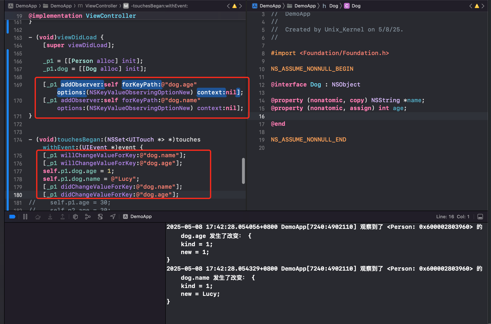
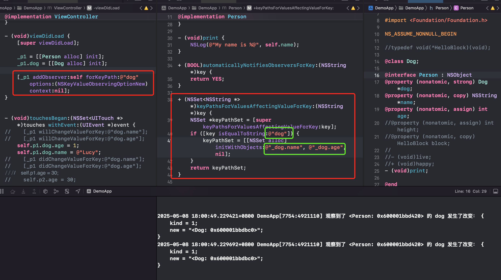
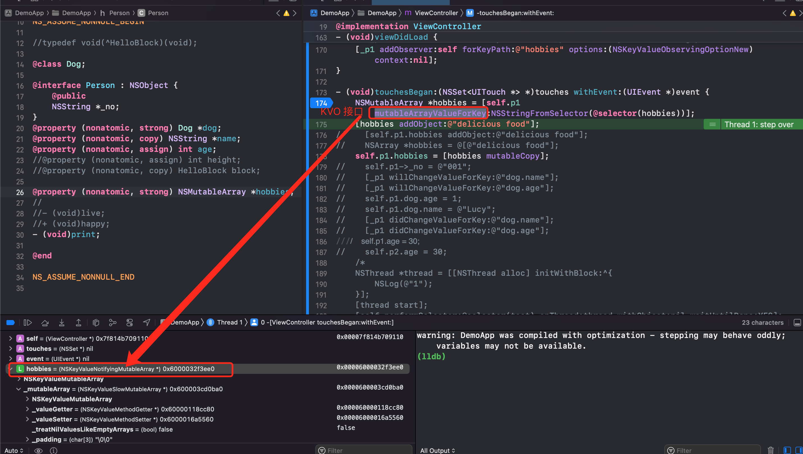
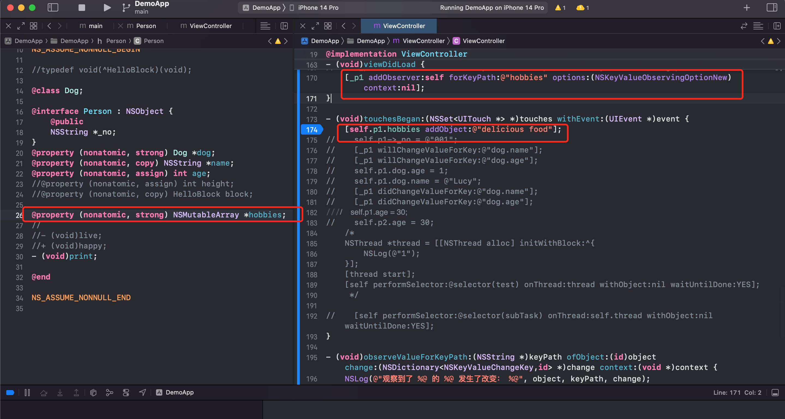
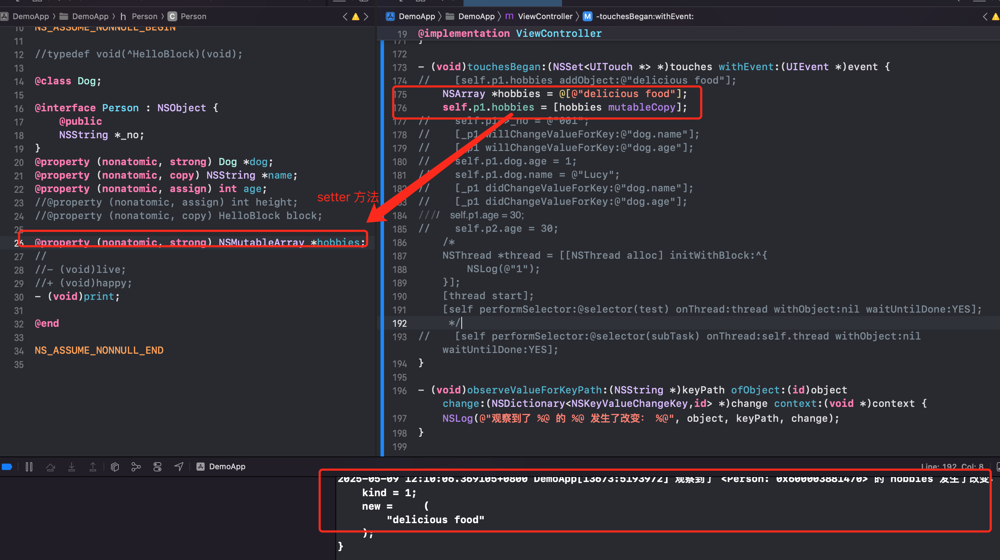

# KVC && KVO

> KVO 的实现原理是什么？如何手动触发 KVO？本文来探索下 iOS 中 KVO 底层细节

## 一、KVO 的高级用法

### 1. KVO 居然还有触发模式的说法？

#### 触发模式

**KVO 的触发分为`自动触发模式`和`手动触发模式`2种**。通常我们使用的都是自动通知，注册观察者之后，当条件触发的时候会自动调用 `-(void)observeValueForKeyPath`。

如果需要实现手动通知，我们需要使用 `+automaticallyNotifiesObserversForKey` 方法返回 NO 即可。此时即使被观察对象的属性值发生了变化，也不会出发观察者的 `- (void)observeValueForKeyPath:(NSString *)keyPath ofObject:(id)object change:(NSDictionary<NSKeyValueChangeKey,id> *)change context:(void *)context` 方法。

```Objective-c
+ (BOOL)automaticallyNotifiesObserversForKey:(NSString *)key {
    return NO;
}
```

如何手动触发（设置了 `automaticallyNotifiesObserversForKey` 返回 NO 的前提下）KVO ？

**手动调用 `willChangeValueForKey`、 `didChangeValueForKey`**

在需要触发 KVO 的地方，先调用 `willChangeValueForKey`，然后更改被观察对象的属性值，最后调用 `didChangeValueForKey` 方法。


QA：在需要触发 KVO 的地方，只调用`willChangeValueForKey`、 `didChangeValueForKey`，不修改被观察对象的属性值，KVO 会触发吗？

会调用，只是值没有变化。

系统默认行为：当没有显式设置新值时，KVO 会尝试通过属性的访问器方法（`getter`）获取当前值作为 `newValue`。此时 `age` 未初始化，默认为 `0`

说明，属性值改不改变不影响 KVO 的触发，只与 `willChangeValueForKey`、 `didChangeValueForKey`  的调用与否有关。

- **禁用自动 KVO 通知**：`+automaticallyNotifiesObserversForKey:返回 NO` 仅禁止属性赋值自动触发 KVO，**手动调用 `willChange/didChange` 仍会触发回调**。
- **`change` 字典内容**：依赖新旧值的显式记录，若未正确设置属性值，KVO 会通过 `valueForKey:` 获取当前值。
- **最佳实践**：在手动触发 KVO 时，始终在 `willChange` 和 `didChange` 之间修改属性值，并确保新旧值能被正确捕获


#### 使用场景

##### 批量属性修改后一次性通知

当需要同时修改多个关联属性时，自动触发 KVO 会导致多次回调，而手动触发可以合并为一次通知，提升性能。

Demo: 图形对象的 `frame` 更新

假设一个 `Rectangle` 对象有 `x`、`y`、`width`、`height` 四个属性，修改 `frame` 时需要同时更新这四个属性：

```objective-c
// Rectangle.m
+ (BOOL)automaticallyNotifiesObserversForKey:(NSString *)key {
    // 禁用自动触发
    if ([key isEqualToString:@"x"] || 
        [key isEqualToString:@"y"] || 
        [key isEqualToString:@"width"] || 
        [key isEqualToString:@"height"]) {
        return NO;
    }
    return [super automaticallyNotifiesObserversForKey:key];
}

- (void)setFrameWithX:(CGFloat)x y:(CGFloat)y width:(CGFloat)width height:(CGFloat)height {
    // 手动触发 KVO
    [self willChangeValueForKey:@"x"];
    [self willChangeValueForKey:@"y"];
    [self willChangeValueForKey:@"width"];
    [self willChangeValueForKey:@"height"];
    
    _x = x;
    _y = y;
    _width = width;
    _height = height;
    
    [self didChangeValueForKey:@"x"];
    [self didChangeValueForKey:@"y"];
    [self didChangeValueForKey:@"width"];
    [self didChangeValueForKey:@"height"];
}
```

#####  **属性之间存在依赖关系**

当一个属性的值依赖于其他属性时，需要手动触发其 KVO 通知。类似于 Vue 的计算属性一样。

Demo:  `fullName` 依赖 `firstName` 和 `lastName`

```objective-c
// Person.m
+ (BOOL)automaticallyNotifiesObserversForKey:(NSString *)key {
    // 禁用自动触发
    if ([key isEqualToString:@"fullName"]) {
        return NO;
    }
    return [super automaticallyNotifiesObserversForKey:key];
}

- (void)setFirstName:(NSString *)firstName {
    [self willChangeValueForKey:@"fullName"];
    _firstName = firstName;
    [self didChangeValueForKey:@"fullName"];
}

- (void)setLastName:(NSString *)lastName {
    [self willChangeValueForKey:@"fullName"];
    _lastName = lastName;
    [self didChangeValueForKey:@"fullName"];
}

- (NSString *)fullName {
    return [NSString stringWithFormat:@"%@ %@", self.firstName, self.lastName];
}
```

##### **属性变更需要条件触发**

当属性变更需要满足特定条件时才触发通知。

Demo: 数值范围校验

```objective-c
// TemperatureSensor.m
+ (BOOL)automaticallyNotifiesObserversForKey:(NSString *)key {
    if ([key isEqualToString:@"temperature"]) {
        return NO; // 禁用自动触发
    }
    return [super automaticallyNotifiesObserversForKey:key];
}

- (void)setTemperature:(CGFloat)temperature {
    // 温度变化超过 0.5 度才触发通知
    if (fabs(temperature - _temperature) > 0.5) {
        [self willChangeValueForKey:@"temperature"];
        _temperature = temperature;
        [self didChangeValueForKey:@"temperature"];
    }
}
```

##### 避免循环触发

当属性 A 的变更会触发属性 B 的变更，而属性 B 的变更又可能触发属性 A 的变更时，需要手动控制。

Demo: 双向关联对象

```objective-c
// Node.m (双向链表节点)
+ (BOOL)automaticallyNotifiesObserversForKey:(NSString *)key {
    if ([key isEqualToString:@"next"]) {
        return NO; // 禁用自动触发
    }
    return [super automaticallyNotifiesObserversForKey:key];
}

- (void)setNext:(Node *)next {
    // 手动解除旧节点的反向关联
    if (_next != next) {
        [self willChangeValueForKey:@"next"];
        _next.previous = nil; // 可能触发 previous 的 KVO
        _next = next;
        _next.previous = self; // 可能触发 next 的 KVO
        [self didChangeValueForKey:@"next"];
    }
}
```

##### **性能优化**

当属性频繁变更但无需立即通知观察者时，手动触发可以合并多次变更为一次通知。

Demo: 实时数据流处理

```objective-c
// DataStreamProcessor.m
+ (BOOL)automaticallyNotifiesObserversForKey:(NSString *)key {
    if ([key isEqualToString:@"buffer"]) {
        return NO; // 禁用自动触发
    }
    return [super automaticallyNotifiesObserversForKey:key];
}

- (void)appendData:(NSData *)data {
    // 数据积累到阈值后一次性触发通知
    [self.internalBuffer appendData:data];
    if (self.internalBuffer.length >= 1024) {
        [self willChangeValueForKey:@"buffer"];
        _buffer = [self.internalBuffer copy];
        [self.internalBuffer setLength:0];
        [self didChangeValueForKey:@"buffer"];
    }
}
```

注意：

1. **成对调用**：`willChange` 和 `didChange` 必须成对出现。
2. **线程安全**：确保 KVO 方法在同一线程调用。
3. **性能权衡**：手动触发会增加代码复杂度，需根据场景选择。


### 2. KVO 如何优雅监听 property 嵌套的情况

假设 Person 对象有一个 dog 对象作为属性。 Dog 对象拥有 age、name 2个属性。现在想实现对 person 对象的 dog 监听，当 dog 对象的 name、age 任何一个属性改变时，都可以监听到改变，该怎么实现呢？

版本1：不优雅的方案。手动依次将 dog 的每个属性，都被 Person 的观察者监听。

`[_p1 addObserver:self forKeyPath:@"_dog.age" options:(NSKeyValueObservingOptionNew) context:nil];`

代码如下



看上去很麻烦，有没有优雅点的方案？

版本2: 利用系统 API  `+ (NSSet<NSString *> *)keyPathsForValuesAffectingValueForKey:(NSString *)key API_AVAILABLE(macos(10.5), ios(2.0), watchos(2.0), tvos(9.0))`

`+keyPathsForValuesAffectingValueForKey:` 是 KVO（Key-Value Observing）中用于 **声明属性依赖关系** 的方法，它允许开发者显式指定某个属性的值变化依赖于其他属性（或其键路径）。通过该方法，系统会自动监听依赖属性的变化，并在这些依赖属性变化时触发目标属性的 KVO 通知。

实现如下：



注意：在对 Person 对象的 `dog` 属性进行监听后，Person 内部需要实现 `+`keyPathsForValuesAffectingValueForKey 方法，判断 key 为 `@"dog"` 后，想监听 dog 的哪个属性变化就通知 Person 对象的观察者收到响应的话就写上去。但注意绿色框里面，set 添加的内容，必须换个名字，比如 `@"_dog.name"`，不能是 `@"dog.name"`。这会导致循环依赖或逻辑矛盾


#### 使用场景

##### 计算属性

类似 Vue 的 Computed Property，当一个属性的值是基于其他属性计算得出时，可通过该方法声明依赖关系，确保计算属性的 KVO 通知自动触发。

Demo：`fullName` 依赖 `firstName` 和 `lastName`

```objective-c
// Person.h
@property (nonatomic, copy) NSString *firstName;
@property (nonatomic, copy) NSString *lastName;
@property (nonatomic, readonly) NSString *fullName; // 计算属性

// Person.m
+ (NSSet *)keyPathsForValuesAffectingValueForKey:(NSString *)key {
    NSSet *keyPaths = [super keyPathsForValuesAffectingValueForKey:key];
    if ([key isEqualToString:@"fullName"]) {
        // 声明 fullName 依赖 firstName 和 lastName
        keyPaths = [keyPaths setByAddingObjectsFromArray:@[@"firstName", @"lastName"]];
    }
    return keyPaths;
}

- (NSString *)fullName {
    return [NSString stringWithFormat:@"%@ %@", self.firstName, self.lastName];
}
```

##### **聚合属性（Aggregated Property）**

当某个属性是多个子属性的聚合结果（如总和、平均值），可通过该方法声明依赖关系。

Demo：`totalPrice` 依赖多个商品项的 `price` 和 `quantity`

```objective-c
// Order.h
@property (nonatomic, strong) NSArray<OrderItem *> *items;
@property (nonatomic, readonly) CGFloat totalPrice; // 聚合属性

// Order.m
+ (NSSet *)keyPathsForValuesAffectingValueForKey:(NSString *)key {
    NSSet *keyPaths = [super keyPathsForValuesAffectingValueForKey:key];
    if ([key isEqualToString:@"totalPrice"]) {
        // 声明 totalPrice 依赖所有 items 的 price 和 quantity
        NSMutableArray *dependencies = [NSMutableArray array];
        for (OrderItem *item in self.items) {
            [dependencies addObject:[NSString stringWithFormat:@"items.%@.price", item.itemId]];
            [dependencies addObject:[NSString stringWithFormat:@"items.%@.quantity", item.itemId]];
        }
        keyPaths = [keyPaths setByAddingObjectsFromArray:dependencies];
    }
    return keyPaths;
}

- (CGFloat)totalPrice {
    CGFloat sum = 0;
    for (OrderItem *item in self.items) {
        sum += item.price * item.quantity;
    }
    return sum;
}
```


##### **跨对象依赖（Cross-Object Dependency）**

当属性依赖于其他对象的属性时，可通过键路径声明跨对象依赖。

Demo：Person 的 dog 属性本身就是一个对象，对象的值改变后通知观察者

```objective-c
// Person.h
@property (nonatomic, strong) Dog *dog;
// Person.m
+ (NSSet<NSString *> *)keyPathsForValuesAffectingValueForKey:(NSString *)key {
    NSSet *keyPathSet = [super keyPathsForValuesAffectingValueForKey:key];
    if ([key isEqualToString:@"dog"]) {
        keyPathSet = [[NSSet alloc] initWithObjects:@"_dog.name", @"_dog.age", nil];
    }
    return keyPathSet;
}

// VC   
[_p1 addObserver:self forKeyPath:@"dog" options:(NSKeyValueObservingOptionNew) context:nil];
self.p1.dog.age = 1;
self.p1.dog.name = @"Lucy";
```


### 3. KVO 如何对容器类进行监听

可以在下面的 Demo1 中可以看到 KVO 无法直接对数组进行 KVO 监听。但系统为了方便，也提供了容器类的接口，比如针对 `NSMutableArray` 系统就提供了 `mutableArrayValueForKey` 接口。



那么虽然功能实现了，我们可以想想，这个接口背后做了哪些事？

- NSMutableArray 实例调用 `mutableArrayValueForKey` 方法，即利用 Runtime 创建一个继承自 NSMutableArray 的子类

- 因为需要对 NSMutableArray 容器类进行监听，所以 NSMutableArray 方法调用都需要可以观察到。所以需要对这些方法进行重写，内部需要：先调用 `willChangeValueForKey` -> 再调用父类方法实现 -> 最后调用 `didChangeValueForKey`

  ```objective-c
  - (void)addObject:(ObjectType)anObject;
  - (void)insertObject:(ObjectType)anObject atIndex:(NSUInteger)index;
  - (void)removeLastObject;
  - (void)removeObjectAtIndex:(NSUInteger)index;
  - (void)replaceObjectAtIndex:(NSUInteger)index withObject:(ObjectType)anObject;
  ```

- OC 调用方法的本质就是利用对象的 isa 找到类对象，然后查找方法列表中的实现。为了调用方法可以走到重写的方法里，所以需要修改当前的 NSMutableArray 的实例对象的 isa 为新创建的类

- 如何触发？为 NSObject 添加分类即可。只要对集合类进行观察，就生成子类，修改 isa。拦截容器类的方法。


### 4. KVO 的问题与改进

#### 问题

KVO 存在一些问题，让我们用起来很不爽。

##### 野指针崩溃

**在调用 addObserver 后，KVO 并不会对观察者进行强引用。**

问：`self.person1` 有没有强引用 `self` ?

答案是否。因为当前控制器用 strong 指针拥有一个 person1 属性，此时如果 self.person1 也强引用了 self，则形成环，造成内存泄漏。系统不会这么设计，所以答案是否。

所以要注意观察者的生命周期，否则会导致观察者被释放带来的 Crash 问题。如果**观察者对象被释放，若未移除观察，则被观察对象的属性变化时，仍然会调用观察者的 `- (void)observeValueForKeyPath:(NSString *)keyPath ofObject:(id)object change:(NSDictionary<NSKeyValueChangeKey,id> *)change context:(void *)context`  方法。此时，观察者指向的内存可能已被回收或分配给其他对象，导致访问无效内存（`EXC_BAD_ACCESS` 崩溃）**。

所以 addObserver 和 removeObserver 需要成对存在

```objective-c
// Observer 被释放后未移除观察
- (void)dealloc {
    // 未调用 [object removeObserver:self forKeyPath:@"keyPath"];
}
```

##### 内存泄漏

虽然 **KVO 不会强引用观察者**（Observer 是弱引用），但以下情况可能引发内存问题：

- **多次添加观察者**：重复调用 `addObserver` 会导致多次监听同一属性，但未正确移除时，被观察对象会保留多余的观察记录。
- **被观察对象生命周期长于观察者**：若被观察对象存活时间更长，未移除观察会导致观察者无法释放（如单例对象监听某个属性）。

Bad case

```objective-c
// 多次添加观察者而未移除
[self.object addObserver:self forKeyPath:@"value" options:NSKeyValueObservingOptionNew context:nil];
[self.object addObserver:self forKeyPath:@"value" options:NSKeyValueObservingOptionNew context:nil];
// 移除一次后仍残留一次观察
[self.object removeObserver:self forKeyPath:@"value"];
```

官方文档说明：

> *Prior to iOS 9, if an object is observing a property when it is deallocated, the system will throw an exception. In iOS 9 and later, the system automatically removes the observer when it is deallocated.*
> —— [Apple Developer Documentation](https://developer.apple.com/documentation/objectivec/nsobject/1415099-removeobserver)

iOS 9+ 的改进与兼容性

- iOS 9 及以上：当观察者或被观察对象被释放时，系统会自动清理 KVO 注册信息，减少崩溃风险。
- iOS 8 及以下：仍需手动调用 `removeObserver`，否则可能导致崩溃。


#### 改进

- 添加 observer 后需要在 dealloc 方法中移除
- 不能同同一属性，多次添加 observer
- 也不能注册1次（addObserver），2次移除（removeObserver）。必须严格对应
- 在某个地方添加监听，在另一处 `observeValueForKeyPath` 方法里拿到变化。导致 VC 的代码量变大且很分散

可以用 RAC 或者 FBKVO

FBKVO 优势：

- **语法简洁易用** ：相比苹果原生的 KVO API，FBKVO 的语法更加简洁直观，减少了大量的模板代码和繁琐的步骤，使得开发者可以更快速、更方便地实现对对象属性变化的观察，降低了代码的复杂度和出错的概率。
- **自动管理观察者生命周期** ：在原生 KVO 中，需要手动在合适的地方添加和移除观察者，容易出现忘记移除观察者而导致的崩溃问题。而 FBK VO够自动管理观察者的生命周期，当观察的对象被销毁或者观察者本身被销毁时，会自动移除相应的观察，有效避免了因观察者未及时移除而引发的异常，提高了代码的健壮性。
- **支持 block 回调** ：提供了基于 block 的观察回调方式，使得代码更加简洁明了，逻辑更加集中，便于阅读和维护，也更符合现代 iOS 开发中使用 block 的编程习惯。
- **线程安全** ：在多线程环境下，FBKVO 能够保证观察者注册、移除以及回调等操作的线程安全，避免了因线程问题导致的数据不一致和程序崩溃等风险，让开发者在处理多线程场景下的 KVO 操作时更加放心。
- **丰富的观察选项** ：除了支持原生 KVO 的观察选项外，还提供了一些额外的选项和功能，如可以方便地观察 NSArray 和 NSDictionary 等集合类的变化，以及对观察属性的变化进行更细致的控制和过滤等，满足了开发者在不同场景下的多样化需求。

FBKVO 工作原理：

- **基于原生 KVO 进行封装** ：FBKVO 在内部封装了苹果原生的 KVO 机制，通过创建一个中间类来桥接观察者和被观察对象，替开发者处理了原生 KVO 中繁琐的细节操作，如 addObserver:forKeyPath:options:context: 和 removeObserver:forKeyPath: 等方法的调用，以及 context 参数的管理等。
- **利用关联对象存储观察信息** ：由于在 Objective - C 中，类别（category）无法直接添加属性，FBKVO 使用关联对象技术将观察的相关信息（如观察的键路径、回调 block 等）存储在被观察对象上，从而实现对被观察对象的扩展，使其能够记录和管理自身的观察者信息。
- **实现自动移除观察者机制** ：FBKVO 通过在被观察对象的 dealloc 方法中插入代码，或者利用 NSObject 的 KVO 通知机制，在观察的对象或者观察者即将被销毁时，自动调用 removeObserver:forKeyPath: 等方法移除相应的观察者，确保了观察者与被观察对象之间的正确解绑，避免了野指针等潜在问题。
- **block 转换为对象方法调用** ：在原生 KVO 中，观察者的回调是通过对象的方法来实现的。FBKVO 将开发者提供的 block 回调封装成一个符合原生 KVO 回调格式的对象方法，当被观察对象的属性发生变化时，先调用原生的 KVO 回调方法，再将事件传递给对应的 block 回调，从而实现了 block 回调的机制，使代码更加简洁和灵活。

 

## KVO 实现机制

## KVO 底层实现分析

### Demo1


可以发现对成员变量添加观察者的时候，成员变量的值变化了，KVO 也是监听不到的

结论：**KVO 无法观察成员变量的变化**

### Demo2



可以看到对 NSMutableArray 类型的属性添加了 KVO。然后点击屏幕，NSMutableArray 里添加了元素，但是观察方法没有触发。

对实验进行改进下



结论： **KVO 只可以对属性的 setter 方法起作用**。

通过 Demo1 和 Demo2 可以发现：**触发 KVO 的本质是必须要有属性的 setter，且触发属性的 setter。直接修改成员变量，是不会触发 setter** 的。

### Demo3

创建 Person 类，点击事件里触发属性值的改变


分析：

- 添加过 KVO 的 person1，isa 为系统利用 Runtime 技术动态创建的类，名字为 `NSKVONotifying_Person`
- 没有添加过 KVO 的 person2，isa 为 Person 的类对象
- `.height = 177` 本质是 `[self.person1 setHeight:177]` 也就是调用 set 方法。

在内存中的结构如下图


整个流程分析下：

- self.person2 调用 setHeight 的时候，首先根据 self.person2 实例对象的 isa 找到 Person 类对象，然后在方法列表中找到 setHeight 方法，然后进行调用
- self.person1 调用 setHeight 的时候，首先根据 self.person1 实例对象的 isa 找到 `NSKVONotifying_Person` 类对象，然后在方法列表中找到 setHeight 方法，然后进行调用。内部实现中，会调用 Foundation 的 `_NSSetIntValueAndNotify` 方法。
- 然后调用： willSet、super setHeight、didSet 方法。

当我们按照 KVO 后动态生成的类名去创建一个新的类的时候，Xcode 会报错：`[general] KVO failed to allocate class pair for name NSKVONotifying_Person, automatic key-value observing will not work for this class`。因为自己创建的类名和系统将要动态创建的类名冲突了，并且 KVO 监听失效


### Demo4


分析：

- 可以看到在对 self.person1 添加 KVO 之后，self.person1 的类对象改变了，也就是 self.person1的 isa 改变了，变为系统动态生成的新类
- 在对 self.person1 添加 KVO 之后，self.person1 的 setHeight 方法的实现变了，添加前后 self.person2 的 setHeight 方法，都是 Person 类对象的 setHeight 方法实现。KVO 添加前后都未改变
- 利用 `(IMP)方法地址` 查看，没有进行 KVO 的 `setHeight` 是在 `KVOExplore -[Person setHeight:] at Person.h:14)` 里。添加过 KVO 的是在 `Foundation _NSSetLongLongValueAndNotify` 里。且 `_NSSetLongLongValueAndNotify`是个 c 语言函数。


### Demo5


可以看到我们将 KVO 的数据类型改为 double 后，原本的 setHeight 是 `_NSSetLongLongValueAndNotify`，现在是 `_NSSetDoubleValueAndNotify`

也可以借助于 `nm` 来查看所有 Foundation 关于 KVO 的方法 `nm Foundation | grep ValueAndNotify `  （需要自己提取真机上的 Foundation 符号表）


### NSSet**ValueAndNotify 的内部实现


来对 Person 类增加一些打印方法


可以看出内部实现是：

- 调用 `willChangeVlueForKey`

- 调用原本的 setter 

- 调用 `didChangeValueForKey`。

  - `didChangeValueForKey:` 会检查属性值是否实际变化，避免冗余通知
  - 通知的发送是线程安全的，但观察者的回调执行线程取决于注册时的上下文

- 在 `didChangeValueForKey` 内部会调用 KVO 的 `- (void)observeValueForKeyPath:(NSString *)keyPath ofObject:(id)object change:(NSDictionary<NSKeyValueChangeKey,id> *)change context:(void *)context` 方法

  

```objective-c
@interface Person() 
@property (nonatomic, assign) double height;
@end
@implementation Person
- (void)setHeight:(double)height {
  _height = height;
}
  
@end
  
@interface NSKVONotifying_Person: Person()

@end

@implementation NSKVONotifying_Person
- (void)setHeight:(double)height {
	[self setDoubleValueAndNotify:height];
}

- (void)setDoubleValueAndNotify:(double)height {
	[self willChangeValueForKey:@"height"];
	[super setHeight: height];
	[self didChangeValueForKey:@"height"];
}

- (void)didChangeValueForKey:(NSString *)key {
  [observer observeValueForKeyPath:key ofObject:self change:@{} context:nil];
}

- (Class)class {
  return [Person class];
}

-(BOOL)_isKVOA {
 	return YES; 
}


- (void)dealloc {
 	// 收尾工作 
}
 
@end
```


### 重写 class 方法


可以看到利用 runtime api，在添加 KVO 之后，类对象为 `NSKVONotifying_Person`

但是利用 class 方法，添加 KVO 之后，获取类对象依旧为 Person。所以推测系统在为某个对象添加 KVO 监听后，先利用 Runtime 生成一个继承自被监听类的基类。调用 `- (Class)class` 方法的本质就是先利用 isa 指针找到 `NSKVONotifying_Person` 类对象，然后在类对象的对象方法列表中查看有没有 `class` 方法的实现，系统应该是重写了 `-(Class)class` 方法，用于屏蔽底层实现。

好处是：屏蔽了 KVO 底层内部实现，隐藏了 `NSKVONotifying_Person` 的存在，通过 `-(Class)class` 方法告诉开发者添加 KVO 之后的类，依旧是 Person，本质上是继承自 Person 的类对象，能力没有改变。


### KVO 类的所有方法


利用 runtime api，打印添加 KVO 后，动态创建的 NSKVONotifying_Person 都存在什么方法？

```objective-c
- setHeight:
- class
- dealloc
_isKVOA
```


QA：为什么新创建的类没有 getter？

因为新创建的类是子类，父类中存在 getter。子类中增加的 setter 方法只是为了触发 KVO，getter 不影响。


QA：请描述系统如何实现一个对象的 KVO？KVO 的本质是什么

- 系统利用 runtime 的能力，动态创建一个监听对象的类的子类，子类命名格式为: `NSKVONotifying_类名`。 并且让 instance 对象的 isa 指向这个全新的子类
- 当修改 instance 对象的属性时，会调用 Foundation 框架的 `_NSSet***ValueAndNotify` c 函数
- 然后调用:
  -  `willChangeValueForKey`
  -  原来的 setter
  -  `didChangeValueForKey`，且 didChangeValueForKey 内部会触发监听器（Observer）的监听方法（`- (void)observeValueForKeyPath:(NSString *)keyPath ofObject:(id)object change:(NSDictionary<NSKeyValueChangeKey,id> *)change context:(void *)context`）。也就是发消息


### 当没有 observer 观察任何一个 property 时，删除动态创建的子类

`[self.person removeObserver:self forKeyPath:@"height"];` 该代码调用后，会删除动态创建的子类。


### 为什么要选择是继承的子类而不是分类呢？

对某个类的属性添加 KVO 观察后，系统会创建一个继承自该类的子类，子类的类对象没有 setter 方法，但是可以调用 setter 方法（子类在继承父类对象，子类对象调用调方法的时候先看看当前子类中是否有方法实现，如果不存在方法则通过 isa 指针顺着继承链向上找到父类中是否有方法实现，如果父类种也不存在方法实现，则继续向上找...直到找到 NSObject 类为止，系统会抛出几次机会给程序员补救，如果未做处理则奔溃）。但是为了可以触发 KVO，所以需要在保证原来业务逻辑的基础上，在业务逻辑之前调用 `willChangeValueForKey` ，在业务逻辑之后调用 `didChangeValueForKey`.

为了实现这一诉求就必须使用继承，因为如果用分类实现了，则知道分类的方法会在 App 启动后经过 Runtime 进行方法整合后，会排在类对象的方法列表最前面，也就是会覆盖被监听类的属性 setter 方法。万一 setter 里面不只是简单的 `_name = name;` 而是有加锁、或者其他的业务逻辑，**使用 Category 会造成业务逻辑丢失的情况。所以必须使用继承实现**，内部再调用 `[super setName:value]` 即可。

```objective-c
- setter {
	[self willChangeValueForKey:key]
  [super setter:key]
  [self didChangeValueForKey:key]
}
```

关于分类与子类的关系可以看看我之前的 [文章](1.50.md).


## 

> Automatic key-value observing is implemented using a technique called isa-swizzling... When an observer is registered for an attribute of an object the isa pointer of the observed object is modified, pointing to an intermediate class rather than at the true class ...

Apple 文档告诉我们：被观察对象的 `isa指针` 会指向一个中间类，而不是原来真正的类，

通过对被观察的对象断点调试发现 Person 类在执行过 addObserveValueForKeyPath... 方法后 isa 改变了。NSKVONotifying_Person。

- KVO 是基于 Runtime 机制实现的

- 当某个类的属性第一次被观察的时候，系统会在运行期动态的创建该类的一个派生类（子类）。在派生类中重写任何被观察属性的 setter 方法。派生类在真正实现`通知机制`

- 如果当前类为 Person，则生成的派生（子类）类名称为 `NSKVONotifying_Person`

- 每个类对象中都有一个 `isa指针` 指向当前类，当一个类对象第一次被观察的时候，系统会偷偷将 isa 指针指向动态生成的派生类，从而在给被监控属性赋值时执行的是当前派生类的 `setter` 方法

- 键值观察通知依赖于 NSObject 的两个方法：`willChangeValueForKey:、didChangeValueForKey:` 。在一个被观察属性改变之前，调用 `willChangeValueForKey:` 记录旧的值。在属性值改变之后调用 `didChangeValueForKey:`，从而 `observeValueForKey:ofObject:change:context:` 也会被调用。


iOS 用什么方式实现对一个对象的 KVO？（KVO 的本质是什么）

- 当对一个对象使用了 KVO 监听，系统会修改这个对象的 isa 指针，改为一个指向通过 Runtime 动态创建的子类
- 子类拥有自己对监听属性的 setter 实现，内部会调用
  - willChangeValueForKey
  - 原来的 setter 实现
  - didChangeValueForKey，这个方法内部又会调用监听器的 监听方法 `[observer observeValueForKey:ofObject:change:context:]`

如何手动触发 KVO？

```objective-c
[p willChangeValueForKey:@"height"];
[p didChangeValueForKey:@"height"];
```


### 模拟实现系统的 KVO

1. 创建被观察对象的子类

2. 重写观察对象属性的 set 方法，同时调用 `willChangeValueForKey、didChangeValueForKey`

   因为子类继承自父类，所以子类调用 setter 的时候，会调用成功，不过方法调用的时候是通过子类的 isa 找到子类对象的类对象，然后从类对象的方法列表里查看 setter，发现没有则通过子类的 superclass 找到父类，然后找到父类的类对象方法列表，成功找到了 setter 方法实现。

   但 KVO 的 setter 里需要在原来基础上做一些额外逻辑，所以需要重写 setter。在子类里重写 setter，本质就是为元类对象里添加一个新的 setter 方法。

3. 外界改变 isa 指针（class方法重写）

我们用自己的类模拟系统的 KVO。

```objective-c
//NSObject+LBPKVO.h
#import <Foundation/Foundation.h>

NS_ASSUME_NONNULL_BEGIN

@interface NSObject (LBPKVO)

- (void)lbpKVO_addObserver:(NSObject *)observer forKeyPath:(NSString *)keyPath options:(NSKeyValueObservingOptions)options context:(nullable void *)context;

@end

NS_ASSUME_NONNULL_END

//NSObject+LBPKVO.m
#import "NSObject+LBPKVO.h"
#import <objc/message.h>

@implementation NSObject (LBPKVO)


- (void)lbpKVO_addObserver:(NSObject *)observer forKeyPath:(NSString *)keyPath options:(NSKeyValueObservingOptions)options context:(nullable void *)context {
    //生成自定义的名称
    NSString *className = NSStringFromClass(self.class);
    NSString *currentClassName = [@"LBPKVONotifying_" stringByAppendingString:className];
    //1. runtime 生成类
    Class myclass = objc_allocateClassPair(self.class, [currentClassName UTF8String], 0);
    // 生成后不能马上使用，必须先注册
    objc_registerClassPair(myclass);

    //2. 重写 setter 方法
    class_addMethod(myclass,@selector(setName:) , (IMP)setName, "v@:@");
    //3. 修改 isa
    object_setClass(self, myclass);

    //4. 将观察者保存到当前对象里面
    objc_setAssociatedObject(self, "observer", observer, OBJC_ASSOCIATION_ASSIGN);

    //5. 将传递的上下文绑定到当前对象里面
    objc_setAssociatedObject(self, "context", (__bridge id _Nullable)(context), OBJC_ASSOCIATION_RETAIN);
}


//
void setName (id self, SEL _cmd, NSString *name) {
    NSLog(@"come here");
    //先切换到当前类的父类，然后发送消息 setName，然后切换当前子类
    //1. 切换到父类
    Class class = [self class];
    object_setClass(self, class_getSuperclass(class));
    //2. 调用父类的 setName 方法
    objc_msgSend(self, @selector(setName:), name);

    //3. 调用观察
    id observer = objc_getAssociatedObject(self, "observer");
    id context = objc_getAssociatedObject(self, "context");
    if (observer) {
        objc_msgSend(observer, @selector(observeValueForKeyPath:ofObject:change:context:), @"name", self, @{@"new": name, @"kind": @1 } , context);
    }
    //4. 改回子类
    object_setClass(self, class);
}

@end


//ViewController.m
- (void)viewDidLoad {
    [super viewDidLoad];
    _person = [[Person alloc] init];
    _person.name = @"杭城小刘";
    _person.age = 23;
    _person.hobbies = [@[@"iOS"] mutableCopy];
    NSDictionary *context = @{@"name": @"成吉思汗", @"hobby" :  @"弯弓射大雕"};
    [_person lbpKVO_addObserver:self forKeyPath:@"hobbies" options:(NSKeyValueObservingOptionNew) context:(__bridge void * _Nullable)(context)];

}

- (void)touchesBegan:(NSSet<UITouch *> *)touches withEvent:(UIEvent *)event{
    _person.name = @"刘斌鹏";
    NSMutableArray *hobbies = [_person mutableArrayValueForKeyPath:@"hobbies"];
    [hobbies addObject:@"Web"];
}

- (void)observeValueForKeyPath:(NSString *)keyPath ofObject:(id)object change:(NSDictionary<NSKeyValueChangeKey,id> *)change context:(void *)context{
    NSLog(@"%@",change);
}
```

KVO 的缺陷：

KVO 虽然很强大，你只能重写 `-observeValueForKeyPath:ofObject:change:context: ` 来获得通知，想要提供自定义的 selector ，不行；想要传入一个 block 没门儿。感觉如果加入 block 就更棒了。

KVO 的改装：

看到官方的做法并不是很方便使用，我们看到无数的优秀框架都支持 block 特性，比如 AFNetworking ，所以我们可以将系统的 KVO 改装成支持 block。


## KVC

`setValueForKey` 用来设置对象的一层属性值修改。

`setValueForKeyPath` 可以设置对象的某个属性（属性本身是对象）的属性值修改


### KVC 设值原理

KVC 之后会触发 KVO 吗？


发现 KVC 触发了 KVO。

问题来了：为什么 KVC 会触发 KVO？探究下 `setValueForKey`

整个流程如下


`[self.person setValue:@10 forKey:@"age"]` 会先调用 `setKey:` 同名的方法，找不到则调用 `_setKey:` 的方法，如果还是找不到则调用 `+(BOOL)accessInstanceVariableDirectlt`，如果该方法返回 YES，则可以直接修改成员变量的值，会按照 `_key`、`_isKey`、`key`、`isKey` 的顺序寻找成员变量，如果找到则直接赋值，没找到则抛出异常 `NSUnknownKeyException`

```
@implementation Person
- (void)setAge:(int)age
{
    _age = age;
}

- (void)_setAge:(int)age
{
    _age = age;
}

+ (BOOL)accessInstanceVariableDirectlt
{
    return YES;
}

@end
```


### 直接修改成员变量会触发 KVO 吗？

比如在屏幕触目事件里修改 Person 对象的成员变量 `_age`。比如 `self.p1->_age = 30;`  这样是无法触发 KVO 的。

因为 KVO 的实现原理就是在 Runtime 动态生成类里拦截 setter 方法。在 setter 内部调用 `willChangeValueForKey`、`didChangeValueForKey` ，所以直接修改成员变量不会触发 KVO。

如果要在修改成员变量的基础上触发 KVO，则必须手动调用上面2个 API。比如下面的代码

```objective-c
- (void)touchesBegan:(NSSet<UITouch *> *)touches withEvent:(UIEvent *)event {
    [self.p1 willChangeValueForKey:@"age"];
    self.p1->_age = 30;
    [self.p1 didChangeValueForKey:@"age"];
}
```


### KVC 取值原理

`valueForKey` 原理

- 按照 getKey、key、isKey、_key 的顺序寻找方法实现，找到则直接调用方法，返回值
- 如果没找到则调用 `+(BOOL)accessInstanceVariableDirectly` 方法，询问是否可以访问成员变量
  - 为 NO 则调用 `valueForUndefinedKey `并抛出 `NSUnknownKeyException`异常
  - 为 YES 则按照 ` __key`、`_isKey`、`key`、`isKey` 的顺序访问成员变量。找到哪个则返回值

- 都没找到则调用 `valueForUndefinedKey `并抛出 `NSUnknownKeyException`异常


### KVC 会破坏面向对象的原则吗？

KVC 有违背面向对象编程思想吗？如果一个类的成员变量是私有的，也没有在 `.h` 中公开一些方法去设置、修改成员变量，那么外部直接通过 KVC 去修改值，是有违背面向对象编程思想的。

KVC 提供了对应的能力，去保护或者说支持面向对象的原则。


## 基本用法-字典快速赋值

KVC 可以将字典里面和 model 同名的 property 进行快速赋值 `setValuesForKeysWithDictionary`。

```objective-c
//前提：model 中的各个 property 必须和 NSDictionary 中的属性一致
- (instancetype)initWithDic:(NSDictionary *)dic{
    BannerModel *model = [BannerModel new];
    [model setValuesForKeysWithDictionary:dic];
    return model;  
}
```

但是这里会有2种特殊情况。

- 情况一：在 model 里面有 property 但是在 NSDictionary 里面没有这个值

运行上面的代码，代码不崩溃，只不过在输出值的时候输出了 null

- 情况二：在 NSDictionary 中存在某个值，但是在 model 里面没有值

运行后编译成功，但是代码奔溃掉。原因是 KVC 。所以我们只需要实现这么一个方法。甚至不需要写函数体部分

```
- (void)setValue:(id)value forUndefinedKey:(NSString *)key{

}
```

- 情况三：如果 Dictionary 和 Model 中的 property 不同名

我们照样可以利用 **setValue:forUndefinedKey:** 去处理

```objective-c
//model
@property (nonatomic,copy)NSString *name;
@property (nonatomic,copy)NSString *sex;
@property (nonatomic,copy) NSString* age;
//NSDictionary
NSDictionary *dic = @{@"username":@"张三",@"sex":@"男",@"id":@"22"};

-(void)setValue:(id)value forUndefinedKey:(NSString *)key{
    if([key isEqualToString:@"id"]){
        self.age=value;
    }
    if([key isEqualToString:@"username"]){
        self.name=value;
    }
}    
```

- 情况四：如果我们观察对象的属性是数组，我们经常会观察不到变化，因为 KVO 是观察 setter 方法。我们可以用 `mutableArrayValueForKeyPath` 进行属性的操作

```
NSMutableArray *hobbies = [_person mutableArrayValueForKeyPath:@"hobbies"];
[hobbies addObject:@"Web"];
```

- 情况五： 注册依赖键.

KVO 可以观察属性的二级属性对象的所有属性变化。说人话就是“假如 Person 类有个 Dog 类，Dog 类有 name、fur、weight 等属性，我们给 Person 的 Dog 属性观察，假如 Dog 的任何属性变化是，Person 的观察者对象都可以拿到当前的变化值。我们只需要在 Person 中写下面的方法即可”

```
[self.person  addObserver:self
        forKeyPath:NSStringFromSelector(@selector(dog))
           options:NSKeyValueObservingOptionOld | NSKeyValueObservingOptionNew
           context:ContextMark];

self.person.dog.name = @"啸天犬";
self.person.dog.weight = 50;


// Person.m
+ (NSSet<NSString *> *)keyPathsForValuesAffectingValueForKey:(NSString *)key {
    NSSet *keyPaths = [super keyPathsForValuesAffectingValueForKey:key];

    if ([key isEqualToString:@"dog"]) {
        NSArray *affectingKeys = @[@"name", @"fur", @"weight"];
        keyPaths = [keyPaths setByAddingObjectsFromArray:affectingKeys];
    }
    return keyPaths;
}
```


## 几个基本的知识点

1. KVO 观察者和属性被观察的对象之间不是强引用的关系

2. KVO 的触发分为`自动触发模式`和`手动触发模式`2种。通常我们使用的都是自动通知，注册观察者之后，当条件触发的时候会自动调用 `-(void)observeValueForKeyPath`。如果需要实现手动通知，我们需要使用下面的方法

```Objective-c
+ (BOOL)automaticallyNotifiesObserversForKey:(NSString *)key {
    return NO;
}
```

3. 若类有实例变量 NSString *_foo， 调用 setValue:forKey: 是以 foo 还是 _foo 作为 key ？

都可以

4. KVC 的 keyPath 中的集合运算符如何使用
- 必须用在 **集合对象** 或者 **普通对象的集合属性** 上

-简单的集合运算符有 @avg、@count、@max、@min、@sum

5. KVO 和 KVC 的 keyPath 一定是属性吗？
   可以是成员变量

6. KVO 中 派生类的 setter 方法内部实现调用了 Foundation 框架中的 `_NSSetIntValueAndNotify`.

7. 直接修改对象的成员变量会触发 KVO 吗？
   
   不会。因为成员变量没有 setter.
   
   ```
   @interface Person: NSObject
   {
       @public:
       int age;
   }
   @end
   ```


