# Ruby

> 为了 iOS 工程化开展，自己最近开始了 Ruby 的学习，本篇博文就用来记录 Ruby 的学习心得和体验。本文作为切入点，展开聊聊原理、组件、脚本


## 一. Ruby VS Python
- Python 的解析器实现更成熟，第三方库质量高。但是 Ruby 包管理更简单、方便。
- Python 的应用领域广泛。而Ruby目前主要局限在在 Web 领域与精致项目。
- Python语法简单，Ruby更强大、灵活


## 二. Ruby 语法

### 1. 注释
单行注释
```
# 单行注释
puts "Hello, ruby!"
```

多行注释
```Ruby
=begin
多行注释：第1行
多行注释：第2行
多行注释：第3行
=end
print("Hello world!\n")
```

### 2. 打印
- puts：打印后自动换行
- print：打印后不会自动换行

- 另外如果打印内容携带变量格式的话，必须用双引号。比如
  ```Ruby
  name = "@FantasticLBP"
  puts "hello, #{name}!"
  puts 'hello,#{name}!'
  
  # 输出
  hello, @FantasticLBP!
  hello,#{name}!
  ```
- 如果要直接 shell，则需要用 ``
  ```Ruby
  puts `ruby --version`
  # 输出
  ruby 2.6.10p210 (2022-04-12 revision 67958) [universal.x86_64-darwin21]
  ```

### 3. 万物皆对象
```Ruby
puts 3.class
puts 'FantasticLBP'.class
puts nil.class
puts true.class
# 输出
Integer
String
NilClass
TrueClass
```


### 4. Symbol
- Ruby 是一个强大的面向对象脚本语言，一切皆是对象
- 在 Ruby 中 Symbol 表示“名字”，比如字符串的名字，标识符的名字。
- 创建一个 Symbol 对象的方法是在名字或者字符串前面加上冒号:
- 在 Ruby 中每一个对象都有唯一的对象标识符(Object Identifier)
- 对于 Symbol 对象，一个名字唯一确定一个 Symbol 对象
- Ruby 内部一直在使用 Symbol，Ruby内部也存在符号表
- Symbol 本质上是一个数字，这个数字和创建 Symbol 的名字形成一对一的映射;而String 对象是一个重量级的 用C结构体表示的家伙，因此使用 Symbol 和 String 的开销相差很大。
- 符号表是一个全局数据结构，它存放了所有 Symbol 的(数字ID，名字)。 Ruby 不会从中删除 Symbol ，因此 当你创建一个 Symbol 对象后，它将一直存在，直到程序结束。

## 三. 安装篇

### 1. rvm & rbenv

- rvm & rbenv 是一种命令行工具，可让您轻松地安装，管理和使用多个Ruby环境。
- 这两个工具本质都是 PATH 上做手脚，一个在执行前，一个在执行中
- 如果你不需要维护特定版本的 Ruby 项目，那么只需要装一个比较新的 Ruby 版本 就行了。`brew install ruby`

### 2. gem 

- 与大多数的编程语言一样，Ruby 也受益于海量的第三方代码库
- 这些代码库大部分都以 Gem 形式发布。 RubyGems 是设计用来帮助创建，分享和安装 这些代码库的
  - `gem search -r/-f <gem>`
  - `gem install <gem> --version <num>`
  - `gem list`
    有没有发现 gem search、install、list 和 cocoapods 的 pod 指令一样

### 3. Bundler

Bundler 能够跟踪并安装所需的特定版本的 gem，以此来为 Ruby 项目提供一致的运行环境
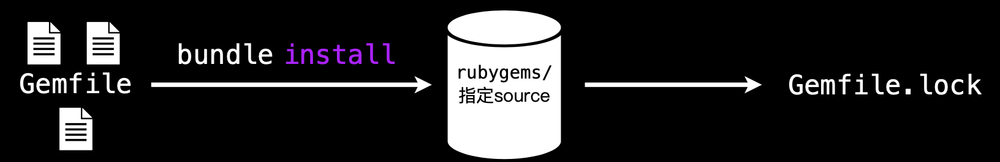

```
source 'https://rubygems.org' gem 'rails', '4.1.0.rc2'
gem ‘rack-cache'
gem 'nokogiri', '~> 1.6.1'
```

- 读取 Gemfile：Bundler 首先会读取当前目录下的 Gemfile 文件，解析其中声明的所有依赖项及其版本约束
- 解析依赖关系：
  - 分析每个 gem 的版本要求，确定满足所有约束的最佳版本组合
  - 处理依赖的依赖（传递依赖），确保整个依赖树的兼容性
- 检查本地缓存：
  - 查看本地是否已缓存所需版本的 gem
  - 如果有，直接使用本地缓存，跳过下载步骤
- 从源下载 gem：
  - 对于本地没有的 gem，从 source 'https://rubygems.org' 指定的源下载
  - 默认源是 RubyGems 官方仓库，国内用户可能需要切换到镜像源以提高速度
- 安装 gem 到项目目录：
  - 默认情况下，gem 会被安装到项目根目录下的 vendor/bundle 目录
  - 这种方式可以避免污染系统级的 gem 安装，实现项目间的依赖隔离
- 生成 Gemfile.lock：
  - 安装完成后，Bundler 会生成 Gemfile.lock 文件
  - 该文件记录了实际安装的每个 gem 的精确版本，确保团队协作或部署时使用完全相同的依赖版本

思考：怎么样，是不是发现 Ruby Bundler 工作流程和 iOS Cocoapods 的工作过程一致？是的，iOS Cocoapods 的设计就是参考 Ruby Bundler 的设计。甚至连 pod search、install、list API 设计也和 gem 一致


## 四. Cocoapods

### 1. cocoapods-binary
- cocoapods-binary 通过开关，在 pod insatll 的过程中进行 library 的预编译，生成 framework，并自动集成到项目中。
- 整个预编译工作分成了三个阶段来完成:
  - binary pod 的安装 
  - binary pod 的预编译 
  - binary pod 的集成

### 2. Hook
- pre_install：Pod 下载之后，但在安装之前可以有时机对 Pod 进行任何更改
- post_install：当所需依赖安装完成，但此时生成的 XcodeProj 项目在写入磁盘前，我们可以对其进行最后的更改


### 3. Cocoapods 工程拆解
#### 1. cocoapods.gemspec 文件
```Ruby
# encoding: UTF-8
require File.expand_path('../lib/cocoapods/gem_version', __FILE__)
require 'date'

Gem::Specification.new do |s|
  s.name     = "cocoapods"
  s.version  = Pod::VERSION
  s.date     = Date.today
  s.license  = "MIT"
  s.email    = ["eloy.de.enige@gmail.com", "fabiopelosin@gmail.com", "kyle@fuller.li", "segiddins@segiddins.me"]
  s.homepage = "https://github.com/CocoaPods/CocoaPods"
  s.authors  = ["Eloy Duran", "Fabio Pelosin", "Kyle Fuller", "Samuel Giddins"]

  s.summary     = "The Cocoa library package manager."
  s.description = "CocoaPods manages library dependencies for your Xcode project.\n\n"     \
                  "You specify the dependencies for your project in one easy text file. "  \
                  "CocoaPods resolves dependencies between libraries, fetches source "     \
                  "code for the dependencies, and creates and maintains an Xcode "         \
                  "workspace to build your project.\n\n"                                   \
                  "Ultimately, the goal is to improve discoverability of, and engagement " \
                  "in, third party open-source libraries, by creating a more centralized " \
                  "ecosystem."

  s.files = Dir["lib/**/*.rb"] + %w{ bin/pod bin/sandbox-pod README.md LICENSE CHANGELOG.md }

  s.executables   = %w{ pod sandbox-pod }
  s.require_paths = %w{ lib }

  # Link with the version of CocoaPods-Core
  s.add_runtime_dependency 'cocoapods-core',        "= #{Pod::VERSION}"

  s.add_runtime_dependency 'claide',                '>= 1.0.2', '< 2.0'
  s.add_runtime_dependency 'cocoapods-deintegrate', '>= 1.0.3', '< 2.0'
  s.add_runtime_dependency 'cocoapods-downloader',  '>= 2.1', '< 3.0'
  s.add_runtime_dependency 'cocoapods-plugins',     '>= 1.0.0', '< 2.0'
  s.add_runtime_dependency 'cocoapods-search',      '>= 1.0.0', '< 2.0'
  s.add_runtime_dependency 'cocoapods-trunk',       '>= 1.6.0', '< 2.0'
  s.add_runtime_dependency 'cocoapods-try',         '>= 1.1.0', '< 2.0'
  s.add_runtime_dependency 'molinillo',             '~> 0.8.0'
  s.add_runtime_dependency 'xcodeproj',             '>= 1.27.0', '< 2.0'

  s.add_runtime_dependency 'colored2',       '~> 3.1'
  s.add_runtime_dependency 'escape',        '~> 0.0.4'
  s.add_runtime_dependency 'fourflusher',   '>= 2.3.0', '< 3.0'
  s.add_runtime_dependency 'gh_inspector',  '~> 1.0'
  s.add_runtime_dependency 'nap',           '~> 1.0'
  s.add_runtime_dependency 'ruby-macho',    '~> 4.1.0'

  s.add_runtime_dependency 'addressable', '~> 2.8'

  s.add_development_dependency 'bacon', '~> 1.1'
  s.add_development_dependency 'bundler', '~> 2.0'
  s.add_development_dependency 'rake', '~> 12.3'

  s.required_ruby_version = '>= 2.6'
end

```

`cocoapods.gemspec` 作为 Cocoapods 工程的配置文件，类似 iOS 组件库的 Podspec 文件一样。
Cocospods 工程本身就是一个 Ruby gem，所以 `cocoapods.gemspec` 用于描述这个 gem 包的元数据，包括作者、版本、描述信息，包括一些导入的文件。

也声明了该 gem 包含的源代码文件、资源文件，以及它所依赖的其他 Ruby gem（比如 xcodeProj 等）和版本要求，确保安装时能正确解析依赖关系。


#### 2. cocoapods-core 

1. CocoaPods 核心模块，用来支持：

   - Pod::specification(podspec)

   - Pod::Podfile(Podfile)

   - Pod::Source(Spec repo)

2. cocoapods-deintergrate: 用于从项目中删除和取消集成 CocoaPods，指令为 `pod deintegrate`

3. Xcodeproj:

   来操作 Xcode 项目的创建和编辑等。同时支持 Xcode 项目的脚本管理和 libraries 构建，以及 Xcode 工作空间(.xcworkspace) 和配置文件 .xcconfig 的管理

4. cocospods-downloader：用于下载和管理引入的源码

5. cocoapods-plugins: 插件管理功能

6. cocoapods-try：可以快速体验该 pod 的 Demo 项目

7. CLAide：命令行解释器

8. ruby-macho：一个用于检查和修改 Mach-O 文件的 Ruby 库


#### 3. Podfile

Podfile 是一个文件，以 DSL 来描述依赖关系，用于描述项目所需要的第三方库。


### 4. VSCode 调试 Cocoapods

1. 新创建文件夹 `RubyDemos`
2. 从 git clone Cocoapods 源码到本地目录
3. 进入到 Cocoapods 文件夹，将分支切换到和本机安全的 pod 版本一致的分支，指令为： **git checkout `pod --version`**
4. `RubyDemos` 根目录下创建一个 Xcode iOS 工程，并为其编写 Podfile 文件。目的是为了调试 Cocoapods 
5. `RubyDemos` 根目录下创建一个 **Gemfile** 文件。内容如下：
  ```Ruby
  source 'https://rubygems.org'

  gem 'cocoapods', path: './Cocoapods'    # 指向本地源码
  gem 'debug', '~> 1.9.0' # 调试用
  ```
6. 终端执行 `bundle install` 指令
7. 此时，项目文件夹为：
  ```
  .
  ├── CocoaPods
  ├── Demos
  ├── Gemfile
  ├── Gemfile.lock
  └── StaticLibConflictsDemo
  ```
8. 用 VSCode 打开工程。进入 Run and Debug 面板 → 点击 create a launch.json file → 选择 Ruby → 选 Debug Local File。
9. 修改 launch.json 内容。
  ```json
  {
    "version": "0.2.0",
    "configurations": [
      {
        "name": "Debug CocoaPods",
        "type": "rdbg",                // 必须为 rdbg（debug 工具类型）
        "request": "launch",
        "script": "${workspaceFolder}/CocoaPods/bin/pod",   // 源码中的 pod 入口
        "args": ["install", "--verbose"],                                // 执行 pod install
        "cwd": "${workspaceFolder}/StaticLibConflictsDemo", // 测试工程目录（Podfile 所在目录）
        "useBundler": true,             // 强制通过 bundle 执行
        "askParameters": false          // 关闭参数询问（避免干扰）
      }
    ]
  }
  ```
10. VSCode 插件市场安装：VSCode rdbg Ruby Debugger、Ruby LSP
11. VSCode 面板中，点击左侧的调试按钮。便可调试。要是看到下面的图，说明可以正常 Debug 了
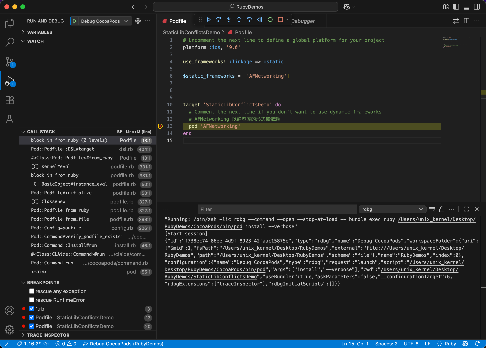

接下来就可以愉快的调试了。
说明：
- pod 的每个指令，分别对应 Cocoapods 工程中一个代码文件 
  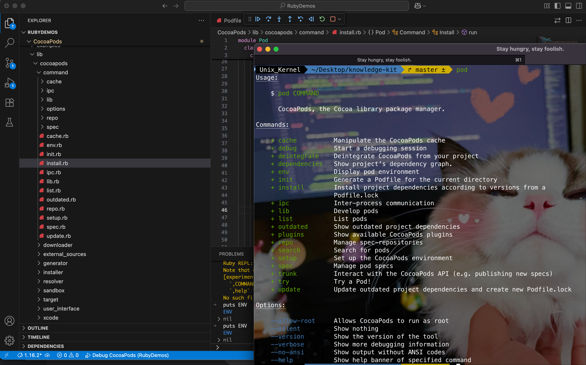
- 同时根据观察，发现 `target  do` 的代码比 pre_install、post_install 执行更早。所以我们可以做一些脚本化的操作。
比如下面，增加了一段自定义的脚本
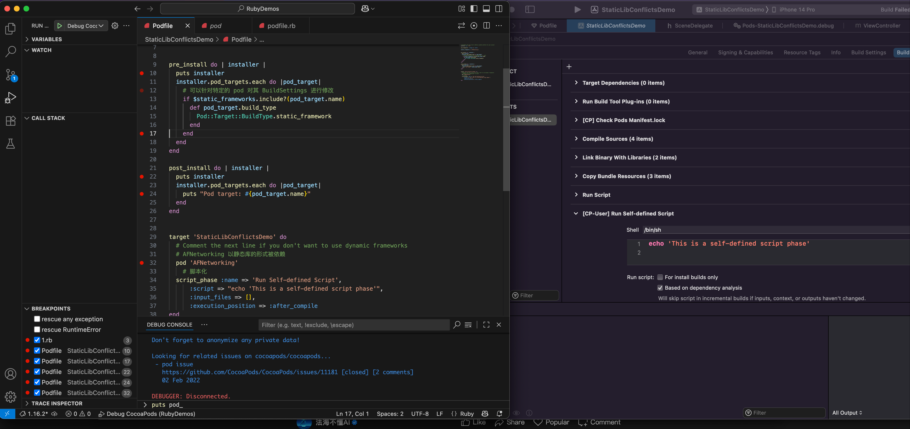


## 五、体验核心依赖库能力

### 1. ruby-macho

#### 1. 操作 Mach-O 文件

读取 Mach-O 文件，并用操作对象的方式去读区、增加、删除信息。

分别对 Mach-O 增加了一个  `LC_RPATH` 类型的 Load Command

```ruby
lc_rpath = MachO::LoadCommands::LoadCommand.create(:LC_RPATH, 'test_rpath')
file_exec.add_command lc_rpath
```

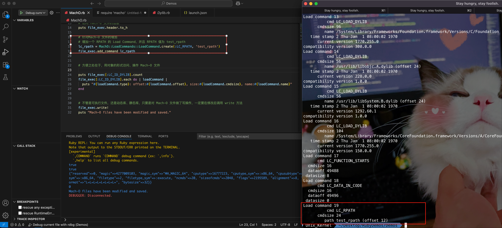

对 Mach-O 文件中删除了类型为 `LC_LINKER_OPTION` 的 Load Command


#### 2. 操作动态库

`ruby-macho` 还可以读取动态库信息，下面演示几个能力：

- 读取动态库所依赖的动态库信息

  ```ruby
  # 打印出当前 Mach-O 文件使用的所有动态库
  macho_dylibs = MachO::Tools.dylibs(macho_filepath)
  macho_dylibs.each do | dylib |
    puts dylib
  end
  ```

- 修改动态库的 id

  ```ruby
  # 修改动态库的 id
  MachO::Tools.change_dylib_id(macho_copy_filepath, 'test_selfdefined_dylib')   
  ```

  修改后在终端用指令 **objdump --macho --private-headers ./macho/libAFNetworking_copy.dylib | grep 'LC_ID_DYLIB' -A 5** 验证效果，如下图所示：

  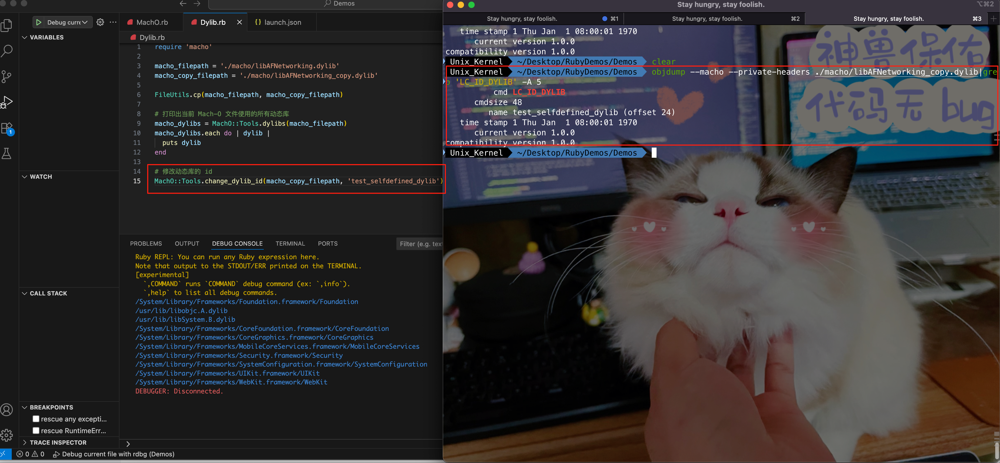

  也可以直接查看动态库的 id

  ```ruby
  original_dylib_id = MachO::MachOFile.new(macho_filepath)
  copyed_dylib_id = MachO::MachOFile.new(macho_copy_filepath)
  
  # 也可以直接查看动态库的 id
  puts "before change dylib id: #{original_dylib_id.dylib_id}"
  puts "after change dylib id: #{copyed_dylib_id.dylib_id}"
  ```

- 修改动态库 rpath

  ```ruby
  MachO::Tools.change_rpath(macho_copy_filepath, '@loader_path/Frameworks', '@loader_path/Frameworks/FantasicLBP')
  ```

  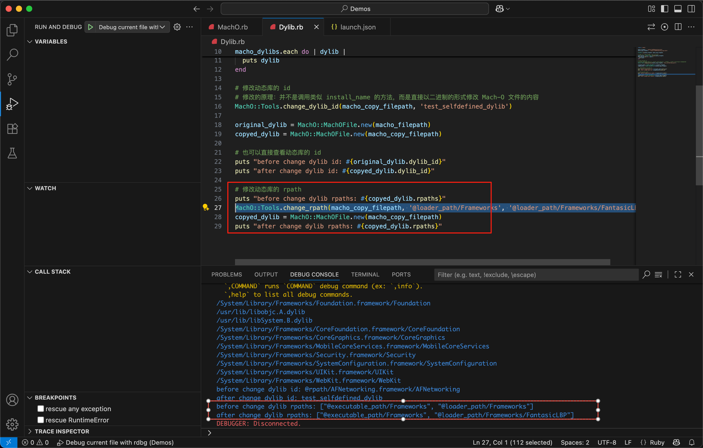

#### 3. 合并动态库到胖二进制

ruby-macho 有很多丰富的 API，基本上开发阶段所遇到的问题，都有现成的 API 解决。比如二进制指令集的合并

```ruby
filenames = [dylib_merged_filepath, dylib_arm_filepath]   
# # 第一个参数为合并之后的动态库名称，第二个参数为需要合并的一堆动态库
MachO::Tools.merge_machos(dylib_merged_filepath, *filenames)
```

合并后用 `otool -f ./macho/libAFNetworking_merged.dylib` 指令查看指令集

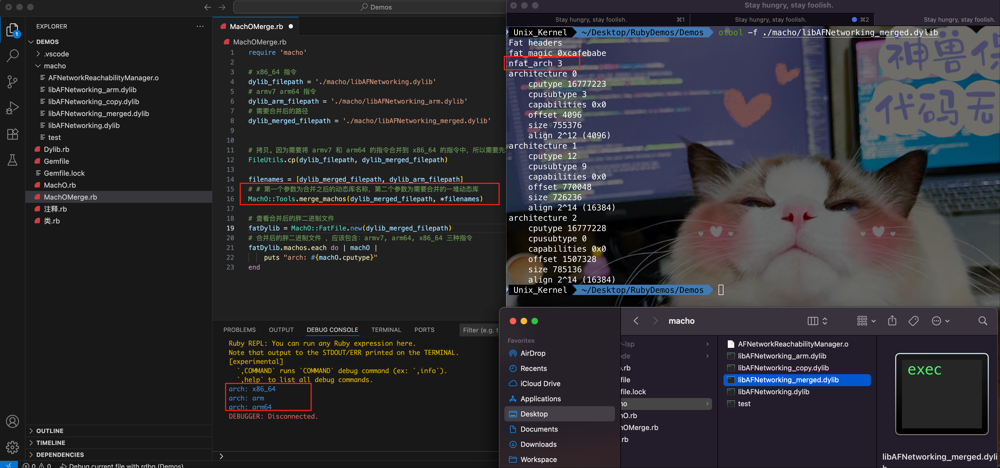


### 2. Xcodeproj 

通过 xcodeproject 路径构建 xcodeproj 对象 `app_project = Xcodeproj::Project.new(app_project_path)`

通过 xcworkspace 路径构建 xcworkspace 对象 `app_workspace = Xcodeproj::Workspace.new_from_xcworkspace(app_workspace_project_path)`

然后通过对象的方式访问 xcworkspace 的信息。比如 schemes

```ruby
app_workspace.schemes.each do | scheme |
  puts scheme
end
```

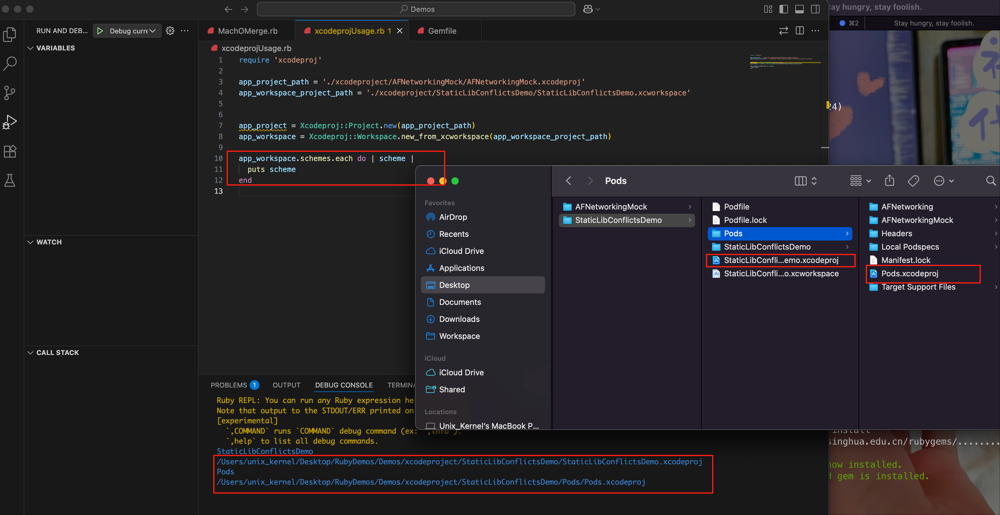

也可以针对特定的 target 修改 xcconfig

```ruby
# 修改 targets 中第一个对应 configurations 为指定的 xcconfig 文件
configuration_path = File.dirname(__FILE__) + '/xcodeproject/AFNetworkingMock/xcodeproj-testing.debug.xcconfig'
# 转换为 xcode 的 file
xc_file = app_project.new_file(configuration_path)

app_project.targets.first.build_configurations.first.base_configuration_reference = xc_file
```

效果如下：

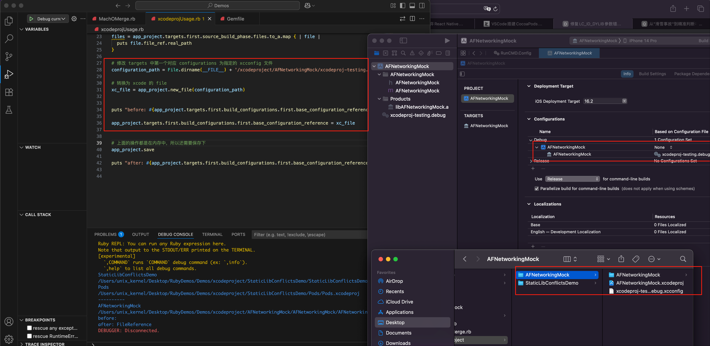

也可以对特定的 target 修改 buildSetting 中的信息，比如 bundle id

```ruby
# 修改 target 的 bundle id
app_project.targets.each do | target |
  target.build_configurations.each do | config |
    config.build_settings['PRODUCT_BUNDLE_IDENTIFIER'] = 'com.github.FantasticLBP.AFNetworkingMock' if config.name == 'Debug'
  end
end
```

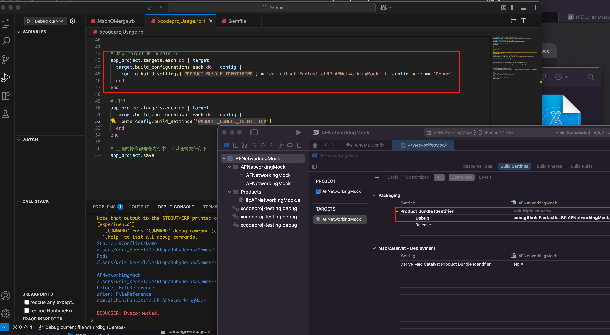

 

## 六、自定义 cocoapods 插件

### 1. 自定义 gem 库


#### 1. 初始化创建

输入指令 `bundle gem cocoapods-hmap` 自定义一个名为 `cocoapods-hmap`  的 gem 库

#### 2. 工程结构说明

得到的工程结构是：

```shell
.
├── CHANGELOG.md
├── CODE_OF_CONDUCT.md
├── Gemfile
├── LICENSE.txt
├── README.md
├── Rakefile
├── bin
│   ├── console
│   └── setup
├── cocoapods-hmap.gemspec
├── lib
│   └── cocoapods
│       ├── hmap
│       │   └── version.rb
│       └── hmap.rb
└── sig
    └── cocoapods
        └── hmap.rbs
```

说明：

- **cocoapods-hmap.gemspec**: 

  - gem 的核心配置文件，定义了 gem 的名称、版本、作者、依赖、描述、文件包含规则等关键信息。
  - 用于打包和发布 gem 到 RubyGems 仓库，是 gem 工程的 “身份证

- **Rakefile**：

  - 定义自动化任务（如测试、打包、发布等），通过 `rake <任务名>` 执行（类似 `Makefile`）。
  - 常见任务：`rake spec`（运行测试）、`rake build`（打包 gem）、`rake release`（发布到 RubyGems）

- **Gemfile**:

  - 定义 gem 开发 / 测试阶段的依赖（如测试框架 `rspec`、打包工具等），类似前端的 `package.json`。
  - 通过 `bundle install` 安装依赖，依赖版本由 `Gemfile.lock`（自动生成）锁定

- **源代码目录：lib/ **

  - gem 的核心功能代码存放目录，Ruby 会自动加载该目录下的文件

  - `lib/cocoapods/hmap.rb`：gem 的主入口文件，定义了 `CocoaPods::Hmap` 模块的核心逻辑，是功能实现的主要载体（如与 CocoaPods 集成的逻辑、头文件映射相关功能等）
  - `lib/cocoapods/hmap/version.rb`： 单独存放版本号的文件，通常定义 `CocoaPods::Hmap::VERSION` 常量，便于统一管理版本（在 `gemspec`中会引用该常量）。


#### 3. 改造并 run 起来

- 修改 gemspec 文件中带有 url、uri 的字段，开发阶段可以修改为任何一个 url 字符串

- 修改自带的工程结构，比如 `cocoapods/hmap` 改为 `cocoapods-hmap`，将对应的文件也移动位置

- 我们预期的效果是：在终端输入 **pod hmap** 就可以将工程中的静态库 Header Search Path 传统查找模式改为 hmap 文件配置模式。所以需要的的步骤就是在 **bin 目录下创建 hmap.rb**，然后通过 **bin 目录下的代码调用 lib 目录下的 HMap.rb** 能力。

- 为此，需要：

  - 在 lib 目录下创建 HMap.rb 文件

    ```ruby
    require_relative "version"
    
    module CocoapodsHmap
      class HMap 
        def initialize
          puts "Cocoapods HMap initialized"
        end
    
        def self.run
          puts "Running Cocoapods HMap..."
        end
    
      end
    end
    
    ```

  - 在 bin 目录下创建 hmap.rb 文件

    ```ruby
    #!/usr/bin/env ruby
    require "bundler/setup"
    require "cocoapods-hmap/hmap"
    
    # 打印携带的参数
    puts ARGV
    
    CocoapodsHmap::HMap.run
    ```

- 为了在 VSCode 中测试，需要在 Gemfile 中添加一行 **gem 'debug', '~> 1.9.0' # 调试用**

- 工程根目录创建 `.vscode` 文件夹，创建 launch.json 文件。内容如下：

  ```json
  {
      // Use IntelliSense to learn about possible attributes.
      // Hover to view descriptions of existing attributes.
      // For more information, visit: https://go.microsoft.com/fwlink/?linkid=830387
      "version": "0.2.0",
      "configurations": [
          {
              "type": "rdbg",
              "name": "Debug current file with rdbg",
              "request": "launch",
              "script": "${workspaceFolder}/bin/hmap", 
              "args": ["hmap"],   // pod 命令的参数
              "askParameters": true,
              "cwd": "${workspaceFolder}",    // pod 执行命令的路径
          },
          {
              "type": "rdbg",
              "name": "Attach with rdbg",
              "request": "attach"
          }
      ]
  }
  ```

VSCode 中运行效果如下：

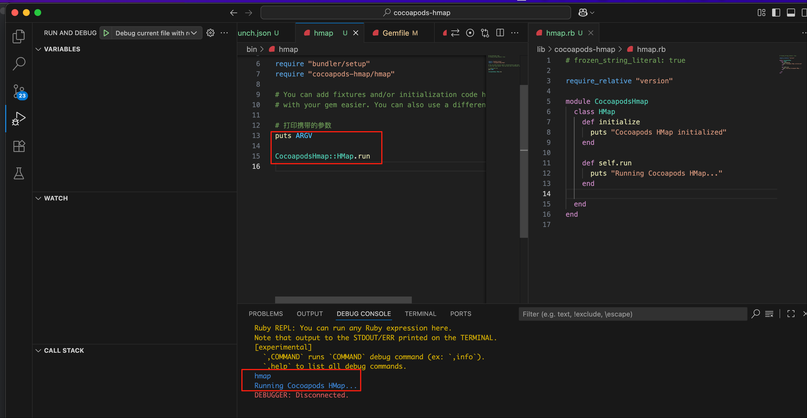

#### 4. 如何将自定义的指令加入到 cocoapods 中

- 在 Command 目录下创建 `hmap` 文件，不带任何拓展名。rake 处理后，最后会变为 `/Users/unix_kernel/.rbenv/versions/3.2.2/lib/ruby/gems/3.2.0/gems/cocoapods-hmap-0.1.0/bin/hmap: Ruby script text executable, ASCII text`

- 在 lib 目录下，创建 `cocoapods-hmap` 文件夹。
  - 在 `cocoapods-hmap` 文件夹内创建 `command` 文件夹，在 `command` 文件夹内创建 `hmap.rb` 文件
  - class 继承自 Pod::Command，并实现相关方法。比如 initialize、validate!、run
- 在 lib 目录下，创建 `cocoapods-plugin.rb` 文件
  - 暴露继承自 Pod::Command 的 hmap command

调试运行后的效果如下：

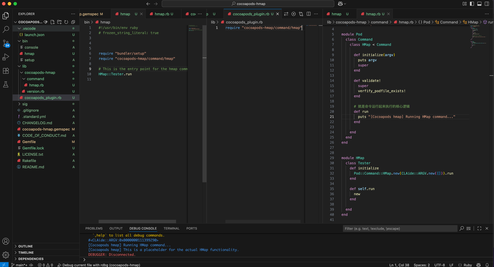

类名小写，和类文件关联起来

比如 install.rb 中，类名为 `class Install` ，内部会记录为 **{"install": "install.rb"}**


#### 5. 打包安装到本地

在终端项目目录下，执行指令 **rake install:local** ，主要用于**在本地构建并安装当前开发的 gem 包**，方便开发者进行本地测试和调试。

一开始有报错，如下图所示。按照提示修改 `cocoapods-hmap.gemspec` 中的配置，然后就可以成功安装了。然后输入 **gem list** 查看：

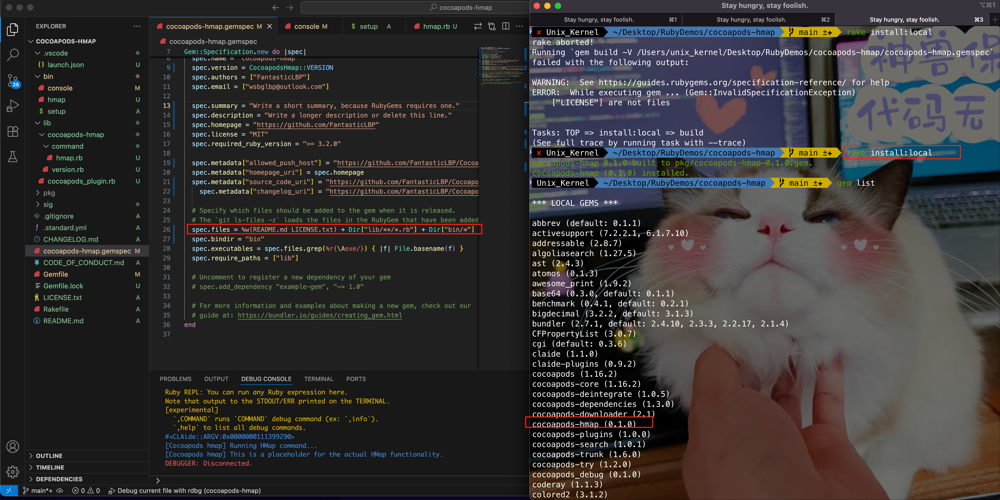

输入: **gem info cocoapods-hmap** 查看安装信息

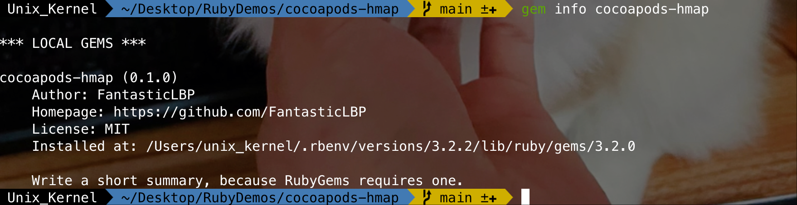


就目前的功能进行测试：

| 条件                                | 预期                                    | 结果     |
| ----------------------------------- | --------------------------------------- | -------- |
| 随便一个工程目录，没有 Podfile 文件 | 执行 `pod hmap` 会报错                  | 符合预期 |
| 存在 Podfile 文件的目录             | 正常执行 run 方法里面的逻辑（打印逻辑） | 符合预期 |

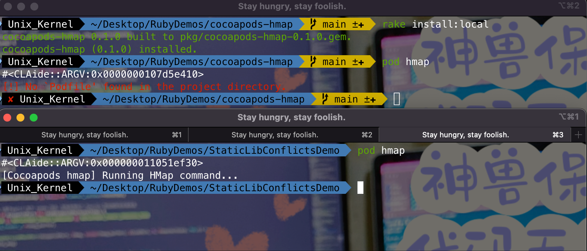


#### 6. Hook 能力

##### 1. post_install

- 修改插件入口文件 (cocoapods_plugin.rb)

  先在 `lib/cocoapods-plugin.rb` 中注册插件和对应的 hook 能力。利用 API：**Pod::HooksManager.register('cocoapods-hmap', :post_install)**，其文档说明如下：

  >register(plugin_name, hook_name, &block)
  >
  >**Definitions**: [hooks_manager.rb](vscode-file://vscode-app/Applications/Visual Studio Code.app/Contents/Resources/app/out/vs/code/electron-browser/workbench/workbench.html)
  >
  >Registers a block for the hook with the given name.
  >
  >@param [String] plugin_name The name of the plugin the hook comes from.
  >
  >@param [Symbol] hook_name The name of the notification.
  >
  >@param [Proc] block The block.

  ```ruby
  Pod::HooksManager.register('cocoapods-hmap', :post_install) do |context, options|
      argv = CLAide::ARGV.new([]) # 创建一个空的参数数组
      command = Pod::Command::HMap.new(argv)
      command.run_post_install(context, options)
  end
  ```

- 完善 HMap 命令类

  修改 `lib/cocoapods-hmap/command/hmap.rb`，增加 `run_post_install` 方法

  ```ruby
  module Pod
    class Command
      class HMap < Command
      	// ...
      	
      	# Post-install 钩子执行的方法
        def run_post_install(context, options = {})  
          puts "[Cocoapods hmap] Running HMap command in post_install hook..."
        end
      end
     end
  end   
  ```

- 测试配置

  修改测试项目的 Podfile 文件，声明 **plugin 'cocoapods-hmap'**

  ```ruby
  platform :ios, '9.0'
  plugin 'cocoapods-hmap'
  
  post_install do | installer |
    puts "Self defined post_install hook"
  end
  
  target 'StaticLibConflictsDemo' do
    # Comment the next line if you don't want to use dynamic frameworks
    # AFNetworking 以静态库的形式被依赖
    pod 'AFNetworking'
      # 脚本化
    script_phase :name => 'Run Self-defined Script',
        :script => "echo 'This is a self-defined script phase'",
        :input_files => [],
        :execution_position => :after_compile
  end
  ```

- 修改 `cocoapods-hmap` 工程的 VSCode 的 launch.json 文件

  因为 cocoapods-hmap 工程和 iOS Pods 工程不在一个目录，所以可以在 args 的第二个参数设置为测试工程路径

  ```json
  {
      // Use IntelliSense to learn about possible attributes.
      // Hover to view descriptions of existing attributes.
      // For more information, visit: https://go.microsoft.com/fwlink/?linkid=830387
      "version": "0.2.0",
      "configurations": [
          {
              "type": "rdbg",
              "name": "Debug current file with rdbg",
              "request": "launch",
              // "script": "${workspaceFolder}/bin/hmap",
              "script": " /Users/unix_kernel/.rbenv/versions/3.2.2/bin/pod",
              "args": [
                  "install",
                   "--project-directory=${workspaceFolder}/../StaticLibConflictsDemo"
              ],   // pod 命令的参数
              "askParameters": true,
              "cwd": "${workspaceFolder}",    // pod 执行命令的路径
          },
          {
              "type": "rdbg",
              "name": "Attach with rdbg",
              "request": "attach"
          }
      ]
  }
  ```

- 测试：存在2种方法

  - 第一种：在 cocospods-hmap 工程中测试，如下图

    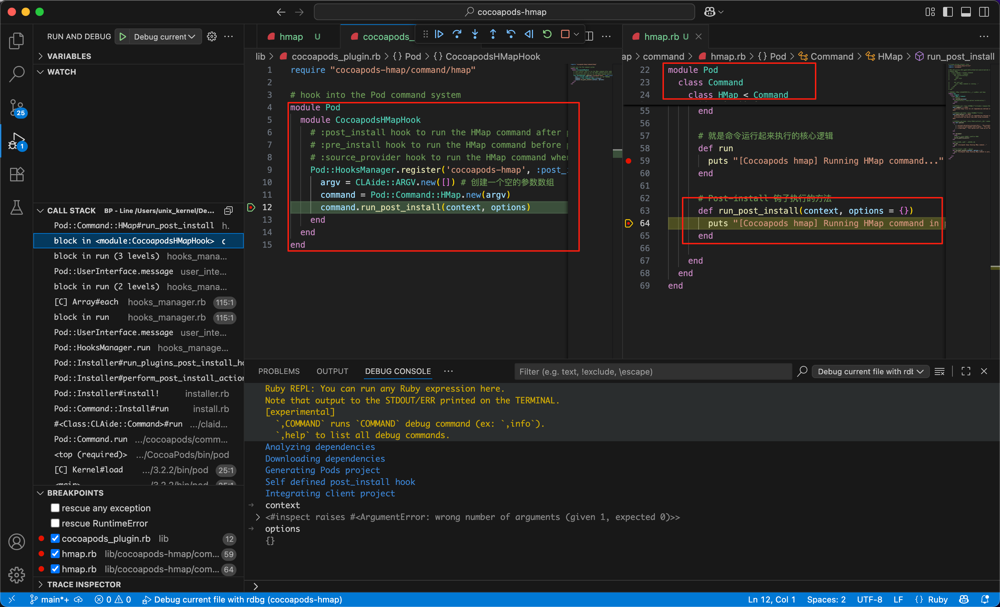

  - 第二种：

    - 在终端 cocoapods-hmap 目录下执行 **rake install:local** ，将插件安装到本地
    - 然后切换到 iOS 被测工程目录下，执行 `pod install`

    效果如下：

    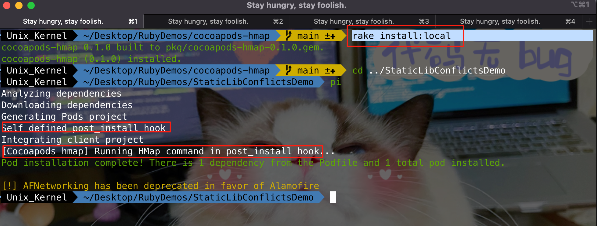

    

##### 2. pre_install


### 2. CocoaPods 插件系统设计

CocoaPods 通过严格的目录结构约定来加载插件：

```shell
lib/
├── cocoapods-plugin.rb              # 插件主入口文件（必需）
└── cocoapods-hmap/                  # 插件命名空间目录
    └── command/                     # 命令目录
        └── hmap.rb                  # 命令实现文件（必需）
```

#### 1. 自动加载机制

CocoaPods 启动时会自动执行以下操作：

1. 扫描已安装的 gem
2. 查找所有以 `cocoapods-` 为前缀的 gem
3. 加载这些 gem 中的 `lib/cocoapods-plugin.rb` 文件
4. 通过该文件加载插件功能

#### 2. 关键文件

- 插件入口文件 (`lib/cocoapods-plugin.rb`)	

  ```ruby
  require 'cocoapods-hmap/command/hmap'
  ```

- 命令实现文件 (lib/cocoapods-hmap/command/hmap.rb)

- 


