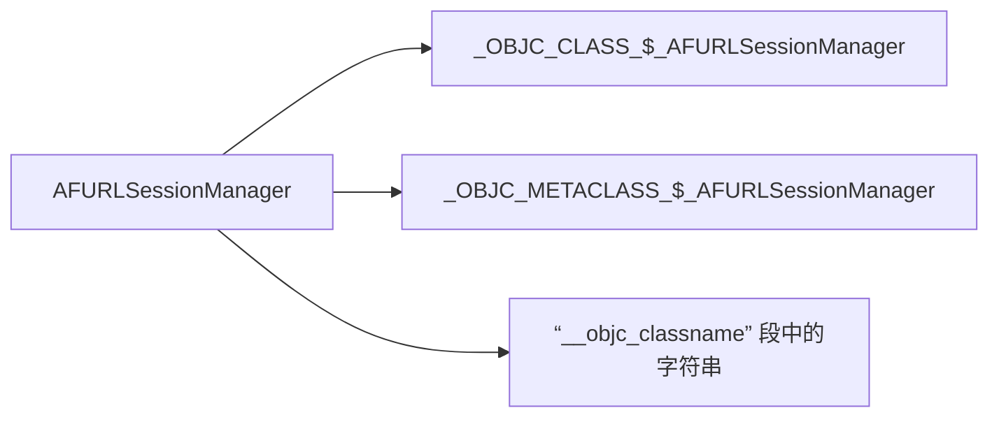
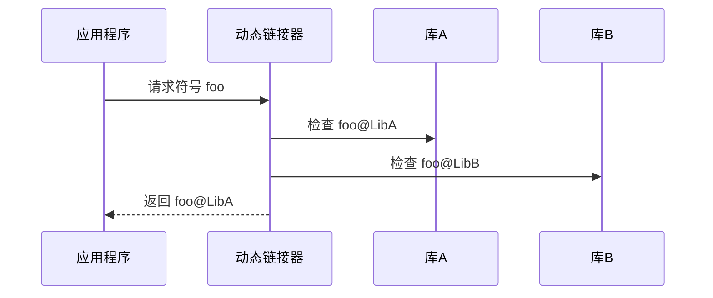
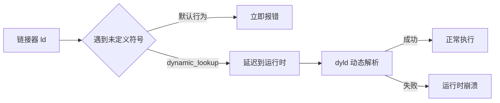
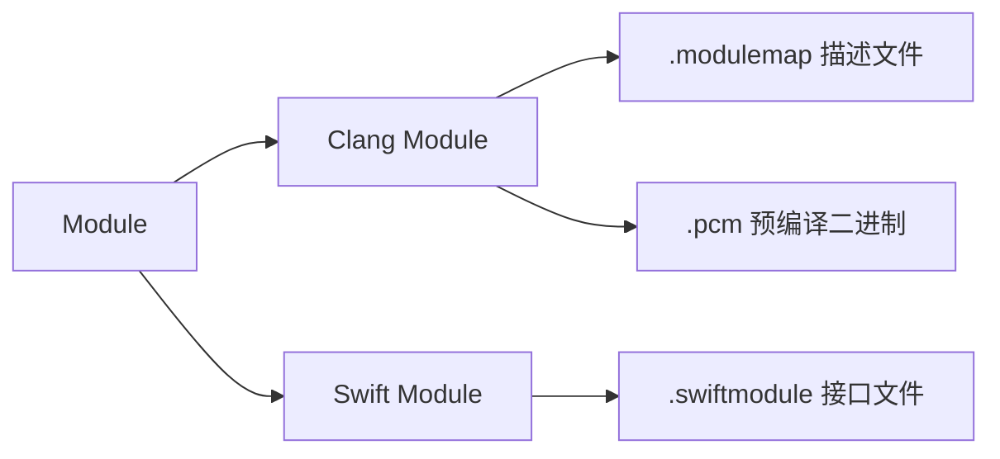
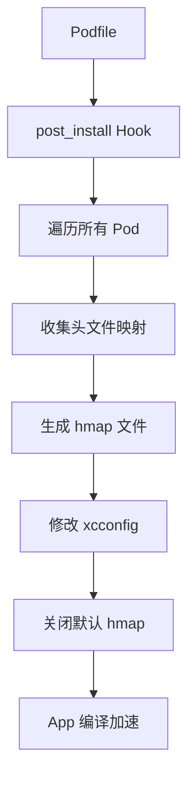
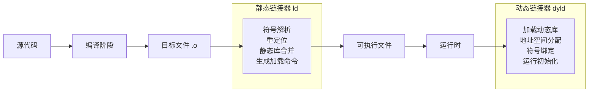
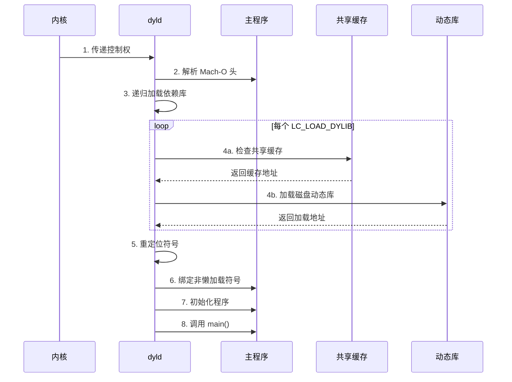
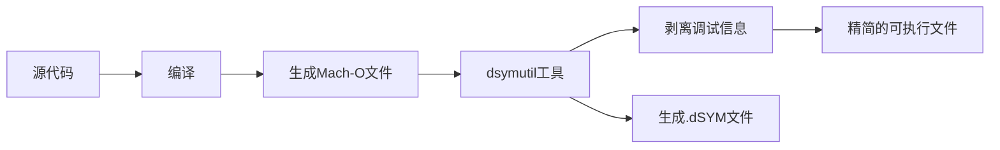
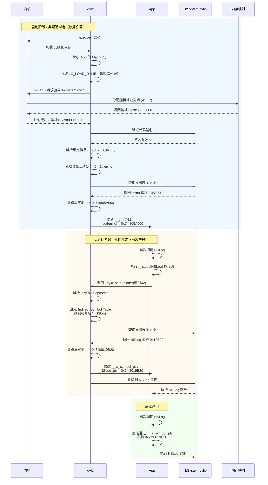
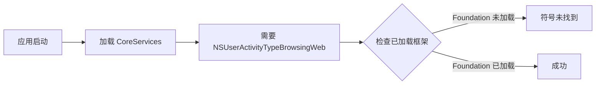

# DYLD 及 Mach-O 

> 链接动态库还是静态库对 App l包体积影响大？
>
> 动态库、静态库编译链接都做了哪些事情？链接的要素是什么？
>
> Module 是什么？ 
>
> 如果这些问题不是很清楚，可以带着问题看看本文。


什么是 DYLD？dynamic loader，动态加载器。在 MacOS/iOS 中，是使用 `/usr/lib/dyld` 程序来加载动态库的。


## 一、工程多环境配置

- Project：包含了项目的所有代码、资源文件、所有信息

- Target：对指定代码和资源文件的具体（特定）构建方式

- Scheme：对指定 Target 的环境配置

- xcconfig：便捷化的方式管理编译、链接等配置

传统的在 GUI 面板上操作不在本文研究范畴。对于 Build Settings 各个 key 不知道是什么作用的，可以查看 [Xcode Build Settings Reference](https://help.apple.com/xcode/mac/current/#/itcaec37c2a6) 和 [Xcode Project Management Guide](https://developer.apple.com/library/archive/documentation/DeveloperTools/Conceptual/XcodeBuildSystem/)


### 1. 多 Target 的方式

举个例子，我们经常会遇到在不同环境下，根据环境的不同，网络接口请求不同的 url。常见的一幕是：给 QA 测试不同环境的 App，手动更改 baseUrl 地址，然后打包让下载。太低效了。

所以需要做：

1. 在 Xcode 中创建多个 Target。选择 TARGETS 模块，选择原有的 TARGET，点击 **Duplicate**，即可创建新的 TARGET 和对应的 plist 文件

2. 为了区分不同环境，还需要设置 OC 和 Swift 各自的编译宏。

   - OC：需要在 `Build Settings` 中的 `Preprocessor Macros` 中添加，可以区分不同的 **Configuration**（工程自带的是 Debug、Release。可以在 PROJECT 中添加新的 Configuration。假设在 Configuration 里再增加一个 Beta。那就可以在这里设置）。

     OC 自带 `DEBUG` 宏定义来区分是否是 Debug 环境。只有在 Beta 下 BETA 宏为1，其他为0。

     要增加新的参数，选中对应的 Configuration，双击后在弹出的面板后，按照 **DEBUG=1** 的格式添加

     

   - 对于 Swift 则有不同的编译器。在 Build Settings 中的 **Other Swift Flags** 里选择对应的 Configuration，按照 **-DDEV** 的格式添加。**-D** 是必须要存在的，后面要加的 Flag，就紧跟在后面

     

   


操作了一番下来，我们可以发现一些缺点：

1. 操作繁琐。需要添加 OC、Swift 的宏定义。
2. 资源重复，存在多份 plist 文件


### 2. 多 Scheme 方式

要在不同的环境设置不同的 BASE_URL 在多 Scheme 方案下如何实现？

1. 多 Scheme 可以选中 PROJECT，然后点击左下方的 **+**，点击「Duplicate "Debug" Configuration」，增加一列后，重命名为 Beta

   

2. 选择 TARGETS，点击左上角的 **+** 号，在弹出面板中选择 "Add User-Defined Setting"。然后区分不同的 Configuration，设置不同的值

3. 然后新添加的值要在项目中使用，需要添加到 plist 中。

4. 添加后便可以按照正常使用 plist 的方式进行使用

5. Xcode 选择项目进行 Manage Scheme。添加了 `LDExploreDemoBeta`、`LDExploreDemoRelease` 2个 **Scheme**。

6. 分别选择不同的 Scheme，点击 Edit Scheme。**让不同的 Scheme 对应不同的 Configuration**

   

7. 选择 Debug Scheme，Debug Scheme 的名称就是 `LDExploreDemo`，点击 Run 验证


优点：不用像方式1一样，要配置某个值，需要切换不同的 TARGETS。通过多 Scheme 的方式，可以在同一个 Build Settings 中对不同的值进行配置，不会很分散。到时候只需要切换不同的 Scheme 即可。


###  3. .xcconfig 方式

#### 1. 基础使用

 Cocoapods 管理的项目在 install 之后便可以看到2份 `.xcconfig` 文件。命名格式为：`Pods-{ProjectName}.debug.xcconfig` 和 `Pods-{ProjectName}.release.xcconfig`

所以我们也可以使用 `.xcconfig` 的方式管理工程。命名格式为：`Pods-{ProjectName}.${ConfigurationName}.xcconfig`

- ProjectName: 就是工程项目名
- ConfigurationName：工程设置的 Configuration 名称。比如 Debug、Beta、Release

另外 `.xcconfig` 可以给 PROJECT 设置，也可以给 TARGETS 设置。


需求：设置不同环境对应不同的 BASE_URL 的值，在项目中正确读取。

1. 在 PROJECT 中创建不同的 Configuration，比如：Debug、Beta、Release

2. Manage Scheme。创建不同的 Scheme。比如：`${ProjectName}Debug` 、`${ProjectName}Beta` 、`${ProjectName}Release 

3. Edit Scheme。让不同的 Scheme 选择对应的 Build Configuration

   

4. 创建不同的 `.xcconfig` 文件，命名格式为：`Pods-{ProjectName}.${ConfigurationName}.xcconfig`。比如：Config-LDExploreDemo.Debug.xcconfig、Config-LDExploreDemo.Beta.xcconfig、Config-LDExploreDemo.Release.xcconfig。并编辑里面的内容

5. 将 xcconfig 文件中的变量，在 plist 文件中声明一下

6. 业务代码中按照读取 plist 文件的逻辑，正常编写业务代码

7. Xccode 选中工程的不同 Scheme 运行即可

效果如下：


同样 Cocoapods 管理的工程，也会根据 Configuration 生成不同的 xcconfig 文件，我们可以修改或者创新新的 xcconfig 文件，但引入使用。


#### 2. xcconfig 编写规范

xcconfig (Xcode Configuration Settings File) 文件是用于管理 Xcode 项目构建设置的纯文本配置文件。遵循正确的编写规范可以确保项目配置的可维护性和一致性。

1. 键值对声明

   ```shell
   // 基本键值对
   BUILD_SETTING_NAME = value
   
   // 带引号的值（包含空格时必需）
   OTHER_LDFLAGS = -ObjC -all_load
   FRAMEWORK_SEARCH_PATHS = "$(inherited)" "$(PROJECT_DIR)/Frameworks"
   ```

2. 包含其他文件

   ```shell
   // 包含其他配置文件
   #include "Base.xcconfig"
   #include "../Configurations/SharedSettings.xcconfig"
   ```

3. 注释规范

   ```shell
   // 单行注释
   /* 
      多行注释
      用于详细说明
   */
   
   // 设置分组标题
   ////////////////////////////
   // MARK: - 路径设置
   ////////////////////////////
   ```

4. 条件设置

   SDK 条件

   ```shell
   // iOS 真机配置
   LIBRARY_SEARCH_PATHS[sdk=iphoneos*] = $(inherited) "$(SRCROOT)/iOS/Libs"
   
   // iOS 模拟器配置
   LIBRARY_SEARCH_PATHS[sdk=iphonesimulator*] = $(inherited) "$(SRCROOT)/Simulator/Libs"
   
   // macOS 配置
   OTHER_CFLAGS[sdk=macosx*] = -DMAC_ENV
   ```

   架构条件

   ```shell
   // ARM64 架构
   GCC_PREPROCESSOR_DEFINITIONS[arch=arm64] = ARM_OPTIMIZED=1
   
   // x86_64 架构
   SWIFT_COMPILATION_MODE[arch=x86_64] = wholemodule
   ```

   构建配置条件

   ```shell
   // Debug 配置
   OTHER_SWIFT_FLAGS[config=Debug] = -D DEBUG -enable-testing
   
   // Release 配置
   CODE_SIGN_IDENTITY[config=Release] = "Apple Distribution"
   ```

   组合条件（上述条件可以自由组合）

   ```shell
   // 仅对 iOS 模拟器的 Debug 配置生效
   ENABLE_UI_TESTS[sdk=iphonesimulator*][config=Debug] = YES		
   ```

   设置条件后，如果在不符合的条件下，编译会报错

   

5. 值引用和继承

   ```shell
   // 引用其他设置的值
   NEW_SETTING = $(EXISTING_SETTING)/subpath
   
   // 继承上级设置（重要！）
   OTHER_LDFLAGS = $(inherited) -framework CryptoKit
   ```

6. 文件组织结构

   ```shell
   Project/
   ├── Configurations/
   │   ├── Base.xcconfig
   │   ├── Debug.xcconfig
   │   ├── Release.xcconfig
   │   ├── Development.xcconfig
   │   └── Production.xcconfig
   ```

7. 分层配置

   ```shell
   // Base.xcconfig - 通用基础设置
   SDKROOT = iphoneos
   IPHONEOS_DEPLOYMENT_TARGET = 15.0
   
   // Debug.xcconfig
   #include "Base.xcconfig"
   GCC_PREPROCESSOR_DEFINITIONS = DEBUG=1 COCOAPODS=1
   SWIFT_OPTIMIZATION_LEVEL = -Onone
   
   // Release.xcconfig
   #include "Base.xcconfig"
   SWIFT_OPTIMIZATION_LEVEL = -O
   GCC_OPTIMIZATION_LEVEL = 3
   ```

8. 路径管理规范

   ```shell
   // 使用 PROJECT_DIR 作为根目录
   PROJECT_DIR = $(SRCROOT)
   
   // 框架搜索路径
   FRAMEWORK_SEARCH_PATHS = $(inherited) \
       "$(PROJECT_DIR)/ThirdParty" \
       "$(PROJECT_DIR)/Frameworks"
   
   // 头文件搜索路径
   HEADER_SEARCH_PATHS = $(inherited) \
       "$(PROJECT_DIR)/Includes" \
       "$(PROJECT_DIR)/Generated"
   ```

9. 多平台支持

   ```shell
   // 通用设置
   COMMON_SETTINGS = -DCOMMON_FEATURE
   
   // iOS 特定
   BUILD_SETTING[sdk=iphoneos*] = $(COMMON_SETTINGS) -DIOS
   BUILD_SETTING[sdk=iphonesimulator*] = $(COMMON_SETTINGS) -DIOS_SIMULATOR
   
   // macOS 特定
   BUILD_SETTING[sdk=macosx*] = $(COMMON_SETTINGS) -DMACOS
   ```

10. 条件包含

    ```shell
    // 根据配置包含不同文件
    #if $(CONFIGURATION) == Debug
    	#include "DebugOverrides.xcconfig"
    #elif $(CONFIGURATION) == Release
    	#include "ReleaseOverrides.xcconfig"
    #endif
    ```

11. 命令行验证

    ```shell
    # 检查语法
    plutil -lint Config.xcconfig
    
    # 查看最终设置
    xcodebuild -project YourProject.xcodeproj -showBuildSettings
    ```

#### 3. 编译链接日志输出重定向


终端输入 `tty` 敲回车，然后在 Xcode 脚本中，就可以将 echo 输出的结果重定向到终端 `echo "message" > /dev/ttys000`

因为要编写脚本，研究 MachO 文件，但每次编译后的 MachO 还要 show in Finder，之后再切换到终端，然后执行脚本很繁琐。所以可以直接在 Xcode 的 Build Phases 中，增加脚本解决该问题。

但 Build Phases 中的 Run Script 长度有限，不能写很多脚本，所以还是需要结合 Xcconfig。

Xcconfig 中定义的变量在 Run Script 中是可以访问的到。

Demo 验证如下：


所以编写了一个脚本，进行输出重定向 [xcode_run_cmd](https://raw.githubusercontent.com/FantasticLBP/knowledge-kit/master/assets/xcode_run_cmd.sh)

使用的时候，需要搭配 `.xcconfig` 文件，需要设置3个参数：

- CMD：运行到命令
- CMD_FLAG ：运行到命令参数
- TTY：需要打开终端，查看终端编号配置进去。


#### 4. LLVM Strip 调试

符号的处理都是利用 LLVM Strip 的能力，对这部分好奇的，可以在源码中对 Strip 进行调试。

调试的时候要想更有意义，类似：真的在 strip 一个项目的符号，可以把某个可执行文件的路径配置到 LLVM-Strip 的启动项中

步骤：Edit Scheme - Arguments - 添加2个参数：-pa 和 需要脱符号的路径


关于 LLVM 工程如何编译、运行的具体步骤，可以查看  [LLVM](./1.102.md)


## 二、Xcode 配置层级机制

上面已经看到了 Xcconfig 文件的身影。在 Xcode 中使用 `.xcconfig` 文件设置 `OTHER_LDFLAGS = -framework "AFNetworking"` 后，该值会出现在项目的 **Build Settings** 界面中，这是由 Xcode 配置系统的设计机制决定的

### 1. Xcode 配置层级机制

Xcode 的 Build Settings 是一个**多层叠加系统**，优先级从高到低如下：


这是因为：

- `.xcconfig` 配置是比较通用的，比较基础的
- **Project 是通用容器**，存放多个 Target 的共享配置。只能选择  Configuration 下的某个 Configuration Set。并指定对应的 `.xcconfig`
- **Target 是具体构建目标**（如 App、Framework），可以在拥有从 Project 继承而来的配置后，进行独立配置。比如管理 Project 中的某几个文件、资源的编译、链接配置方式。
- Xcode 默认值：优先级最低。啥都不设置才是默认值

最终生效的意思是：Xcode 的 Build Settings 界面本质是一个**实时计算的合并视图**，它会展示：

- 所有直接通过 GUI 设置的值
- 从 `.xcconfig` 导入的值
- 继承的默认值（如 `$(inherited)`）

举个例子：

假设在以下位置设置 `OTHER_LDFLAGS`：

| 配置位置       | 设置的值                    |
| :------------- | :-------------------------- |
| Project 层     | `-framework "CoreData"`     |
| Target 层      | `-framework "AFNetworking"` |
| .xcconfig 文件 | `-framework "OpenSSL"`      |

最终生效值将是：`OTHER_LDFLAGS = -framework "AFNetworking"`


### 2. 验证 Xcode 的配置层级系统

1. 新创建一个 iOS 项目，不引入任何库

2. 创建2个 `.xcconfig` 文件

   - `Base.xcconfig`：只链接一个  UI 基础库 WantUIKit
   - `Dev.xcconfig`：引入 `Base.xcconfig` 文件，同时在此基础上，引入：SDWebImage、AFNetworking、PrismClient 3个库

   

3. 配置工程的 PROJECT 对应的 Configuration。让 Debug 模式，选择 `Dev.xcconfig`

编译后，查看如下：


所以可以看到：Xcode 的配置是遵循层级关系和继承的。

当配置完 Xcconfig 和 Xcode GUI 面板上操作完后，可以用 **xcodebuild -showBuildSettings -configuration Debug** 查看最终的结果是否符合预期


## 三、符号的导入与导出

### 1. 从源文件到可执行文件做了什么？

iOS 应用的构建过程本质上是将高级语言代码转化为设备可执行的 Mach-O 文件的过程，其中**编译阶段**和**链接阶段**是核心技术环节


#### 1. 编译阶段（Compilation） - 将源代码转化为机器码的中间形态

前端编译：

1. 词法分析(Lexical Analysis）：将源代码拆分为 token 流（关键字、标识符、运算符等）

   ```mermaid
   graph LR
   Source["int a = 10;"] --> Lexer
   Lexer --> Tokens[["'int'<br>'a'<br>'='<br>'10'<br>';'"]]
   ```

2. 语法分析（**Syntax Analysis**）:生成抽象语法树（AST）

   ````c
   int main() {
       return add(2, 3);
   }
   
   ->
   FunctionDecl: main
   └─ CompoundStmt
      └─ ReturnStmt
         └─ CallExpr: add
            ├─ IntegerLiteral: 2
            └─ IntegerLiteral: 3
   ````

3. 语义分析（Semantic Analysis）：

   - 类型检查（确保 `add` 函数存在且参数匹配）
   - 作用域验证（变量声明周期检查）
   - 生成带类型信息的 AST

 中间代码的生成与优化：

1. LLVM IR 的生成：平台无关的中间表示（Objective-C 通过 Clang，Swift 通过 SILGen）

   ```ruby
   ; add 函数的 IR 表示
   define i32 @add(i32 %a, i32 %b) {
     %1 = add i32 %a, %b
     ret i32 %1
   }
   ```

2. 机器无关的优化。经历一系列 Pass。关键方面

   - 常量传播（Constant Propagation）
   - 死代码消除（DCE）
   - 函数内联（Function Inlining）
   - 循环展开（Loop Unrolling）

   ```assembly
   - 优化前： 
     %1 = mul i32 %a, 1  ; a*1
     %2 = add i32 %1, 0  ; +0
   
   + 优化后：
     %result = add i32 %a, %b
   ```

3. 目标代码生成：包含机器码 + 符号表 + 重定位信息

   - 汇编代码生成：将 IR 转换为目标架构的汇编代码（.s 文件）
     - **指令选择**：映射 IR 到机器指令
     - **寄存器分配**：管理有限寄存器资源
     - **指令调度**：优化指令顺序
     - **代码发射**：生成汇编文本
   - 汇编器阶段：将汇编文本转为机器码。输入 `.s` 文件，输出 `.o` 文件

   

   

   

   

   

   

#### 2. 链接阶段（Linking）- 构建完整可执行文件

   1. 符号解析与重定位

      

      ```c++
      // main.c
      extern int add(int, int);  // 外部符号声明
      
      int main() {
          return add(2, 3);
      }
      ```

      符号解析过程：

      ```mermaid
      graph LR
      A[main.o] -- 寻找 add 符号 --> B[math.o]
      B -- 返回符号地址 --> A
      ```

      重定位操作：

      ```assembly
      - 链接前： call 0x00000000  ; 未知地址
      + 链接后： call 0x1000F2A0  ; 解析后的add函数地址
      ```

   2. 静态链接处理

      | 文件类型     | 处理方式     | 示例                  |
      | :----------- | :----------- | :-------------------- |
      | 目标文件(.o) | 直接合并     | main.o + utils.o      |
      | 静态库(.a)   | 按需提取     | libMath.a 中的 add.o  |
      | Swift 模块   | 消除重复符号 | __TEXT.__swift5_types |

      合并过程：

      ```assembly
      0x1000: _main (来自 main.o)
      0x2000: _add  (来自 math.o)
      ```

   3. 动态链接处理

      ```mermaid
      sequenceDiagram
          participant App as 应用程序
          participant PLT as PLT(NSLog桩代码)
          participant GOT as GOT(NSLog指针)
          participant Binder as dyld_stub_binder
          participant Dyld as dyld(动态链接器)
          participant Lib as libSystem (NSLog实现)
      
          App->>+PLT: 首次调用 NSLog
          PLT->>+GOT: 读取NSLog指针
          Note right of GOT: 初始指向绑定器
          GOT-->>-PLT: 返回dyld_stub_binder地址
          PLT->>+Binder: 跳转到绑定器
          Binder->>+Dyld: 请求解析NSLog
          Dyld->>+Lib: 查找NSLog实现
          Lib-->>-Dyld: 返回0x7FFFE4567890
          Dyld-->>-Binder: 返回真实地址
          Binder->>+GOT: 更新指针地址
          Note right of GOT: 指向真实NSLog实现
          Binder->>+Lib: 跳转到NSLog
          Lib-->>-App: 执行NSLog功能
          
          Note over App,Lib: 后续调用
          App->>PLT: 再次调用NSLog
          PLT->>GOT: 读取指针
          GOT-->>PLT: 返回真实地址(0x7FFFE4567890)
          PLT->>Lib: 直接跳转
          Lib-->>App: 执行NSLog
      ```

      当 App 编译完成的时候，Mach-O 文件中会存在一些关键结构：

      - `__TEXT.__stubs` section（PLT 桩代码）

        ```assembly
        ; NSLog 的桩代码
        _NSLog_stub:
            jmp     qword ptr [rip + _NSLog_ptr]  ; 跳转到GOT中的指针
            nop
        ```

      - `__DATA._la_symbol_ptr` section（GOT 懒符号指针）

        ```assembly
        _NSLog_ptr: 
            .quad   _dyld_stub_binder  ; 初始指向绑定器
        ```

      - `__DATA._nl_symbol_ptr` section(非懒加载指针)

        ````assembly
        ; 启动时立即绑定的符号
        _malloc_ptr: .quad _malloc_real
        ````

      首次调用 NSLog 过程

      - App 调用桩代码 `NSLog(@"hello world");` 编译后调用的是 `_NSLog_stub` 

      - 桩代码读取 GOT 指针

        ```assembly
        jmp qword ptr [rip + _NSLog_ptr]
        ```

        此时 `_NSLog_ptr` 指向 `dyld_stub_binder`

      - 执行动态绑定器

        dyld_stub_binder 工作流程：

        - 通过栈帧找到调用者信息
        - 计算目标符号在重定位表中的偏移量
        - 调用 dyld 的 bindLazySymbol 函数

      - dyld 解析符号地址

        dyld 执行下面步骤：

        - 遍历加载的镜像（libSystem.dylib、Foundation.framework 等）

        - 在导出符号表中查找 `_NSLog`

        - 计算 ASLR 偏移后的实际地址。

          ```shell
          基地址:   0x7FFFE4500000
          偏移:     0x0000000000004a30
          实际地址:  0x7FFFE4504a30
          ```

      - 更新  GOT 并跳转

        ```assembly
        ; 更新GOT指针
        mov [rip + _NSLog_ptr], rax ; rax=0x7FFFE4504a30
        
        ; 跳转到真实实现
        jmp rax
        ```

      后续调用 NSLog 流程

      ```mermaid
      graph LR
          A[App调用NSLog] --> B[桩代码]
          B --> C[读取GOT指针]
          C --> D{指针已绑定?}
          D -->|是| E[直接跳转实现]
          D -->|否| F[触发绑定流程]
      ```

      

   4. 生成 Mach-O 可执行文件

      ```shell
      Mach-O Header
      ┌───────────────────────┐
      │ Load Commands         │ → 描述段信息
      ├───────────────────────┤
      │ __TEXT (代码段)       │ → 只读机器码
      │   __text: 主程序代码  │
      │   __stubs: PLT存根   │
      ├───────────────────────┤
      │ __DATA (数据段)       │ → 可读写数据
      │   __data: 全局变量    │
      │   __la_symbol_ptr:   │ → 延迟绑定指针
      ├───────────────────────┤
      │ Dynamic Loader Info   │ → dyld 所需信息
      └───────────────────────┘
      ```

      

   编译、链接的对比

   | 阶段     | 核心任务 | 关键技术                  | 输出          |
   | :------- | :------- | :------------------------ | :------------ |
   | **编译** | 代码转换 | AST 生成 IR 优化 指令选择 | `.o` 目标文件 |
   | **链接** | 模块集成 | 符号解析 地址绑定 重定位  | Mach-O 文件   |

   


那看上去链接器做的事情很简单，不就是个打包工具？**链接器最重要的工作就是决定符号（变量名、函数名）的定义**

```c++
#include <Foundation/Foundation.h>

int main() {
	NSLog(@"Hello world");
	return 0;
}
```

例如上面的代码 `main.m`。编译器在编译 `main.m`  时遇到 NSLog，根本不知道这个 `NSLog` 符号定义在哪里，这不是编译器该关心的事情。因此，编译器只能看到局部，只聚焦关心一个当前的源文件。到底谁来关心这个 NSLog 符号定义在哪呢？这就是链接器。

链接器打包所有的目标文件，因为链接器可以看到全局，具有上帝视角，因此链接器从依赖的库中去查找 NSLog 这个符号，如果找不到则会报经典的错误   `undefined reference to  ***`

编译器只能将 NSLog 这个函数的跳转地址暂时设置为0，随后在链接的时候再去修正它。


通过一个例子一步步验证下上面的过程：

第一步，将 main.m 编译为 main.o 文件。指令如下

```shell
clang -target x86_64-apple-macos13.1 \
  -fobjc-arc \
  -isysroot /Applications/Xcode.app/Contents/Developer/Platforms/MacOSX.platform/Developer/SDKs/MacOSX13.1.sdk \
  -c main.m -o main.o
```

第二步，已经得到了 main.o 目标文件，也就是二进制文件，利用指令 `objdump -r main.o` 查看目标文件中的内容


可以看到 main 函数中，callq 就是调用 NSLog 函数。后面的地址写为了 0，这里的0会在后面链接的过程中被修正。

第三步，另外为了能让链接器能够定位到这些需要被修正的地址，在代码块中可以看到一个重定位表。指令为 `objdump -r main.o`


NSLog 位于偏移量为19的位置，

第四步，链接目标文件到可执行文件，指令为 

```shell
clang -target x86_64-apple-macos13.1 \
  -fobjc-arc \
  -isysroot /Applications/Xcode.app/Contents/Developer/Platforms/MacOSX.platform/Developer/SDKs/MacOSX13.1.sdk \
  main.o -o main
```

因为目前 Foundation 已经存在于系统目录，所以不需要额外指定动态库/静态库路径了。


### 2. 符号

符号可以理解为程序中各种元素的抽象表示。它就像是一个标识符，用来代表函数、变量、类等编程元素

#### 1. 符号的种类

| Symbol Type | **说明**                                                     |
| ----------- | ------------------------------------------------------------ |
| **U**       | undefined（未定义）                                          |
| **A**       | absolute（绝对符号）                                         |
| **T**       | text section symbol(__TEXT.__text)                           |
| **D**       | data section symbol(__DATA.__data)                           |
| **B**       | bss section symbol(__DATA.__bss)                             |
| **C**       | common symbol（只能出现在`MH_OBJECT` 类型的`Mach-O`⽂件中）  |
| **-**       | debugger symbol table                                        |
| **S**       | 除了上⾯所述的，存放在其他`section`的内容，例如未初始化的全局变量存放在(__DATA,__common)中 |
| **I**       | indirect symbol（符号信息相同，代表同⼀符号）                |
| **u**       | 动态共享库中的⼩写u表示⼀个未定义引⽤对同⼀库中另⼀个模块中私有外部符号 |

编译 `main.m` 到 `main.o` 

```shell
clang -target x86_64-apple-macos13.1 \
  -fobjc-arc \
  -isysroot /Applications/Xcode.app/Contents/Developer/Platforms/MacOSX.platform/Developer/SDKs/MacOSX13.1.sdk \
  -c main.m -o main.o
```

使用 `nm -pa  .o文件路径` 命令来查看符号


#### 2. 符号的大分类

##### 1. 全局符号(Global Symbols)

定义：在目标文件中显式导出的符号，可被其他模块引用。

特点：

- 对其他目标文件或库**可见**
- 链接时若存在多个同名全局符号，会引发 **`duplicate symbol` 错误**（除非使用弱符号）。

```c++
// C/C++/Objective-C 中未加 static 的函数/全局变量
int globalVar = 10;
void publicFunction() { ... }
```

Mach-O 标记：`N_EXT`（外部符号）。

针对全局符号：

- 当存在2个同名的全局符号，一个初始化了，一个未初始化，不会报错。在编译链接阶段，当找到定义之后，未定义的会被删掉。
- 链接器默认会把未初始化的全局符号，给强制初始化掉。比如 `int global_age;` 初始化为 `int global_age = 0;`

##### Common Symbol

Common Symbol：**Common Symbol 是全局符号的“临时状态”** 

编译器将未初始化的全局变量（如 `int x;`）暂存为 Common Symbol，**链接时**再决定其最终形态：

- 若全局唯一 → 转为标准全局符号（位于 `.bss` 段）
- 若多个同名 → 合并为一个全局符号
- 若存在强定义 → 被强定义覆盖

Common Symbol（公共符号）和全局符号（Global Symbol）本质上是**同一符号在不同编译阶段的表现形式**，二者既有紧密联系又有关键区别

编译期与链接期的形态转换

| 阶段       | Common Symbol                              | 全局符号 (Global Symbol)   |
| :--------- | :----------------------------------------- | :------------------------- |
| **编译期** | ✅ 未初始化的全局变量被标记为 Common Symbol | ❌ 此时未形成强定义         |
| **链接期** | ❌ 被转化或合并                             | ✅ 最终成为强定义的全局符号 |


链接器设置：

- -d：强制定义 Common Symbol
- -commons：指定对待 Common Symbol 如何响应

有趣的 feature：

```c++
int global_int_age = 28;
int global_int_age;

void main() {
	print("Hello world");
}
```

上面的代码不会编译报错。当存在2个同名的全局符号，一个初始化了，一个未初始化，不会报错。在编译链接阶段，当找到定义之后，未定义的会被删掉。

##### 2. 本地符号（Local Symbols / Static Symbols）

定义：仅在当前目标文件中可见，不会暴露给其他模块

特点：

- 链接时不会被其他目标文件引用，避免了命名冲突
- 通常用于内部工具函数或私有状态
- Static 修饰的符号，只对定义所在的文件可见。

```c++
static int localVar = 5;        // 静态全局变量
static void privateFunc() { ... } // 静态函数
```

Mach-O 标志：无 `N_EXT` 标志

##### 3. 未定义符号（Undefined Symbol）

定义：当前目标文件声明但未定义的符号，需由链接器在其他目标文件或库中解析。

特点：链接时若找不到符号定义，则会报错：Undefined Symbol

```c++
extern int externalVar; // 声明外部变量
void undefinedFunc();  // 声明未实现的函数
```

##### 4. Weak Symbol

**Weak Reference Symbol**：表示此 未定义符号是弱引用。如果动态链接器找不到该符号的定义，则将其设置为0。链接器会将该符号设置弱链接标志

**Weak definition Symbol**：表示此符号为弱定义符号。如果静态链接器或动态链接器为此符号找到另一个（非弱）定义，则该弱定义将被忽略。只能将合并部分中的符号标记为弱定义


当把其中一个符号通过 **\__attribute__((weak))** 改为 weak symbol 的时候，再次编译，发现没有问题。


- 当用 **\__attribute__((weak, visibility("hidden")))** 把弱定义的全局符号设置为隐藏的时候，本来是全局符号的弱定义符号，就会变成局部弱定义符号

- 弱引用符号。`__attribute__((weak_import))` 是 Clang/GCC 编译器的一个属性，用于在 iOS/macOS 开发中实现**弱链接（Weak Linking）**。它的核心作用是：**允许代码引用高版本 SDK 中的符号（函数/变量/类），同时在低版本系统中运行时安全地处理这些符号的缺失**，避免崩溃

  主要作用：

  1. 向后兼容性

     - 当您的 App **部署目标（Deployment Target）设置为较低版本（如 iOS 12）**，但**编译时使用的高版本 SDK（如 iOS 13 SDK）** 时，您可以在代码中使用高版本新增的 API（如 iOS 13 新增的类），但必须通过弱导入确保在低版本系统上运行时不会崩溃
     - 编译器不会阻止你使用高版本符号，但运行时如果符号不存在，其地址会被设为 `NULL`。

  2. 运行时安全检查。使用前需显式检查符号是否可用：

     ```objective-c
     if (&NewFunction != NULL) { // 检查弱导入函数指针
         NewFunction();          // 安全调用
     }
     if ([NewClass class] != nil) { // 检查弱导入类
         // 安全使用 NewClass
     }
     ```

  3. 避免链接错误

     - 未使用 `weak_import` 时：低版本系统因找不到符号会直接崩溃
     - 使用后：**\__attribute__((weak_import))**  系统动态加载器（dyld）会将缺失符号置为 `NULL`，由开发者处理

     实验不方便模拟动态库和 App 的情况。就看同一个 Mach-O 中，只有函数声明，没有实现的情况

     

     但告诉编译器该符号是弱引用符号，就可以编译链接成功

     


生成目标文件分过程中，只需要头文件信息（头文件路径），只需要重定位符号表，知道哪些符号需要重定位，链接的时候，会自动将符号重定位。


### 3. 脱符号

符号在 Mach-O 中占一定的体积，所以需要脱符号。那么哪些符号不能脱？

动态库的全局符号不做处理，默认就是导出符号。链接之后，这些导出符号可能就是间接符号表中的后续经由 dyld_stub_binder 去查找所需的符号。所以动态库的全局符号不能 strip 掉。

看个 Demo：OC 对象默认就是全局符号。


链接器也提供了能力，将导出符号变为不导出的符号：**-Xlinker -unexported_symbol -Xlinker _OBJC_CLASS_$_Person**


如果有一批符号需要隐藏，链接器提供了更方便的参数: **-Xlinker -unexported_symbols_list -Xlinker ${PROJECT_DIR}/LDExploreDemo/hidden_symbols.list**


### 4. 符号可见性

按照先后顺序

- 生成目标文件阶段：`-O1、O2、O3、Os、Oz`
- 链接：死代码剥离 dead code strip
- 编译后的产物 mach-o：strip 剥离符号


## 四、编译阶段做了什么 

### 1. 预处理

- **输入：** 源代码文件（`.m`, `.mm`, `.c`, `.cpp`, `.swift` 等）。
- **处理：** 由预处理器执行。
- **操作：**
  - **宏展开：** 替换所有 `#define` 定义的宏。
  - **头文件包含：** 将 `#import` 或 `#include` 指令替换为对应头文件的内容（递归处理嵌套包含）。
  - **条件编译：** 根据 `#if`, `#ifdef`, `#ifndef`, `#else`, `#elif`, `#endif` 等指令决定哪些代码块被包含或排除（常用于区分 Debug/Release 版本、不同平台、功能开关）。
  - **特殊指令：** 处理 `#pragma` 等特殊指令。
- **输出：** 一个“纯净”的、宏已展开、头文件已包含、条件编译已处理完毕的“翻译单元”文本文件。这个文件是后续编译步骤的输入

### 2. 词法分析

- **输入：** 预处理后的翻译单元。
- **处理：** 由编译器前端执行。
- **操作：** 将源代码字符流分解成一系列有意义的 **词素**。例如，将 `int result = a + b;` 分解成 `int` (关键字), `result` (标识符), `=` (运算符), `a` (标识符), `+` (运算符), `b` (标识符), `;` (符号)。
- **输出：** 一个 **Token 序列**

### 3. 语法分析

- **输入：** Token 序列。
- **处理：** 由编译器前端执行。
- **操作：** 根据语言的语法规则，将 Token 序列组织成具有层次结构的 **抽象语法树**。AST 代表了代码的结构（函数、语句、表达式、操作符、操作数等），但不包含语义信息（如变量类型）。
- **输出：** **抽象语法树**

### 4. 语义分析

- **输入：** AST。
- **处理：** 由编译器前端执行。
- **操作：**
  - **符号表管理：** 收集标识符（变量名、函数名、类名等）及其属性（类型、作用域、存储类别等），建立符号表。
  - **类型检查：** 验证表达式和操作的类型是否兼容（如 `int` + `float` 是允许的，`int` + `NSString*` 是不允许的）。
  - **类型推导：** (特别是 Swift) 推断未明确声明类型的变量或表达式的类型。
  - **常量表达式求值：** 计算编译时可确定的常量表达式（如 `const int size = 10 * 20;`）。
  - **检查语言规则：** 如变量是否声明后再使用、函数调用参数个数和类型是否匹配、类是否实现了协议要求的方法等。
- **输出：** 经过语义验证和修饰的 **AST**（节点上附加了类型等语义信息），以及符号表。如果发现错误（类型不匹配、未定义符号等），会在此阶段报告

### 5. 生成中间代码

- **输入：** 经过语义分析的 AST。
- **处理：** 由编译器前端执行。
- **操作：** 将 AST 转换成一种与具体硬件架构无关的、更低级的表示形式，称为 **中间代码**。LLVM 使用的中间代码是 **LLVM IR**。
  - **LLVM IR (Intermediate Representation):** 一种类似 RISC 指令集的低级语言，具有强类型化、静态单赋值形式等特点。它是编译流程的核心枢纽。
- **输出：** **LLVM IR 代码**（通常存储在 `.ll` 文本文件或 `.bc` 二进制文件中）。这是**优化发生的主要阶段**

### 6. IR 优化

- **输入：** LLVM IR。
- **处理：** 由 **LLVM 优化器**执行。
- **操作：** 应用一系列优化通道对 LLVM IR 进行转换，目标是在不改变程序行为的前提下，提升性能、减小代码体积。常见优化包括：
  - **死代码消除：** 删除永远不会被执行的代码。
  - **常量传播：** 将使用常量值的变量直接替换为常量。
  - **循环优化：** 展开、不变代码外提、归纳变量优化等。
  - **内联：** 将小函数调用直接替换为函数体，减少调用开销（特别对于 Swift 的泛型函数和 `@inlinable` 函数）。
  - **公共子表达式消除：** 避免重复计算相同的表达式。
  - **内存优化：** 如提升堆栈分配、优化访问模式。
  - **Tail Call Optimization：** 优化尾递归调用。
  - **特定于 Objective-C/Swift 的优化：** 如 ARC 优化（消除不必要的 `retain`/`release`）、Swift 的泛型特化等。
- **输出：** 优化后的 **LLVM IR**。Xcode 的编译设置（如 `-O0`/`-Onone` - 无优化, `-O1` - 基础优化, `-O2`/`-O` - 常用优化, `-O3` - 激进优化, `-Os`/`-Osize` - 优化大小）控制优化的级别和类型

### 7.  生成目标汇编代码

- **输入：** 优化后的 LLVM IR。
- **处理：** 由 **LLVM 后端**执行。
- **操作：** 将平台无关的 LLVM IR 代码转换成特定目标 CPU 架构（iOS 设备主要是 **ARM64**）的 **汇编语言**。
- **输出：** **目标架构的汇编代码文件**（`.s` 文件）。

### 8. 生成 .o 目标文件

- **输入：** 目标架构的汇编代码文件（`.s`）。
- **处理：** 由 **汇编器**执行。
- **操作：** 将人类可读的汇编语言代码转换成机器可以直接执行的 **目标文件**。目标文件包含机器指令、数据以及符号表、重定位信息等元数据（通常是 **Mach-O 格式**的 `.o` 文件）。
- **输出：** **目标文件**（`.o` 文件）。

### 9.  链接

- **输入：**
  - 编译生成的所有目标文件（`.o`）。
  - 项目引用的静态库（`.a` 文件，本质是 `.o` 文件的集合）。
  - iOS SDK 提供的动态库框架（如 `UIKit.framework`, `Foundation.framework`, `libSystem.dylib` 等）的导入信息（头文件声明和链接库 stub）。
  - 链接器脚本（通常由 Xcode/LLD 管理）。
- **处理：** 由 **链接器**执行（iOS 主要使用 `ld64`）。
- **操作：**
  - **符号解析：** 将所有目标文件和库中的符号引用与符号定义关联起来。确保每个被引用的函数或变量都有唯一且明确的定义。
  - **地址和空间分配：** 给程序中的各个段（如代码段 `__TEXT`, 数据段 `__DATA`）以及符号分配最终的内存地址（虚拟地址）。此时地址是相对的或基于段的起始地址。
  - **重定位：** 修改目标文件和库中的代码和数据引用，将符号引用替换为链接器分配的最终地址（或地址偏移量）。这是链接器最核心的工作之一。
  - **合并段：** 将所有输入目标文件的相同段（如 `.text`, `.data`, `.rodata`, `.bss`）合并到输出文件的对应段中。
  - **处理静态库：** 链接器从静态库中只提取那些被目标文件引用了符号所在的 `.o` 文件，避免包含未使用的代码。
  - **处理动态库：** 记录程序依赖的动态库（如 `UIKit`）及其版本信息（`LC_LOAD_DYLIB` 加载命令），并设置符号绑定信息（延迟绑定通过 `__DATA,__la_symbol_ptr`），但不将动态库代码复制到最终可执行文件中。动态库在运行时由 `dyld` 加载。
  - **生成入口点：** 设置程序的入口点（通常是 `start` 函数，最终调用 `main` 或 `UIApplicationMain`）。
  - **生成 Mach-O 头部和加载命令：** 构建最终的 **Mach-O 文件**结构，包含描述文件类型、目标架构、入口点、段信息、符号表、动态库依赖等信息的头部和一系列加载命令。
- **输出：** **可执行的 Mach-O 文件**（通常是应用程序的二进制文件，如 `YourApp`）和/或 **动态库**（`.dylib`）、**Bundle**（`.bundle`, `.framework` 内部）

Tips: 后续有很多终端使用指令的场景，为了查找方便高效，分享一个技巧

**man 指令**，比如 `man nm`：


进入 vim 模式了，看到左下角有 `:` 光标，如果想查看当前 nm 命令的参数，可以快速查找，输入 `/ + 具体参数`，敲回车即可跳转到要匹配到的位置，如果有多个结果，且当前自动跳转到的不是正确的位置，vim 模式下可以输入 `n` 跳转到下一个匹配到的位置（n 即 next），输入 `N` 则跳转到上一个匹配到的位置。

比如查找 `-p`，则输入 `/-p`，敲回车的效果如下


### 符号的导入导出及 App 瘦身

代码中使用了 Foundation 库的 NSLog，NSLog 对于业务代码来说，就是一个导入的符号，对于 Foundation 库来说，就是一个导出的符号。

什么符号可以是导出的符号？全局符号可以是导出符号。

App 或者一个 MachO 中，所有使用到的动态库的符号，都保存在间接符号表中，这些间接符号表中的数据，来自于动态库中。

动态库，全局符号 -> 导出符号

间接符号表 -> 动态库符号

所以，Strip 符号的时候，可能不能 Strip 全局符号。


OC 代码，默认都是导出的全局符号，所以容易占空间，想让体积变小，就可以尽量不想暴露的符号，使用链接器的能力，将不需要暴露的符号不暴露出去。

```shell
OTHER_LDFLAGS=$(inherited) -Xinker -unexported_symbol -Xlinker _OBJC_CLASS_$_Person
```


静态库 = `.o` 文件的合集 + 重定位符号表。但重定位符号表中的符号不能 strip，所以只能 strip `.o` 文件的调试符号。


QA：从符号角度出发，动态库还是静态库对于 App 瘦身较好（更有抓手）？使用动态库还是静态库会提及更小？

- App 在链接静态库的时候，静态库就是 .o 文件的合集，会把 `.o`  中的符号（包括可以重定位的符号），都放到 App 自身的符号表中，也就意味着可能是：本地符号、全局符号、导出符号。根据 Strip 的原理，Strip 可以脱离除了间接符号表之外的所有符号。

  静态库链接的时候，除了间接符号表，其他区域都有可能放。所以链接静态库占用体积更小。

- App 在链接动态库的时候，正好相反，App 链接的动态库的符号都放到了间接符号表中，即使 Strip 所有符号，也不可能脱掉间接符号表中的符号。

所以大家在写 SDK 的时候，可以从符号角度出发想想，是选择静态库还是动态库。针对动态库，可以 strip 导出符号。默认 OC 的符号都是导出的。


## 五、静态库

写在前面：

`.a` 静态库，`.dylib` 动态库使用有问题，一般是：

- header search path
- library search path
- other link flags

这3个的一个或者多个造成的问题，着手去排查问题即可。


### 1. clang 指令

clang 编译、链接的参数解释如下：

```shell
 clang命令参数：
     -x: 指定编译文件语言类型
     -g: 生成调试信息
     -c: 生成目标文件，只运行preprocess，compile，assemble，不链接
     -o: 输出文件
     -isysroot: 使用的SDK路径
     1. -I<directory> 在指定目录寻找头文件 header search path
     2. -L<dir> 指定库文件路径（.a\.dylib库文件） library search path
     3. -l<library_name> 指定链接的库文件名称（.a\.dylib库文件）other link flags -lAFNetworking
     -F<directory> 在指定目录寻找framework framework search path
     -framework <framework_name> 指定链接的framework名称 other link flags -framework AFNetworking
```

说明：

- `-I` 参数

  ```shell
  # Xcode 
  Header Search Paths: /path/Headers
  # 等价于 Clang
  clang -I/path/Headers
  ```

- `-I` + 通配符：

  ```shell
  # Xcode
  Header Search Paths: /path/libs/**
  # 等价于 Clang
  clang -I/path/libs/subdir1 -I/path/libs/subdir2 ...
  ```

- 系统头文件参数：`-isystem`

  ```shell
  # Xcode
  Header Search Paths: system /path/system_headers
  # 等价于 Clang
  clang -isystem /path/system_headers ...
  ```

- `-framework` 参数

  ```shell
  # Xcode
  Framework Search Paths: /path/framework/Headers
  # 等价于 Clang
  clang -F /path/framework/Headers
  ```


### 2. 静态库就是 .o 文件的合集

做个实验，验证下静态库其实就是 `.o` 文件的合集。

第一步，编写 oc 代码，就一个 Person 类，写一个类方法，编译为静态库。`Person.m` 编译为 `Person.o`


第二步，将 `Person.o`  重命名为 `Person.dylib`

其实，这里就已经可以验证「静态库就是 .o 文件的合集」。

利用 `objdump --macho --private-header Person.dylib` 查看静态库依旧是 `Object File` 


第三步，编写代码 `main.m` 代码，导入静态库 `<Person.h>`

```objective-c
#import <Foundation/Foundation.h>
#import <Person.h>

int main(int argc, char * argv[]) {
    Person *p = [[Person alloc] init];
    [p sayHi];
    NSLog(@"%@", p);
}
```

第四步，利用 clang 将 `main.m` 编译为 `main.o` 文件。注意，因为用到了 NSLog 和导入了静态库的头文件，所以需要加参数指定 NSLog 该符号从哪确定，也需要指定静态库所需的信息。

```shell
clang -x objective-c \
  -target x86_64-apple-macos13.1 \
  -fobjc-arc \
  -isysroot /Applications/Xcode.app/Contents/Developer/Platforms/MacOSX.platform/Developer/SDKs/MacOSX13.1.sdk \
  -I./StaticLibrary \
  -c main.m -o main.o
```

第五步，将第四步得到的 `main.o` 文件和前面编译好的 `Person` 静态库

```shell
clang -target x86_64-apple-macos13.1 \
  -fobjc-arc \
  -isysroot /Applications/Xcode.app/Contents/Developer/Platforms/MacOSX.platform/Developer/SDKs/MacOSX13.1.sdk \
  > -L./StaticLibrary \
  > -lPerson \
  > main.o -o main
```

注意：上面第二步，得到的 `Person` 静态库需要重命名下，因为 clang 指令 `-l` 参数的 `Person`，其实就是去找 `libPerson` 的动态库或者静态库。

查找规则：先找 `lib+<library_name>` 的动态库，找不到，再去找 `lib+<library_name>` 的静态库，还找不到，就报错 

第六步，查看第五步得到的可执行文件，然后执行，看看是否正常？

- 成功，则说明 静态库就是`.o` 文件的集合，单个 `main.o` 文件，修改拓展名就可以变为静态库
- 不成功，则相反


### 3. 静态库的合并

**静态库本质就是一堆 `.o` 的合集**，那么2个或者2个以上的静态库是可以合并的。

1. 创建2个类：Person、Cat 用于创建2个静态库

2. 利用 Clang 指令将 .m 编译为 .o 目标文件

   ```shell
   clang -x objective-c \
     -target x86_64-apple-macos13.1 \
     -fobjc-arc \
     -isysroot /Applications/Xcode.app/Contents/Developer/Platforms/MacOSX.platform/Developer/SDKs/MacOSX13.1.sdk \
     -I./CatStaticLibray \
     -c ./CatStaticLibrary/Cat.m -o Cat.o
   ```

3. 再利用 clang 指令将 .o 目标文件，链接为静态库

   

4. 利用 libtool 合并2个静态库

   ```shell
   libtool -static \
   -o libPersonCat  \
   libPerson libCat
   ```

5. 用 **ar -t libPersonCat**  指令，验证合并后的静态库所包含的 .o 目标文件

   

### 4. Auto-Link

链接器有一个特性，Auto-Link，启动这个特性后，当我们  **import <模块>** 不需要我们再去往链接器配置这个链接参数。比如 `import <framework>` 我们在代码里使用的是 *.framework 这个目标文件时，就**自动在目标文件的 `Mach-O` 中插入一个 Load Command 格式是 `LC_LINKER_OPTION`，存储这样一个链接器参数 `-framework FrameworkName`**


### 5. duplicate symbol

静态库（`.a` 文件）在链接阶段出现 **`duplicate symbol`** 错误，本质是链接器在合并多个目标文件时发现了重复的全局符号定义

静态库的本质是**目标文件（`.o`）的集合**。当链接器将主工程和静态库的代码合并时，如果发现：

1. 同一个符号（函数/变量）在多个地方被定义
2. 链接器无法确定使用哪个定义

就会抛出 `duplicate symbol` 错误

其实上述存在前提，链接的时候需要指定为 `all_load\-Objc` 时才会存在


### 6. 静态库冲突

#### 1. 情景模拟

##### 1. Demo1
一个 cocoapods 组织的工程，以 pod 的形式引入了 AFNetworking 库。再将另一个 `libAFNetworking.a` 以静态库的形式引入了 AFNetworking。


现象：工程编译成功。编译链接后，运行输出打印信息。
问题：为什么2个同样的静态库，没有链接失败？
分析：
- 直接在 Xcode 中手动拖入一个静态库/动态库，本质是将库的路径写到 OTHER_LDFLAGS 后面。Xcode 会按照指定的路径去加载静态库/动态库。
  ```shell
  OTHER_LDFLAGS = $(inherited) -ObjC -l"AFNetworking" "/Users/unix_kernel/Desktop/编译链接/LDAndFramework/StaticLibConflictsSolution/StaticLibConflictsDemo/AFNetworking"`
  ```
- 但链接器很聪明，当发现同名的库的时候，会优先链接找到的第一个库库，第二个库不会被链接。
- 即使将 `OTHER_LDFLAGS = $(inherited) -ObjC -l"AFNetworking"` 中的 `-ObjC` 改为 `-all_load` 也不会存在链接问题。本质是链接器对于同名的库，找到第一个后，后面的就停止查找，不会被链接了，所以不存在符号重复相关的问题


##### 2. Demo2

一个 cocoapods 组织的工程，以 pod 的形式引入了 AFNetworking 库，再将另一个 `libAFNetworking.a` 静态库改名为 `libAFNetworkingCopy.a`，然后引入 Xcode 工程。


现象：工程链接失败。报错：`Issues223 duplicate symbols for architecture x86_64`
问题：为什么上次的链接成功，这次却链接失败了，报符号重复的错误？
分析：
- 不同名称的静态库，就不存在「链接器对于同名的库，找到第一个后，后面的就停止查找，不会被链接了，所以不存在符号重复相关的问题」，也就是会发生冲突


##### 3. Demo3

- 一个 cocoapods 组织的工程，以 pod 的形式引入了 AFNetworking 库
- 然后 Xcode 新创建一个静态库，选择 `Static Library`
- 新创建的静态库就1个 `AFNetworkingMock` 文件。不过类里面还存在一个类 `AFURLSessionManager` 和一个全局函数 `global_function`

现象：工程链接失败。报错：`error: duplicate interface definition for class 'AFURLSessionManager'`


问题：为什么上次的链接成功，这次却链接失败了，报符号重复的错误？
分析：

- 不同名称的静态库，就不存在「链接器对于同名的库，找到第一个后，后面的就停止查找，不会被链接了，所以不存在符号重复相关的问题」，也就是会发生冲突


#### 2. 解决方案

2个静态库有符号冲突怎么办？且一个静态库没有源码。[llvm-objcopy](https://llvm.org/docs/CommandGuide/llvm-objcopy.html) 这个工具刚好有能力在静态库基础上直接修改符号名称。

##### 1. 收集需要重命名的符号
通过 **objdump --macho -t ${MACH_PATH}** 就可以输出符号信息。Demo 中需要重命名的符号如下：


##### 2. 编译 llvm-objcopy 产出工具

关于 LLVM 如何编译运行，或者开发 pass 可以查看 [LLVM 编译运行](./1.102.md#编写-xcode-插件)

打开 LLVM 工程，Scheme 切换为 `llvm-objcopy` 然后编译运行，从 Products 目录下将产物拷贝到个人电脑的 CustomTools 文件夹，后续就可以在终端访问  llvm-objcopy 指令。（因为在 `.zshrc` 文件里配置过 `export PATH=~/CustomTools:$PATH`）

这样就说明已经成功了


然后改造 Demo 工程静态库的脚本为 **llvm-objcopy --prefix-symbols=FantasticLBP_ ${MACH_PATH}** 去给冲突的符号加前缀 `FantasticLBP_`（当然这个前缀名字可以是 SDK 名称简写、业务线简写，我这里是 Github ID ，验证问题而已）。

结果：但发现运行报错，提示 `llvm-objcopy: command not found` 


改进：将 `llvm-objcopy` 移动到源码根目录下，现在 `Command not found` 的问题解决了，但是报错： **error: option is not supported for MachO**

说明 `--prefix-symbols` 并不支持 MachO 格式。而 `--redefine-sym` 符合要求。

打开 llvm 源码进行调试，配置启动参数。

发现修改成功


上面演示了单个修改符号名称的过程。llvm-objcopy 可以批量修改。
- 指令改为 `--redefine-syms`。 
- 用一个文件，格式为空格和换行来区别。
  ```
  _OBJC_CLASS_$_AFURLSessionManager FantasticLBP__OBJC_CLASS_$_AFURLSessionManager
  _OBJC_METACLASS_$_AFURLSessionManager FantasticLBP__OBJC_METACLASS_$_AFURLSessionManager
  _OBJC_IVAR_$_AFURLSessionManager._session FantasticLBP__OBJC_IVAR_$_AFURLSessionManager._session
  ```
  修改后运行，发现批量符号修改成功。
  


##### 3. 使用工具修改符号名称

利用 llvm-objcopy 的能力，修改重名的符号后测试下。


可以看到：

- 符号冲突的问题解决了
- 但同一个符号存在2处实现，当两个同名类被加载时，运行时随机选择一个


##### 4. 为什么存在2处类定义？



**通过 llvm-objcopy 只是修改了  `_OBJC_CLASS_$` 符号而忽略 `_OBJC_METACLASS_$` 和类名字符串，运行时仍会看到两个类定义，导致冲突未解决**
而且和运行时系统相关的所有功能都会受影响，比如：Category、KVC/KVO 内部使用类名字符串查找、Archive/Unarchive 崩溃等。

所以这种方式存在巨大风险，这里只是从技术研究角度出发，证明可以这么做，但是影响面太大。
另外一种方式：2个不同名的静态库，但存在相同符号。可以通过 cocoapods 的配置，将某个静态库改为动态库。因为动态库存在二级命名空间，就可以避免符号重复的问题。
关于动态库二级命名空间的细节，可以查看[这里](#twoLevelNamespace)

方案 1：单个库转为动态库
```ruby
# Podfile
use_frameworks!  # 启用框架支持

target 'YourApp' do
  pod 'AFNetworking', '~> 4.0'  # 默认静态库
  
  # 将冲突库转为动态框架
  pod 'ConflictingLib', :modular_headers => true, :linkage => :dynamic
end
```
方案 2：指定模块为动态框架
```ruby
dynamic_frameworks = ['ConflictingLib']

target 'YourApp' do
  # 先声明所有库
  pods = [
    'AFNetworking',
    'ConflictingLib',
    'OtherLib'
  ]
  
  # 动态处理
  pods.each do |pod|
    if dynamic_frameworks.include?(pod)
      pod pod, :modular_headers => true, :linkage => :dynamic
    else
      pod pod
    end
  end
end
```
实验：我的电脑 cocoapods 版本较低，采用下面写法
```ruby
platform :ios, '9.0'
use_frameworks!  # 确保启用框架支持

target 'StaticLibConflictsDemo' do
  # 动态链接 AFNetworking（兼容所有版本）
  pod 'AFNetworking', :modular_headers => true
  
  # 添加后安装钩子脚本
  post_install do |installer|
    # 将 AFNetworking 设为动态框架
    installer.pods_project.targets.each do |target|
      if target.name == 'AFNetworking'
        # 设置 Mach-O 类型为动态库
        target.build_configurations.each do |config|
          config.build_settings['MACH_O_TYPE'] = 'mh_dylib'
          config.build_settings['DYLIB_INSTALL_NAME_BASE'] = '@rpath'
          config.build_settings['LD_RUNPATH_SEARCH_PATHS'] = ['$(FRAMEWORK_SEARCH_PATHS)']
        end
      end
    end
    
    # 确保框架被正确嵌入
    installer.pods_project.build_configurations.each do |config|
      config.build_settings['EMBEDDED_CONTENT_CONTAINS_SWIFT'] = 'YES'
    end
  end
end
```
效果：

可以看到不光是解决了符号重复的问题，也解决了同一个类，存在2处实现的问题。


- 静态库：符号直接合并到主可执行文件的全局符号表
- 动态库：拥有独立的符号空间（LC_ID_DYLIB 标识）
  - 动态库内部符号相互可见
  - 外部通过导出符号表(LC_DYSYMTAB)访问


##### 5. 符号冲突总结
###### 1. 最佳实践方案：动态库隔离

利用动态库的二级命名空间特性，将冲突的静态库转换为动态库，实现符号隔离

```ruby
# Podfile
use_frameworks! # 关键：启用框架支持

target 'StaticLibConflictsDemo' do
  # 将冲突库转为动态 framework 
  pod 'ConflictingLib', :modular_headers => true, :linkage => :dynamic
  
  # 其他静态库
  pod 'NonConflictingLib'
end
```

静态库的 xcconfig 为


动态库的 xcconfig 为


###### 2. 源码级解决方案：添加类前缀

```objective-c
// 原始类名
@interface AFURLSessionManager : NSObject

// 修改后
@interface ABC_AFURLSessionManager : NSObject
```

###### 3. 构建系统级解决方案：Bazel 命名空间

```shell
objc_library(
    name = "AFNetworking",
    namespace = "ABC",  # 自动添加前缀
    srcs = glob(["*.m"]),
    hdrs = glob(["*.h"]),
)
```


## 六、Strip 流程

静态库/ .o 文件 Strip 流程： 处理  `_DWARF` 段


Strip 的过程，就是在修改 Mach-O 文件中的内容。


动态库


All Symbols


Non-Global Symbols（非全局符号）：


## 七、Framework

### 1. 定义

**Mac OS/iOS 平台还可以使用 Framework，Framework 实际上是一种打包方式，将库的：二进制文件、头文件、和有关资源打包到一起，方便管理和分发**。

Framework 和系统 UIKit.Framework 还是有很大区别的。

- 系统的 Framework 不需要拷贝到目标程序中
- 我们自己的 Framework 不管是静态还是动态的，都需要拷贝到 App 中（App 和 Extension 的 Bundle 是共享的）

因此，Apple 把这种 Framework 又叫做 `Embedded Framework`。开发中使用的动态库会被放到 ipa 的 framework 目录下，基于沙盒运行。

不同的 App 使用相拥的动态库，并不会只在系统中存在一份。而是在各个 App 中各自打包、签名、加载一份。


根据 Apple 审核要求，上传到 App Store 的 ipa 可执行文件有大小限制。这里的大小不是指二进制（Mach-O）文件大小，而是指去其中 `__TEXT` 段的大小。

- iOS 7 之前，二进制文件中所有 `__TEXT`  部分总和不得超过 80M
- iOS7.x 至 iOS8.x，二进制文件中，每个架构中的 `__TEXT` 部分不得超过 60M
- iOS9.0 之后，二进制文件中所有 `__TEXT` 部分的总和不超过 500M

为了实现该效果，很多公司在组件化或者开源库，都采用动态链接的方式。因为动态链接的部分，不算在当前 Mach-O 的 `__TEXT` 段。


### 2. Framework 2种结构

- **动态库：Header +  `.dylib` + 签名 + 资源文件**
- **静态库：Header + `.a`  + 签名 + 资源文件**


### 3. 静态库转 Framework

继续做个实验，验证下 Framework 的结构（上面做了静态库），所以我们可以沿用上面的成果，将静态库包装成 Framework

第一步，新建一个文件夹 `Framworks`，下面创建一个 `Person.Framework` 文件夹，把之前得到的静态库 `Person` 移动到该目录下。并创建一个 `test.m` 移动过去。

```objective-c
#import <Foundation/Foundation.h>
#import "Person.h"

int main () {
    Person *person = [[Person alloc] init];
    NSLog(@"Person is %@", person);
}
```

第二步，模仿 Framwork 文件结构目录。因为 Framework 的结构里有 Header 信息，所以创建 `Headers` 文件夹，把 `Person.h` 文件放进去。Headers 同层目录，把 Person 静态库放进去。

第三步，根据 `test.m` 和 framework 信息，编译成 `test.o`

```shell
clang -x objective-c \
  -target x86_64-apple-macos13.1 \
  -fobjc-arc \
  -isysroot /Applications/Xcode.app/Contents/Developer/Platforms/MacOSX.platform/Developer/SDKs/MacOSX13.1.sdk \
  -I ./Frameworks/Person.framework/Headers \
  -c test.m -o test.o
```

第四步，再根据 `test.o` 和 framework 去完成链接。链接三要素：库的头文件、库所在目录、库的名称。只不过在处理 Framework 的时候，参数不一样

```shell
clang \
-target x86_64-apple-macos13.1 \
-fobjc-arc \
-isysroot /Applications/Xcode.app/Contents/Developer/Platforms/MacOSX.platform/Developer/SDKs/MacOSX13.1.sdk \
 -F ./Frameworks \
-framework Person \
test.o -o test
```

说明：test.o 链接 Person.framework 生成 main 可执行文件

- `-F./Frameworks` 在当前目录的子目录 Frameworks 查找需要的库文件。类似 Xcode 里的 **Framwork search path**

- `-framework Person ` 链接的名称为 `Person.framework` 的动态库或者静态库。类似 **Other linker flags -framework**

  查找规则：先找 `Person.framework` 的动态库，找不到，再去找 `Person.framework` 的静态库，还找不到，就报错

第五步：成功得到了 test 可执行文件，说明模仿 Framwork 搭建的静态库 Framwork 成功了。然后测试下可执行文件运行结果。进行 double check


### 4. QA：通常情况下，**同一份代码，一个库制作成动态库体积会比静态库小**。为什么？

静态库是一堆 `.o` 文件的集合。假设 AFNetworking 有15个 `.m` 文件，编译后产生 15个 `.o` 文件。每个 `.o` 文件的都存在下面3部分：

- Mach header
- Segment
- Section

Mach header 包括一些基础信息，所以 Mach header 存在冗余（大小端序、CPU 类型等），这也就是为什么静态库比动态库体积大的原因之一。


```shell
Unix_Kernel  ~/Desktop/OCExplore/OCExplore  file Person.o
Person.o: Mach-O 64-bit object x86_64
 Unix_Kernel  ~/Desktop/OCExplore/OCExplore  otool -h Person.o
Person.o:
Mach header
      magic  cputype cpusubtype  caps    filetype ncmds sizeofcmds      flags
 0xfeedfacf 16777223          3  0x00           1     4       1880 0x00002000
```


动态库在 Mach header 这里有改进，AFNetworking 动态库格式如下：


将公共的信息放到一起，公用一个 Mach header。


但「同一份代码，一个库制作成动态库体积会比静态库小」不绝对。

对于 iOS9，Load Commands Segment vmsize 默认是一个内存页，也就是16k

对于 iOS10，Load Commands Segment vmsize 默认是 32k

- vmsize：此 segment 占用的虚拟内存的字节数
- filesize：此 segment 在磁盘上占用的内存数

假设项目只有1个源文件，可能打包后的静态库要比动态库体积大。


### 5. dead strip

dead strip 触发条件：

- 没有被入口点使用 -> 脱掉
- 没有被导出符号使用 -> 脱掉

由于 OC 是动态性语言，比如 Category 是在运行时创建的，所以即使开启了 dead strip 也没办法脱掉 OC 符号。

链接器很方便，提供了 **-why_live** 参数，来查看为什么某个符号没有被脱掉。用法：**-Xlinker -why_live -Xlinker _global_Function **

``` shell
clang -target x86_64-apple-macos13.1 \
-fobjc-arc \
-isysroot /Applications/Xcode.app/Contents/Developer/Platforms/MacOSX.platform/Developer/SDKs/MacOSX13.1.sdk \
-Xlinker -dead_strip \
-Xlinker -all_load \
-Xlinker -why_live -Xlinker _global_Function \
-L ./StaticLibrary \
-l Person \
test.o -o test
```

dead code strip 和 xlinker 提供的4个参数：

- `-noall_load`:  完全不加载、直接去优化。`OTHER_LDFLAGS=-Xlinker -noall_load`

- `-all_load`:  完全加载、不要去优化掉。`OTHER_LDFLAGS=-Xlinker -all_load`
- `-ObjC` :  排除ObjC的代码、其他的都优化掉。`OTHER_LDFLAGS=-Xlinker -ObjC ` 
- `-force_load` ： 指定哪些静态库不要优化掉； 


## 八、动态库

### 1. tbd

tbd 全称是 text-based stub libraries，本质就是一个 YAML 描述的文本文件。

作用：用于描述动态库的链接信息，包括导出的符号、动态库的架构信息、动态库的依赖信息

用于避免在真机开发过程中直接使用传统的 dylib。

对于真机来说，由于动态库都是在设备上的，在 Xcode 上使用基于 tbd 格式的伪 framework，可以大大减少 Xcode 的大小

一个典型的 TBD 文件（如 `UIKit.tbd`）包含以下部分：

```yaml
--- !tapi-tbd-v3
archs:           [ arm64, arm64e ]
platform:        ios
install-name:    /System/Library/Frameworks/UIKit.framework/UIKit
current-version: 61000
compatibility-version: 1.0
exports:
  - archs:           [ arm64, arm64e ]
    symbols:         [ _UIApplicationMain, _UIViewSetFrame ]
    weak-symbols:    [ _UISomeOptionalAPI ]
    objc-classes:    [ UIViewController, UIView ]
    objc-ivars:      [ UIViewController.view ]
...
```

| 字段                    | 描述                                 |
| :---------------------- | :----------------------------------- |
| `archs`                 | 支持的架构 (arm64, armv7, x86_64 等) |
| `platform`              | 目标平台 (ios, ios-simulator, macos) |
| `install-name`          | 运行时加载路径                       |
| `current-version`       | 库的当前版本                         |
| `compatibility-version` | 兼容版本                             |
| `exports`               | 导出的符号信息                       |
| `symbols`               | 导出的 C 函数和全局变量              |
| `objc-classes`          | 导出的 Objective-C 类                |
| `objc-ivars`            | 导出的实例变量                       |
| `objc-eh-types`         | Objective-C 异常类型                 |
| `re-exports`            | 重新导出的其他库                     |

### 2. 直接链接动态库

继续通过小实验来研究动态库的创建与使用

第一步：创建 dylib 文件夹，下面创建 `Person.h` `Person.m`  类。在 dylib 同层目录创建 main.m 文件。代码如下


第二步：对 main.m 编译成 main.o 文件，指令为

```shell
clang -target x86_64-apple-macos13.1 \
  -fobjc-arc \
  -isysroot /Applications/Xcode.app/Contents/Developer/Platforms/MacOSX.platform/Developer/SDKs/MacOSX13.1.sdk \
  -I./dylib \
  -c main.m -o main.o
```

第三步：到 dylib 文件夹下，对 Person 编译为 Person.o 文件，指令为

```shell
clang -target x86_64-apple-macos13.1 \
  -fobjc-arc \
  -isysroot /Applications/Xcode.app/Contents/Developer/Platforms/MacOSX.platform/Developer/SDKs/MacOSX13.1.sdk \
  -c Person.m -o Person.o
```

第四步：将 Person.o 编译为动态库，指令为

```shell
clang -dynamiclib \
  -target x86_64-apple-macos13.1  \
  -fobjc-arc \
  -isysroot /Applications/Xcode.app/Contents/Developer/Platforms/MacOSX.platform/Developer/SDKs/MacOSX13.1.sdk \
  Person.o -o LibPerson.dylib
```

第五步，将 main.o 和 LibPerson.dylib 链接，成为 main 可执行文件

```shell
clang -target x86_64-apple-macos13.1 \
  -fobjc-arc \
  -isysroot /Applications/Xcode.app/Contents/Developer/Platforms/MacOSX.platform/Developer/SDKs/MacOSX13.1.sdk \
  -L./dylib \
  -lPerson \
  main.o -o main
```

每次针对动态库的操作都是这些差不多的指令，就是一些参数的不同，写个 Shell 脚本，命名为 `build.sh`

```shell
echo "---------------- start --------------"

echo "第一步：先对 main.m 编译为 main.o"

clang -target x86_64-apple-macos13.1 \
  -fobjc-arc \
  -isysroot /Applications/Xcode.app/Contents/Developer/Platforms/MacOSX.platform/Developer/SDKs/MacOSX13.1.sdk \
  -I./dylib \
  -c main.m -o main.o

echo "第二步，再对 Person 编译为 Person.o"

pushd ./dylib
clang -target x86_64-apple-macos13.1 \
  -fobjc-arc \
  -isysroot /Applications/Xcode.app/Contents/Developer/Platforms/MacOSX.platform/Developer/SDKs/MacOSX13.1.sdk \
  -c Person.m -o Person.o

echo "第三步，将 Person.o 编译为 libPerson.dylib 动态库"

clang -dynamiclib \
  -target x86_64-apple-macos13.1  \
  -fobjc-arc \
  -isysroot /Applications/Xcode.app/Contents/Developer/Platforms/MacOSX.platform/Developer/SDKs/MacOSX13.1.sdk \
  Person.o -o libPerson.dylib

echo "第四步，将 main.o 和 libPerson.dylib 链接为可执行文件 main"

popd
clang -target x86_64-apple-macos13.1 \
  -fobjc-arc \
  -isysroot /Applications/Xcode.app/Contents/Developer/Platforms/MacOSX.platform/Developer/SDKs/MacOSX13.1.sdk \
  -L./dylib \
  -lPerson \
  main.o -o main

echo "---------------- Done --------------"
```

结果如下：


第六步：对生成的 main 可执行文件进行调试运行，使用 lldb 指令 `lldb -file 可执行文件`，然后输入 r 进行运行：


咦，为什么我用动态库链接后还是无法使用？？？带着问题研究下


### 3. 静态库链接成动态库

因为：

- `.o` 文件可以链接成静态库
- `.o` 文件可以链接成动态库

所以：能不能推导出这样一个结论：静态库也可以链接成动态库。

做个小实验验证看看：

和上面的材料没有差别，区别在于脚本，其中一步是将静态库链接为动态库。

使用链接器 LD 能力，链接静态库为动态库指令如下

```shell
ld -dylib -arch x86_64 \
  -macosx_version_min 13.1 \
  -syslibroot /Applications/Xcode.app/Contents/Developer/Platforms/MacOSX.platform/Developer/SDKs/MacOSX13.1.sdk \
  -lsystem -framework Foundation \
  libPerson.a -o libPerson.dylib
```

`build.sh` 完整脚本如下

```shell
echo "---------------- start --------------"

echo "第一步：先对 main.m 编译为 main.o"

clang -target x86_64-apple-macos13.1 \
  -fobjc-arc \
  -isysroot /Applications/Xcode.app/Contents/Developer/Platforms/MacOSX.platform/Developer/SDKs/MacOSX13.1.sdk \
  -I./dylib \
  -c main.m -o main.o

echo "第二步，再对 Person 编译为 Person.o"

pushd ./dylib
clang -target x86_64-apple-macos13.1 \
  -fobjc-arc \
  -isysroot /Applications/Xcode.app/Contents/Developer/Platforms/MacOSX.platform/Developer/SDKs/MacOSX13.1.sdk \
  -c Person.m -o Person.o

echo "第三步，对 Person.o 编译为 LibPerson.a 静态态库"

libtool -static -arch_only x86_64 Person.o -o libPerson.a

echo "第四步，LD 链接器将 libPerson.a 链接为 libPerson.dylib 动态库"

ld -dylib -arch x86_64 \
  -macosx_version_min 13.1 \
  -syslibroot /Applications/Xcode.app/Contents/Developer/Platforms/MacOSX.platform/Developer/SDKs/MacOSX13.1.sdk \
  -lsystem -framework Foundation \
  libPerson.a -o libPerson.dylib

echo "第五步，将 main.o 和 libPerson.dylib 链接为可执行文件 main"

popd
clang -target x86_64-apple-macos13.1 \
  -fobjc-arc \
  -isysroot /Applications/Xcode.app/Contents/Developer/Platforms/MacOSX.platform/Developer/SDKs/MacOSX13.1.sdk \
  -L./dylib \
  -lPerson \
  main.o -o main

echo "---------------- Done --------------"
```

执行完脚本，又出现了奇怪的现象：


发现，在**利用动态库链接成可执行文件时报错了 `undefined symbols for **`，然后利用 `objdump --macho --exports-trie libPerson.dylib` 查看动态库的导出符号，居然是空**。为什么？

链接器在链接阶段，默认使用  `-noall_load` 参数。共4个参数：

- `-noall_load` ：默认是 `-noall_load`，顾名思义就是不会所有符号的加载，而是链接器链接一个静态库之前去扫描静态库文件，找到需要的代码再进行链接
- `-all_load`：链接所有符号，不管代码有没有使用
- `-force_load`： 可以指定要载入所有方法的库，后面必须跟一个只想静态库的路径
- `-ObjC`：告诉链接器把库中定义的 Objective-C 类和 Category 都加载进来，这样编译之后的可执行文件会变大（因为加载了其他的 OC 代码进来）。由于  OC语言符号链接的基本单位是类，静态库链接时首先会链接本类，而 Category 是运行时才会被加载的，因此会被静态链接器直接忽略掉，通过 `-ObjC` 命令是告知链接器链接所有的 OC 代码

知道具体原因那就好办了，修改指令

```shell
ld -dylib -arch x86_64 \
  -macosx_version_min 13.1 \
  -syslibroot /Applications/Xcode.app/Contents/Developer/Platforms/MacOSX.platform/Developer/SDKs/MacOSX13.1.sdk \
  -lsystem -framework Foundation \
  -all_load \
  libPerson.a -o libPerson.dylib
```

再次运行 build 脚本，然后对可执行文件执行，还是报错 😂


 

通过上面的实验可以得出结论：

- **静态库是 `.o` 文件的合集**
- **动态库是 `.o` 文件链接后的产物**
- **静态库可以链接成动态库**
- **动态库是最终链接产物。动态库比静态库多走一次链接的过程**


### 4. 动态库 Library not loaded？

为什么动态库链接后的可执行文件运行，会报 `Library not loaded: 'libPerson.dylib'` 错误？

不得不聊聊动态库加载原理


也就是说：**当 dyld 加载一个可执行文件（main） 的时候，在 Mach-O 中有一些名字叫 `LC_LOAD_DYLIB` 的 Load Command，里面保存了所使用到的动态库的路径。可执行文件所依赖的动态库，就是靠 dyld 根据动态库路径进行加载的**。

用 MachOView 打开另一个 App **看看**


对于我们自己链接的可执行文件 main 进行查看，利用 `otool  -l main | grep 'DYLIB' -A 5` 指令


可以发现：

- **name 好像就是动态库的路径**
- 链接的其他几个动态库的路径都没问题，就是 LibPerson.dylib 路径有问题。


如何解决？

**需要在编译链接生成动态库的时候，有个东西保存动态库路径，这个就是 Mach-O 文件中的另一个 Load Command，即 `LC_ID_DYLIB`**。


#### 方式一：通过 `install_name_tool` 指令


通过改变动态库 name 来修改动态库的路径。具体指令为： `install_name_tool -id 动态库路径 动态库名称`。即：`install_name_tool -id /Users/unix_kernel/Desktop/LDAndFramework/StaticLibraryLinkedIntoDynamicLibrary/dylib/libPerson.dylib libPerson.dylib`

修改动态库的 name 之后，再次 `otool  -l libPerson.dylib | grep 'DYLIB' -A 5` 查看路径信息


动态库有了正确的 name 后，再重新链接生成可执行文件。可执行文件可以正确运行，查看所以来的动态库路径，均正确加载。


方式一有明显**缺点，因为路径是绝对路径，因此没办法迁移**。


#### 方式二：`rpath`

`rpath`，Runpath search paths，dyld 搜索路径。运行时，`@rpath`  指示 dyld 按顺序搜索路径列表，以找到动态库。

`@rpath` 保存一个或多个路径的变量。

关键步骤：**谁链接动态库，谁来提供 rpath**

- 动态库需要 rpath 信息，用来加载访问动态库真正的实现
- 宿主（App）提供 rpath 信息，用于提供路径信息给动态库


前提说明：模拟下 App 真实环境。创建一个文件夹 `Frameworks`，内部继续创建 `Person.framework` 文件夹，其内部继续创建 `Headers`

文件夹，将 dylib 文件夹下的文件复制过去。结构如下

```shell
// tree -L 4
.
├── Frameworks
│   └── Person.framework
│       ├── Headers
│       │   └── Person.h
│       ├── Person.h
│       ├── Person.m
├── build.sh
├── dylib
│   ├── Person.h
│   ├── Person.m
│   ├── Person.o
│   ├── libPerson.a
│   └── libPerson.dylib
├── main.m
```

第一步，在 ` Frameworks/Person.framework` 下面执行命令，将 `Person.m` 编译为 `Person.o` 

```shell
clang -target x86_64-apple-macos13.1 \
  -fobjc-arc \
  -isysroot /Applications/Xcode.app/Contents/Developer/Platforms/MacOSX.platform/Developer/SDKs/MacOSX13.1.sdk \
  -c Person.m -o Person.o
```

第二步，将 `Person.o` 链接为动态库

```shell
clang -dynamiclib \
  -target x86_64-apple-macos13.1  \
  -fobjc-arc \
  -isysroot /Applications/Xcode.app/Contents/Developer/Platforms/MacOSX.platform/Developer/SDKs/MacOSX13.1.sdk \
  Person.o -o Person
```

第三步，给动态库利用 `install_name_tool` 修改 id，id 指定 `@rpath` 信息（在做这么一件事：动态库需要 rpath 信息，用来加载访问动态库真正的实现）

```shell
install_name_tool -id @rpath/Frameworks/Person.framework/Person /Users/unix_kernel/Desktop/LDAndFramework/StaticLibraryLinkedIntoDynamicLibrary/Frameworks/Person.framework/Person
```

第四步，利用 `otool` 查看动态库的 name 是否修改好了 `@rpath` 信息

```
otool -l Person | grep 'ID' -A 5
```

第五步，回到根目录，将 `main.m` 编译为 `main.o`

```shell
clang -target x86_64-apple-macos13.1 \
  -fobjc-arc \
  -isysroot /Applications/Xcode.app/Contents/Developer/Platforms/MacOSX.platform/Developer/SDKs/MacOSX13.1.sdk \
  -I./Frameworks/Person.framework/Headers \
  -c main.m -o main.o
```

第六步，将 `main.o` 和 `Person.framework` 链接为可执行文件

```shell
clang -target x86_64-apple-macos13.1 \
  -fobjc-arc \-isysroot /Applications/Xcode.app/Contents/Developer/Platforms/MacOSX.platform/Developer/SDKs/MacOSX13.1.sdk \
  -F./Frameworks \
  -framework Person \
  main.o -o main
```

此时的可执行文件虽然链接成功了，但是可执行文件需要用到动态库的功能，直接运行会报错 `Library not loaded: '@rpath/Frameworks/Person.framework/Person'`。所以需要给可执行文件添加 `rpath` 信息

第七步，给可执行文件 `main` 添加 `rpath` 信息（在做这么一件事：宿主（App）提供 rpath 信息，用于提供路径信息给动态库）

```shell
install_name_tool -add_rpath /Users/unix_kernel/Desktop/LDAndFramework/StaticLibraryLinkedIntoDynamicLibrary main
```

添加后验证是否添加成功，指令 `otool -l main | grep 'RPATH' -A 5`

第八步，链接成功后 `main` 可执行文件即可执行


下面是上面全部步骤的截图说明。


给动态库添加 `rpath` 信息。

核心：谁链接动态库，`rpath` 谁来提供，比如一个 Person.framework 路径为： `/usr/meiying/desktop/DynamicExplore/Person.framework`

- 可执行文件中 `Load Command ` 中存在 `LC_RPATH` ，值为 `/usr/meiying/desktop/DynamicExplore/Person.framework`
- 动态库 Mach-O 中也存在 值为 `@rpath/Frameworks/Person.framework/Person`

反思：上面的方案还是有缺点的，因为可执行文件提供的 `rpath`  还是一个绝对路径。


#### 方式三：@execute_path、@loader_path

`@executable_path`：表示可执⾏程序所在的⽬录，解析为可执⾏⽂件的绝对路径。

`@loader_path`：表示被加载的`Mach-O` 所在的⽬录，每次加载时，都可能被设置为不同的路径，由上层指定

可以将可执行文件的 **rpath 修改为灵活的，而不是写死的路径**，指令格式为：**install_name_tool -rpath oldPath newPath**

```shell
install_name_tool -rpath /Users/unix_kernel/Desktop/LDAndFramework/StaticLibraryLinkedIntoDynamicLibrary @executable_path main
```


这个可不是花里胡哨的烧操作，Cocoapods 也是这么干的

```
LD_RUNPATH_SEARCH_PATHS = $(inherited) '@executable_path/Frameworks' '@loader_path/Frameworks'
```


注意：`@loader_path` 还是比较抽象的，举一个实际场景例子来看看

假设背景是：

- 动态库 Cat 具有 `[cat sleep]` 能力
- 动态库 Person 具有 `[person sayHi]` 能力，动态库 Person 使用了动态库 Cat
- 可执行文件，导入了动态库 Person

这样一个场景，代码模拟下，文件目录如下


1. 在 Cat.framework 文件夹下运行 build.sh
2. 在 Person.framework 文件夹下运行 build.sh
3. 在 main.m 根目录下运行 build.sh

得到 main 可执行文件，运行报错。

```shell
lldb -file main
(lldb) target create "main"
Current executable set to '/Users/unix_kernel/Desktop/LDAndFramework/DynamicLibraryUseDynamicLibrary/main' (x86_64).
(lldb) r
Process 54157 launched: '/Users/unix_kernel/Desktop/LDAndFramework/DynamicLibraryUseDynamicLibrary/main' (x86_64)
dyld[54157]: Library not loaded: 'Person'
  Referenced from: '/Users/unix_kernel/Desktop/LDAndFramework/DynamicLibraryUseDynamicLibrary/main'
  Reason: tried: 'Person' (no such file), '/usr/local/lib/Person' (no such file), '/usr/lib/Person' (no such file), '/Users/unix_kernel/Desktop/LDAndFramework/DynamicLibraryUseDynamicLibrary/Person' (no such file), '/usr/local/lib/Person' (no such file), '/usr/lib/Person' (no such file)
Process 54157 stopped
* thread #1, stop reason = signal SIGABRT
    frame #0: 0x000000010005698e dyld`__abort_with_payload + 10
dyld`:
->  0x10005698e <+10>: jae    0x100056998               ; <+20>
    0x100056990 <+12>: movq   %rax, %rdi
    0x100056993 <+15>: jmp    0x100013150               ; cerror_nocancel
    0x100056998 <+20>: retq
Target 0: (main) stopped.
```

得到新的命题：**可执行文件中引入动态库 A，动态库的功能实现依赖动态库 B，链接器该如何链接呢？**


第一种尝试：

对 Cat.framework 下的 build.sh 修改脚本，指定 `@rpath` 信息， `-Xlinker -install_name -Xlinker @rpath/Cat.framework/Cat`

```shell
echo "1： 编译 Cat.m 为 Cat.o 可执行文件"

clang -target x86_64-apple-macos13.1 \
  -fobjc-arc \
  -isysroot /Applications/Xcode.app/Contents/Developer/Platforms/MacOSX.platform/Developer/SDKs/MacOSX13.1.sdk \
  -c Cat.m -o Cat.o

echo "2: 链接 Cat.o 为 Cat 动态库"

clang -dynamiclib \
    -target x86_64-apple-macos13.1  \
    -fobjc-arc \
    -isysroot /Applications/Xcode.app/Contents/Developer/Platforms/MacOSX.platform/Developer/SDKs/MacOSX13.1.sdk \
    -Xlinker -install_name -Xlinker @rpath/Cat.framework/Cat \
    Cat.o -o Cat

echo "3: 输出动态库的 name（路径）信息"
otool -l Cat | grep 'ID' -A 5
```

对 Person.framework 下的 build.sh 修改脚本，指定 `@rpath` 信息，` -Xlinker -install_name -Xlinker @rpath/Person.framework/Person`

```shell
echo "1：编译 Person.m 为 Person.o 可执行文件"

clang -target x86_64-apple-macos13.1 \
  -fobjc-arc \
  -isysroot /Applications/Xcode.app/Contents/Developer/Platforms/MacOSX.platform/Developer/SDKs/MacOSX13.1.sdk \
  -I./Headers \
  -I./Frameworks/Cat.framework/Headers \
  -c Person.m -o Person.o

echo "2: 链接 Person.o 为 Person 动态库"

clang -dynamiclib \
    -target x86_64-apple-macos13.1  \
    -fobjc-arc \
    -isysroot /Applications/Xcode.app/Contents/Developer/Platforms/MacOSX.platform/Developer/SDKs/MacOSX13.1.sdk \
    -Xlinker -install_name -Xlinker @rpath/Person.framework/Person \
    -F./Frameworks/ \
    -framework Cat \
    Person.o -o Person


echo "3: 输出动态库的 dylib 信息"
otool -l Person | grep 'DYLIB' -A 5

echo "-----------"
echo "4: 输出动态库的 name 信息"
otool -l Person | grep 'ID' -A 5

```

对可执行文件 main 根目录，指定 `@executable_path` 信息，`-Xlinker -rpath -Xlinker @executable_path/Frameworks`

```shell
echo "---------------- start --------------"

echo "第一步：先对 main.m 编译为 main.o"

clang -target x86_64-apple-macos13.1 \
  -fobjc-arc \
  -isysroot /Applications/Xcode.app/Contents/Developer/Platforms/MacOSX.platform/Developer/SDKs/MacOSX13.1.sdk \
  -I./Frameworks/Person.framework/Headers \
  -c main.m -o main.o

echo "第二步，将 main.o 和 Person.dylib 链接为可执行文件 main"

clang -target x86_64-apple-macos13.1 \
  -fobjc-arc \
  -isysroot /Applications/Xcode.app/Contents/Developer/Platforms/MacOSX.platform/Developer/SDKs/MacOSX13.1.sdk \
  -Xlinker -rpath -Xlinker @executable_path/Frameworks \
  -F./Frameworks \
  -framework Person \
  main.o -o main

echo "第三步，输出信息"
otool -l main | grep 'RPATH' -A 3
otool -l main | grep 'DYLIB' -A 3

echo "---------------- Done --------------"
```

运行报错如下：


为什么还错误了？都已经给可执行文件添加了 `@executable_path`，给2个动态库都添加了 `@rpath`，怎么办？

思路：因为报错是说动态库 Person 找不到动态库 Cat，那是不是聚焦下 Person，在 Person 的链接指令中，给 Person 添加 `@rpath` 就可以了？

动手实践下，修改 Person 动态库的 build.sh 脚本

```shell
echo "1：编译 Person.m 为 Person.o 可执行文件"

clang -target x86_64-apple-macos13.1 \
  -fobjc-arc \
  -isysroot /Applications/Xcode.app/Contents/Developer/Platforms/MacOSX.platform/Developer/SDKs/MacOSX13.1.sdk \
  -I./Headers \
  -I./Frameworks/Cat.framework/Headers \
  -c Person.m -o Person.o

echo "2: 链接 Person.o 为 Person 动态库"

clang -dynamiclib \
    -target x86_64-apple-macos13.1  \
    -fobjc-arc \
    -isysroot /Applications/Xcode.app/Contents/Developer/Platforms/MacOSX.platform/Developer/SDKs/MacOSX13.1.sdk \
    -Xlinker -install_name -Xlinker @rpath/Person.framework/Person \
    -Xlinker -rpath -Xlinker @executable_path/Frameworks/Person.framework/Frameworks \
    -F./Frameworks/ \
    -framework Cat \
    Person.o -o Person


echo "3: 输出动态库的 dylib 信息"
otool -l Person | grep 'DYLIB' -A 5

echo "-----------"
echo "4: 输出动态库的 name 信息"
otool -l Person | grep 'ID' -A 5

```

在 Person.framework运行下 build.sh，然后在根目录下运行 build.sh，得到新的可执行文件，然后可以成功运行


反思：可执行文件依赖动态库 A，动态库 A 依赖动态库 B，上面的配置很繁琐：

- 可执行文件提供 `rpath`，指令为： `-Xlinker -rpath -Xlinker @executable_path/Frameworks`
- 动态库 A 指定 name 为 `-Xlinker -install_name -Xlinker @rpath/Person.framework/Person`，同时又因为依赖了动态库 B，所以同时又要提供 `rpath`，指令为 `-Xlinker -rpath -Xlinker @executable_path/Frameworks/Person.framework/Frameworks `
- 动态库 B 指定 name，指令为 `-Xlinker -install_name -Xlinker @rpath/Cat.framework/Cat`

好繁琐啊，有没有简化的方法。此时 **`@loader_path`** 呼之欲出了。

在当前场景下，Person 动态库的指令可以简化下。`-Xlinker -rpath -Xlinker @executable_path/Frameworks/Person.framework/Frameworks ` 可以替换为 `-Xlinker -rpath -Xlinker @loader_path/Frameworks `

修改脚本后，分别在 Person.framework 和 main 可执行文件根目录下执行 build.sh 脚本，然后验证可执行文件是否可以正确运行，加载所需动态库

注：为了方便看清楚脚本执行情况和可执行文件执行结果，这次运行注释了 otool 的打印脚本。


`loader_path` 是标准解决方案。随便打开 AFNetworking 工程看看


链接器可真强大啊，同时 Mach-O 开的口子也多，也就是可以随意修改已经编译好的可执行文件的 `rpath` ，自己也可以创建一个同名的动态库（name）把原有的动态库替换了，这也是为什么 MacOS 那些破解软件的工作原理。（当然，这些也要结合逆向技术）

上述的操作，其实本质就是修改 Mach-O 文件的 Load Command，按照 Apple 的机制，Mach-O 修改后，必须重新签名才可以运行使用破解软件时，总是要求我们重新签名，背后的命令如下：

```shell
sudo codesign --force --deep --sign - (应用路径)
```


### 5. 动态库如何导出所引用的动态库的符号

- 主工程 -> Person 动态库
- Person 动态库 -> Cat 动态库

那么主工程可以直接调用 Cat 动态库的能力吗？

正常写代码肯定可以，但是从链接器角度分析下，如何实现

**调用的本质就是符号的发现。也就是 Cat 的符号有没有导出？可执行文件 mian 使用的能力就是动态库导出后，自己导入的**。

因为 main 引入了 `import <Person.h>` ，查看下 Person 动态库的导出符号，使用指令 `objdump --macho --exports-trie Person`

进入 Cat.framework 也查看下 Cat 动态库的导出符号，使用指令 `objdump --macho --exports-trie Cat`

发现 Person 没有导出 Cat 的符号。那在可执行文件中调用不了 Cat 的能力了。


怎么办呢？链接器 LD 已经是很成熟的东西了，对于处理动态库依赖了动态库，且需要将被依赖动态库的符号导出，这样的需求早已满足了。具体是什么参数？终端输入 `man ld` 查看下指令


其中，我们需要用的是 **-reexport_framework** 这个参数。指令为 ` -Xlinker -reexport_framework -Xlinker Cat`

对此，修改 Person.framework 的 build.sh 脚本

```shell
echo "1：编译 Person.m 为 Person.o 可执行文件"

clang -target x86_64-apple-macos13.1 \
  -fobjc-arc \
  -isysroot /Applications/Xcode.app/Contents/Developer/Platforms/MacOSX.platform/Developer/SDKs/MacOSX13.1.sdk \
  -I./Headers \
  -I./Frameworks/Cat.framework/Headers \
  -c Person.m -o Person.o

echo "2: 链接 Person.o 为 Person 动态库"

clang -dynamiclib \
    -target x86_64-apple-macos13.1  \
    -fobjc-arc \
    -isysroot /Applications/Xcode.app/Contents/Developer/Platforms/MacOSX.platform/Developer/SDKs/MacOSX13.1.sdk \
    -Xlinker -install_name -Xlinker @rpath/Person.framework/Person \
    -Xlinker -rpath -Xlinker @executable_path/Frameworks/Person.framework/Frameworks \
    -Xlinker -reexport_framework -Xlinker Cat \
    -F./Frameworks/ \
    -framework Cat \
    Person.o -o Person


echo "3: 输出动态库的 dylib 信息"
otool -l Person | grep 'DYLIB' -A 5

echo "-----------"
echo "4: 输出动态库的 name 信息"
otool -l Person | grep 'ID' -A 5

```

执行脚本输出如下：


结构如下：


理论上来讲，Person.framework 把 Cat.framework 导出了，实现方式是通过给 Mach-O 的一个叫做 `LC_REEXPORT_DYLIB` 的 Load Command。也就是可执行文件，通过 Person.framework 的 `LC_REEXPORT_DYLIB` load Command 可以实现访问 Cat.framework 的符号。

完整验证下，还需要做2件事情：

- 修改 main.m 的代码，因为要访问 Cat.framework 的能力，测试能否正常运行

  ```objective-c
  #import <Foundation/Foundation.h>
  #import "Person.h"
  #import <Cat.h>
  
  int main(int argc, char * argv[]) {
      Person *p = [[Person alloc] init];
      [p sayHi];
      Cat *cat = [[Cat alloc] init];
      [cat sleep];
      return 0;
  }
  ```

- 修改 main.m 的 build.sh 脚本，因为 Person.framework 已经暴露了 Cat.framework 的能力， `mian.m` 中引入了 `Cat.Framework` 的符号，LD 链接指令需要加 Cat.framework 头文件的参数

  ```shell
  echo "---------------- start --------------"
  
  echo "第一步：先对 main.m 编译为 main.o"
  
  clang -target x86_64-apple-macos13.1 \
    -fobjc-arc \
    -isysroot /Applications/Xcode.app/Contents/Developer/Platforms/MacOSX.platform/Developer/SDKs/MacOSX13.1.sdk \
    -I./Frameworks/Person.framework/Headers \
    -I./Frameworks/Person.framework/Frameworks/Cat.framework/Headers \
    -c main.m -o main.o
  
  echo "第二步，将 main.o 和 Person.dylib 链接为可执行文件 main"
  
  clang -target x86_64-apple-macos13.1 \
    -fobjc-arc \
    -isysroot /Applications/Xcode.app/Contents/Developer/Platforms/MacOSX.platform/Developer/SDKs/MacOSX13.1.sdk \
    -Xlinker -rpath -Xlinker @executable_path/Frameworks \
    -F./Frameworks \
    -framework Person \
    main.o -o main
  
  # echo "第三步，输出信息"
  # otool -l main | grep 'RPATH' -A 3
  # otool -l main | grep 'DYLIB' -A 3
  
  echo "---------------- Done --------------"
  ```

修改完从里到外一次性执行 build.sh，得到 main 可执行文件。一切顺利，输出如下：


<span id="twoLevelNamespace"></span>
### 6. 二级命名空间
在 iOS 系统中，动态库的二级命名空间是一种关键的符号管理机制，它解决了不同库之间可能发生的符号冲突问题。这个机制是 macOS 和 iOS 平台动态链接的核心特性。


#### 1. 核心原理
二级命名空间通过2个维度来唯一标识符号：
- 符号名称（Symbol Name）
- 动态库名称（Dylib Identity）
```
graph TD
    A[符号解析] --> B{是否在二级命名空间?}
    B -->|是| C[符号名称 + 库标识符]
    B -->|否| D[仅符号名称]
    C --> E[唯一符号]
    D --> F[可能冲突]
```

##### 1. 库标识符（Dylib Identity）
每个动态库都有一个唯一标识符，通常包含：
- 安装路径（Install Name）
- 当前版本号（Current Version）
- 兼容版本号（Compatibility Version）
```shell
# 查看库标识符
otool -l libExample.dylib | grep -A 3 LC_ID_DYLIB

# 输出示例：
#          cmd LC_ID_DYLIB
#      cmdsize 56
#         name @rpath/libExample.dylib (offset 24)
#    time stamp 1 Wed Dec 31 19:00:01 1969
#       current version 1.0.0
# compatibility version 1.0.0
```

##### 2. 使用过程
当动态链接器（dyld）加载符号的时候：
- 解析符号引用
- 确定定义该符号的动态库
- 使用（符号名、动态库ID）作为唯一键
- 在符号表中查找唯一匹配


##### 3. 符号表结构
在二级命名空间下，符号表使用分层结构
```shell
Symbol Table
├── LibA Symbols
│   ├── foo
│   ├── bar
│   └── baz
├── LibB Symbols
│   ├── foo
│   ├── xyz
│   └── abc
└── ...
```

#### 2. 应用场景
##### 1. 解决符号冲突
当两个库定义同名符号时：
```shell
// libNetwork.dylib
void process_data() {
    // 网络处理实现
}

// libAudio.dylib
void process_data() {
    // 音频处理实现
}
```
在二级命名空间作用下：
- process_data@libNetwork
- process_data@libAudio
所以，可以安全的使用2个库，而不会发生符号冲突问题


##### 2. Xcode 配置

- 启用二级命名空间(默认)：`OTHER_LDFLAGS = $(inherited) -twolevel_namespace`
- 禁用二级命名空间：`OTHER_LDFLAGS = $(inherited) -flat_namespace`
查看命名空间状态：
```shell
# 检查二进制是否使用二级命名空间
otool -lv YourApp | grep TWOLEVEL

# 输出示例：
# flags TWOLEVEL
```


#### 3. 动态库开发 tips

##### 1. 动态库设计原则
- 使用唯一前缀命名符号
  ```c++
  // 良好的命名实践
  void TaoBaoNetwork_processData() {
      // 实现
  }
  ```
- 限制导出符号数量
- 明确声明依赖关系
- 符号可见性控制
  ```c++
  // 只导出必要的符号
  __attribute__((visibility("default")))
  void public_api();
  
  // 隐藏内部实现
  __attribute__((visibility("hidden")))
  void internal_function();
  ```

##### 2. 运行时路径管理
使用适当的路径变量：
- `@executable_path`: 可执行文件所在目录
- `@loader_path`:	当前加载模块所在目录
- `@rpath`:	运行时搜索路径


## 九、xcframework

### 1. 诞生背景

XCFramework：是苹果官⽅推荐的、⽀持的，可以更⽅便的表示⼀个多平台和架构的分发⼆进制库的格式。专⻔在 2019 年提出的framework 的另⼀种先进格式。

需要 Xcode11 以上⽀持。是为了更好的⽀持 Mac Catalyst 机制和 ARM 芯⽚的 macOS。

### 2. 优势

胖二进制：Fat Binary，通用二进制格式（Universal Binary）。通用二进制文件实际上就是将支持不同架构的二进制文件打包成一个文件，系统在加载运行时，会根据通用二进制文件中提供的架构，选择和当前系统匹配的二进制文件。

动态库是可以合并的。前提是不同的 CPU 架构。合并之后还是多个不同的动态库，只不过 mach-header 是挨在一起的，所有的库文件也是挨着的。可以理解成是“压缩”。

lipo 指令的缺点：

- 不能合并相同架构
- 需要手动处理头文件、资源文件的内容
- 设计优秀的 SDK 还需对外提供 DSYM文件，用于后续卡顿、Crash 的堆栈还原。对不同的库处理后，还要处理 `dSYM` 文件
-  如果库开启了 bitcode，还会生成 `BCSymbolMaps`

文件。所以使用 lipo 处理动态库的合并、拆分，都需要管理 `dSYM`、`BCSymbolMaps`、`库文件`，较为繁琐。

基于此，Apple 在 2019 诞生了 `xcframework` 技术。

和传统的 framework 相⽐：

- **可以⽤单个`.xcframework` ⽂件提供多个平台的分发⼆进制⽂件**

- **与 `Fat Header` 相⽐，可以按照平台划分，可以包含相同架构的不同平台的⽂件**

- **在使⽤时，不需要再通过脚本去剥离不需要的架构体系（比如默认包含3种架构，armv7、arm64、x86_64 上架前为了包大小，还会用 lipo 指令剔除不需要的架构）**


### 3.  如何制作 xcframework

第一步：先创建一个动态库 `pod lib create Person`。里面就一个 Person 类， 包含2个方法。

第二步：利用 `xcodebuild` 指令打包。`xcodebuild` 指令执行的是打包当前的工程目录，会读取 `-workspace` 参数指定的项目配置，然后根据指定的 `-scheme` 和 `-configuration` 模式去打包工程。

先打出模拟器的包，指令如下：

```shell
xcodebuild -workspace Person.xcworkspace \
  -scheme 'Person-Example' \
  -configuration Release \
  -destination 'generic/platform=iOS Simulator' \
  -archivePath '../archives/Person.framework-iphonesimulator.xcarchive' \
  SKIP_INSTALL=NO \
  archive
```

再打出真机的包，指令如下

```shell
xcodebuild -workspace Person.xcworkspace \
  -scheme 'Person-Example' \
  -configuration Release \
  -destination 'generic/platform=iOS' \
  -archivePath '../archives/Person.framework-iphoneos.xcarchive' \
  SKIP_INSTALL=NO \
  archive
```

打包成功的输出如下：


实体目录如下：


注意：我们打包归档后生成的符号表只有 `.dSYM` 文件，没有 `BCSymbolMaps` 文件，是因为工程没有开启 bitcode，当开启 bitcode 后的，打包会生成 `BCSymbolMaps` 文件，作用也是用于 Crash 后解析堆栈用的。

因为 `.dSYM` 文件是默认生成的，但是 `bitcode` 需要分别开启（Pod 和 Demo 工程）。开启 bitcode 后重新打包，看看生成的产物里有没有 `BCSymbolMaps` 和相关的 `.bcsymbolmap` 文件


第三步：利用 `xcodebuild` 打包成 xcframework

```shell
xcodebuild -create-xcframework \
  -framework 'archives/Person.framework-iphoneos.xcarchive/Products/Library/Frameworks/Person.framework' \
  -framework 'archives/Person.framework-iphonesimulator.xcarchive/Products/Library/Frameworks/Person.framework' \
  -output 'https://raw.githubusercontent.com/FantasticLBP/knowledge-kit/master/xcframework/Person.xcframework'
```

结果如下：


可以看到打包后的 xcframework 自动处理了文件夹。但是缺点是我们提供的 framework，别人使用可能会 crash，所以为了一些使用场景需要在 xcframework 中提供 `.dSYM` 文件或者 `.bcsymbolmap` 文件。

第四步：加入 `.dSYM` 和 `.BCSymbolMaps` 文件，重新生成 xcframework，其参数为 `-debug-symbols`，后面路径必须是绝对路径。

```shell
xcodebuild -create-xcframework \
  -framework 'archives/Person.framework-iphoneos.xcarchive/Products/Library/Frameworks/Person.framework' \
  -debug-symbols '/Users/unix_kernel/Desktop/LDAndFramework/MultipleArchMerge/Person/archives/Person.framework-iphoneos.xcarchive/BCSymbolMaps/3C61A3F4-4398-322F-8AC9-F078B196C381.bcsymbolmap' \
  -debug-symbols '/Users/unix_kernel/Desktop/LDAndFramework/MultipleArchMerge/Person/archives/Person.framework-iphoneos.xcarchive/BCSymbolMaps/B34138DB-2F8F-372C-93D3-7ADDDFC7BDA1.bcsymbolmap' \
  -debug-symbols '/Users/unix_kernel/Desktop/LDAndFramework/MultipleArchMerge/Person/archives/Person.framework-iphoneos.xcarchive/dSYMs/Person.framework.dSYM' \
  -framework 'archives/Person.framework-iphonesimulator.xcarchive/Products/Library/Frameworks/Person.framework' \
  -debug-symbols '/Users/unix_kernel/Desktop/LDAndFramework/MultipleArchMerge/Person/archives/Person.framework-iphonesimulator.xcarchive/dSYMs/Person.framework.dSYM' \
  -output 'https://raw.githubusercontent.com/FantasticLBP/knowledge-kit/master/xcfrmaework/Person.xcframework'
```

结果如下


可以看到 xcframework 里面不只有不同的动态库，还携带了对应的 `.dSYM` 和 `bcsymbolmap` 文件，用于堆栈、符号还原。


第五步：制作好的 xcframework 接入使用下。

- 新建一个叫做 `XCFrameworkUsageDemo` 的 Xcode iOS App 工程

- 导入创建的 `Person.xcframework` 

- import 头文件并使用

  

- 编译运行，查看 products 下面的产物，因为选择的是模拟器运行，所以验证  `Person.framework` 里面的动态库文件大小，是否和 `Person.xcframework` 里面模拟器目录下 Person 动态库的大小一致

  

可以看到我们打包的 `Person.xcframework` 可以正常使用，除此之外，`Person.xcframework` 包含了模拟器和真机的动态库文件和对应的 `.dSYM` 和 `.bcsymbolmap` 文件，当导入到项目中的时候，Xcode 会根据当前编译的架构，自动从里面选择合适的架构文件。

好处有三:

- 不需要处理头文件
- 我们不需要关心上线前处理，重复架构（lipo 剔除）
- 调试符号也方便的给到

注意：该部分代码，在 `LDAndFramework/XCFramework` 目录下。

### 4. 弱链接（weakly linked）

先做个小实验

第一步：创建一个 iOS App 工程，然后把上面生成的 `Person.framework` 拖到工程根目录下

第二步：不引入动态库，而是通过 xcconfig 文件，告诉链接器，关于动态库的三要素：头文件位置、动态库名称。

第三步：编译运行。


结论：编译正常，但是运行会报错 `Library not loaded: @rpath/Person.framework/Person`

第一种解决方案是给 xcconfig 添加 rpath 的具体路径。


**第二种解决方案是将库声明为“弱链接”**。输入 `man ld` 查看具体的参数和说明：

```shell
 -weak_framework name[,suffix]
             This is the same as the -framework name[,suffix] but forces the framework and all references to it to be marked as weak imports.  Note: due to a
             clang optimizations, if functions are not marked weak, the compiler will optimize out any checks if the function address is NULL.
```

运行时行为：

1. **dyld 加载**：
   - 弱链接框架不作为启动依赖
   - 不检查框架是否存在
2. **符号解析**：
   - 首次访问符号时尝试解析
   - 失败则置为 `NULL`
3. **错误处理**：
   - 不触发崩溃
   - 无异常抛出

主要功能：

1. **运行时可选依赖**：允许程序在框架不存在时仍能运行
2. **版本兼容**：支持调用新版框架功能，同时保持旧系统兼容
3. **避免崩溃**：框架缺失时不会导致 `EXC_BAD_ACCESS`
4. **动态功能检测**：可安全检查框架/API 可用性

修改 xcconfig 文件为

```shell
//  引用一个动态库，3要素：头文件、动态库名称、动态库路径
// 知道了链接的原理之后，就知道可以不用把动态库托到项目中去，指定了3要素就可以链接了。
// 1. -I:头文件信息
HEADER_SEARCH_PATHS = $(inherited) ${SRCROOT}/Person.framework/Headers
LD_RUNPATH_SEARCH_PATHS = $(inherited)
// 2. -F:framework
FRAMEWORK_SEARCH_PATHS = $(inherited) ${SRCROOT}
// 3. -weak_framework: 允许该库在运行时消失
OTHER_LDFLAGS = $(inherited) -Xlinker -weak_framework -Xlinker "Person"
```

修改后编译运行，发现没有报 `Library not loaded: ` 这样的错。

我们对添加了 `_weak-framework` 这个链接器参数的可执行文件查看下，指令为 `otool -l WeakImportDemo`


查看 Mach-O 发现，**被 `-weak-framework` 声明后，cmd  从 `LC_LOAD_DYLIB` 变为 `LC_LOAD_WEAK_DYLIB`** 


通常，当链接一个库时，链接器会尝试解析所有从该框架中引用的符号。如果某个符号在库不存在或者没有导出，链接器会报错，因为这是一个强链接（strong linking）的要求。

使用 `-weak_framework` 选项，可以告诉链接器，即使框架中缺少某些符号，也不要报错，而是允许链接继续进行。

这样，应用程序在运行时可以优雅地处理缺少的符号，例如，某个特性可能因为缺少实现而不可用，但应用程序的其他部分仍然可以正常工作。


### 5. 静态库符号冲突原因及其解法

探索下静态库符号冲突的情况下，怎么解决？

来个简单的小实验。

第一步：准备2个 AFNetworking 的静态库，符号一模一样，但是静态库名称不同。

第二步：创建 Demo 工程，将静态库放到根目录下。

第三步：创建 xcconfig 文件。配置参数用于配制一些编译、链接信息。

```json
//// -I
HEADER_SEARCH_PATHS = $(inherited) "${SRCROOT}/AFNetworking" "$(SRCROOT)/AFNetworking2"
//// -L
LIBRARY_SEARCH_PATHS = $(inherited) "${SRCROOT}/AFNetworking" "$(SRCROOT)/AFNetworking2"
//// -l
OTHER_LDFLAGS = $(inherited) -l"AFNetworking" -l"AFNetworking2"
```

第四步：尝试编译，编译成功。


QA：**为什么链接2个同名同符号的静态库，编译不报错？**

会有二级命名空间吗？不是的。静态库本质就是一堆 `.o` 文件，所有的 `.o` 最后都会和主工程的可执行文件进行合并，所以不存在二级命名空间的问题。

核心原因是因为，**链接器针对静态库，在 deac code strip 专门为静态库，设置为 `-noall_load`，意思是：完全不加载、直接去优化**

**可以验证下，在链接的时候修改链接参数为 `-all_load` 就会报错**


如何解决？？

LD 提供了 ` -load_hidden` 参数。

```shell
 -load_hidden path_to_archive
             Uses specified static library as usual, but treats all global symbols from the static library to as if they are visibility hidden.
             Useful when building a dynamic library that uses a static library but does not want to export anything from that static library.
```

修改 LD 链接参数 

```shell
OTHER_LDFLAGS = $(inherited) 
                -l"AFNetworking" 
                -l"AFNetworking2" 
                -Xlinker -force_load // 强制加载静态库中所有目标文件（即使未使用）
                -Xlinker "${SRCROOT}/AFNetworking/libAFNetworking.a" 
                -Xlinker -load_hidden // 隐藏静态库符号
                -Xlinker "${SRCROOT}/AFNetworking2/libAFNetworking2.a"
```


具体代码见： `LDAndFramework/StaticLibConflictsSolution/StaticLibConflictsDemo`


## 十、动态库/静态库的搭配使用

### 1. 动动

第一步，创建一个名字叫 `NetworkManager` 的 Framework，勾选测试。里面就添加一个 `NetworkDetector`  类，有1个类方法 `+sharedManager`

第二步，给动态库添加 AFNetworking 依赖。

- 项目根目录下执行 `pod init` ，初始化工程
- 添加 `pod 'AFNetworking'` 

第三步：目的是为了研究 App -> NetworkManager 动态库 -> AFNetworking 动态库的情况，所以 App 可以用测试工程代替，测试工程就是一个可执行文件，类似一个 App。

发现编译通过，运行报错。


为什么？原因

因为 `Pods-NetworkManager.debug.xcconfig` 里面的配置信息告诉链接器关于编译的3要素：头文件位置、动态库名称、rpath 信息。所以可以链接成功，

运行报错是因为 dyld 找不到 AFNetworking 动态库所在的位置。

使用的 AFNetworking 动态库，所以`NetworkManager.Framework` 的 Load Command `LC_LOAD_DYLIB` 中的 name 就告诉外部，AFNetworking 将会在 `@rpath/AFNetworking.framework/AFNetworking` 下面查找。


遵循原则是谁链接库，谁就提供库所需要的 rpath 信息。所以 `NetworkManager.Framework` 提供 rpath 信息。xcconfig 文件的 `LD_RUNPATH_SEARCH_PATHS` 是 Xcode 项目中的一个设置，它在编译时告诉链接器在生成的可执行文件的运行时路径（rpath）中包含特定的目录（ `install_name_tool -add_rpath` 是在二进制文件生成后对其进行修改）

```shell
LD_RUNPATH_SEARCH_PATHS = $(inherited) '@executable_path/Frameworks' '@loader_path/Frameworks' '@executable_path/.https://raw.githubusercontent.com/FantasticLBP/knowledge-kit/master/Frameworks'
```

dyld 在运行起来后，会根据 `LD_RUNPATH_SEARCH_PATHS` 提供的 rpath 信息，和 AFNetworking 的 `name` 拼接去查找。但我们面前的例子，路径下没有 AFNetworking。

如何解决？

方式一：low 一点，直接给测试工程也 `pod AFNetworking`。这是在探究原理，简单解决问题可以这么做。


方式二：不是找不到 AFNetworking 吗？因为 xcconfig 提供的路径找不到，那直接给 `LD_RUNPATH_SEARCH_PATHS` 配置一个可以找到的地方。然后运行成功。这只是为了研究定位问题后，简单解决问题的方案。


方式三：观察标准做法，比如一个 App 使用了 AFNetworking，这个 case Cocoapods 是怎么处理的？


是通过 shell 脚本来处理的。该脚本肯定是 Cocoapods 生成的。属于工程化范畴。核心代码如下


具体怎么做呢？编写 shell 脚本，编译 Person 动态库、AFNetworking 动态库，然后将产物复制到 Frameworks 文件夹下。

Tips

>  往一个 Framework 里通过 Cocoapods 导入一个库，并不会真的导入，而是生成链接器链接所需的参数，并不会把依赖的库文件放到自身的 Framework 中。


来个有趣的操作：NetworkManager.Framework 如何使用主工程的功能？也就是反向依赖

**功能的本质就是符号，dyld 在链接的时候，会把所有的导出符号放到一起，只要运行的时候找到所有的符号，就可以动态链接。**

 那怎么做呢？

第一步：在 App（我们的实验中就是测试工程）创建 NetworkObject 类（OC 类默认就是全局符号，反向依赖后，可供外部使用）

第二步：在 framework 的 HEADER_SEARCH_PATHS 中增加 App 的头文件查找路径

第三步：framework 中增加实现代码，使用 App 中的符号


发现编译报错？符号找不到

- 链接的时候会去找符号的地址
- 但 App 和动态库的符号原则是，链接成功，App 运行起来，动态库自然可以访问到 App 中的符号

所以，如何链接成功？如何处理这个未定义的符号？

LD 链接器支持符号的处理。

方法一：**`-Xlinker -undefined -Xlinker dynamic_lookup` 修改动态库 xcconfig 添加未定义的符号为动态查找。但风险较大，所有未定义的都不会报错误伤较大**（比如随便敲的符号，也检测不出问题）

```shell
OTHER_LDFLAGS = $(inherited) -framework "AFNetworking" -Xlinker -undefined -Xlinker dynamic_lookup
```




方法二：**`-Xlinker -U -Xlinker _OBJC_CLASS_$_NetworkObject` 只对特定的未定义的符号采用动态查找**

```shell
OTHER_LDFLAGS = $(inherited) -framework "AFNetworking" -Xlinker -U -Xlinker _OBJC_CLASS_$_NetworkObject
```


### 2. 动静

模拟：App -> NetworkManager 动态库 -> AFNetworking 静态库。将上面的工程中，NetworkManager 中的 podfile `# use_frameworks!` 注释掉，就会以静态库的形式链接 AFNetworking。

动态库依赖静态库（动态库作为宿主），则会把静态库中所有导出符号链接到动态库中。同时动态库的符号都被保留了（静态库被引用到的符号 + 动态库的符号，存放于动态库的导出符号表中）所以工程可以正常编译、链接。

如何在 App 中引入静态库 AFNetworking 中的符号？因为链接后，动态库中已经包含了静态库中的符号，所以只需要让 Xcode 编译通过即可。符号查找无需关心。

打开 NetworkManager 动态库的 Mach-O 查看下符号，可以看到动态库 NetworkManager 中已经包含了静态库 AFNetworking 的符号。


如何成功编译？告诉链接器 HEADER_SEARCH_PATH 信息即可。


思考：动态库链接静态库后，静态库中暴露的导出符号，在动态库中也是导出符号。假设动态库不想把静态库的符号暴露出来，该怎么做？

LD 链接器提供了能力，将静态库的符号不暴露出来。指令为： **-Xlinker -hidden-l"AFNetworking"**

```shell
OTHER_LDFLAGS = $(inherited) -ObjC -Xlinker -hidden-l"AFNetworking"
```


### 3. 静静

模拟：App -> NetworkManager 静态库 -> AFNetworking 静态库

- 将上面的工程中，NetworkManager 中的 `Build Settings` -> `Mach-OType` 改为 `Static Library`
- 将 Podfile 中 `use_frameworks!` 注释掉，就会以静态库的形式链接 AF

之后编译报错


静态库链接的本质是：链接器只提取被直接引用的目标文件。此时 NetworkManager 静态库中只有自己的符号，没有所依赖的 AFNetworking 中的符号。

App 链接 NetworkManager 静态库，需要告诉链接器：头文件、库名称、库所在位置。

但 NetworkManager 静态库链接 AFNetworking 静态库，没有配置信息告诉 App。所以需要额外配置。App 直接依赖的静态库，静态库所依赖的静态库没有对 App 可见。

方法一：Build Settings -> 查找 Other Linker Flags，添加 `-lAFNetworking` 指明链接哪个库；查找 Libarary Search Path，设置库的查找路径 `${BUILD_DIR}/$(CONFIGURATION)$(EFFECTIVE_PLATFORM_NAME)/AFNetworking`


方法二：直接给 App install 静态库。Cocoapods 处理这些依赖关系。

具体代码见：`LDAndFramework/StaticLibUseStaticLib`


### 4. 静动

模拟：App -> NetworkManager 静态库 -> AFNetworking 动态库。效果等价于：App + 动态库

- Xcode 中将 NetworkManager 项目的 Build Settings 中的 Mach-O Type 设置为 `Static Library`
- Podfile 中将 `use_frameworks!` 注释打开

编译报错，符号未定义 。


App 调用静态库，静态库中被 App 引用的符号最终会被链接到 App 里。所以问题演变为：App 如何使用动态库里面的符号？

上面代码运行，NetworkManager 静态库调用 AFNetworking 动态库的能力，就相当于 App 直接访问 AFNetworking 动态库的符号一样。

App 没有配置关于 AFNetworking 的链接三要素，所以找不到 AFNetworking。

- AutoLink：当在代码中 `import <AFNetworking/AFNetworking.h>` 会自动在目标文件的 Mach-O 中 `OTHER_LDFLAGS` 拼接 `-framework`  参数
- 所以只需要告诉 App framework search path 即可。参考debug.xcconfig 中的 `FRAMEWORK_SEARCH_PATHS = $(inherited) "${PODS_CONFIGURATION_BUILD_DIR}/AFNetworking"`，展开为 `"${BUILD_DIR}/$(CONFIGURATION)$(EFFECTIVE_PLATFORM_NAME)/AFNetworking"`。将其设置到 Build Settings 的 framework search path 中。

修改后编译没问题，运行报错 `image not found`，因为编译后的 AFNetworking 没有拷贝到 App 所需目录下。（通过配置，链接器会在 `build/Debug-iphoneos/AFNetworking` 的位置查找 AFNetworking，目前找不到）


怎么处理？

- 参考其他使用 AFNetworking 的项目，Cocoapods 工程化模版写好了脚本。
  - 工程根目录下新建 `Scripts` 文件夹
  - 直接拷贝一份到 `Scripts` 目录下，重命名为 `handle-frameworks.sh`

- Xcode Targets 选择 “NetworkManagerTests” -> Build Phases，添加 “Run script”，内容为 `"${SRCROOT}/Scripts/handle-frameworks.sh"`

运行成功。同时查看测试过程的 Product 里 framework 目录下确实存在了 AFNetworking


具体代码见：`LDAndFramework/StaticLibUseDynamicLib`

### 5. 同时依赖静态库、动态库

```shell
platform :ios, '14.1'

target 'InstallDyanmicAndStaticFramework' do
  use_frameworks!
  $static_framework = ['AFNetworking']

  pre_install do |install|
    puts install
    install.pod_targets.each {| pod |
      if $static_framework.include?(pod.name)
        def pod.build_type;
          Pod::BuildType.static_framework # 使用静态库
        end
      end
    }
  end

  # Pods for InstallDyanmicAndStaticFramework
  pod 'SDWebImage'
  pod 'AFNetworking'
end
```

代码见：`LDAndFramework/InstallDyanmicAndStaticFramework`


## 十一、Module

### 1. 定义

在 iOS/macOS 开发领域的编译链接体系中，Module 是一项由 Clang/LLVM 提供的**语义化头文件封装**技术，其核心目标是**通过强隔离的预编译单元解决传统 `#include` 机制的头文件污染与低效问题**

编译器实现：



特征：

- **原子性**：头文件集合的编译边界（不可部分导入）
- **自包含性**：显式声明导出符号（`export`）与依赖（`requires`）
- **隔离性**：宏定义（`#define`）不泄漏到导入方
- **预编译能力**：可序列化为 `.pcm`（Precompiled Module）加速编译


一个 Module 是机器代码和数据的最小单位，可以独立于其他代码单元进行链接。

通常，Module 是通过编译单个源文件生成的目标文件。例如，当前的 `test.m` 被编译成目标文件 `test.o` 时，当前的目标文件就代表了一个 Module 。

但是，Module 在调用的时候会产生**开销**，比如我们在使用一个**静态库**的时候。


### 2. .pcm 文件

#### 1. 结构

Module 生成的 `.pcm`（Precompiled Module）文件是 Clang 对 C++ Module 的**预编译二进制表示**，其内容远非简单的头文件文本封装，而是包含编译器所需的完整语义信息。

`.pcm` 文件包含：

- 模块元数据

  - **模块标识**：模块名、导出符号列表（`export` 声明的函数/类）

  - **编译环境指纹**：

    ```shell
    Target: x86_64-apple-darwin22.4.0
    SDK: MacOSX13.3.sdk
    Language: C++17
    ```

  - **时间戳与版本号**：确保与源码版本一致

- AST 抽象语法树：**完整语法树序列化**：将头文件解析后的 AST 以二进制形式存储，通常占 `.pcm` 文件的 **60-70%**（主要膨胀源）

- 语义信息：

  - 符号可见性
  - 内联函数代码生成
  - ...

- 依赖关系图

  - **显式依赖**：通过 `import` 直接导入的其他模块（如 `import std.core;`）
  - **隐式依赖**：递归包含的所有头文件（如 `<vector>` 依赖 `<memory>`）
  - **依赖树序列化**：以邻接表存储，支持快速增量编译检查

- 编译器配置快照

  - **编译标志**：`-D` 宏定义、`-I` 包含路径、`-std=c++20` 等
  - **ABI 配置**：`-mabi=sysv`、`-fPIC` 等影响二进制兼容性的参数
  - **诊断设置**：`-Werror`、`-fno-exceptions` 等策略


#### 2. 技术特性

- 平台强耦合性：`.pcm` 文件与以下环境绑定，**不可跨平台/编译器/配置复用**：

  ```shell
  // 不同配置生成不同 .pcm
  -arch arm64 ≠ -arch x86_64
  -O2 ≠ -O0
  -DDEBUG ≠ -DRELEASE
  ```

- 内容敏感性

  - **头文件内容哈希**：即使注释修改也会使 `.pcm` 失效（因 AST 变化）
  - **编译参数敏感性**：`-I` 路径顺序变化即触发重新生成

- 反序列化开销：加载 `.pcm` 本质是 AST 的反序列化过程


 

### 3. 场景

说人话，平时什么情况下使用的最多？导入库文件的时候，就是 module 的主战场。

当在 App 里导入一个库的时候，发生了什么事情？`.h` 文件也是需要编译的（里面也会承载一些方法信息）。

先谈谈导入方式，导入方式有2种：

- `include`:

  假设没有开启 module 能力，当使用 `#include "*.h"` 的时候， 头文件 A、B 在 `use.c ` `another-use.c` 中，include 几次就要编译几次。

  

  当编译 `use.c` 的时候，就要编译 include 进来的 `A.h`、`B.h`。编译 `another-use.c`  同样要再编译一次 `A.h`、`B.h`。被 include 了几次，就要编译几次，重复编译，效率低下。

  - `#include` 是纯粹的文本替换指令
  - 预处理器将头文件内容原样复制到包含位置
  - 每个 `.c` 文件都获得头文件的完整副本

- `import`：与 `include` 相对应，`import  `  语句用于导入模块，而不是简单的文本包含。使用模块可以减少编译时间，因为编译器只需要编译模块的接口而不是整个模块的实现

  

**`clang -fmodules -fmodule-map-file=mo dule.modulemap -fmodules-cache-path=./moduleCache -c use.c -o use.o` **：

- `-fmodules` 用于告诉 clang 启用 module 编译
- 编译后 module 缓存保存到 `-fmodules-cache-path` 后面的路径中可以看到 A、B2个头文件，编译缓存也存在2个，分别以 A、B 开头
- `-fmodule-map-file` 指明 modulemap 文件路径

module 是 clang 提供的能力。可以把头文件编译成二进制文件，缓存到系统目录中。这样的好处是，在使用某个 `.h` 的多个 `.m` 中，就不会因为多处引入 `.h` 而编译多次 `.h`

当开启 module 能力后，下面3种写法都会被转换为 moudle 的写法

```c
#import <AFNetworking/AFNetworking.h>
#include "AFNetworking/AFNetworking.h"
@import AFNetworking.AFNetworking;
// 转换为
@import AFNetworking.AFNetworking;
```


### 4. modulemap 编写规范

- 开启 module 能力：Xcode 默认开启了 module 能力，开启或者关闭步骤：选择项目中的 target，进入 Build Settings 页面，搜索 “Enable Modules (C and Objective-C)”，将其设置为 NO，即可关闭 Module
- 配置 Module Map File 路径：Xcode -> Build Settings -> Module Map File 中配置 moduleMapFile 路径。


#### case 1：上例中的 modulemap

```shell
/* module.modulemap */
module A {	// 定义了一个名字叫 A 的模块
  header "A.h"	//模块 A 的公共头文件为 A.h。这意味着任何想要使用模块 A 中定义的类或函数的代码，都需要导入 A.h 文件
}

module B {		// 定义了一个名为 B 的模块。。
  header "B.h"	// 模块 B 的公共头文件是 B.h
  export A	// 模块 B 向外暴露模块 A。这意味着任何导入模块 B 的代码，也可以使用模块 A 中定义的类或函数。export A 将模块 A 作为模块 B 的一部分公开，以便在使用模块 B 时，可以隐式使用模块 A 中的内容。
}
```

假设存在一个 c.h 的文件，需求是想使用模块 A 和模块 B 中定义的内容。

方法一：直接 import 模块对应的头文件

```objective-c
#import "A.h"
#import "B.h"
```

方法二：因为模块 B 已经暴露了模块 A，所以导入 B 就可以使用模块 A 中定义的类和函数

```objective-c
#import "B.h"
```


#### case2：AFNetworking Demo 中的 modulemap

AFNetworking 的 [Framework/module.modulemap](https://github.com/AFNetworking/AFNetworking/blob/master/Framework/module.modulemap)

```json
framework module AFNetworking {	// 定义一个名为 AFNetworking 的框架模块
    umbrella header "AFNetworking.h"	// 指定了框架的伞头文件，这个文件是包含了所有公共头文件的文件，方便外部调用
    export *	// 表示框架中的所有公共接口（类、结构体、枚举、协议等）都被导出，
    module * { export * } // 意味着框架内部的所有子模块（即 AFNetworking.h 中头文件代表的子模块都会被匹配到），子模块的名称就是 .h 文件的名称，都将被导出，可以被外部所访问
}
```


#### case3：AsyncDisplayKit 的 modulemap

```json
framework module AsyncDisplayKit {	// 定义了一个名为 AsyncDisplayKit 的框架模块
  umbrella header "AsyncDisplayKit.h"	// 指定了框架的伞头文件，这个文件是包含所有公共头文件的文件，方便外部调用
  
  export *		// 表示框架中所有公共借口（类、结构体、枚举、协议等）都被导出，可以被外部代码访问
  module * {		// 意味着框架内部的所有子模块（即 AsyncDisplayKit.h 中头文件代表的子模块都会被匹配到），子模块的名称就是 .h 文件的名称，都将被导出，可以被外部所访问
    export *
  }
  
  explicit module ASControlNode_Subclasses {	// 如果需要显示指名，则必须使用 explicit。本行定义了一个名为 ASControlNode_Subclasses 的子模块，它包含了与 ASControlNode 相关的子类
    header "ASControlNode+Subclasses.h"	// 指定了子模块的头文件，这个头文件包含了该子模块中所有需要对外暴露的头文件的定义
    export * // 将 ASControlNode+Subclasses.h 中的 .h 头文件，名称不变，导出出去
  }
  
  explicit module ASDisplayNode_Subclasses {	// 定义了一个名为 ASDisplayNode_Subclasses 的子模块，它包含了所有与 ASDisplayNode 相关的子类
    header "ASDisplayNode+Subclasses.h"	// 指定了子模块的头文件，这个头文件包含了子类的定义
    export *
  }
  
}
```

看一个例子，AsyncDisplayKit 中 `umbrella header` 伞头文件，即 `AsyncDisplayKit.h` 的内容

```c++
#import <AsyncDisplayKit/ASAvailability.h>
#import <AsyncDisplayKit/ASDisplayNode.h>
#import <AsyncDisplayKit/ASDisplayNode+Convenience.h>
#import <AsyncDisplayKit/ASDisplayNodeExtras.h>

#import <AsyncDisplayKit/ASControlNode.h>
#import <AsyncDisplayKit/ASImageNode.h>
#import <AsyncDisplayKit/ASTextNode.h>
#import <AsyncDisplayKit/ASButtonNode.h>
#import <AsyncDisplayKit/ASMapNode.h>
#import <AsyncDisplayKit/ASVideoNode.h>
#import <AsyncDisplayKit/ASVideoPlayerNode.h>
#import <AsyncDisplayKit/ASEditableTextNode.h>

#import <AsyncDisplayKit/ASImageProtocols.h>
#import <AsyncDisplayKit/ASBasicImageDownloader.h>
#import <AsyncDisplayKit/ASPINRemoteImageDownloader.h>
#import <AsyncDisplayKit/ASMultiplexImageNode.h>
#import <AsyncDisplayKit/ASNetworkImageNode.h>
#import <AsyncDisplayKit/ASPhotosFrameworkImageRequest.h>

#import <AsyncDisplayKit/ASTableView.h>
#import <AsyncDisplayKit/ASTableNode.h>
#import <AsyncDisplayKit/ASCollectionView.h>
#import <AsyncDisplayKit/ASCollectionNode.h>
#import <AsyncDisplayKit/ASCollectionViewLayoutInspector.h>
#import <AsyncDisplayKit/ASCollectionViewLayoutFacilitatorProtocol.h>
#import <AsyncDisplayKit/ASCellNode.h>
#import <AsyncDisplayKit/ASSectionContext.h>

#import <AsyncDisplayKit/ASElementMap.h>
#import <AsyncDisplayKit/ASCollectionLayoutContext.h>
#import <AsyncDisplayKit/ASCollectionLayoutState.h>
#import <AsyncDisplayKit/ASCollectionFlowLayoutDelegate.h>

#import <AsyncDisplayKit/ASSectionController.h>
#import <AsyncDisplayKit/ASSupplementaryNodeSource.h>

#if AS_IG_LIST_KIT
#import <AsyncDisplayKit/IGListAdapter+AsyncDisplayKit.h>
#import <AsyncDisplayKit/AsyncDisplayKit+IGListKitMethods.h>
#endif

#import <AsyncDisplayKit/ASScrollNode.h>

#import <AsyncDisplayKit/ASPagerFlowLayout.h>
#import <AsyncDisplayKit/ASPagerNode.h>

#import <AsyncDisplayKit/ASNodeController+Beta.h>
#import <AsyncDisplayKit/ASViewController.h>
#import <AsyncDisplayKit/ASNavigationController.h>
#import <AsyncDisplayKit/ASTabBarController.h>
#import <AsyncDisplayKit/ASRangeControllerUpdateRangeProtocol+Beta.h>

#import <AsyncDisplayKit/ASDataController.h>

#import <AsyncDisplayKit/ASLayout.h>
#import <AsyncDisplayKit/ASDimension.h>
#import <AsyncDisplayKit/ASDimensionInternal.h>
#import <AsyncDisplayKit/ASDimensionDeprecated.h>
#import <AsyncDisplayKit/ASLayoutElement.h>
#import <AsyncDisplayKit/ASLayoutSpec.h>
#import <AsyncDisplayKit/ASBackgroundLayoutSpec.h>
#import <AsyncDisplayKit/ASCenterLayoutSpec.h>
#import <AsyncDisplayKit/ASRelativeLayoutSpec.h>
#import <AsyncDisplayKit/ASInsetLayoutSpec.h>
#import <AsyncDisplayKit/ASOverlayLayoutSpec.h>
#import <AsyncDisplayKit/ASRatioLayoutSpec.h>
#import <AsyncDisplayKit/ASAbsoluteLayoutSpec.h>
#import <AsyncDisplayKit/ASStackLayoutDefines.h>
#import <AsyncDisplayKit/ASStackLayoutSpec.h>

#import <AsyncDisplayKit/_ASAsyncTransaction.h>
#import <AsyncDisplayKit/_ASAsyncTransactionGroup.h>
#import <AsyncDisplayKit/_ASAsyncTransactionContainer.h>
#import <AsyncDisplayKit/_ASDisplayLayer.h>
#import <AsyncDisplayKit/_ASDisplayView.h>
#import <AsyncDisplayKit/ASDisplayNode+Beta.h>
#import <AsyncDisplayKit/ASTextNode+Beta.h>
#import <AsyncDisplayKit/ASTextNodeTypes.h>
#import <AsyncDisplayKit/ASBlockTypes.h>
#import <AsyncDisplayKit/ASContextTransitioning.h>
#import <AsyncDisplayKit/ASControlNode+Subclasses.h>
#import <AsyncDisplayKit/ASDisplayNode+Subclasses.h>
#import <AsyncDisplayKit/ASEqualityHelpers.h>
#import <AsyncDisplayKit/ASHighlightOverlayLayer.h>
#import <AsyncDisplayKit/ASImageContainerProtocolCategories.h>
#import <AsyncDisplayKit/ASLog.h>
#import <AsyncDisplayKit/ASMutableAttributedStringBuilder.h>
#import <AsyncDisplayKit/ASThread.h>
#import <AsyncDisplayKit/ASRunLoopQueue.h>
#import <AsyncDisplayKit/ASTextKitComponents.h>
#import <AsyncDisplayKit/ASTraitCollection.h>
#import <AsyncDisplayKit/ASVisibilityProtocols.h>
#import <AsyncDisplayKit/ASWeakSet.h>
#import <AsyncDisplayKit/ASEventLog.h>

#import <AsyncDisplayKit/CoreGraphics+ASConvenience.h>
#import <AsyncDisplayKit/NSMutableAttributedString+TextKitAdditions.h>
#import <AsyncDisplayKit/UICollectionViewLayout+ASConvenience.h>
#import <AsyncDisplayKit/UIView+ASConvenience.h>
#import <AsyncDisplayKit/UIImage+ASConvenience.h>
#import <AsyncDisplayKit/NSArray+Diffing.h>
#import <AsyncDisplayKit/ASObjectDescriptionHelpers.h>
#import <AsyncDisplayKit/UIResponder+AsyncDisplayKit.h>

#import <AsyncDisplayKit/AsyncDisplayKit+Debug.h>
#import <AsyncDisplayKit/ASDisplayNode+Deprecated.h>

#import <AsyncDisplayKit/ASCollectionNode+Beta.h>
```

使用：子模块可以通过大模块访问到，比如 `@AsyncDisplayKit.ASEventLog;`

注意： umbrella 有2种用法：

- umbrella header "Header.h"：用于指定一个头文件作为模块的伞头文件，该头文件会包含模块中所有需要暴露的头文件。

- umbrella "文件夹目录"：用于将指定目录中的所有头文件都包含在模块中，这种方式适用于目录中有很多头文件需要暴露的情况。简化了模块中多个头文件的管理和导入，不需要在 `modulemap` 文件中逐个列出文件名，提高了开发的灵活性和效率。

  

更多关于 Module 的信息，可以查看 [Clang::Modules](https://clang.llvm.org/docs/Modules.html)


### 5. 实战：Framework 使用 modulemap 

第一步：创建动态库 `PersonFramework`，创建一个 iOS App Demo 工程。

第二步：给动态库添加 `PersonFramework.modulemap` 文件

第三步：给主工程、动态库设置在同一个 Xcode 项目中编译调试。


结论：

- 工程中 `PersonFramework.modulemap` 命名的 modulemap，在编译后被 Xcode 重命名为 `module.modulemap`，系统只认这个

- `.modulemap` 文件有多种写法，就拿上面的举例，存在3种写法：

  - 写法1

    ```json
    framework module PersonFramework {
        // umbrella 不加 Header，则说明后面要跟文件夹路径。
        umbrella "Headers"
        export *
        module * {
            export *
        }
    }
    ```

    `nubrella` 后不加 Header，说明跟得是文件夹，文件夹中里面的内容和 `Build Phases` 中 `Header`  public 部分的头文件描述的一致。会将 public 的头文件，最后放到 `Headers` 文件夹中。

  - 写法2

    ```json
    framework module PersonFramework {
        umbrella header "PersonFramework.h"
        export *
        module * {
            export *
        }   
    }
    ```

    `umbrella header + 伞头文件` 意味着伞头文件里所有的 `.h` 将会被放到 `Headers` 文件夹中。且给外部访问

  - 写法3

    ```json
    framework module PersonFramework {
        umbrella header "PersonFramework.h"
        explicit module Worker {
            header "Worker.h"
            export *
        }
        explicit module Student {
            header "Student.h"
            export *
        }   
    }
    ```

    写法3是将需要暴露的头文件，挨个显示声明子模块，指明头文件，然后导出。


### 6. Swift Framework modulemap

背景：探索 Swift Framework 中，没有桥接文件，Swift 如何访问 OC？如何处理 modulemap 导出文件？

问题1：Swift Framework 中 Swift 里如何访问 OC？

利用 modulemap 解决。


但是，上面的做法有副作用。虽然 Framework 内部 Swift 可以访问 OC 了，但是使用 Framework 的地方，也可以访问到 OCStudent 类。如何解决该问题？


如何实现只在 Swift Framework 内 Swift 代码可以访问 OC 类，在使用 framework 的地方，访问不到 oc 类？

module 提供 private modle 的能力。


说明：

- **private  module 文件必须命名为 `PersonSwiftFramework.private.modulemap` 的 `private.modulemap` 格式**

- **`private.modulemap` 模块名必须为 `PersonSwiftFramework_Private`**

  ```json
  /* module.modulemap */
  framework module PersonSwiftFramework_Private {
      module OCStudent {
          header "OCStudent.h"
          export *
      }
  }
  ```

  文件内容是不希望通过正常预设模块暴露出去的子模块。

  什么是正常预设模块？比如 `PersonSwiftFramework` 是正常预设模块，通过 `@import PersonSwiftFramework.` 访问均符合预期。

- private module 是规范，但是还是可以在使用 framework 的地方通过 `@import PersonSwiftFramework_Private.OCStudent;`访问到的

具体代码见： `LDAndFramework/module-collections/ModulePractice`


### 7. Swift module - Swift 静态库的合并

#### 1. Swift module 概念

Xcode 9 之后，Swift 开始支持静态库。

Swift 没有头文件的概念，Swift 要用 public 修饰的类和函数怎么办？

Swift 库引入了一个全新的文件 `.swiftmodule`，其包含序列化过的 AST，也包含 SIL（Swift Intermediate Language，Swift 中间语言）

#### 2. 实战：Swift 静态库合并

第一步：准备2个 Swift 静态库。其中 FLSwiftWorker 2个类完全一样，FLSwiftA、FLSwiftB 同名方法，方法实现不一样。

编写脚本： `cp -Rv -- "${BUILT_PRODUCTS_DIR}/" "${SOURCE_ROOT}/../Products"`，把产物拷贝到 products 目录下


第二步，打算用 libtool 指令 `libtool -static FLSwiftLibA.framework/FLSwiftLibA FLSwiftLibB.framework/FLSwiftLibB -o libFLSwiftC.a` 进行合并，发现报错


因为存在同名符号，但是又不存在2级命名空间，所以如何处理符号问题？？

需要找 Headers 头文件信息和 Modules 文件夹里面的信息。

```shell
.
├── FLSwiftLibA
├── Headers
│   ├── FLSwiftLibA-Swift.h
│   └── FLSwiftLibA.h
├── Info.plist
├── Modules
│   ├── FLSwiftLibA.swiftmodule
│   │   ├── Project
│   │   ├── x86_64-apple-ios-simulator.abi.json
│   │   ├── x86_64-apple-ios-simulator.swiftdoc
│   │   └── x86_64-apple-ios-simulator.swiftmodule
│   └── module.modulemap
└── _CodeSignature
    ├── CodeDirectory
    ├── CodeRequirements
    ├── CodeRequirements-1
    ├── CodeResources
    └── CodeSignature
```

第三步，新建一个 iOS App 工程，引入合并后的静态库 libSwiftC.a 然后一步步解决符号冲突问题

- 把静态库拖入到工程中

- 新建 xcconfig 文件，配置静态库的头文件等信息

- 编辑 xcconfig 配置头文件信息，不然编译会报错（引入了头文件）。

  ```shell
  // 头文件信息
  HEADER_SEARCH_PATHS = $(inherited) "${SRCROOT}/FLStaticLibC/Public/FLSwiftLibA.framework/Headers" "${SRCROOT}/FLStaticLibC/Public/FLSwiftLibB.framework/Headers"
  ```

  **为什么 App 工程中的 OC 类中导入头文件编译成功，但还是无法访问里面的类？**

  

  同样，需要一个新的参数，告诉 LD modulemap 的信息，然后系统根据 module.modulemap 去关联查找 `FLSwiftLibA.swiftmodule`  里面的 `x86_64-apple-ios-simulator.swiftmodule` swiftmodule 文件信息。

  这个时候就可以在 App oc 代码中访问静态库里 Swift 类了。

  

  **为什么 App 工程中的 Swift 类中导入头文件报错？**

  因为上面的配置是 Swift 编译后产生的 modulemap 和 swiftmodule 是配置 `OTHER_CFLAGS`，其实就是配置 c、oc 编译器也就是 clang 的关于 swift 的信息。

  而 Swift 编译器是 swiftc，需要额外配置。`SWIFT_INCLUDE_PATHS = "${SRCROOT}/FLStaticLibC/Public/FLSwiftLibA.framework/Modules/" "${SRCROOT}/FLStaticLibC/Public/FLSwiftLibB.framework/Modules/"`

  

  但是配置后还是报错，因为看上去文件路径是对的，Framework 生成的时候，就是这么划分文件夹的。但实际编译的时候 Headers和 `module.modulemap` 、`.swiftmodule` 文件夹在同一层目录。所以我们手动编译静态库之后，需要处理静态库产物的文件目录信息。
  
  


#### 3. 为什么 Swift 静态库在链接的时候需要配置2个信息？

- Header Search Path
- Swift module 相关信息

**Swift 静态库编译后确实会生成两个核心目录：`Headers` (包含 Objective-C/C 头文件) 和 `.swiftmodule` (包含 Swift 的模块接口信息)。** 要让使用方（宿主 App 或其他模块）正确链接和使用这个静态库，**必须同时处理好这两个部分的路径配置**

- 配置 Header Search Path：告诉编译器（主要是 Clang 前端，处理 Objective-C/C 和 Swift 与 C 的交互）在哪里可以找到静态库暴露的 **Objective-C/C 头文件** (通常位于 `Headers/` 目录下)
- 配置 Swift Module 信息：
  -  -fmodule-map-file： `OTHER_CFLAGS = "-fmodule-map-file={path}"` 
  - Swift Import Paths：对应 xcconfig 文件中，就是 SWIFT_INCLUDE_PATHS = {path}


### 8. 静态库使用 Module 带来的问题

#### 1. 存储与 I/O 开销显著增加

- **`.pcm` 文件体积膨胀**

  Module 预编译生成的 `.pcm` 文件包含头文件的完整 AST（抽象语法树）及依赖元数据，其体积通常达原始头文件的 **30–40 倍**（例如 `<vector>` 头文件 20 KB → `.pcm` 800 KB）。大型项目累积 `.pcm` 可达 GB 级（如 LLVM 编译超 10 GB），加剧存储压力与 I/O 延迟（机械硬盘随机读写性能骤降）。

- 缓存管理复杂度上升

  需维护全局 `.pcm` 缓存路径（`-fmodules-cache-path`），多版本编译环境易因缓存失效导致重复生成，消耗额外磁盘与计算资源

#### 2. 编译效率降低


## 十二、hmap文件与 Header Maps

### 1. 头文件导入技术发展历史

#### 1. 头文件查找流程

引入头文件的方式：

- 路径：头文件所在目录 + `具体文件.h`
- module：一堆 `.h` 放到 module，采用预编译的方式，产出二进制，节省编译时间。比如 `#import <UIKit/UIKit.h>`

思考：平时 Xcode 写代码的时候 `#import "ViewController.h"` 背后是怎么工作的？是如何找到具体的文件内容的

##### 阶段1：基础路径搜索

1. **本地目录优先搜索**：
   - 当你使用双引号 `"ViewController.h"` 进行导入时，编译器会首先在当前源文件所在的本地目录（即当前 `.m` 或 `.mm` 文件所在的目录）查找头文件
   - 示例：`AppDelegate.m` 中导入 `ViewController.h` 时，优先在 `AppDelegate.m` 同级目录查找
2. **递归子目录搜索**
   - 如果在当前目录找不到 `ViewController.h`，编译器会自动递归地搜索所有子目录
   - 搜索深度由 Xcode 设置决定（默认无限制）
   - 可通过 `-I-` 编译选项禁用递归

##### 阶段2：工程配置路径搜索

3. **Header Search Paths 遍历**

   如果本地目录中没有找到文件，编译器会根据 Xcode 项目的设置中的 "Header Search Paths" 来确定接下来搜索的目录。这些路径通常包括：

   - 项目的其他部分，如其他目标的目录
   - 项目依赖的库或框架的路径
   - 用户或系统级别的额外头文件目录

   路径类型：

   - **相对路径**：在 "Header Search Paths" 中设置的路径可以是相对路径，Xcode 会将其相对于项目文件（`.xcodeproj`）的位置来解析
   - **绝对路径**：也可以使用绝对路径指定头文件的位置
   - **环境变量**：有时 Header Search Paths 会包含环境变量，这些变量在编译时会被系统的实际路径替换。

4. **Framework Search Paths 遍历** 

   如果 `ViewController.h` 是某个框架或库的一部分，编译器还会在 "Framework Search Paths" 中指定的目录下查找。

##### 阶段3：高级优化机制

5. **Header Maps(hmap) 加速**

   为了提高查找效率，项目可能使用 Header Maps。这些是预先生成的文件，列出了目录中所有头文件的索引，帮助编译器快速定位。

6. **编译器缓存优化**

   编译器可能会缓存头文件的查找结果，以避免在后续编译中重复搜索

##### 阶段4：错误处理机制

7. **文件未找到处理**

   如果编译器在所有指定的搜索路径中都没有找到 `ViewController.h`，它会报错指出找不到文件。

   ```objective-c
   fatal error: 'ViewController.h' file not found
   #import "ViewController.h"
           ^~~~~~~~~~~~~~~~~~
   1 error generated.
   ```

    


#### 2. 早期的 import

最早期是 include，再到后来的 import，区别是什么？

- `include`： 是基础引入，编译过程中会被直接展开，其内容会插入到 `#include` 指令的位置。将 `目标.h`  文件中的内容一字不落地拷贝到当前文件中，并替换掉这句 `#include`
- `import`： 只引入一次。用于导入模块化的头文件，它遵循模块化的结构，可以提供更好的封装性。会加入缓存，判断 import 的内容之前已经引入过则不再引入。

这段缓存相关逻辑，可以在 [LLVM:HeaderSearch.cpp](https://github.com/llvm/llvm-project/blob/main/clang/lib/Lex/HeaderSearch.cpp) 中查看

```c++
// Cache all of the lookups performed by this method.  Many headers are
// multiply included, and the "pragma once" optimization prevents them from
// being relex/pp'd, but they would still have to search through a
// (potentially huge) series of SearchDirs to find it.
LookupFileCacheInfo &CacheLookup = LookupFileCache[Filename];
```

import 举个例子吧。在 `Person.m`

```objective-c
#import <DynamicLibA/DynamicLibA.h>
@implementation Person
- (void)eat {
  	NSLog(@"Person eat");
}
@end
```

`DynamicLibA.h` 内容如下

```objective-c
#import <DynamicLibA/Student.h>
#import <DynamicLibA/Worker.h>
#import <DynamicLibA/Teacher.h>
```

在找到上面的内容后，编译器将其复制粘贴到 `Person.m` 中

```objective-c
#import <DynamicLibA/Student.h>
#import <DynamicLibA/Worker.h>
#import <DynamicLibA/Teacher.h>
@implementation Person
- (void)eat {
  	NSLog(@"Person eat");
}
@end
```

编译器发现存在3个 import，则继续查找其内容

```objective-c
// Student.h
@interface Student: NSObject
- (void)study;
@end
```

编译器会把其内容复制到 `Person.m` 中。

```objective-c
@interface Student: NSObject
- (void)study;
@end

#import <DynamicLibA/Worker.h>
#import <DynamicLibA/Teacher.h>
@implementation Person
- (void)eat {
  	NSLog(@"Person eat");
}
@end
```

这样的步骤，直到整个文件（Perosn.m）中的所有 import 被替换掉。同时 `.m` 可能会变得非常长。

存在2个问题：健壮性、拓展性。

我们大多数情况下，经常需要引入一些头文件来助力实现某些功能，假设某个类只有一个方法，方法本身10行。但是因为导入了某些头文件，最后这个文件按照上述 import 的查找替换过程，最后该文件可能存在10万行代码（import 了 Foundation、UIKit、MapKit 等库）。太浪费、太不合理了


#### 3. PCH(PreCompiled Header)

为了优化前面提到的问题，一种折中的技术方案诞生了，它就是 `PreCompiled Header`。早期做 iOS 开发的都看过 pch 文件。

日常开发中，我们经常可以看到某些组件的头文件会频繁的出现，例如 UIKit，而这很容易让人联想到一个优化点，我们是不是可以通过某种手段，避免重复编译相同的内容呢？

而这就是 PCH 为预编译流程带来的改进点。大体原理就是，在我们编译任意 `.m` 文件前, 编译器会先对 `.pch`  里的内容进行预编译，将其变为一种二进制的中间格式缓存起来，便于后续的使用。当开始编译 `.m` 文件时，如果需要 PCH 里已经编译过的内容，直接读取即可，无须再次编译。

虽然这种技术有一定的优势，但实际应用起来，还存在不少的问题。

首先，它的维护是有一定的成本的：

- 对于大部分历史包袱沉重的组件来说，将项目中的引用关系梳理清楚就十分麻烦。因此不知道需要将哪些头文件放到 `.pch` 文件中
- 随着版本的不断迭代，哪些头文件需要移出 PCH，哪些头文件需要移进 PCH 将会变得越来越麻烦


#### 4. clang module

为了解决上面的问题，Clang Module  技术诞生了。

一个 Module 是机器代码和数据的最小单位，可以独立于其他代码单元进行链接。

通常，Module 是通过编译单个源文件生成的目标文件。例如，当前的 `test.m` 被编译成目标文件 `test.o` 时，当前的目标文件就代表了一个 Module 。

在实际编译之时，编译器会创建一个全新的目录，用它来存放已经编译过的 Module 产物。如果在编译的文件中引用到某个 Module 的话，系统将优先在这个列表内查找是否存在对应的中间产物，如果能找到，则说明该文件已经被编译过，则直接使用该中间产物，如果没找到，则把引用到的头文件进行编译，并将产物添加到相应的空间中以备重复使用。

相关的一些使用，可以查看上面的 section。

还是存在问题，因此诞生了 Use Header Maps 技术


### 2. 诞生背景

但存在一个问题，如果同时存在多个 `header search path` 的时候，假设一个工作项目有10000个文件，一个类使用了10个头文件，要去10000个文件中分别查找10个头文件具体位置，这个查找过程是发生在编译阶段的。无疑会增加编译耗时。

基于此，诞生了 Header Maps 技术，通过 hmap 文件，让 Xcode 在查找头文件的时候更快速。

编译器 -I 参数可以跟 Header Search Paths 也可以跟 hmap 文件路径。


QA：Xcode 自己会生成 hmap 文件，为什么我们还需要自己生成？

- **Xcode默认行为**：虽然 Xcode 可以自己生成 hmap 文件。首次编译时动态生成hmap（耗时），后续编译复用。但清理工程后需重新生成。
- **优化策略**：通过 CocoaPods 插件或自定义脚本在 pod install 阶段提前生成好 hmap 文件，避免动态生成的开销。工程化阶段，修改 xcconfig 文件，给编译器 `-I` 参数提供 hmap 文件路径。来享受编译加速带来的红利。


### 3. hmap 结构

创建一个 iOS App，默认模版的基础上添加一个 Person 类，一个继承自 Person 的 Student 类。然后编译


从 Xcode Compile log 可以看到通过 `-I` 参数来指定 hmap 文件。复制目录路径查看所有的 hmap 文件，可以看到，

**iOS hmap 文件会根据文件分类和使用方式主要与项目结构和编译需求有关。可以分为项目级别 Header Maps、组件级别 Header Maps、公共与私有 Header Maps等等**。


`hmap` 文件不可读，必须用对应的工具解析，按照指定的格式解析。因为属于编译器的 scope，所以查看 LLVM 源码窥探下。


可以看到 hmap 结构类似 Mach-O ，顶部 HMapHeader 告诉系统，当前有几个 Bucket，下面是 Bucket 信息。然后最下方是 string 区域。

在 HMapBucket 中：

- Key： 一个 `uint32_t` 类型的成员，表示 bucket 中键的哈希值或者是一个特殊值表示 bucket 的状态（例如，是否为空或者是一个冲突的bucket）

- prefix： 一个 `uint32_t` 类型的成员，通常用于存储键的前缀偏移量，它与 `Suffix` 一起定义了键在整个 Header Map 中的完整字符串
- Suffix： 一个 `uint32_t` 类型的成员，用于存储键的后缀长度，与 `Prefix` 结合使用可以定位到键的具体字符串


### 4. why hmap？

不就是1个文件依赖4个头文件吗？为什么设计成 hMap 这么复杂的结构？要表示路径的话，可以有很多种方式，比如最基础的 Map。hMap 有啥优点？

```json
{
  "ViewController.m": ['a.h', 'b.h', 'c.h', 'd.h']
}
```

#### 1. 文本映射方案的致命缺陷

内存占用对比（10,000 头文件场景）

| 方案            | 存储量    | 内存占用 | 问题              |
| :-------------- | :-------- | :------- | :---------------- |
| 文本映射 (JSON) | 约 5 MB   | 50+ MB   | 解析耗时 + 碎片化 |
| HMap 二进制     | 约 800 KB | 2 MB     | **直接内存映射**  |

查找性能对比（单次查找）

| 操作     | JSON 方案          | HMap 方案               |
| :------- | :----------------- | :---------------------- |
| 加载文件 | 5 ms (读5MB)       | 0.01 ms (mmap)          |
| 解析数据 | 15 ms (JSON parse) | **0 ms** (直接访问)     |
| 查找键值 | 0.5 ms (遍历)      | **0.001 ms** (哈希计算) |
| 总耗时   | ~20 ms             | **~0.01 ms**            |

> **2000倍差距**：当 ViewController.m 引入 4 个头文件时，仅查找就相差 **80ms vs 0.04ms**

#### 2. HMap 的优点

##### 1. 零解析内存映射


- **传统文本方案**：读取 → 解析 → 构建哈希表（三重开销）
- **HMap 方案**：操作系统自动映射，编译器直接访问。HMap 利用操作系统提供的 **内存映射文件 (mmap)** 技术，让编译器能够像访问内存一样直接操作 HMap 文件，无需传统的数据加载和解析过程。这是 HMap 高性能的核心秘密。

##### 2. 路径压缩艺术

假设 100 个头文件在相同目录：

```shell
// 文本方案存储：
{"File1.h": "/path/to/project/Sources/File1.h", ...} // 重复100次"/path/to/project/Sources/"

// HMap 存储：
前缀: "/path/to/project/Sources/" (存储1次)
后缀: "File1.h", "File2.h" ... (只存文件名)
```

有事：**空间节省**，目录路径节省 **99%** 存储。类似 Trie 树。

##### 3. CPU 缓存友好

- HMap 的桶数组是**连续内存块**（12字节/桶）
- 现代 CPU 缓存行（通常 64 字节）可一次加载 **5个桶**


### 5. 编写工具分析 hmap 文件

#### 1. 读取 HMap 文件的代码

其结构、工作原理都类似 Mach-O 文件。读取思路为：

```
二进制数据
sizeOf(HMapHeader)

从二进制数据中读取出：header -----> 根据 Header 信息，按照 Bucket 格式，读取出 Bucket 信息 ------> 再根据 Bucket 的 Key、prefix、suffix 去 String Payload 区域读取数据
```

参考 Mach-O 文件结构和 LLVM 源码中对于 HMap 的处理 [LLVM:HeaderMap.cpp](https://github.com/llvm/llvm-project/blob/main/clang/lib/Lex/HeaderMap.cpp) 的实现，编写一个读取 hmap 文件的代码。

具体可以运行的代码可以在 github 这个 Repo 中查看并运行  [BlogDemos:HMapDump](https://github.com/FantasticLBP/BlogDemos/tree/master/HMapDump)

运行调试的时候，把需要读取的 HMapFile 拷贝到项目根目录。然后 Edit Scheme - Run - Arguments Passed On Launch

这里我把 [github Textture](https://github.com/texturegroup/texture/) 编译日志中的 hmap 拖到项目的根目录下了


#### 2. 变成终端可使用的能力

QA：如何做到该工具做到像系统自带的 `objdump` 一样，在终端命令行使用：

- 在电脑根目录新建 `CustomTools` 文件夹
- 将上面编译后的产物复制进去
- 在 `.zshrc` 文件里将路径添加进去。`export PATH=~/CustomTools:$PATH`
- 编辑 `.zshrc` 文件后，在终端执行 `souce .zshrc` 
- 即可使用，在终端输入： **hmapdump ${hmapFileFullPath}** 

效果如下：


### 5. 编写工具生成 hmap 文件

#### 1. 为什么要生成 hmap 文件

如果2个 `.m` 文件有相同的头文件代码，造成编译浪费。


clang 可以使用 `-I` 来指定 Header Search Path 信息。`-I` 后面可以跟：`目录文件夹`、`.hmap` 文件

iOS 导入方式:

- `import <> ` ：本质上就是 LD 编译参数 `HEADERS_SEARCH_PATHS -I`
- `import ""` ：本质上就是 LD 编译参数 `USER_HEADER_SEARCH_PATHS -iquote`

Tips：Xcode 设置 Search Path 有三处 `Header Search Path`、`System Header Search Path`、`User Header Search Path`，区别是什么？

- System Header Search Path 是针对系统头文件的设置，通常代指 `<>` 方式引入的文件
- User Header Search Path 则是针对非系统头文件的设置，通常代指 `""` 方式引入的文件
- Header Search Path 并不会有任何限制，它普适于任何方式的头文件引用


Xcode 会主动生成 `.hmap` 文件，那为什么还需要研究生成 `hmap` 文件？

有必要。下面来个例子进行说明。虽然平时开发中经常以二进制组件的方式构建 App，但在某些场景下（精准测试、覆盖率统计等），打包构建还是需要以全源码编译的方式进行。而且在实际开发过程中，大多是以源码的方式进行开发，所以我们将实验对象设置为基于全源码编译的流程。


创建一个静态库 `HMapStaticLib` 里面就包含2个类文件 `Person` 类、继承自 `Person` 类的 `Student` 类。再创建一个使用 iOS App，使用该静态库。编译该 App，查看编译日志。

然后查看编译日志中的 ` HMapStaticLibApp-project-headers.hmap` 文件。利用上面制作的 `HMapDump` 工具。


分析：在 App 使用 Static Library 的情况下，假设开启了 `Use Header Map`，静态库中所有头文件类型为 `Project`(只有 Project、Private、Public 3种类型，public 就是字面意思的公开，private 则代表 In Progress， project 才是通常意义上的 Private 含义)的情况，最终生成的 `.hmap` 文件中只会包含类似 `#import "Student.h"` 的键值引用。也就是说使用的地方，只有 `#import "Student.h"` 的这种方式才会走 hmap 策略，否则还是走 `Header Search Path` 来寻找头文件路径。

组件、库使用 `#import <SomeFramework/SomeFrameworkExportedHeader.h>` 是访问的标准做法。好处有3点：
1. 明确头文件的由来，避免歧义
2. 可以让我们在是否开启 clang module 中随意切换
3. Apple 在 WWDC 里曾经不止一次建议开发者使用这种方式来引入头文件

所以可以回答上面的问题了。虽然一个静态库、动态库项目中，`Build Setting` 中虽然 `Use Header Maps` 为 YES，但是某些情况下 Header Maps 带来的加速福利没有享受到。


一个大型项目有300个 Pod，每个 Pod 有100个头文件，也就是共 30000个头文件，在30000个头文件中，如果没有享受 `Header Maps` 带来的福利，老老实实依靠 `Header Search Path` 中提供的头文件所在的文件夹信息查找，或者递归查找。可能存在 n*m 的循环查找过程，效率很低，涉及的 IO 影响大型项目的编译构建时间，影响分发和发生问题时候的及时热修复。

既然知道某些情况下会存在 hmap 文件没有命中的情况，那有必要修改吗？让静态库的情况，也可以使用 hmap 带来的编译红利。


#### 2. 如何生成 HMap 文件
LLVM 真是好东西，把 Xcode 编译、链接等一些幕后的事情变成白盒，有迹可循，感兴趣的可以去查看源码并带着一些关键词来搜索源码进行查看，可能会发现一些平时了解不到的细节。

可以查看 [HeaderMapTest.cpp](https://github.com/llvm/llvm-project/blob/main/clang/unittests/Lex/HeaderMapTest.cpp)  和 [HeaderMapTestUtils.h](https://github.com/llvm/llvm-project/blob/main/clang/unittests/Lex/HeaderMapTestUtils.h) 编写  hmap 的生成代码。编写后的具体代码可以查看  [BlogDemos:HMapWritor](https://github.com/FantasticLBP/BlogDemos/tree/master/HMapWritor)

为了方便平时使用，按照上面的方式，也将二进制放到 `/Users/unix_kernel/CustomTools` 目录下，同时设置 `.zshrc` 可访问性。


###  6. hmap 助力提升 iOS 项目编译速度

本节讨论：**如何为静态库自定义 hmap 开启编译加速**？

为了方便观察，开启2组对照实验。

#### 1. 实验一：静态库 + Header Search Paths + App 编译

##### 1. 静态库设置 

- 第一步：Xcode 新建项目，选择 **Static Library **。为了方便对照，命名为：**HMapStaticLib-HeaderSearchPath**
- 第二步：根目录下创建 **Sources** 文件夹，多创建几个存在继承关系的类
- 第三步：把这几个类的头文件导入到静态库头文件中
- 第四步：**Build Phases - Headers** 中设置静态库头文件为 **Public**，允许外部直接访问。其他几个头文件设为 **Private**
- 第五步：为了方便操作，不用每次创建文件夹，手动拖 **.a** 文件和 **.h** 文件很低效。编写 shell 脚本处理。指定到 **Build Phases - Run Script** 中

整体目录结构和设置如下：


##### 2. App 以 Header Search Paths 方式编译链接静态库

- 新建 App 工程。在工程目录下创建 **StaticLib** 文件夹
- 将上面脚本得到静态库产物 **HMapStaticLib-HeaderSearchPath** 拷贝到 **StaticLib** 文件夹下
- App 工程打开，Build Settings - Header Search Paths** 中配置：`${SRCROOT}/HMapBenchMark-HeaderSearchPath/StaticLib/HMapStaticLib-HeaderSearchPath/Headers` 
- App 工程的 `ViewController.m` 中，`#import "HMapStaticLib_HeaderSearchPath.h"` 引入静态库的公共头文件，然后使用里面的类
- 编译运行，导出编译日志。查看编译时间.

注意：因为我的 Demo 都是在一个 Xcode 工程，不同的 **TARGETS**，所以即使打包好的静态库产物，复制到 App 工程 **StaticLib** 文件夹下，系统在编译的时候还是会以源码的形式编译。
会看到以下的编译日志。


解决办法：
- 方法1: 创建不同的 Xcode 工程
- 方法2: 还是同一个 Project，不同的 Targets，选中当前的 Target，**Edit Scheme**，在 **Build** 下取消勾选 **Find Implicit Depedencies**


问题修复完，最终编译链接效果如下：

编译日志里时间先放着。等以 HeaderMap 编译链接实现结束一起对比看看时间节省了多少。


#### 2. 实验二：静态库 + HeaderMap + App 编译

##### 1. 静态库设置 

- 第一步：Xcode 新建项目，选择 **Static Library **。为了方便对照，命名为：**HMapStaticLib-HeaderMap**
- 第二步：根目录下创建 **Sources** 文件夹，多创建几个存在继承关系的类
- 第三步：把这几个类的头文件导入到静态库头文件中
- 第四步：**Build Phases - Headers** 中设置静态库头文件为 **Public**，允许外部直接访问。其他几个头文件设为 **Private**
- 第五步：根据源码中头文件目录，创建一个 **HMapFile.json** 文件。以数组的形式写入信息，3个元素，分别为：Key、Prefix、Suffix。利用 LLVM 开发的 hmapmaker 能力，将 json 转换为 hmap 文件
  
- 第六步：**Build Settings - Use Header Maps** 中设为 **NO**，**Header Search Paths** 设为：`${SRCROOT}/HMapStaticLib-HeaderMap/hmap`(hmap 文件所在目录)
- 第七步：**Build Phases - Headers** 中设置静态库头文件为 **Public**，允许外部直接访问。其他几个头文件设为 **Private**
- 第八步：为了方便操作，不用每次创建文件夹，手动拖 **.a** 文件和 **.h** 文件很低效。编写 shell 脚本处理。指定到 **Build Phases - Run Script** 中

整体目录结构和设置如下：


##### 2. App 以 HeaderMap 方式编译链接静态库

- 新建 App 工程。在工程目录下创建 **StaticLib** 文件夹
- 将上面脚本得到静态库产物 **HMapStaticLib-HeaderMap** 拷贝到 **StaticLib** 文件夹下
- App 工程打开，Build Settings - Header Search Paths** 中配置：`${SRCROOT}/HMapBenchMark-HeaderMap/StaticLib/HMapStaticLib-HeaderMap/Headers`
- App 工程的 `ViewController.m` 中，`#import "HMapStaticLib_HeaderMap.h"` 引入静态库的公共头文件，然后使用里面的类
- 编译运行，导出编译日志。查看编译时间.

注意：因为我的 Demo 都是在一个 Xcode 工程，不同的 **TARGETS**，所以即使打包好的静态库产物，复制到 App 工程 **StaticLib** 文件夹下，系统在编译的时候还是会以源码的形式编译。
会看到以下的编译日志。


解决办法：同一个 Project，不同的 Targets，选中当前的 Target，**Edit Scheme**，在 **Build** 下取消勾选 **Find Implicit Depedencies**


最终编译链接效果如下：


#### 3. 数据分析及结论

**可以看到静态库先用 Header Search Paths 的方式，App 编译耗时6.5s。使用了自定义的 Header Map 文件后，App 编译耗时6.1s。编译耗时减少了0.4s，节省了6.6%。这是只有1个静态库且只有7个头文件的情况下测试得到的数据。真实项目中，如果静态库数量越多、项目文件目录长且嵌套复杂、头文件数量越多，以自定义 hmap 的方式将会在编译阶段节省更多的时间**


源码查看：
- 静态库 + HeaderSearchPath：[HMapStaticLib-HeaderSearchPath](https://github.com/FantasticLBP/BlogDemos/tree/master/HMapStaticLib-HeaderSearchPath) 和  [HMapBenchMark-HeaderSearchPath](https://github.com/FantasticLBP/BlogDemos/tree/master/HMapBenchMark-HeaderSearchPath) 

- 静态库 + hmap：[HMapStaticLib-HeaderMap](https://github.com/FantasticLBP/BlogDemos/tree/master/HMapStaticLib-HeaderMap) 和 [HMapBenchMark-HeaderMap](https://github.com/FantasticLBP/BlogDemos/tree/master/HMapBenchMark-HeaderMap) 


### 7. 工程化问题

上面是理论上分析并思考了2个问题：
- 为什么需要介入自己生成 hmap 文件
- 生成后的 hmap 文件如何使用
如果每个工程项目都这么做，效率有点低，所以需要站在工程化的角度去设计，如何优化？

完整流程如下：


Cocoapods 提供了很多钩子，可以自定义编写 Ruby 脚本。
- HooksManager 注册 cocoapods 的 `post_install` 钩子
- 通过 `header_mappings_by_file_accessor` 遍历所有头文件和 `header_dir`，由header_dir/header.h和header.h为key，以头文件搜索路径为value，组装成一个Hash<key,value>，生成所有组件pod头文件的json文件，再通过hmap工具将json文件转成hmap文件。
- 再修改各 pod 中 `.xcconfig` 文件的 `HEADER_SEARCH_PATHS` 值，仅指向生成的新生成的 `.hmap` 文件，删除原来添加的搜索目录；
- 修改各 pod 的 `USE_HEADERMAP` 值，关闭对默认的 `.hmap` 文件的访问


完整步骤：

1. Hook `pod install` 执行过程；
2. 扫描所有Pod组件的头文件路径；
3. 为**每个Pod**生成专属hmap文件（如`Pods-MainApp-prebuilt.hmap`）；
4. 修改xcconfig：删除原始头文件搜索路径，替换为hmap路径（`HEADER_SEARCH_PATHS = ${PODS_ROOT}/Headers/HMap/Pods-MainApp-prebuilt.hmap`）；
5. 关闭Xcode默认hmap生成（`USE_HEADERMAP = NO`）。


## 十一、dyld 及其工作流程

### 1. DYLD（dyld shared cache） 动态库共享缓存

UIKit、CoreGraphics 等。从 iOS13 开始，为了提高性能，绝大部分的系统动态库文件都被打包存放到了一个缓存文件中（dyld shared cache）中。
存放路径为：`/System/Libarey/Caches/com.apple.dyld/dyld_shared_cache_armX`
其中，`X` 代表 ARM 处理器的指令集架构。V6、V7、V7s、arm64、arm64e。不同架构，对应的动态库缓存不一致。

所有指令集原则是向下兼容的。动态库共享缓存一个非常明显的好处是节省内存。

具体底层源码可以查看，dyld 源码中 `dyld2.cpp` 文件，函数入口为 load 方法。

```c
ImageLoader* load(const char* path, const LoadContext& context, unsigned& cacheIndex);
```

某个 App 被第一次打开时候， dyld 根据动态库的依赖，循环加载动态库到动态库共享缓存中（内存），后续其他 App 第一次打开发现使用了动态库A已经在动态库共享缓存中存在，则不需要加载。这一步调用方法为 `findInSharedCacheImage`

### 2. ASLR

#### 1. 虚拟内存、物理内存、内存分页、ASLR

早期：应用程序的可执行文件是存储在磁盘上的，启动应用，则需要将可执行文件加载进内存，早期计算机是没有虚拟内存的，一旦加载就会全部加载到内存中，并且进程都是按照顺序排列的，这样存在两个问题：

- 当前进程只需要在合适的地址基础上，加减一些地址，就能访问到下一个进程所使用的内存，安全性很低

- 当前软件越来越大，开启多个软件时会直接全部加载到内存中，导致内存不够用。而且使用软件的时候大多数情况只使用部分功能。如果软件一打开就全部加载到内存中，会造成内存的严重浪费。

基于上述2个问题，诞生了虚拟内存技术。App 进程通过内存管理单元（Memory Management Unit, MMU）来管理的。MMU 使用一张特殊的表来跟踪虚拟内存地址和物理内存地址之间的映射关系。这张表通常被称为页表（Page Table）

内存分页：

- 页表结构：页表包含了一系列的表项，每个表项对应虚拟内存中的一个页（通常是 4KB）。每个表项包含了该虚拟页对应的物理页的信息，包括物理页的起始地址和一些状态信息。
- 虚拟地址到物理地址的转换：当程序访问一个虚拟地址时，MMU 查看页表来找到对应的表项，然后根据表项中的信息将虚拟地址转换为物理地址。
- 页表缓存（TLB - Translation Lookaside Buffer）：为了提高地址转换的速度，MMU 通常会有一个 TLB，它缓存了最近访问的页表项。这样，对于频繁访问的地址，转换过程可以更快地完成
- 页错误处理：如果一个虚拟地址在页表中没有对应的条目，就会发生页错误。操作系统的页错误处理程序会被调用，它负责加载缺失的页到物理内存中，并更新页表。
- 内存分配：当应用程序请求内存时，操作系统会分配虚拟地址空间，并在页表中创建相应的条目。如果需要，操作系统还会分配物理内存页，并将其与虚拟页关联起来。

当物理内存满的时候，会发生覆盖。用户使用的活跃的数据，覆盖内存中最不活跃的数据那一页。对应现实的表现就是：iPhone 上永远可以较好的打开一个 App，比如打开了 App1、App2、App3...，等打开使用了一阵子后，内存紧张，我们尝试切换打开最早的 App1，会发现 App1 重新启动了，之前用的功能 A 的页面1，已经不见了，经历一个新的启动流程。


但虚拟内存方案带来一个问题。比如黑客不断探索发现，某个重要的功能位于第3页，是不是完全可以通过固定的地址去访问？？

因为早期物理内存方案下，App 启动后位于什么地址是不确定的。有了虚拟内存后，App 内符号的地址都是从0到4G，都是相对地址。

为了解决该问题，Apple 又推出了 ASLR 技术。核心就是为了解决虚拟内存地址固定不变的问题。就不能通过固定的地址访问内存或者数据了。

#### 2. 未使用 ASLR 的问题

- 函数代码存放在 `__TEXT` 段

- 全局变量存放在 `__DATA` 段

- 可执行文件的内存地址为 `0x0`

- 可执行文件 Header 的内存地址，就是 `LC_SEGMENT(__TEXT)` 中的 VM Address

  - arm64 ：`0x100000000`

  - 非 arm64：`0x4000`

也可以使用 `size -l -m -x DDD` 指令来查看 Mach-O 的内存分布


利用 MachOView 查看如下：


- _PAGEZERO
  - VM Address：0x0
  - VM Size：0x100000000
- _TEXT
  - VM Address：0x100000000
  - VM Size：0x4000
- _DATA_CONST:
  - VM Address：0x10004000
  - VM Size：0x4000
- _DATA
  - VM Address：0x10008000
  - VM Size：0x4000
- _LINKEDIT
  - VM Address：0x1000C000
  - VM Size：0x8000


File Offset：在 Mach-O 文件中的位置

File Size：在 Mach-O 文件中的占据的大小

从下面的图可以看出，`_PAGEZERO` 在真实的 Mach-O 文件中不存在，不占据大小。只在虚拟内存中存在。


我们会发现根据 Mach-O 文件中的信息，File Size、File Offset、VM Address、VM Size 可以判断出 `__TEXT` 段内函数信息，这样子不够安全

#### 3. ASLR 诞生

Address Space Layout Randomization，地址空间布局随机化。是一种针对缓冲区溢出的安全保护技术，通过堆、栈、共享库映射等线性区布局的随机化，通过增加攻击者预测目的地址的难度，防止攻击者直接定位攻击代码的位置，达到阻止溢出攻击目的的一种技术。在 iOS 4.3 引入。


- LC_SEGMENT (__TEXT) 的 VM Address `0x10005000`

- ASLR 随机偏移 0x5000，也就是可执行文件的内存地址

在有 ASLR 的时候：__TEXT 代码段地址 = __`PAGEZEROR 地址`

在 Mach-O 文件中的地址是原始地址

```shell
代码运行起来函数真实地址 = ASLR-Offset + __PAGEZERO（arm64：0x100000000，其他：0x4000）+ 函数基于 Mach-O 的地址
```


### 3. 概念

dyld 是一个动态链接程序。是 iOS 和 macOS 系统中的**动态链接器**（Dynamic Loader）。它负责在程序运行时加载和链接动态库。简单来说，dyld 就如同一个「中间人」，将你的程序代码和它所依赖的所有动态库整合在一起，最终让你的程序能够正常运行。

`libdyld.dylib` 给我们的程序提供在 runtime 期间能使用动态链接功能。比如 dlopen 能力，又或者是系统 lazy-binding 符号表，在运行之后，动态修正符号地址。

懒加载的符号表项通常包括一个或多个指向符号的间接符号（Indirect Symbols），这些间接符号在首次访问时会被动态链接器替换为实际的内存地址。这个过程称为符号绑定（Symbol Binding）。由于懒加载的符号在首次使用前不会被绑定，因此可以减少应用程序的启动时间，并按需加载所需的资源


```shell
objdump --macho --private-headers DSYMDemo
```


- **启动阶段**：应用程序启动时，iOS 系统首先解析 `Info.plist` 文件，加载相关信息，例如启动画面等，并建立沙盒环境以及进行权限检查

- **Mach-O 加载**：系统加载应用程序的可执行文件（Mach-O 格式），这是一个包含程序指令和数据的文件。加载时会包括 dylib（动态库）的加载时间以及偏移修正（rebase）和符号绑定（binding）的时间

- **dyld 的初始化**：在系统内核完成初始化后，从 Mach-O 的 `LC_LOAD_DYLINKER` load command 中，根据 name 路径信息，然后加载，dyld 开始执行。它的主要任务是加载应用程序的主可执行文件以及其他依赖的动态库

  ```shell
  Load command 14
            cmd LC_LOAD_DYLIB
        cmdsize 88
           name /System/Library/Frameworks/Foundation.framework/Foundation (offset 24)
     time stamp 2 Thu Jan  1 08:00:02 1970
        current version 1953.255.0
  compatibility version 300.0.0
  ```

- **依赖分析**：dyld 会分析 Mach-O 文件，找出程序所依赖的所有库，并递归地解析所有依赖关系，形成动态库的依赖图

- **内存映射**：dyld 将匹配 Mach-O 文件到内存空间，确保每个依赖库都被映射到正确的地址

  - 解析 Mach Header，判断当前 Mach-O 文件是否可用

    比如上面的 Mach header 中

    - cputype 是 `X86_64`，dyld 会判断该架构能否在当前系统上运行
    - filetype 是 `EXECUTE`，是不是一个可执行文件
    - 有 ncmds 16个 Load commands，占 sizeofcmds 2848大小的空间

  - 根据 Mach Header，解析 load commands，根据解析的结果，将程序各个部分加载程序到指定的地址空间，同时设置保护标志

    ```js
    Load command 1
          cmd LC_SEGMENT_64		// 指定加载命令的类型是 LC_SEGMENT_64，这代表一个 64 位的内存段命令。
      cmdsize 792							// 表示这个加载命令的总大小是 792 字节。
      segname __TEXT					// 段名称，这里是 __TEXT 段，通常包含程序的指令和只读数据。
       vmaddr 0x0000000100000000	// 指定了该段在内存中的虚拟地址
       vmsize 0x0000000000004000	// 定义了该段在内存中的大小，这里是 16 KiB（4000 十六进制转换为十进制是 16384）。
      fileoff 0										//  表示该段在文件中的偏移量，这里是文件的起始位置
     filesize 16384								// 表示该段在文件中的实际大小，以字节为单位
      maxprot r-x									// 定义了该段（代码段）的最大保护级别，这里是 r-x（读和执行），表示该段可以被读取和执行，但不能写入。如果是数据段，则可读可写 rw-
     initprot r-x									// 定义了该段在加载到内存时的初始保护级别，与最大保护级别相同
       nsects 9										// 表示该段包含的节（sections）数量，这里是 9 个
        flags (none)							// 该段没有设置任何特殊标志
    ```

    

- **符号查找和绑定**：进行符号查找，处理程序中的符号引用，并进行符号绑定，确保所有的函数调用和全局变量引用都能正确地指向它们的实现

- **rebase 操作**：由于 ASLR（地址空间布局随机化）的需要，dyld 会对 Mach-O 文件进行 rebase 操作，调整代码和数据的地址以适应随机化的内存布局

- **初始化程序执行**：在链接操作完成后，dyld 会执行初始化程序，包括 Objective-C 的 `+load` 方法和 C 的构造函数，以初始化静态变量

- **main 函数调用**：最后，dyld 读取 Mach-O 文件的 `LC_MAIN` 命令，获取程序的入口地址，并调用  `main` 函数，启动应用程序的主执行流程

- **dyld 3 的优化**：从 iOS 11 开始，引入了 dyld 3，它通过进程外的 Mach-O 分析器/编译器以及进程内的执行引擎，将许多耗时的操作提前处理好，并缓存结果，从而极大提升了启动速度


### 4. dyld 到底做了什么

1. 执行自身初始化配置加载环境。 `LC_DYLD_INFO_ONLY`

   ```shell
   Load command 4
               cmd LC_DYLD_INFO_ONLY	// 表示这是一个只包含 dyld 信息的加载命令，它通常不包含实际的 rebase、bind 等信息，而是提供给 dyld 用于优化链接过程的信息
           cmdsize 48	// 这个命令的总大小是 48 字节
        rebase_off 0		// 指示 rebase 信息在文件中的位置
       rebase_size 0		// 指示 rebase 信息在文件中的大小
          bind_off 0		// 指示 bind 信息的位置
         bind_size 0		// 指示 bind 信息的大小	
     weak_bind_off 0		// 指示弱绑定信息的位置
    weak_bind_size 0		// 指示弱绑定信息的大小
     lazy_bind_off 0		// 指示延迟绑定信息的位置
    lazy_bind_size 0		// 指示延迟绑定信息的大小
        export_off 32768	// 导出表（export table）的位置
       export_size 48		// 导出表（export table）的大小
   ```

2. 加载当前程序链接的所有动态库到指定的内存中。`LC_LOAD_DYLIB`

   ```shell
   Load command 12
             cmd LC_LOAD_DYLIB	//  指明了 load command 的类型是 LC_LOAD_DYLIB，意味着接下来的信息是关于加载一个动态库的
         cmdsize 56						// 这个命令的总大小是56字节
            name /usr/lib/libSystem.B.dylib (offset 24)	// 指定了要加载的动态库的路径和文件名。这里是 libSystem.B.dylib，位于 /usr/lib/ 目录下。(offset 24) 表示文件名在命令数据中的偏移量
      time stamp 2 Thu Jan  1 08:00:02 1970	// 这是动态库的时间戳，用于版本检查。不过，这个时间戳通常是0或一个固定值，因为系统库的加载不依赖于时间戳
         current version 1319.0.0	// 这是动态库的当前版本号，用于确保应用程序加载的是兼容的版本
   compatibility version 1.0.0			//  这是动态库的兼容版本号，表明应用程序至少需要这个版本的库才能正常运行
   ```

   通过下面指令便可以获取到 Load Command 为 LC_LOAD_DYLIB 的记录，也就是可以看到所需要的全部动态库

   ```shell
   objdump --macho --private-headers /Users/unix_kernel/Library/Developer/Xcode/DerivedData/LLDBWithDSYM-bhspsnzkxcmhjjcekslnvrepukag/Build/Products/Debug-iphoneos/LLDBWithDSYM.app/LLDBWithDSYM | grep -A 7 'LC_LOAD_DYLIB'
   ```

3. 搜索所有动态库，绑定需要在调用程序之前用的符号（非懒加载符号）。`LC_DYSYMTAB`

   使用下面指令便可以查看 LC_DYSYMTAB 相关信息

   ```shell
   objdump --macho --private-headers /Users/unix_kernel/Library/Developer/Xcode/DerivedData/LLDBWithDSYM-bhspsnzkxcmhjjcekslnvrepukag/Build/Products/Debug-iphoneos/LLDBWithDSYM.app/LLDBWithDSYM | grep -A 30 'LC_DYSYMTAB'
   ```

   `LC_DYSYMTAB` 对于动态链接非常重要，因为：

   - 定义了符号的分类（本地/外部定义/未定义）

   - 定位了间接符号表（用于方法调用和动态绑定）

     如何定位间接符号表？

     ```shell
     indirectsymoff 69744   # 间接符号表在文件中的偏移地址
     nindirectsyms 25       # 间接符号表包含25个条目
     ```

     - 间接符号表起始位置 = **文件起始位置 + 69744 字节**
     - 每个条目大小 = **4 字节** (32 位无符号整数)
     - 总表大小 = 25 条目 × 4 字节/条目 = **100 字节**
     - 结束位置 = 69744 + 100 = **69844 字节**

     结构类似于：

     ```shell
     文件布局：
     0x0000 ┌───────────────────┐
           │     Mach-O 头部    │
           ├───────────────────┤
           │   加载命令区域     │
           │ (包含LC_DYSYMTAB) │
           ├───────────────────┤
           │      __TEXT段      │
           ├───────────────────┤
           │      __DATA段      │
           ├───────────────────┤
     0x69744├───────────────────┤ ← 间接符号表开始位置
           │  条目0: 4字节      │
           │  条目1: 4字节      │
           │      ...          │
           │  条目24: 4字节     │
     0x69844├───────────────────┤ ← 间接符号表结束位置
           │     其他数据       │
           └───────────────────┘
     ```

   - 提供了重定位信息（地址修正数据）

     ```shell
     extreloff 0    # 外部重定位表偏移=0 → 不存在
     nextrel 0      # 外部重定位条目数=0
     locreloff 0    # 本地重定位表偏移=0 → 不存在
     nlocrel 0      # 本地重定位条目数=0
     ```

   - 包含模块表（动态链接遗留信息）

     ```shell
     ilocalsym 0      # 本地符号起始索引=0
     nlocalsym 173    # 本地符号数量=173
     iextdefsym 173   # 外部定义符号起始索引=173
     nextdefsym 8     # 外部定义符号数量=8
     iundefsym 181    # 未定义符号起始索引=181
     nundefsym 22     # 未定义符号数量=22
     ```

4. 在  indirect symbol table 中，将需要绑定的导入符号真实地址替换。`LC_DYSYMTAB`

   工作流程：

   动态库、静态库在使用类似 NSLog 等系统动态库符号的时候，由于系统动态库是是共享缓存技术，所以编译阶段没办法确定这些系统符号的地址。源码调用 NSLog，编译器会生成 `call _NSLog`,标记为未定义符号（在 Mach-O 中体现为 `n_type` 的 `N_UNDF` 标志）。

   这时候间接符号表就登场了，存储了在符号表中的索引，符号的真实地址存储在 `_DATA` 段的  **_la_symbol_ptr**，一开始 **_la_symbol_ptr** 中的地址，指向 **dyld_stub_binder**

   

   链接阶段同样无法确认系统符号地址。

   - 对于静态库来说，当和 App 链接的时候，由于启用 dead code strip，没有被 App 使用的符号全被 Strip 掉，使用的符号和 App 合并了，静态库的间接符号表一样合并到了 App 的间接符号表中。
   - 对于动态库来说，动态库无法合并和裁剪，所以导出符号表和全部的符号都被保留了，但也不能和 App 合并。

   

   所以总的来说，编译链接后，App 启动的时候，第一次调用了 NSLog，汇编层面会发生类似调用 `call _NSLog` 去实现，然后 dyld 通过 dyld_stub_binder 去扫描加载的动态库的导出符号表信息，查询真正地址后发生 NSLog 调用，并把真实地址写入懒加载符号表（_la_symbol_prt）中。第二次及以后调用的时候，便可以从懒加载符号表中直接获取到真实地址了。

   这也是 Fishhook 可以正常 work 的基础。

5. 向程序提供 Runtime 运行时使用 dyld 的接口（存在于 libdyld .dylib 中，由 `LC_LOAD_DYLIB` 提供）

6. 配置 Runtime，执行所有动态库/image 中使用的全局构造函数

7. dyld 调用程序入口函数，开始执行程序。`LC_MAIN`

   ```
   Load command 11
          cmd LC_MAIN	// 里的 cmd 指明了加载命令的类型是 LC_MAIN，这个命令用于指定程序的主入口点
      cmdsize 24	// 这个命令的大小是24字节，这是命令头加上任何尾部数据的总和
     entryoff 16288	// 指定了程序入口点的偏移量，它是相对于文件的开始位置的。在这个例子中，入口点位于文件开头的第 16288 字节处。入口点通常是 main 函数的地址
    stacksize 0 // 这个字段指定了为程序的主线程初始栈分配的大小。在这个例子中，栈大小被设置为0，这可能意味着栈的大小将使用默认值，或者在其他地方指定（例如，通过链接器的其他设置或命令行选项）
   ```

   

   

### 5. main 函数

实验一：

3. 

编写2个函数，main 函数和 test 函数，除了方法名不同，在汇编侧是一样的。

实验二：


可以看到创建的 `test.c` 文件中，只有一个 `test` 方法。没有 `main` 方法，然后用 gcc 发现链接报错。

然后利用 gcc 指令 ` gcc -nostartfiles -e_test test.c` 发现可以编译通过，运行也没问题。

当然除了 gcc，很多嵌入式平台，可以在代码中指定 c 程序的起点。

比如 STM32，专门有个汇编文件，用于系统的初始化。

总结一下：

- main 函数和其他普通函数并无区别
- main 函数是很多程序的默认起点，但绝不是非它不可，任何函数都可以被设置成程序起点。


iOS 侧，dyld 默认以 main 函数作为函数起点。


### 6. dyld 加载过程


- 调⽤ `fork `函数，创建⼀个进程
- 调⽤ `execve` 或其衍⽣函数，在该进程上加载，执⾏ `Mach-O`⽂件
- 将 `Mach-O` ⽂件加载到内存
- 开始分析 `Mach-O` 中的 `mach_header`，以确认它是有效的 `Mach-O` ⽂件
- 验证通过，根据 `mach_header `解析 `load commands`。根据解析结果，将程序各个部分加载到指定的地址空间，同时设置保护标记
- 从 `LC_LOAD_DYLINKEN`中加载 `dyld`
- `dyld`开始⼯作
- 调用 `__dyld_start()` 函数，通知 `dyld` 开始工作
- 调用 `dyldbootstrap::start` 函数，使 `dyld` ⾃身进⼊可运⾏状态
- 调用 `dyld::_main` 函数，`dyld `的入口函数
- 检查共享缓存中的缓存，如果找到直接返回（红线逻辑），否则继续后面的流程
- 共享缓存中没有找到，则继续下面流程
- 加载所有手动插入的动态库
- 链接程序需要的动态库
- 链接插入的库
- 应用插入函数
- 绑定符号
- 调用  `instantiateMainExecutable` ，为主可执行文件创建镜像
- 调用当前程序与动态库的初始化构造函数（`__attribute__((constructor))`）
- 通过 `LC_MAIN` 查找设置程序⼊⼝函数，将胶⽔地址设置成⼊⼝函数地址，否则胶⽔地址为0
- 提供胶水地址，返回到 `dyld::_main` 函数中继续执行
- 通过 `dyld::_main`→`dyldbootstrap::start`→`__dyld_start()`，dyld  配置完成，把控制权交给可执⾏⽂件的⼊⼝函数`main()`，继续后面的流程


QA：有没有这样一个疑问：dyld 的工作流程有一部分是：加载所有手动插入的动态库、链接程序需要的动态库、链接插入的库、应用插入的函数。为什么 dyld 的工作流程为什么和链接器的有些重合？链接动态库为什么是 dyld 在做的事情

链接器（Linker）和动态链接器（Dynamic Linker）在程序构建和运行过程中的不同角色，它们的工作看似有重合，实则处于不同阶段且分工明确



1. **时间点不同**：

   - **链接器**：在**编译时**工作（构建阶段）
   - **dyld**：在**运行时**工作（程序启动后）

2. **地址确定性**：

   - 动态库加载地址在编译时**无法确定**（受 ASLR 影响）
   - 系统库位置由共享缓存决定（每次启动可能不同）

3. **工作内容本质差异**：

   | 功能               | 链接器 (ld)          | dyld               |
   | :----------------- | :------------------- | :----------------- |
   | **静态库处理**     | ✅ 合并到可执行文件   | ❌ 不处理           |
   | **动态库依赖记录** | ✅ 写入 LC_LOAD_DYLIB | ❌ 只读取           |
   | **地址分配**       | ❌ 仅预留空间         | ✅ 实际分配内存地址 |
   | **符号绑定**       | ❌ 只设置占位符       | ✅ 实际解析地址     |
   | **共享缓存**       | ❌ 无法访问           | ✅ 直接映射使用     |

dyld 完整流程



由于 ASLR 的存在

1. **静态链接器**：
   - 专注**可执行文件结构构建**
   - 处理**确定性的链接操作**
   - 生成**可重定位的 Mach-O 文件**
2. **动态链接器**：
   - 处理**环境相关**的地址分配
   - 管理**运行时动态行为**
   - 实现**资源共享和安全特性**

### 7. dyld 应用

窥探系统库底层实现的时候可能需要从动态库共享缓存中提取出某个 Framework，比如 UIKit。这时候要么用第三方工具，要么用 dyld 的能力。

查看 `dsc_extractor.cpp` 代码可以看到是具备抽取能力的。修改源码，将 if 宏定义去掉。如下

```c
#include <stdio.h>
#include <stddef.h>
#include <dlfcn.h>


typedef int (*extractor_proc)(const char* shared_cache_file_path, const char* extraction_root_path,
                              void (^progress)(unsigned current, unsigned total));

int main(int argc, const char* argv[])
{
    if ( argc != 3 ) {
        fprintf(stderr, "usage: dsc_extractor <path-to-cache-file> <path-to-device-dir>\n");
        return 1;
    }

    //void* handle = dlopen("/Volumes/my/src/dyld/build/Debug/dsc_extractor.bundle", RTLD_LAZY);
    void* handle = dlopen("/Applications/Xcode.app/Contents/Developer/Platforms/iPhoneOS.platform/usr/lib/dsc_extractor.bundle", RTLD_LAZY);
    if ( handle == NULL ) {
        fprintf(stderr, "dsc_extractor.bundle could not be loaded\n");
        return 1;
    }

    extractor_proc proc = (extractor_proc)dlsym(handle, "dyld_shared_cache_extract_dylibs_progress");
    if ( proc == NULL ) {
        fprintf(stderr, "dsc_extractor.bundle did not have dyld_shared_cache_extract_dylibs_progress symbol\n");
        return 1;
    }

    int result = (*proc)(argv[1], argv[2], ^(unsigned c, unsigned total) { printf("%d/%d\n", c, total); } );
    fprintf(stderr, "dyld_shared_cache_extract_dylibs_progress() => %d\n", result);
    return 0;
}
```

然后用 clang++ 编译，命令为 `clang++ dsc_extractor.cpp`

将编译后的产物复制到动态库共享缓存目录下去。然后执行命令`./dsc_extractor dyld_shared_cache_armv7s armv7s`，代表将动态库提取到 armv7s 目录下。


dyld 本身就是一种 MachO 文件，MachO 文件类型为7，是一种包含多种架构的结构，如下图：


可以加载以下类型的 Mach-O 文件：MH_EXECUTE、MH_DYLIB、MH_BUNDLE


#### 1. 插入动态库

工作原理：使用 `__attribute__((constructor))` 是 GCC 和 Clang 编译器支持的一个属性，用于标记一个函数为构造函数，该函数会在程序加载动态库时自动执行。

动态库的加载过程通常是在程序启动时进行的，因此 `__attribute__((constructor))` 属性标记的函数会在 `main` 函数执行之前被调用。


第一步：创建 `Inject` 动态库，新建 `Inject.m` 文件

```c++
#import <Foundation/Foundation.h>

__attribute__((constructor))
static void customConstructor(int argc, const char **argv) {
    NSLog(@"Hello，I am an injected dynamic library!");
}
```

第二步：创建 iOS App 测试工程，接入 Inject 动态库。将 `Inject.framework` 里的动态库拖到 App 工程根目录。

第三步：Edit scheme -> Run -> Environment Variables。Name 为 `DYLD_INSERT_LIBRARIES`，value 为 InjectFunction 动态库路径，`${SRCROOT}/Inject`。


第四步：运行输出如下


具体 [Demo]()

不只是这一种方式可以插入动态库，图上是 GUI 的方式，给 Xcode Enviornment Variables 中加入 `DYLD_INSERT_LIBRARIES` 的方式实现。还可通过 **dlopen("/path/to/your_lib.dylib", RTLD_NOW)** 实现。


#### 2. 函数替换

工作原理：

**在 iOS 中，`__DATA,__interpose` 是一个特殊的 Mach-O 段，用于实现函数插桩 (Function Interposing)。它允许你在不修改原始库代码的情况下，拦截并替换库中的某个函数**

```shell
Mach-O 文件结构
├── Header
├── Load Commands
└── Segments (每个段包含多个节)
    ├── __TEXT (代码段)
    │   ├── __text
    │   └── __cstring
    └── __DATA (数据段)   <-- __interpose 所在位置
        ├── __data
        ├── __bss
        └── __interpose  <-- 拦截功能的核心
```

`__interpose` 通过在 `__DATA` 段中声明特殊结构，通知 dyld（动态链接器）进行函数重定向

```c
// 拦截结构体定义
struct interpose_t {
    void* replacement;  // 替换函数地址
    void* original;     // 原始函数地址
};
```

**`__attribute__((used)) static struct { ... } ... __attribute__ ((section("__DATA, __interpose"))) = { ... };`** 定义一个结构体，它包含两个指向函数的指针：`replacement` 和 `replacee`。结构体使用 `__attribute__((used))` 属性标记，以避免编译器将其优化掉。同时，它被放置在 `__DATA, __interpose` 段，这个段是专门为函数插桩而设计的。


参考 [dyld::dyld-interposing.h](https://opensource.apple.com/source/dyld/dyld-210.2.3/include/mach-o/dyld-interposing.h)

第一步：创建 `InjectFunction` 动态库，新建 `InjectFunction.m` 文件

```c++
#import <Foundation/Foundation.h>
#define INTERPOSE(_replacement, _replacee) \
   __attribute__((used)) static struct { \
       const void* replacement; \
       const void* replacee; \
   } _interpose_##_replacee __attribute__ ((section("__DATA, __interpose"))) = { \
       (const void*) (unsigned long) &_replacement, \
       (const void*) (unsigned long) &_replacee \
   };

void my_NSLog(NSString *format, ...) {
   NSLog(@"Injected Function ---> %@", format);
}
INTERPOSE(my_NSLog, NSLog);
```

第二步：创建 iOS App 测试工程，接入 InjectFunction 动态库。将 `InjectFunction.framework` 里的动态库托到 App 工程根目录。

第三步：Edit scheme -> Run -> Environment Variables。Name 为 `DYLD_INSERT_LIBRARIES`，value 为 InjectFunction 动态库路径，当有多个动态库的时候，中间用 `:` 把路径隔开。`${SRCROOT}/Inject:${SRCROOT}/InjectFunction`。

第四步：运行输出。发现 NSLog 确实被 hook 做了替换。


应用场景：不能上架，但可以去做探索、验证源码等场景。


### 8. 调试 dyld

第一种是替换系统的 dyld，风险大，需要感知源码。需要准备带调试信息的 `dyld/libdyld.dylib/libclosured.dylib` ,与系统做替换，风险较大。

第二种方式是**通过 lldb 调试 dyld**。dyld 提供了一些环境变量，用于控制 dyld 在运行过程中输出感兴趣的信息。

lldb 保留了一个库列表，避免在按名称设置断点时出现问题，而 dyld 与 libdyld.dyllib 就在该列表上。

有2种方式可以强制在 dyld 上设置断点：

- **br set -n dyldbootstrap::start -s dyld**
  - `br set`：`breakpoint set` 的简写，表示设置断点
  - `-n dyldbootstrap::start`：`-n` 指定函数名称，`dyldbootstrap::start` 是 macOS/iOS 系统动态链接器 **dyld** 的入口函数。当程序启动时，系统会先执行此函数完成动态库加载和程序初始化
  - `-s dyld`：`-s` 限定共享库范围，`dyld` 是 macOS/iOS 的核心动态链接器（路径通常为 `/usr/lib/dyld`），所有用户进程的启动都依赖它
- **set target.breakoints-use-platform-avoid-list 0**：禁用 LLDB 的系统断点保护机制
  - 默认值为1，LLDB 会遵守操作系统提供的**断点黑名单**（如 macOS 的 `dyld`、系统框架关键函数）。禁止在这些敏感位置设置断点，防止系统崩溃。
  - **设置为 `0` (禁用)，强制允许在任何地址设置断点**，包括：
    - 操作系统内核函数
    - 动态链接器 (`dyld`) 内部
    - 系统框架关键路径（如 `libobjc` 的运行时函数）

推荐使用 dyld 提供的环境变量来控制 dyld 在运行过程中输出感兴趣的信息。格式为：**DYLD_PRINT_APIS=1 ${MachOPath}**

- `DYLD_PRINT_APIS`： 打印 dyld 内几乎所有发生的调用。格式为：**DYLD_PRINT_APIS=1 ${MachOPath}**

  ```shell
  DYLD_PRINT_APIS=1 Users/unix_kernel/Library/Developer/Xcode/DerivedData/LLDBWithDSYM-bhspsnzkxcmhjjcekslnvrepukag/Build/Products/Debug-iphoneos/LLDBWithDSYM.app/LLDBWithDSYM 
  ```

- `DYLD_PRINT_LIBRARIES` ：打印在应用程序启动期间正在加载的所有动态库

- `DYLD_PRINT_WARNINGS`：打印 dyld 运行过程中的辅助信息

- `DYLD_PATH`：显示 dyld 搜索动态库的目录顺序

- `DYLD_PRINT_ENV`：显示 dyld 初始化的环境变量

- `DLYD_PRINT_SEGMENTS`：打印当前程序的 segment 信息

- `DYLD_PRINT_STATISTICS`：打印 pre-main 耗时

- `DYLD_PRINT_INITIALIZERS`：会在执行每个镜像（image）的初始化器（initializer）时打印出一行信息。这些初始化器包括 C++ 的静态构造函数以及使用 `__attribute__((constructor))` 标记的函数。这个环境变量对于调试和分析程序启动时的初始化顺序和行为非常有用。

怎么用？


另一种方式是利用 Xcode -> Edit Scheme，增加或修改 dyld 环境变量


## 十二、Mach-O

Mach Object 的缩写，是 iOS/MacOS 上用于存储程序、库的标准格式。

Mach-O 格式⽤来替代 BSD 系统的 `a.out` 格式。Mach-O ⽂件格式保存了在编译过程和链接过程中产⽣的机器代码和数据，从⽽为静态链接和动态链接的代码提供了单⼀⽂件格式。


在 XNU 源码中可以查看 Mach-O 的定义。`loader.h` 

属于 Mach-O 格式的文件类型有：

```c
#define    MH_OBJECT    0x1        /* relocatable object file */
#define    MH_EXECUTE    0x2        /* demand paged executable file */
#define    MH_FVMLIB    0x3        /* fixed VM shared library file */
#define    MH_CORE        0x4        /* core file */
#define    MH_PRELOAD    0x5        /* preloaded executable file */
#define    MH_DYLIB    0x6        /* dynamically bound shared library */
#define    MH_DYLINKER    0x7        /* dynamic link editor */
#define    MH_BUNDLE    0x8        /* dynamically bound bundle file */
#define    MH_DYLIB_STUB    0x9        /* shared library stub for static */
                    /*  linking only, no section contents */
#define    MH_DSYM        0xa        /* companion file with only debug */
                    /*  sections */
#define    MH_KEXT_BUNDLE    0xb        /* x86_64 kexts */
```


### 1. 常见的 Mach-O 文件类型

- MH_OBJECT
    - 目标文件（.o）
    - 静态库文件（.a），静态库其实就是 N 个 `.o` 合并在一起

- MH_EXECUTE：可执行文件

- MH_DYLIB：动态库文件
    - dylib
    - .framework
- MH_DYLINKER：动态链接器 (/usr/lib/dyld)
- MH_DSYM：存储着二进制文件符号。`.dSYM/Contents/Resource/DWARF/xx` 常用于还原堆栈

Xcode 中也可以查看 Mach-O 文件类型


源代码（比如c文件），编译变为目标文件（比如.o文件），再经过链接变为可执行文件。

Tips：`file` 命令可以查看文件类型。


`find . -name "*.c"` 比如在当前路径查找 .c 文件


### 2. Universal Binary

通用二进制文件，可以同时适用于多种架构的二进制文件，包含多种不同架构的独立的二进制文件。

- 因为要存储多种架构的代码，所以通用二进制文件通常比单一平台的二进制程序更大

- 由于两种架构有共同的一些资源，所以并不会达到单一版本的2倍多。

- 执行的过程中，只调用一部分代码，运行起来不需要额外的内存。

因为通用二进制文件比原来的大，所以被成为“胖二进制文件”（Fat Binary），使用 Hopper 打开会显示 “FAT archive”

信息查看：

- 查看某可执行文件(Test)支持的架构指令集 ：`lipo -info Test`

- 将某个指令集拆出来比如 arm64：`lipo Test -thin arm64 -o Test_arm64`

- 也可以将多个指令集合并：`lipo -create Test_arm64 Test_armv7 -output Test_universal`

Xcode 中可以修改指令集。由 Build Settings 的2个配置决定： `Architectures->Architectures` `User-Defined->VALID_ARCHS`，取2者的交集。
其中 `Architectures->Architectures` 的值 `$(ARCHS_STANDARD)` 是 Xcode 内置的环境变量，不同版本的 Xcode 值不一样，是通用的一些架构值。比如 Xcode9下，`$(ARCHS_STANDARD)` 可能为 arm64、armv7。Xcode 4下，`$(ARCHS_STANDARD)` 可能为 armv7


### 3. Mach-O 结构


一个 Mach-O 文件包含3块

- Header：文件类型、目标架构类型信息

- Load commands：描述文件在虚拟内存中的逻辑结构、布局

- Raw segment data：在 Load Commands 中定义的 segment 的原始数据

可以用 [MachOView:](https://github.com/fangshufeng/MachOView) 和系统自带的 atool 查看 Mach-O 信息


比如我用 otool 查看我编写的一个 SwiftUIDemo 所依赖的共享缓存库


用 MachOView 查看 DDD Mach-O 文件


可以看到在 Mach-O  文件上，`__PAGEZERO` 的  `VM Size`  有值，但是 File Size 为0，也就是说 `__PAGEZERO` 在 Mach-O 中不占据内存，但是程序运行起来之后，会占据虚拟内存。所以代码段在 Mach-O 中 File Offset 为0（如果前面的 `__PAGEZERO` 的 File size 有值，这里的 File Offset 就不为0）。

**在没有 ASLR 的时候：__TEXT 代码段地址 = __PAGEZEROR 地址**


### 4. Mach-O 文件如何查找地址

第一步，编写一个名为 `main.m` 的代码

```objective-c
void test1 () {}
void test2() {}
int globalValue;
int main () {
    globalValue = 21;
    globalValue = 20;
    test1();
    test2();
    return 0;
}
```

第二步，将其转换为可执行文件，指令为`clang main.m -o main` 

第三步，分析查看可执行文件 `objdump --macho -d main`

第四步，将其转为目标文件，指令为 `clang -c main.m -o main.o`

第五步，查看目标文件指令信息 `objdump --macho -d main.o`


分析下指令信息：

- 可以看到源码中从上到下声明的函数，在目标文件和可执行文件中顺序是一致的

  - 可执行文件中，顺序也是从上到下，依次执行的。左侧是真实指令地址
  - 目标文件中，顺序也是从上大下，但没有真实地址，是相对地址，是偏移量。

- 可以看到像函数调用的逻辑，是 `	e8 00 00 00 00	callq	_test1`，其中 `e8` 是固定指令，代表 `callq`。后面的 `00 00 00 00 ` 是相对地址，test1 真正的地址是 `下面 4e` + `上面 00 00 00 00` 的结果。这是一种**近地址相对位移技术**

- test1、test2 2个函数都存在，地址不一样，为什么都是 `00 00 00 00 ` ？那系统如何确定函数真实地址？需要找个地方将这些符号存起来，然后再找个时机去把真实的地址写进去。需要**重定位符号表**，告诉链接器在链接阶段需要重定位

  

  - 使用 `objdump --macho --reloc main.o` 指令查看 main.o 的重定位符号表。
  - 符号表中 `test1` 的地址就是 `0000004a` 对应的数据。`49` 后面就是 `4a`
  - 符号表中 `test2` 的地址就是 `0000004f` 对应的数据。`4e` 后面就是 `4f`
  - 符号表中 `globalValue` 的地址就是 `0000003f` 对应的数据，`3c 3d 3e 3f`，经过 `48 8b 05` 到 `3f`

#### 1. 如何找到函数的真实地址

以 test1 为例。

```shell
100003f93:	c7 00 14 00 00 00	movl	$20, (%rax)
100003f99:	e8 b2 ff ff ff	callq	_test1
100003f9e:	e8 bd ff ff ff	callq	_test2
100003fa3:	31 c0	xorl	%eax, %eax
```

第一步：根据 B2 计算得到原码，然后计算出原码。

iOS 是小端序，从右向左看，`b2 ff ff ff` 可以看到后4位是 ff，所以是一个经过计算后的补码信息。所以需要计算得到原码信息。

补码如何到原码？所有的1取反，然后加1。第一步计算结果为 `0x4E`

第二步：根据近地址相对位移技术，`下一条指令地址+ b2 ff ff ff` 就是函数 test1 的真实地址。但是 FF 是负的，所以 `0x100003f9e - 0x4E = 0x100003F50  `，也就是 Text 段中 test1 的真实地址。

完整的


#### 2. 如何找到全局变量地址

第一步，先用指令查看全局变量的地址值。 `objdump --macho -s main`，可以看到地址值为 `0x100008000` 


第二步，手动计算。根据近地址相对位移技术原理，`下一条指令 + 0x407a` = `0x100003f86 +0x407a = 0x100008000`

去掉最开始的 `48 8d 05` ，iOS 小端序，所以是 `0x407a`

```shell
100003f70:	55	pushq	%rbp
100003f71:	48 89 e5	movq	%rsp, %rbp
100003f74:	48 83 ec 10	subq	$16, %rsp
100003f78:	c7 45 fc 00 00 00 00	movl	$0, -4(%rbp)

100003f7f:	48 8d 05 7a 40 00 00	leaq	_globalValue(%rip), %rax
100003f86:	c7 00 15 00 00 00	movl	$21, (%rax)

100003f8c:	48 8d 05 6d 40 00 00	leaq	_globalValue(%rip), %rax
100003f93:	c7 00 14 00 00 00	movl	$20, (%rax)
```

可见 `0x100008000` 和数据段的地址是一样的。

至此，可以了解到 Mach-O 文件是按照不同 Section 去加载数据，访问数据的。但不同 Section 是语义上更方便理解的，程序执行最本质的是：不管处于什么 section，只看偏移量。


## 十三、.dSYM 文件

### 1. 定义

`.dSYM` 文件就是保存 DWARF 格式的调试信息的文件。

`.DSYM` （debugging symbol）文件是保存十六进制函数地址映射信息的中转文件，调试信息（symbols）都包含在该文件中。Xcode 工程每次编译运行都会生成新的 `.DSYM` 文件。默认情况下 debug 模式时不生成 `.DSYM` ，可以在 Build Settings -> Build Options -> Debug Information Format 后将值 `DWARF` 修改为 `DWARF with DSYM File`，这样再次编译运行就可以生成 `.DSYM` 文件。

DWARF 是被众多编译器和调试器使用的，用于支持源码级别调试的调试文件格式。


### 2. 探索

#### 1. 如何生成 `.dSYM` 文件

第一步，新建 `main.m` 文件

第二步：Xcode 每次编译运行都会生成新的 `.DSYM` 文件。使用 clang -g 参数也可以生成 DSYM 文件。指令为： **`clang -g -c main.m -o main.o`**

第三步：查看 Mach-O 中，包含 `__DWARF` 的段，使用指令查看：**`objdump --macho --private-headers main.o`**


可以看到：**编译阶段，编译器会把调试信息放到一个单独的段中，该段名为 `__DWARF`**

我们知道：**链接阶段，Strip 会把调试信息从 .o 文件中剥离出来，单独放在符号表中**

继续向下窥探验证

第四步：编译成可执行文件，指令为 `clang -g main.m -o main`

第五步：查看可执行文件中是否包含 `__DWARF` 段。`objdump --macho --private-headers main`


第六步：查看可执行文件的符号表。指令为：`nm -pa main`。红色区域代表调试符号。


可以看到：链接完成后，所有的调试符号、使用的符号，都放在符号表里了。

看到了调试符号和 DWARF 信息，那如何生成 .dSYM 文件？因为 DWARF 是一种调试格式，所以知道调试符号，只要按照 DWARF 格式组织，写入一个文件就可以了。

- 指令 **`clang -g1 main.m -o main`**，**参数 `-g1` 用于生成 `.dSYM` 文件**。
- 指令 **`dwarfdump main.dSYM` 用于查看 `.dSYM` 文件**


- 读取 `debug map`
- 从 `.o` 文件中加载 DWARF
- 重新定位所有地址
- 最后将全部的 DWARF 打包成 `.dSYM` bundle


结论：

编译器会在编译阶段，把调试信息放在单独的 `__DWARF` 段中。当去链接的时候，会把 `__DWARF` 段删掉，同时把所有的调试信息放在符号表中。

打包上线的时候会把调试符号等裁剪掉，但是线上统计到的堆栈我们仍然要能够知道对应的源代码，这时候就需要把符号写到另外一个单独的文件里，这个文件就是DSYM。


#### 2. Xcode Build Settings 中的 `DWARF` 和 `DWARF with dSYM File` 有啥区别？

##### 1. DWARF


调试信息位置：直接嵌入在 `.o` 目标文件和最终可执行文件中

文件结构：

```shell
App (Mach-O)
├── __TEXT (代码段)
├── __DATA (数据段)
└── __DWARF (调试段)  // 包含所有调试信息
```

调试过程：LLDB 直接从可执行文件中读取调试信息

优点：调试速度快（无需加载额外文件）

缺点：增加30%～50%的 App 体积，源码信息泄漏

##### 2. DWARF with dSYM File



文件结构：

```shell
App (精简Mach-O)   // 无调试信息
App.dSYM          // 独立调试信息包
  └── Contents
      └── Resources
          └── DWARF
              └── App   // 实际DWARF数据
```

调试过程：

- 调试器从 .dSYM 加载符号信息
- 崩溃服务使用 .dSYM 符号化堆栈

| **特性**         | **DWARF**          | **DWARF with dSYM File** |
| :--------------- | :----------------- | :----------------------- |
| **调试信息位置** | 嵌入在可执行文件中 | 分离到独立的.dSYM文件    |
| **文件大小**     | 可执行文件体积大   | 可执行文件体积小         |
| **调试速度**     | 调试启动快         | 调试启动稍慢             |
| **符号化能力**   | 需要完整可执行文件 | 使用.dSYM文件即可        |
| **适用场景**     | 开发调试阶段       | 发布/测试阶段            |
| **安全隐私**     | 源码信息易暴露     | 保护源码信息             |
| **Bitcode支持**  | 不支持             | 支持                     |
| **默认配置**     | Debug模式默认      | Release模式默认          |


#### 3. 深入理解程序技术器

在崩溃日志中 `4 ExploreDSYM 0x103b84f17 -[ViewController visitArray] + 55 (ViewController.m:25)` 的 `+55` 表示**程序计数器(PC)距离函数入口点的字节偏移**

##### 1. 程序执行流程


- 偏移量：0x37（十进制 55）
- 函数入口地址：0x103b84f17 - 0x37 = 0x103B84EE0（符号 -[ViewController visitArray] 的起始地址）
- 奔溃点地址：0x103b84f17

##### 2. 为什么需要这个偏移量？
###### 1. 精确代码定位
- 函数内部位置：程序员写的一个函数，最后转换为汇编，内部可能存在好几十条指令。偏移量精确定位到具体指令
- 多行代码映射：一个函数可能对应的多行源代码，偏移量确定具体行号

###### 2. 优化代码分析
- 内联函数识别：当函数被内联时，偏移量帮助定位到函数原始地址
- 尾部调用优化：编译器优化后，返回地址可能不在函数末尾


#### 4. 剖析 .dSYM 符号化

第一步：新建 iOS 项目，Buidl Setting 切换为 `DWARF with dSYM File ` 。设置模拟 crash（数组越界）

第二步：Mac 自带 `console` App 查看崩溃报告，因为有 `.dSYM` 文件，所以可以看到方法信息


思考：假设线上 crash 了，如何根据 crash 堆栈中没有符号化的地址，找到符号的真实地址？

```shell
-------------------------------------
Translated Report (Full Report Below)
-------------------------------------

Incident Identifier: 2AA5A2DD-78A3-4FCC-807D-4523F88DBD0E
CrashReporter Key:   B8015533-4AEE-8714-C435-0ABAB8898AE5
Hardware Model:      MacBookPro11,4
Process:             ExploreDSYM [23538]
Path:                /Users/USER/Library/Developer/CoreSimulator/Devices/C099153B-7736-4241-A734-2514070F8E90/data/Containers/Bundle/Application/E85716C6-245A-4B16-BA20-1A030036DE46/ExploreDSYM.app/ExploreDSYM
Identifier:          com.unix.kernel.ExploreDSYM
Version:             1.0 (1)
Code Type:           X86-64 (Native)
Role:                Foreground
Parent Process:      launchd_sim [18357]
Coalition:           com.apple.CoreSimulator.SimDevice.C099153B-7736-4241-A734-2514070F8E90 [8102]
Responsible Process: SimulatorTrampoline [624]

Date/Time:           2025-06-19 17:15:50.0523 +0800
Launch Time:         2025-06-19 17:15:47.7752 +0800
OS Version:          macOS 12.7.6 (21H1320)
Release Type:        User
Report Version:      104

Exception Type:  EXC_CRASH (SIGABRT)
Exception Codes: 0x0000000000000000, 0x0000000000000000
Exception Note:  EXC_CORPSE_NOTIFY
Triggered by Thread:  0

Last Exception Backtrace:
0   CoreFoundation                	    0x7ff80042889b __exceptionPreprocess + 226
1   libobjc.A.dylib               	    0x7ff80004dba3 objc_exception_throw + 48
2   CoreFoundation                	    0x7ff8004b0019 -[__NSCFString characterAtIndex:].cold.1 + 0
3   CoreFoundation                	    0x7ff80035282d +[NSConstantArray automaticallyNotifiesObserversForKey:] + 0
4   ExploreDSYM                   	       0x103b84f17 -[ViewController visitArray] + 55 (ViewController.m:25)
5   ExploreDSYM                   	       0x103b84e64 __29-[ViewController viewDidLoad]_block_invoke + 36 (ViewController.m:20)
6   libdispatch.dylib             	    0x7ff80013ca3a _dispatch_client_callout + 8
7   libdispatch.dylib             	    0x7ff80013fe87 _dispatch_continuation_pop + 715
8   libdispatch.dylib             	    0x7ff80015534a _dispatch_source_invoke + 2046
9   libdispatch.dylib             	    0x7ff80014c1e9 _dispatch_main_queue_drain + 1015
10  libdispatch.dylib             	    0x7ff80014bde4 _dispatch_main_queue_callback_4CF + 31
11  CoreFoundation                	    0x7ff800387b1f __CFRUNLOOP_IS_SERVICING_THE_MAIN_DISPATCH_QUEUE__ + 9
12  CoreFoundation                	    0x7ff800382436 __CFRunLoopRun + 2482
13  CoreFoundation                	    0x7ff8003816a7 CFRunLoopRunSpecific + 560
14  GraphicsServices              	    0x7ff809cb128a GSEventRunModal + 139
15  UIKitCore                     	       0x10c80aad3 -[UIApplication _run] + 994
16  UIKitCore                     	       0x10c80f9ef UIApplicationMain + 123
17  ExploreDSYM                   	       0x103b851be main + 110 (main.m:17)
18  dyld_sim                      	       0x103dc12bf start_sim + 10
19  dyld                          	       0x1055ce52e start + 462

Thread 0 Crashed::  Dispatch queue: com.apple.main-thread
0   libsystem_kernel.dylib        	    0x7ff83611cfce __pthread_kill + 10
1   libsystem_pthread.dylib       	    0x7ff8361741ff pthread_kill + 263
2   libsystem_c.dylib             	    0x7ff800132fe0 abort + 130
3   libc++abi.dylib               	    0x7ff800258742 abort_message + 241
4   libc++abi.dylib               	    0x7ff80024995d demangling_terminate_handler() + 266
5   libobjc.A.dylib               	    0x7ff800032082 _objc_terminate() + 96
6   libc++abi.dylib               	    0x7ff800257b65 std::__terminate(void (*)()) + 8
7   libc++abi.dylib               	    0x7ff800257b16 std::terminate() + 54
8   libdispatch.dylib             	    0x7ff80013ca4e _dispatch_client_callout + 28
9   libdispatch.dylib             	    0x7ff80013fe87 _dispatch_continuation_pop + 715
10  libdispatch.dylib             	    0x7ff80015534a _dispatch_source_invoke + 2046
11  libdispatch.dylib             	    0x7ff80014c1e9 _dispatch_main_queue_drain + 1015
12  libdispatch.dylib             	    0x7ff80014bde4 _dispatch_main_queue_callback_4CF + 31
13  CoreFoundation                	    0x7ff800387b1f __CFRUNLOOP_IS_SERVICING_THE_MAIN_DISPATCH_QUEUE__ + 9
14  CoreFoundation                	    0x7ff800382436 __CFRunLoopRun + 2482
15  CoreFoundation                	    0x7ff8003816a7 CFRunLoopRunSpecific + 560
16  GraphicsServices              	    0x7ff809cb128a GSEventRunModal + 139
17  UIKitCore                     	       0x10c80aad3 -[UIApplication _run] + 994
18  UIKitCore                     	       0x10c80f9ef UIApplicationMain + 123
19  ExploreDSYM                   	       0x103b851be main + 110 (main.m:17)
20  dyld_sim                      	       0x103dc12bf start_sim + 10
21  dyld                          	       0x1055ce52e start + 462

Thread 1:
0   libsystem_pthread.dylib       	    0x7ff83616ff48 start_wqthread + 0

Thread 2:
0   libsystem_pthread.dylib       	    0x7ff83616ff48 start_wqthread + 0

Thread 3:
0   libsystem_pthread.dylib       	    0x7ff83616ff48 start_wqthread + 0

Thread 4:: com.apple.uikit.eventfetch-thread
0   libsystem_kernel.dylib        	    0x7ff83611693a mach_msg_trap + 10
1   libsystem_kernel.dylib        	    0x7ff836116ca8 mach_msg + 56
2   CoreFoundation                	    0x7ff80038788e __CFRunLoopServiceMachPort + 145
3   CoreFoundation                	    0x7ff800381fdf __CFRunLoopRun + 1371
4   CoreFoundation                	    0x7ff8003816a7 CFRunLoopRunSpecific + 560
5   Foundation                    	    0x7ff800c568b4 -[NSRunLoop(NSRunLoop) runMode:beforeDate:] + 213
6   Foundation                    	    0x7ff800c56b2d -[NSRunLoop(NSRunLoop) runUntilDate:] + 72
7   UIKitCore                     	       0x10c8e0286 -[UIEventFetcher threadMain] + 535
8   Foundation                    	    0x7ff800c8011b __NSThread__start__ + 1009
9   libsystem_pthread.dylib       	    0x7ff8361744e1 _pthread_start + 125
10  libsystem_pthread.dylib       	    0x7ff83616ff6b thread_start + 15

Thread 5:
0   libsystem_pthread.dylib       	    0x7ff83616ff48 start_wqthread + 0

Thread 6:
0   libsystem_pthread.dylib       	    0x7ff83616ff48 start_wqthread + 0

Thread 7:
0   libsystem_pthread.dylib       	    0x7ff83616ff48 start_wqthread + 0


Thread 0 crashed with X86 Thread State (64-bit):
  rax: 0x0000000000000000  rbx: 0x0000000105649600  rcx: 0x00007ff7bc379b98  rdx: 0x0000000000000000
  rdi: 0x0000000000000103  rsi: 0x0000000000000006  rbp: 0x00007ff7bc379bc0  rsp: 0x00007ff7bc379b98
   r8: 0x00007ff7bc379a60   r9: 0x00007ff7bc379cc0  r10: 0x0000000000000000  r11: 0x0000000000000246
  r12: 0x0000000000000103  r13: 0x0000003000000008  r14: 0x0000000000000006  r15: 0x0000000000000016
  rip: 0x00007ff83611cfce  rfl: 0x0000000000000246  cr2: 0x0000000000000000
  
Logical CPU:     0
Error Code:      0x02000148 
Trap Number:     133


Binary Images:
    0x7ff836115000 -     0x7ff83614cfff libsystem_kernel.dylib (*) <2fe67e94-4a5e-3506-9e02-502f7270f7ef> /usr/lib/system/libsystem_kernel.dylib
    0x7ff83616e000 -     0x7ff836179ff7 libsystem_pthread.dylib (*) <5a5f7316-85b7-315e-baf3-76211ee65604> /usr/lib/system/libsystem_pthread.dylib
    0x7ff8000b5000 -     0x7ff800139ff7 libsystem_c.dylib (*) <8a60f5c1-ea1f-352b-b778-967be44e3677> /Applications/Xcode.app/Contents/Developer/Platforms/iPhoneOS.platform/Library/Developer/CoreSimulator/Profiles/Runtimes/iOS.simruntime/Contents/Resources/RuntimeRoot/usr/lib/system/libsystem_c.dylib
    0x7ff800248000 -     0x7ff80025dffb libc++abi.dylib (*) <ae8cbd53-0926-3251-b648-6f32d9330a50> /Applications/Xcode.app/Contents/Developer/Platforms/iPhoneOS.platform/Library/Developer/CoreSimulator/Profiles/Runtimes/iOS.simruntime/Contents/Resources/RuntimeRoot/usr/lib/libc++abi.dylib
    0x7ff80002c000 -     0x7ff80005ffe9 libobjc.A.dylib (*) <2a7a213a-fdb2-311c-81d7-efdfd9ddf25a> /Applications/Xcode.app/Contents/Developer/Platforms/iPhoneOS.platform/Library/Developer/CoreSimulator/Profiles/Runtimes/iOS.simruntime/Contents/Resources/RuntimeRoot/usr/lib/libobjc.A.dylib
    0x7ff80013a000 -     0x7ff800185ff3 libdispatch.dylib (*) <59be51c1-e9f3-3a60-8108-cd70ae082897> /Applications/Xcode.app/Contents/Developer/Platforms/iPhoneOS.platform/Library/Developer/CoreSimulator/Profiles/Runtimes/iOS.simruntime/Contents/Resources/RuntimeRoot/usr/lib/system/libdispatch.dylib
    0x7ff800303000 -     0x7ff80068bffc com.apple.CoreFoundation (6.9) <2be0f79f-8b25-3614-9e7e-dbac565f72dd> /Applications/Xcode.app/Contents/Developer/Platforms/iPhoneOS.platform/Library/Developer/CoreSimulator/Profiles/Runtimes/iOS.simruntime/Contents/Resources/RuntimeRoot/System/Library/Frameworks/CoreFoundation.framework/CoreFoundation
    0x7ff809cae000 -     0x7ff809cb5ff2 com.apple.GraphicsServices (1.0) <16365e42-1d5c-363d-84d1-3bb290a43253> /Applications/Xcode.app/Contents/Developer/Platforms/iPhoneOS.platform/Library/Developer/CoreSimulator/Profiles/Runtimes/iOS.simruntime/Contents/Resources/RuntimeRoot/System/Library/PrivateFrameworks/GraphicsServices.framework/GraphicsServices
       0x10b9c9000 -        0x10d494fff com.apple.UIKitCore (1.0) <adb282b1-2fb2-38e0-8492-47f9443eb1ef> /Applications/Xcode.app/Contents/Developer/Platforms/iPhoneOS.platform/Library/Developer/CoreSimulator/Profiles/Runtimes/iOS.simruntime/Contents/Resources/RuntimeRoot/System/Library/PrivateFrameworks/UIKitCore.framework/UIKitCore
       0x103b83000 -        0x103b86fff com.unix.kernel.ExploreDSYM (1.0) <be3ba671-c69f-3a68-9d76-310c4e150256> /Users/USER/Library/Developer/CoreSimulator/Devices/C099153B-7736-4241-A734-2514070F8E90/data/Containers/Bundle/Application/E85716C6-245A-4B16-BA20-1A030036DE46/ExploreDSYM.app/ExploreDSYM
       0x103dbf000 -        0x103e1efff dyld_sim (*) <6fb74554-3370-3677-93d4-7f7a01ea6a80> /Applications/Xcode.app/Contents/Developer/Platforms/iPhoneOS.platform/Library/Developer/CoreSimulator/Profiles/Runtimes/iOS.simruntime/Contents/Resources/RuntimeRoot/usr/lib/dyld_sim
       0x1055c9000 -        0x105634fff dyld (*) <eea022bb-a6ab-3cd1-8ac1-54ce8cfd3333> /usr/lib/dyld
    0x7ff8006fe000 -     0x7ff80102eff4 com.apple.Foundation (6.9) <86cd050d-44fc-3045-a1f3-8ad5047b329e> /Applications/Xcode.app/Contents/Developer/Platforms/iPhoneOS.platform/Library/Developer/CoreSimulator/Profiles/Runtimes/iOS.simruntime/Contents/Resources/RuntimeRoot/System/Library/Frameworks/Foundation.framework/Foundation

EOF

-----------
Full Report
-----------

{"app_name":"ExploreDSYM","timestamp":"2025-06-19 17:15:55.00 +0800","app_version":"1.0","slice_uuid":"be3ba671-c69f-3a68-9d76-310c4e150256","build_version":"1","platform":7,"bundleID":"com.unix.kernel.ExploreDSYM","share_with_app_devs":0,"is_first_party":0,"bug_type":"309","os_version":"macOS 12.7.6 (21H1320)","incident_id":"2AA5A2DD-78A3-4FCC-807D-4523F88DBD0E","name":"ExploreDSYM"}
{
  "uptime" : 110000,
  "procLaunch" : "2025-06-19 17:15:47.7752 +0800",
  "procRole" : "Foreground",
  "version" : 2,
  "userID" : 501,
  "deployVersion" : 210,
  "modelCode" : "MacBookPro11,4",
  "procStartAbsTime" : 110816195256181,
  "coalitionID" : 8102,
  "osVersion" : {
    "train" : "macOS 12.7.6",
    "build" : "21H1320",
    "releaseType" : "User"
  },
  "captureTime" : "2025-06-19 17:15:50.0523 +0800",
  "incident" : "2AA5A2DD-78A3-4FCC-807D-4523F88DBD0E",
  "bug_type" : "309",
  "pid" : 23538,
  "procExitAbsTime" : 110818470471618,
  "cpuType" : "X86-64",
  "procName" : "ExploreDSYM",
  "procPath" : "\/Users\/USER\/Library\/Developer\/CoreSimulator\/Devices\/C099153B-7736-4241-A734-2514070F8E90\/data\/Containers\/Bundle\/Application\/E85716C6-245A-4B16-BA20-1A030036DE46\/ExploreDSYM.app\/ExploreDSYM",
  "bundleInfo" : {"CFBundleShortVersionString":"1.0","CFBundleVersion":"1","CFBundleIdentifier":"com.unix.kernel.ExploreDSYM"},
  "storeInfo" : {"deviceIdentifierForVendor":"9BE90473-1F72-514D-A6F8-2A4F5F1C42D7","thirdParty":true},
  "parentProc" : "launchd_sim",
  "parentPid" : 18357,
  "coalitionName" : "com.apple.CoreSimulator.SimDevice.C099153B-7736-4241-A734-2514070F8E90",
  "crashReporterKey" : "B8015533-4AEE-8714-C435-0ABAB8898AE5",
  "responsiblePid" : 624,
  "responsibleProc" : "SimulatorTrampoline",
  "wakeTime" : 27225,
  "sleepWakeUUID" : "231A480C-858C-466F-AA42-E97E3B5B94AB",
  "sip" : "enabled",
  "isCorpse" : 1,
  "exception" : {"codes":"0x0000000000000000, 0x0000000000000000","rawCodes":[0,0],"type":"EXC_CRASH","signal":"SIGABRT"},
  "asiBacktraces" : ["0   CoreFoundation                      0x00007ff8004288ab __exceptionPreprocess + 242\n1   libobjc.A.dylib                     0x00007ff80004dba3 objc_exception_throw + 48\n2   CoreFoundation                      0x00007ff8004b0019 -[__NSCFString characterAtIndex:].cold.1 + 0\n3   CoreFoundation                      0x00007ff80035282d +[NSConstantArray automaticallyNotifiesObserversForKey:] + 0\n4   ExploreDSYM                         0x0000000103b84f17 -[ViewController visitArray] + 55\n5   ExploreDSYM                         0x0000000103b84e64 __29-[ViewController viewDidLoad]_block_invoke + 36\n6   libdispatch.dylib                   0x00007ff80013ca3a _dispatch_client_callout + 8\n7   libdispatch.dylib                   0x00007ff80013fe87 _dispatch_continuation_pop + 715\n8   libdispatch.dylib                   0x00007ff80015534a _dispatch_source_invoke + 2046\n9   libdispatch.dylib                   0x00007ff80014c1e9 _dispatch_main_queue_drain + 1015\n10  libdispatch.dylib                   0x00007ff80014bde4 _dispatch_main_queue_callback_4CF + 31\n11  CoreFoundation                      0x00007ff800387b1f __CFRUNLOOP_IS_SERVICING_THE_MAIN_DISPATCH_QUEUE__ + 9\n12  CoreFoundation                      0x00007ff800382436 __CFRunLoopRun + 2482\n13  CoreFoundation                      0x00007ff8003816a7 CFRunLoopRunSpecific + 560\n14  GraphicsServices                    0x00007ff809cb128a GSEventRunModal + 139\n15  UIKitCore                           0x000000010c80aad3 -[UIApplication _run] + 994\n16  UIKitCore                           0x000000010c80f9ef UIApplicationMain + 123\n17  ExploreDSYM                         0x0000000103b851be main + 110\n18  dyld                                0x0000000103dc12bf start_sim + 10\n19  ???                                 0x00000001055ce52e 0x0 + 4384941358"],
  "extMods" : {"caller":{"thread_create":0,"thread_set_state":0,"task_for_pid":0},"system":{"thread_create":0,"thread_set_state":627,"task_for_pid":9},"targeted":{"thread_create":0,"thread_set_state":0,"task_for_pid":0},"warnings":0},
  "lastExceptionBacktrace" : [{"imageOffset":1202331,"symbol":"__exceptionPreprocess","symbolLocation":226,"imageIndex":6},{"imageOffset":138147,"symbol":"objc_exception_throw","symbolLocation":48,"imageIndex":4},{"imageOffset":1757209,"symbol":"-[__NSCFString characterAtIndex:].cold.1","symbolLocation":0,"imageIndex":6},{"imageOffset":325677,"symbol":"+[NSConstantArray automaticallyNotifiesObserversForKey:]","symbolLocation":0,"imageIndex":6},{"imageOffset":7959,"sourceLine":25,"sourceFile":"ViewController.m","symbol":"-[ViewController visitArray]","imageIndex":9,"symbolLocation":55},{"imageOffset":7780,"sourceLine":20,"sourceFile":"ViewController.m","symbol":"__29-[ViewController viewDidLoad]_block_invoke","imageIndex":9,"symbolLocation":36},{"imageOffset":10810,"symbol":"_dispatch_client_callout","symbolLocation":8,"imageIndex":5},{"imageOffset":24199,"symbol":"_dispatch_continuation_pop","symbolLocation":715,"imageIndex":5},{"imageOffset":111434,"symbol":"_dispatch_source_invoke","symbolLocation":2046,"imageIndex":5},{"imageOffset":74217,"symbol":"_dispatch_main_queue_drain","symbolLocation":1015,"imageIndex":5},{"imageOffset":73188,"symbol":"_dispatch_main_queue_callback_4CF","symbolLocation":31,"imageIndex":5},{"imageOffset":543519,"symbol":"__CFRUNLOOP_IS_SERVICING_THE_MAIN_DISPATCH_QUEUE__","symbolLocation":9,"imageIndex":6},{"imageOffset":521270,"symbol":"__CFRunLoopRun","symbolLocation":2482,"imageIndex":6},{"imageOffset":517799,"symbol":"CFRunLoopRunSpecific","symbolLocation":560,"imageIndex":6},{"imageOffset":12938,"symbol":"GSEventRunModal","symbolLocation":139,"imageIndex":7},{"imageOffset":14949075,"symbol":"-[UIApplication _run]","symbolLocation":994,"imageIndex":8},{"imageOffset":14969327,"symbol":"UIApplicationMain","symbolLocation":123,"imageIndex":8},{"imageOffset":8638,"sourceLine":17,"sourceFile":"main.m","symbol":"main","imageIndex":9,"symbolLocation":110},{"imageOffset":8895,"symbol":"start_sim","symbolLocation":10,"imageIndex":10},{"imageOffset":21806,"symbol":"start","symbolLocation":462,"imageIndex":11}],
  "faultingThread" : 0,
  "threads" : [{"triggered":true,"id":1036283,"threadState":{"r13":{"value":206158430216},"rax":{"value":0},"rflags":{"value":582},"cpu":{"value":0},"r14":{"value":6},"rsi":{"value":6},"r8":{"value":140701991410272},"cr2":{"value":0},"rdx":{"value":0},"r10":{"value":0},"r9":{"value":140701991410880},"r15":{"value":22},"rbx":{"value":4385445376,"symbolLocation":0,"symbol":"_main_thread"},"trap":{"value":133},"err":{"value":33554760},"r11":{"value":582},"rip":{"value":140704035753934,"matchesCrashFrame":1},"rbp":{"value":140701991410624},"rsp":{"value":140701991410584},"r12":{"value":259},"rcx":{"value":140701991410584},"flavor":"x86_THREAD_STATE","rdi":{"value":259}},"queue":"com.apple.main-thread","frames":[{"imageOffset":32718,"symbol":"__pthread_kill","symbolLocation":10,"imageIndex":0},{"imageOffset":25087,"symbol":"pthread_kill","symbolLocation":263,"imageIndex":1},{"imageOffset":516064,"symbol":"abort","symbolLocation":130,"imageIndex":2},{"imageOffset":67394,"symbol":"abort_message","symbolLocation":241,"imageIndex":3},{"imageOffset":6493,"symbol":"demangling_terminate_handler()","symbolLocation":266,"imageIndex":3},{"imageOffset":24706,"symbol":"_objc_terminate()","symbolLocation":96,"imageIndex":4},{"imageOffset":64357,"symbol":"std::__terminate(void (*)())","symbolLocation":8,"imageIndex":3},{"imageOffset":64278,"symbol":"std::terminate()","symbolLocation":54,"imageIndex":3},{"imageOffset":10830,"symbol":"_dispatch_client_callout","symbolLocation":28,"imageIndex":5},{"imageOffset":24199,"symbol":"_dispatch_continuation_pop","symbolLocation":715,"imageIndex":5},{"imageOffset":111434,"symbol":"_dispatch_source_invoke","symbolLocation":2046,"imageIndex":5},{"imageOffset":74217,"symbol":"_dispatch_main_queue_drain","symbolLocation":1015,"imageIndex":5},{"imageOffset":73188,"symbol":"_dispatch_main_queue_callback_4CF","symbolLocation":31,"imageIndex":5},{"imageOffset":543519,"symbol":"__CFRUNLOOP_IS_SERVICING_THE_MAIN_DISPATCH_QUEUE__","symbolLocation":9,"imageIndex":6},{"imageOffset":521270,"symbol":"__CFRunLoopRun","symbolLocation":2482,"imageIndex":6},{"imageOffset":517799,"symbol":"CFRunLoopRunSpecific","symbolLocation":560,"imageIndex":6},{"imageOffset":12938,"symbol":"GSEventRunModal","symbolLocation":139,"imageIndex":7},{"imageOffset":14949075,"symbol":"-[UIApplication _run]","symbolLocation":994,"imageIndex":8},{"imageOffset":14969327,"symbol":"UIApplicationMain","symbolLocation":123,"imageIndex":8},{"imageOffset":8638,"sourceLine":17,"sourceFile":"main.m","symbol":"main","imageIndex":9,"symbolLocation":110},{"imageOffset":8895,"symbol":"start_sim","symbolLocation":10,"imageIndex":10},{"imageOffset":21806,"symbol":"start","symbolLocation":462,"imageIndex":11}]},{"id":1036302,"frames":[{"imageOffset":8008,"symbol":"start_wqthread","symbolLocation":0,"imageIndex":1}]},{"id":1036303,"frames":[{"imageOffset":8008,"symbol":"start_wqthread","symbolLocation":0,"imageIndex":1}]},{"id":1036304,"frames":[{"imageOffset":8008,"symbol":"start_wqthread","symbolLocation":0,"imageIndex":1}]},{"id":1036305,"name":"com.apple.uikit.eventfetch-thread","frames":[{"imageOffset":6458,"symbol":"mach_msg_trap","symbolLocation":10,"imageIndex":0},{"imageOffset":7336,"symbol":"mach_msg","symbolLocation":56,"imageIndex":0},{"imageOffset":542862,"symbol":"__CFRunLoopServiceMachPort","symbolLocation":145,"imageIndex":6},{"imageOffset":520159,"symbol":"__CFRunLoopRun","symbolLocation":1371,"imageIndex":6},{"imageOffset":517799,"symbol":"CFRunLoopRunSpecific","symbolLocation":560,"imageIndex":6},{"imageOffset":5605556,"symbol":"-[NSRunLoop(NSRunLoop) runMode:beforeDate:]","symbolLocation":213,"imageIndex":12},{"imageOffset":5606189,"symbol":"-[NSRunLoop(NSRunLoop) runUntilDate:]","symbolLocation":72,"imageIndex":12},{"imageOffset":15823494,"symbol":"-[UIEventFetcher threadMain]","symbolLocation":535,"imageIndex":8},{"imageOffset":5775643,"symbol":"__NSThread__start__","symbolLocation":1009,"imageIndex":12},{"imageOffset":25825,"symbol":"_pthread_start","symbolLocation":125,"imageIndex":1},{"imageOffset":8043,"symbol":"thread_start","symbolLocation":15,"imageIndex":1}]},{"id":1036306,"frames":[{"imageOffset":8008,"symbol":"start_wqthread","symbolLocation":0,"imageIndex":1}]},{"id":1036307,"frames":[{"imageOffset":8008,"symbol":"start_wqthread","symbolLocation":0,"imageIndex":1}]},{"id":1036308,"frames":[{"imageOffset":8008,"symbol":"start_wqthread","symbolLocation":0,"imageIndex":1}]}],
  "usedImages" : [
  {
    "source" : "P",
    "arch" : "x86_64",
    "base" : 140704035721216,
    "size" : 229376,
    "uuid" : "2fe67e94-4a5e-3506-9e02-502f7270f7ef",
    "path" : "\/usr\/lib\/system\/libsystem_kernel.dylib",
    "name" : "libsystem_kernel.dylib"
  },
  {
    "source" : "P",
    "arch" : "x86_64",
    "base" : 140704036085760,
    "size" : 49144,
    "uuid" : "5a5f7316-85b7-315e-baf3-76211ee65604",
    "path" : "\/usr\/lib\/system\/libsystem_pthread.dylib",
    "name" : "libsystem_pthread.dylib"
  },
  {
    "source" : "P",
    "arch" : "x86_64",
    "base" : 140703129358336,
    "size" : 544760,
    "uuid" : "8a60f5c1-ea1f-352b-b778-967be44e3677",
    "path" : "\/Applications\/Xcode.app\/Contents\/Developer\/Platforms\/iPhoneOS.platform\/Library\/Developer\/CoreSimulator\/Profiles\/Runtimes\/iOS.simruntime\/Contents\/Resources\/RuntimeRoot\/usr\/lib\/system\/libsystem_c.dylib",
    "name" : "libsystem_c.dylib"
  },
  {
    "source" : "P",
    "arch" : "x86_64",
    "base" : 140703131009024,
    "size" : 90108,
    "uuid" : "ae8cbd53-0926-3251-b648-6f32d9330a50",
    "path" : "\/Applications\/Xcode.app\/Contents\/Developer\/Platforms\/iPhoneOS.platform\/Library\/Developer\/CoreSimulator\/Profiles\/Runtimes\/iOS.simruntime\/Contents\/Resources\/RuntimeRoot\/usr\/lib\/libc++abi.dylib",
    "name" : "libc++abi.dylib"
  },
  {
    "source" : "P",
    "arch" : "x86_64",
    "base" : 140703128797184,
    "size" : 212970,
    "uuid" : "2a7a213a-fdb2-311c-81d7-efdfd9ddf25a",
    "path" : "\/Applications\/Xcode.app\/Contents\/Developer\/Platforms\/iPhoneOS.platform\/Library\/Developer\/CoreSimulator\/Profiles\/Runtimes\/iOS.simruntime\/Contents\/Resources\/RuntimeRoot\/usr\/lib\/libobjc.A.dylib",
    "name" : "libobjc.A.dylib"
  },
  {
    "source" : "P",
    "arch" : "x86_64",
    "base" : 140703129903104,
    "size" : 311284,
    "uuid" : "59be51c1-e9f3-3a60-8108-cd70ae082897",
    "path" : "\/Applications\/Xcode.app\/Contents\/Developer\/Platforms\/iPhoneOS.platform\/Library\/Developer\/CoreSimulator\/Profiles\/Runtimes\/iOS.simruntime\/Contents\/Resources\/RuntimeRoot\/usr\/lib\/system\/libdispatch.dylib",
    "name" : "libdispatch.dylib"
  },
  {
    "source" : "P",
    "arch" : "x86_64",
    "base" : 140703131774976,
    "CFBundleShortVersionString" : "6.9",
    "CFBundleIdentifier" : "com.apple.CoreFoundation",
    "size" : 3706877,
    "uuid" : "2be0f79f-8b25-3614-9e7e-dbac565f72dd",
    "path" : "\/Applications\/Xcode.app\/Contents\/Developer\/Platforms\/iPhoneOS.platform\/Library\/Developer\/CoreSimulator\/Profiles\/Runtimes\/iOS.simruntime\/Contents\/Resources\/RuntimeRoot\/System\/Library\/Frameworks\/CoreFoundation.framework\/CoreFoundation",
    "name" : "CoreFoundation",
    "CFBundleVersion" : "1953.300"
  },
  {
    "source" : "P",
    "arch" : "x86_64",
    "base" : 140703292907520,
    "CFBundleShortVersionString" : "1.0",
    "CFBundleIdentifier" : "com.apple.GraphicsServices",
    "size" : 32755,
    "uuid" : "16365e42-1d5c-363d-84d1-3bb290a43253",
    "path" : "\/Applications\/Xcode.app\/Contents\/Developer\/Platforms\/iPhoneOS.platform\/Library\/Developer\/CoreSimulator\/Profiles\/Runtimes\/iOS.simruntime\/Contents\/Resources\/RuntimeRoot\/System\/Library\/PrivateFrameworks\/GraphicsServices.framework\/GraphicsServices",
    "name" : "GraphicsServices",
    "CFBundleVersion" : "1.0"
  },
  {
    "source" : "P",
    "arch" : "x86_64",
    "base" : 4489777152,
    "CFBundleShortVersionString" : "1.0",
    "CFBundleIdentifier" : "com.apple.UIKitCore",
    "size" : 28098560,
    "uuid" : "adb282b1-2fb2-38e0-8492-47f9443eb1ef",
    "path" : "\/Applications\/Xcode.app\/Contents\/Developer\/Platforms\/iPhoneOS.platform\/Library\/Developer\/CoreSimulator\/Profiles\/Runtimes\/iOS.simruntime\/Contents\/Resources\/RuntimeRoot\/System\/Library\/PrivateFrameworks\/UIKitCore.framework\/UIKitCore",
    "name" : "UIKitCore",
    "CFBundleVersion" : "6209"
  },
  {
    "source" : "P",
    "arch" : "x86_64",
    "base" : 4357369856,
    "CFBundleShortVersionString" : "1.0",
    "CFBundleIdentifier" : "com.unix.kernel.ExploreDSYM",
    "size" : 16384,
    "uuid" : "be3ba671-c69f-3a68-9d76-310c4e150256",
    "path" : "\/Users\/USER\/Library\/Developer\/CoreSimulator\/Devices\/C099153B-7736-4241-A734-2514070F8E90\/data\/Containers\/Bundle\/Application\/E85716C6-245A-4B16-BA20-1A030036DE46\/ExploreDSYM.app\/ExploreDSYM",
    "name" : "ExploreDSYM",
    "CFBundleVersion" : "1"
  },
  {
    "source" : "P",
    "arch" : "x86_64",
    "base" : 4359712768,
    "size" : 393216,
    "uuid" : "6fb74554-3370-3677-93d4-7f7a01ea6a80",
    "path" : "\/Applications\/Xcode.app\/Contents\/Developer\/Platforms\/iPhoneOS.platform\/Library\/Developer\/CoreSimulator\/Profiles\/Runtimes\/iOS.simruntime\/Contents\/Resources\/RuntimeRoot\/usr\/lib\/dyld_sim",
    "name" : "dyld_sim"
  },
  {
    "source" : "P",
    "arch" : "x86_64",
    "base" : 4384919552,
    "size" : 442368,
    "uuid" : "eea022bb-a6ab-3cd1-8ac1-54ce8cfd3333",
    "path" : "\/usr\/lib\/dyld",
    "name" : "dyld"
  },
  {
    "source" : "P",
    "arch" : "x86_64",
    "base" : 140703135948800,
    "CFBundleShortVersionString" : "6.9",
    "CFBundleIdentifier" : "com.apple.Foundation",
    "size" : 9637877,
    "uuid" : "86cd050d-44fc-3045-a1f3-8ad5047b329e",
    "path" : "\/Applications\/Xcode.app\/Contents\/Developer\/Platforms\/iPhoneOS.platform\/Library\/Developer\/CoreSimulator\/Profiles\/Runtimes\/iOS.simruntime\/Contents\/Resources\/RuntimeRoot\/System\/Library\/Frameworks\/Foundation.framework\/Foundation",
    "name" : "Foundation",
    "CFBundleVersion" : "1953.300"
  }
],
  "sharedCache" : {
  "base" : 140703128616960,
  "size" : 3002335232,
  "uuid" : "229cb26a-91c2-3a54-ac19-858f5ac3393c"
},
  "vmSummary" : "ReadOnly portion of Libraries: Total=647.6M resident=0K(0%) swapped_out_or_unallocated=647.6M(100%)\nWritable regions: Total=612.5M written=0K(0%) resident=0K(0%) swapped_out=0K(0%) unallocated=612.5M(100%)\n\n                                VIRTUAL   REGION \nREGION TYPE                        SIZE    COUNT (non-coalesced) \n===========                     =======  ======= \nActivity Tracing                   256K        1 \nColorSync                           32K        4 \nFoundation                          16K        1 \nKernel Alloc Once                    8K        1 \nMALLOC                           216.4M       40 \nMALLOC guard page                   32K        7 \nMALLOC_NANO (reserved)           384.0M        1         reserved VM address space (unallocated)\nSTACK GUARD                       56.0M        8 \nStack                             11.6M        8 \nVM_ALLOCATE                         28K        3 \n__DATA                            4836K      257 \n__DATA_CONST                      23.0M      270 \n__DATA_DIRTY                        26K       12 \n__FONT_DATA                          4K        1 \n__LINKEDIT                       350.8M       18 \n__OBJC_RO                         28.4M        1 \n__OBJC_RW                          882K        1 \n__TEXT                           296.8M      278 \ndyld private memory               1280K        2 \nmapped file                       37.1M        7 \nshared memory                       16K        1 \n===========                     =======  ======= \nTOTAL                              1.4G      922 \nTOTAL, minus reserved VM space     1.0G      922 \n",
  "legacyInfo" : {
  "threadTriggered" : {
    "queue" : "com.apple.main-thread"
  }
},
  "trialInfo" : {
  "rollouts" : [
    {
      "rolloutId" : "6112e14f37f5d11121dcd519",
      "factorPackIds" : {
        "SIRI_TEXT_TO_SPEECH" : "634710168e8be655c1316aaa"
      },
      "deploymentId" : 240000231
    },
    {
      "rolloutId" : "6112dda2fc54bc3389840642",
      "factorPackIds" : {
        "SIRI_DICTATION_ASSETS" : "620aec83b02b354d3afd2f50"
      },
      "deploymentId" : 240000145
    }
  ],
  "experiments" : [

  ]
}
}
```

分析：

问题1: `4 ExploreDSYM 0x103b84f17 -[ViewController visitArray] + 55 (ViewController.m:25)` Crash 日志中的符号地址是偏移后的还是偏移前的？

- iOS 存在 ASLR 技术，所以当发生 crash 的时候，获取到的符号是已经经过 dyld 启动加载，被偏移之后的地址

问题2：.dSYM 文件保存的是虚拟地址还是偏移后的地址？

处于安全原因，Apple 设计了 ASLR 机制。是 App 启动，经由 dyld 后对加载的动态库做了地址随机偏移，而 .dSYM 文件是在编译、链接后生成的，所以肯定保存的是虚拟地址。


问题3：怎么计算原始地址？

- 所以为了还原原始地址，也就是**符号偏移量**， 需要经过计算：**RuntimeAddress = ImageBaseAddress + SymbolOffset + PCOffset** => **SymbolOffset = RuntimeAddress - ImageBaseAddress - PCOffset** 
  - RuntimeAddress：**崩溃点运行时地址**，也就是 Crash 日志中符号的地址
  - ImageBaseAddress：**镜像加载基址**，也就是 Crash 日志中，符号归属库的价值开始地址
  - PCOffset：崩溃点距离符号起始的指令偏移

如上 Crash 数据：

- crash 发生在：**`4 ExploreDSYM  0x103b84f17 -[ViewController visitArray] + 55 (ViewController.m:25)`**，其中 **+55** 偏移量表示程序计数器（PC）距离函数入口点的字节偏移量，所以 **RuntimeAddress = 0x103b84f17，PCOffset = 0x37（十进制55，十六进制37）**

- Crash 发生的的符号所在动态库为：ExploreDSYM。Crash 日志下面的 **Binary Images** 列出来所依赖动态库信息：

  ```		shell
  ExploreDSYM 0x103b83000 -        0x103b86fff com.unix.kernel.ExploreDSYM (1.0) <be3ba671-c69f-3a68-9d76-310c4e150256> /Users/USER/Library/Developer/CoreSimulator/Devices/C099153B-7736-4241-A734-2514070F8E90/data/Containers/Bundle/Application/E85716C6-245A-4B16-BA20-1A030036DE46/ExploreDSYM.app/ExploreDSYM
  ```

  所以 **ImageBaseAddress = 0x103b83000**

- 根据上述公式：**SymbolOffset = RuntimeAddress - ImageBaseAddress - PCOffset = 0x103b84f17 - 0x103b83000 - 0x37 = 0x100001EE0**

- 3种验证方式：

  - 在终端切目录到 App 内用：**nm -a ExploreDSYM | grep 1ee0**  验证，发现找到该符号的信息

    

  - 在终端切目录到 App 内用： `dwarfdump --lookup 地址 --arch 架构 {AppName}.app.dSYM` 来找到相关信息，里面有符号名、文件名、代码行数，具体为：**dwarfdump --lookup 0x100001EE0 ExploreDSYM.app.dSYM**  验证，发现找到该符号的信息

    

  - 在终端切目录到 App 内用：**objdump -d --start-address=0x100001ee0 --stop-address=0x100001f17 ExploreDSYM.app/ExploreDSYM**  验证，发现找到该符号的信息

    指令格式为：

    ```shell
    objdump -d --start-address={0x100001ee0} \
            --stop-address={0x100001ee0+0x37} \
            ExploreDSYM
    ----> 
    objdump -d --start-address=0x100001ee0 \
               --stop-address=0x100001F17 \
               ExploreDSYM
    ```

    


- 符号表存储了当前文件的符号信息，静态链接器(ld) 和动态链接器(dyld) 在链接的过程中都会读取符号表，另外调试器也会用符号表来把符号映射到源文件。
- 打包上线的时候会把调试符号等裁剪掉，但是线上统计到的堆栈我们仍然要能够知道对应的源代码，这时候就需要把符号写到另外一个单独的文件里，这个文件就是 DSYM。
- 符号化，什么是符号化？依靠符号表根据地址找对应的符号名、代码文件名的这个过程就叫符号化
- 但是符号表中记录的信息是未经 ASLR 的，也就是根据偏移地址来记录的。所以 crash 发生拿到的地址，需要计算出原始地址（原始地址也是相对 Mach-O 的地址）才可以根据符号表拿到原始符号、文件信息


#### 5. 计算原始地址

核心公式：**RuntimeAddress = ImageBaseAddress + SymbolOffset + PCOffset**

```objective-c
#import <mach-o/dyld.h>
#import <objc/runtime.h>

// 获取 ASLR 后的地址，也就是 RuntimeAddress
uintptr_t get_slide_address(void) { 
    uintptr_t vmAddress_slide = 0;
  	// 遍历所有加载过的 image，包括 ipa 中的可执行文件（也就是主 App 的可执行文件） + 依赖的动态库
    for (uint32_t i = 0; i < _dyld_image_count(); i++) {
	      // 处理当前 image
      	// 当前 image 的名称
        const char *imageName = (char *)_dyld_get_image_name(i);
      
        const struct mach_header *header = _dyld_get_image_header(i);
        if (header->filetype == MH_EXECUTE) {
          	// 获取 image 当前的偏移地址。偏移是基于该符号所在 image 的。vmAddress_slide 也就是 ImageBaseAddress
            vmAddress_slide = _dyld_get_image_vmaddr_slide(i);
          
          NSString *str = [NSString stringWithUTF8String:imageName];
          // 当前 image 名如果包含 ExploreDSYM，则说明是要找的 image 地址 
          if ([str containsString:@"ExploreDSYM"]) {
              NSLog(@"image name %s at address 0x%llx and ASLR slide 0x%lx.\n", imageName, (mach_vm_address_t)header, vmAddress_slide);
            break;
          }
        }
    }
    return vmAddress_slide;
}

// 计算虚拟内存地址 SymbolOffset = RuntimeAddress - ImageBaseAddress
- (void)getRuntimeAddress {
	  // 获取 sel 的 ASLR 后的地址，因为启动后经过 dyld 做了偏移
    IMP imp = class_getMethodImplementation(self.class, @selector(visitArray));
    unsigned long imppos = (unsigned long)imp;
    unsigned long slide = get_slide_address();
  	// SymbolOffset = RuntimeAddress - ImageBaseAddress
    unsigned long addr = imppos - slide;
    NSLog(@"%lu", addr);
}
```

拿到真实地址，然后利用 **dwarfdump --lookup 0x0000000100001cb0 ./ExploreDSYM.app.dSYM**  找到对应的信息，可以看到

- 符号名
- 符号所在代码文件
- 符号所在代码文件的多少行


可以确认：由于 iOS ASLR 的存在，符号真正的地址，是基于 image 的开始地址进行偏移得到的。

**RuntimeAddress = ImageBaseAddress + SymbolOffset + PCOffset**，类似一个 `y = 1x + b` 的运算

注意：PCOffset 理论上一直存在，但**表示上可能缺失**：

- 当 PCOffset = 0 时通常省略
- 调试信息不足时不显示
- 系统库/优化代码中常见省略


## 十四、编译链接综合实战题目

### 1. 动态库还是静态库，对于 App 包体积影响更大？

核心结论：**在绝大多数情况下，链接静态库对 iOS App 包体积影响更小（即产生的 App 更小）**

**原因分析：**

1. **静态库的链接机制与优化：**
   - 静态库 (`libxxx.a`) 本质上是一个 `.o` 文件的归档。
   - 当 App 链接静态库时，**链接器 (`ld`)** 并不会把整个静态库文件都塞进最终的可执行文件。
   - 相反，链接器会执行一个关键步骤：**只提取** App 代码实际**引用到的那些 `.o` 文件**中的代码和数据。
   - 更进一步，在链接器内部（或通过 Xcode 的 `Dead Code Stripping` 选项）会进行 **`Dead Code Stripping` (死代码剥离)**。这意味着即使链接器提取了一个 `.o` 文件，它也会分析这个 `.o` 文件内部的符号（函数、全局变量等），**只保留那些最终被 App 或其他库代码实际使用到的符号**。没有被任何地方引用的符号会被安全地移除。
   - **这就是静态库节省体积的关键：链接器在目标文件级别和符号级别进行了精细的裁剪，只包含 App 真正需要的部分。**
2. **动态库的打包机制：**
   - 动态库 (`libxxx.dylib` 或 `.framework`) 是一个独立的、预链接好的可执行代码单元。
   - 当 App 链接并使用一个动态库时，App 本身只包含对这个库的**引用信息**（比如需要调用的函数名、库的安装路径等）。这些信息存储在 `LC_LOAD_DYLIB` 加载命令和符号表中。
   - **然而，动态库文件本身 (`xxx.dylib` 或 `xxx.framework/xxx`) 必须作为一个完整的文件被包含在 App Bundle 中。**
   - 即使 App 只使用了动态库中的一小部分功能（比如只用了其中一个函数），**整个动态库文件也必须被打包进去**。链接器没有机会像处理静态库那样只提取动态库中被用到的部分。
   - **这是动态库增大包体积的关键：无论实际使用多少，整个库文件都必须完整地包含在 App 里。**
3. **符号表与 Stripping：**
   - 正如你提到的，无论是静态链接还是动态链接，最终 App 可执行文件 (`Mach-O`) 都会包含一个符号表。
   - 在 App 发布时（Archive 或 Release build），Xcode 会执行 **`Strip Linked Product`** (通常设置为 `YES`)。这个步骤会移除对运行时**非必需**的符号信息。
   - **剥离后：**
     - **静态链接的代码：** 剥离后只剩下极其有限的调试信息（如果保留的话）和动态链接器必需的符号（如 `NSClassFromString` 需要的类名）。大部分原始符号名称都被移除，只保留地址信息。
     - **动态库引用：** App 本身只需要保留对动态库中**外部符号的引用信息**（如函数名）。这些引用信息在剥离过程中**通常会被保留**，因为它们是动态链接器在运行时正确绑定符号所必需的（除非是隐藏符号）。但更重要的是，**动态库文件本身内部也包含了自己的符号表**。这个符号表在动态库被剥离时会被精简，但**整个动态库文件的体积不会因为 App 使用了其中多少而改变**。
   - **关键点：** 符号表的剥离 (`strip`) 发生在链接之后，它确实能减小可执行文件的大小，但符号表本身在整个二进制中占比相对较小。**影响包体积的最大因素还是代码段 (`__TEXT`) 和数据段 (`__DATA`) 的大小。** 静态库通过 `Dead Code Stripping` 在链接阶段就移除了未使用的代码/数据，这是它节省体积的主要手段。动态库缺少这种精细的按需提取机制。
4. **系统动态库的例外：**
   - **系统提供的动态库** (如 `UIKit`, `Foundation`, `libSystem.dylib`) **不需要**打包到你的 App Bundle 中。它们已经存在于 iOS 设备上。
   - 链接系统库时，App 只包含引用信息，不会增加额外体积（除了符号表引用，但剥离后也很小）。
   - **只有你 App 自己打包的第三方动态库或自己开发的动态库才会增加 App 体积。**

#### 1. **间接符号表（Indirect Symbol Table）的本质**

- **它存储的是索引，不是地址！**
  - 它位于 Mach-O 文件的 `__LINKEDIT` 段中。
  - 它是一个 **`uint32_t` 数组**。
  - 每个条目存储的是一个 **符号在动态符号表（`Dynamic Symbol Table`， `LC_DYSYMTAB` Load Command 指向）中的索引**。
- **作用：** 它是连接 **需要动态绑定符号的位置（如 `__stubs`, `__got`, `__la_symbol_ptr`）** 和 **符号定义（在某个动态库中）** 的桥梁。
- **在磁盘上的 Mach-O 文件中：** 间接符号表只包含索引信息，**不包含任何目标地址**。目标地址是未知的，需要在运行时解析。

#### 2. **绑定时机：启动时绑定 vs 延迟绑定**

`dyld` 解析符号地址的时机由符号的 **绑定信息（Binding Info）** 决定。这些信息存储在 `__LINKEDIT` 段中，由 `LC_DYLD_INFO` 或 `LC_DYLD_INFO_ONLY` Load Command 指向。

- **a) 启动时绑定 (Non-Lazy / Load-Time Binding)：**
  - **绑定对象：**
    - **全局/静态变量 (`__DATA, __got` 或 `__DATA_CONST, __got`):** 这些数据符号**必须在程序启动、任何代码访问它们之前**就被解析并填入正确的地址。因为数据访问通常没有像函数调用那样的“桩”机制来延迟处理。
    - **某些关键函数 (较少见):** 如果编译器或链接器明确指定需要立即绑定（例如使用 `-bind_at_load` 链接器标志，但在 iOS/macOS 上通常不鼓励）。
  - **绑定时机：** `dyld` 在 App 启动过程的 **`bind phase`** 完成这些绑定。
  - **过程：**
    1. `dyld` 加载所有依赖的动态库。
    2. 在 `bind phase`，`dyld` 遍历 **`bind opcodes`**（一种紧凑的指令序列，描述了哪些位置的指针需要绑定到哪个库的哪个符号）。
    3. 根据 `bind opcode` 找到：
       - 需要绑定的位置（例如 `__got` 中的某个条目地址）。
       - 目标符号名（通过间接符号表索引找到动态符号表项，得到符号名）。
       - 目标库。
    4. `dyld` 在目标库的导出符号表（通常是 `Trie` 树）中查找该符号，得到其实际内存地址（库基地址 `slide` + 符号偏移）。
    5. **将这个实际地址写入**需要绑定的位置（如 `__got` 中的条目）。
  - **结果：** 当 App 的 `main` 函数执行时，这些非延迟绑定的符号地址**已经确定**。访问这些数据或调用这些函数（如果绑定了函数）不会有额外延迟。
- **b) 延迟绑定 (Lazy Binding / Run-Time Binding)：**
  - **绑定对象：** **函数符号**（绝大多数情况下）。这是默认且优化的行为。
  - **绑定时机：** **第一次调用该函数时。**
  - **机制 (基于 `__stubs` 和 `__la_symbol_ptr`):**
    1. **`__stubs` Section (`__TEXT` 段):**
       - 包含一系列小的桩代码（`stub`）。每个桩代码对应一个需要延迟绑定的函数。
       - 初始状态下，每个 `stub` 的指令是跳转到 `dyld_stub_binder` 函数（由 `dyld` 提供），并传递一个关键参数：该桩对应的 **延迟绑定信息偏移量（Lazy Binding Info Offset）**。
    2. **`__la_symbol_ptr` Section (`__DATA` 段):**
       - 是一个指针数组（`Pointer`）。
       - **初始状态：** 每个条目存储的是**对应 `__stubs` 中那个桩代码的地址**。这确保了第一次调用函数时，CPU 会跳转到 `__stubs` 中的桩代码。
    3. **第一次调用发生：**
       - App 代码调用 `NSLog` (编译后通常是 `callq _NSLog`)。
       - `_NSLog` 符号在编译时被解析为指向 `__stubs` 中 `NSLog` 桩代码的地址（或者在某些架构/优化下直接指向 `__la_symbol_ptr` 条目）。
       - CPU 执行跳转到 `__stubs` 中的 `NSLog` 桩代码。
       - 桩代码执行：
         - 跳转到 `dyld_stub_binder`。
         - 传递自身对应的延迟绑定信息偏移量。
    4. **`dyld_stub_binder` 工作：**
       - 根据传入的偏移量，找到延迟绑定信息（`lazy bind opcodes`）。
       - 解析 `opcode`：确定要绑定的符号名（通过间接符号表索引）和目标库。
       - 在目标库的导出符号表（`Trie`）中查找该符号，得到 `NSLog` 的实际内存地址。
       - **关键步骤：** `dyld_stub_binder` **将 `__la_symbol_ptr` 中对应 `NSLog` 的条目内容，从指向桩代码的地址，改写为 `NSLog` 函数的实际地址！**
       - 然后，`dyld_stub_binder` **直接跳转到 `NSLog` 函数的实际地址执行。**
    5. **后续调用：**
       - 由于 `__la_symbol_ptr` 中的 `NSLog` 条目已被更新为真实地址。
       - 下一次调用 `NSLog` 时，CPU 会**直接跳转到 `NSLog` 的真实地址**，不再经过 `__stubs` 桩代码和 `dyld_stub_binder`。**绑定只发生一次！**
  - **优点：**
    - **加速启动：** App 启动时，`dyld` 只需要处理非延迟绑定（主要是数据）。成千上万的函数绑定被推迟到实际使用时，显著减少了启动时间。
    - **节省内存和 I/O：** 如果某些函数在整个 App 生命周期中从未被调用（例如，特定功能分支下的函数），那么它们就**永远不会被绑定**，避免了不必要的查找和 I/O（读取绑定信息、查找符号）。
  - **`LC_DYLD_INFO` 中的 `lazy_bind_off/size`：** 专门存储描述哪些函数符号需要延迟绑定以及如何绑定的 `opcode` 指令。

#### 3. GOT 的核心作用和工作原理

##### 1. 解决数据访问的位置无关性问题

- 动态库（或 PIE 可执行文件）会被加载到内存的任意地址（由 ASLR 随机化）。编译器在编译时**无法预知**全局变量（如 `extern int g_globalVar;`）最终会位于哪个内存地址。
- 如果代码直接使用绝对地址访问 `g_globalVar`（如 `mov eax, [0x12345678]`），在加载地址随机化后，这个地址肯定是错误的。
- **GOT 提供了间接层：** 代码不直接访问全局变量的绝对地址，而是访问一个 **固定位置** 的指针（即 GOT 条目），这个指针在运行时会被 `dyld` 填充为变量的**真实绝对地址**。

##### 2. GOT 的结构与位置

- **位置：** 在 Mach-O 文件中，GOT 通常位于 `__DATA,__got` 或 `__DATA_CONST,__got` section 中。现代系统倾向于使用 `__DATA_CONST` 以提高安全性（只读）。
- **结构：** 它是一个 **指针数组（`uintptr_t` 数组）**。每个需要动态解析的**全局或静态数据符号**（变量）在 GOT 中独占一个条目（slot）。
- **初始状态：** 在磁盘上的 Mach-O 文件中，GOT 条目的值通常为 **0 或其他占位值**（非有效地址）。真正的地址需要在运行时由 `dyld` 解析后填充。

##### 3. 动态库与 App 的全局变量会写入同一个 GOT 吗？

**不会。每个 Mach-O 模块（App 或动态库）拥有独立的 GOT：**

- **主程序 (App)**
  在 `__DATA_CONST,__got` 中存储：
  - 它引用的外部全局变量地址（如动态库中的 `global_in_dylib`）
  - 自身需动态绑定的全局变量（较少见）
- **动态库 (如 lib.dylib)**
  在自身的 `__DATA,__got` 中存储：
  - 它引用的其他动态库的全局变量地址
  - 若自身全局变量被外部引用（如 `global_in_dylib`），**该变量地址不写入 GOT，而是存储在动态库的数据段**（`__DATA,__data`），供其他模块通过其 GOT 间接访问。

##### 4. 总结

1. **提供间接层：** 在 `__DATA/__got` 中为每个需要动态解析的**全局数据变量**预留一个指针槽位。
2. **支撑位置无关代码 (PIC)：** 使代码通过 **RIP 相对寻址 + GOT 间接访问** 的方式，能够在加载地址随机化 (ASLR) 后正确访问外部全局数据。
3. **存储解析结果：** 在运行时，由 `dyld` 在启动阶段 (**非延迟绑定**) 查找并计算出每个全局数据变量的**真实内存绝对地址**。
4. **填充真实地址：** `dyld` 将计算得到的全局变量的**真实绝对地址写入**其对应的 GOT 条目。
5. **实现高效数据访问：** 绑定完成后，代码通过访问 GOT 条目获得变量地址，再进行数据读写。整个过程保证了动态链接环境下全局数据访问的正确性和效率。

#### 4. Non-Lazy Binding（启动时绑定） 和  Lazy Binding（延迟绑定）



##### 1. 启动阶段 - 非延迟绑定（蓝色区域）

1. **内核加载**：内核加载 dyld 并处理 mmap 请求
2. **ASLR 处理**：为 libSystem 分配随机基址（0x7fff80000000）
3. **代码签名验证**：dyld 验证动态库签名
4. **数据符号绑定**：
   - dyld 解析非延迟绑定信息（如 `errno` 变量）
   - 查询动态库的导出 Trie 树获取符号偏移
   - 计算真实地址（基址 + 偏移）
   - **更新 App 的 GOT（__got 段）**
   - *完成后数据变量立即可用*

##### 2. 首次调用 - 延迟绑定（橙色区域）

1. **桩代码触发**：App 调用 NSLog（实际执行桩代码）
2. **绑定器调用**：桩代码调用 `_dyld_stub_binder` 并传递符号索引
3. **符号解析**：
   - dyld 通过 Indirect Symbol Table 获取符号名
   - 查询动态库导出 Trie 获取函数偏移（0x19B20）
   - 计算真实地址（0x7fff8019B20）
4. **指针更新**：
   - **修改 __la_symbol_ptr 条目**
   - 跳转到真实函数地址
   - *绑定仅发生一次*

##### 3. 后续调用 - 直接访问（绿色区域）

- 直接通过已更新的 `__la_symbol_ptr` 跳转
- 无 dyld 参与，全速执行


#### 5. 总结对比

| 特性                          | 静态库 (`libxxx.a`)                                   | 动态库 (`libxxx.dylib` / `.framework`)           |
| :---------------------------- | :---------------------------------------------------- | :----------------------------------------------- |
| **包含机制**                  | **按需提取**：只链接 App 实际用到的 `.o` 文件中的符号 | **全量打包**：整个库文件必须包含在 App Bundle 中 |
| **核心优化**                  | **Dead Code Stripping**：移除库中未使用的代码/数据    | **无**：即使只用一个函数，整个库文件也得打包     |
| **对 App 可执行文件大小影响** | 较小 (仅包含实际使用的代码+剥离后符号表)              | 很小 (仅包含引用信息+剥离后符号表)               |
| **对 App 整体包体积影响**     | **小**                                                | **大** (库文件本身显著增加体积)                  |
| **符号表作用**                | 链接时定位；剥离后大部分移除                          | App 中：运行时绑定；库文件中：自身需要           |
| **系统库处理**                | 通常不直接链接系统静态库                              | **不增加体积** (库已存在于系统)                  |
| **主要体积来源**              | App 可执行文件中链接进来的**有效代码/数据**           | App Bundle 中**完整的动态库文件**                |

**因此，对于 iOS App 包体积优化：**

1. **优先使用静态库：** 对于第三方库或自己的模块库，**静态链接是减小最终包体积的首选方式**，因为它允许链接器移除未使用的代码。
2. **谨慎使用自定义动态库：** 只有在有**强烈需求**时（如模块热更新 - 需注意 App Store 审核风险、需要在 App Extension 和主 App 间共享大量代码且内存占用优化优先于包体积时）才考虑打包自己的动态库，并意识到它会显著增加包大小。
3. **充分利用系统动态库：** 链接系统动态库不会增加你的包体积，可以放心使用。
4. **启用编译选项：** 确保 Xcode 的 `Dead Code Stripping` 设置为 `YES` (默认通常是)，并且 `Strip Linked Product` 在 Release 模式下设置为 `YES` (默认也是)。对于动态库本身，也要配置其 Stripping 选项。

所以，链接静态库对于体积影响更小。关键在于 **`Dead Code Stripping` 机制允许链接器只包含 App 实际需要的代码**，而动态库则必须完整包含整个文件。符号表的影响相对较小，剥离 (`strip`) 操作对两者都有效，但无法弥补动态库全量包含带来的根本性体积增加。

这也解释了 Apple 的官方建议：**iOS 开发优先使用静态库**。

### 2. 运行报错：Symbol not found 类问题

#### 1. 符号定位错误

报错日志为：

```shell
dyld[5466]: Symbol not found: _NSUserActivityTypeBrowsingWeb 
 Referenced from: <61E75C66-9BA7-3070-B783-EADF1665E135> /private/var/containers/Bundle/Application/51B572E2-1311-459F-89F1-11B96C2B48C4/xxxx.app/xxxx.debug.dylib 
 Expected in: <2C72BAF6-60AA-38C5-BC25-04F76D3EAAC2> /System/Library/Frameworks/CoreServices.framework/CoreServices 
 Symbol not found: _NSUserActivityTypeBrowsingWeb 
 Referenced from: <61E75C66-9BA7-3070-B783-EADF1665E135> /private/var/containers/Bundle/Application/51B572E2-1311-459F-89F1-11B96C2B48C4/xxxx.app/xxxx.debug.dylib 
 Expected in: <2C72BAF6-60AA-38C5-BC25-04F76D3EAAC2> /System/Library/Frameworks/CoreServices.framework/CoreServices 
 dyld config: DYLD_LIBRARY_PATH=/usr/lib/system/introspection DYLD_INSERT_LIBRARIES=/usr/lib/libLogRedirect.dylib:/usr/lib/libBacktraceRecording.dylib:/usr/lib/libRPAC.dylib:/usr/lib/libViewDebuggerSupport.dylib:/System/Library/PrivateFrameworks/GPUToolsCapture.framework/GPUToolsCapture 
```

根本在于：

```shell
Symbol not found: _NSUserActivityTypeBrowsingWeb
Expected in: CoreServices.framework
```

实际上，`NSUserActivityTypeBrowsingWeb` **属于 Foundation.framework**（iOS 10+ 引入），而不是 CoreServices.framework

#### 2. 链接问题



根本问题：**链接顺序错误导致符号解析失败**

- CoreServices.framework 内部依赖 Foundation.framework 的符号
- 但你的链接顺序是：**先链接 CoreServices，后链接 Foundation**
- 当 CoreServices 尝试使用 `NSUserActivityTypeBrowsingWeb` 时，Foundation 尚未加载


#### 3. 系统库为什么出现这种链接错误？

系统库怎么可能会出错？？虽然代码都是系统库，但最终都在 App 的链接配置的地方声明链接顺序的，链接顺序影响符号的发现能力。现在的工程都依赖 Cocoapods 构建。Cocoapods 会对依赖的库名称进行字典排序

```shell
# CocoaPods 处理逻辑
# 原始顺序
frameworks = ['CoreServices', 'Foundation', 'UIKit']
# 排序后的顺序
sorted_frameworks = frameworks.sort # => ['CoreServices', 'Foundation', 'UIKit']
```

字典序排序使 "CoreServices" 排在 "Foundation" 前。生成的 `OTHER_LDFLAGS` 变为：

```shell
-framework CoreServices
-framework Foundation
```

[Cocospods::Xcodeproj/lib/xcodeproj /config.rb]( https://github.com/CocoaPods/Xcodeproj/blob/master/lib/xcodeproj/config.rb#L122-L160 ) 源码也可证明该问题：

```ruby
def to_hash(prefix = nil)
      list = []
      list += other_linker_flags[:simple].to_a.sort
      modifiers = {
        :frameworks => '-framework ',
        :weak_frameworks => '-weak_framework ',
        :libraries => '-l',
        :arg_files => '@',
        :force_load => '-force_load',
      }
      [:libraries, :frameworks, :weak_frameworks, :arg_files, :force_load].each do |key|
        modifier = modifiers[key]
        sorted = other_linker_flags[key].to_a.sort
        if key == :force_load
          list += sorted.map { |l| %(#{modifier} #{l}) }
        else
          list += sorted.map { |l| %(#{modifier}"#{l}") }
        end
      end

      result = attributes.dup
      result['OTHER_LDFLAGS'] = list.join(' ') unless list.empty?
      result.reject! { |_, v| INHERITED.any? { |i| i == v.to_s.strip } }

      result = @includes.map do |incl|
        path = File.expand_path(incl, @filepath.dirname)
        if File.readable? path
          Xcodeproj::Config.new(path).to_hash
        else
          {}
        end
      end.inject(&:merge).merge(result) unless @filepath.nil? || @includes.empty?

      if prefix
        Hash[result.map { |k, v| [prefix + k, v] }]
      else
        result
      end
    end
```


**链接器的工作方式：**

- **`ld` 按从左到右顺序加载框架**
- **当 CoreServices 需要 Foundation 的符号时，右侧的 Foundation 尚未加载**

#### 4. 解决方案：调整链接顺序

在 Xcode 工程的 **Build Settings > Other Linker Flags** 中：

1. 在 **最前面** 添加：`-framework Foundation`
2. 保留 `$(inherited)` 继承 Pods 的设置

```shell
OTHER_LDFLAGS = (
	-framework Foundation,
   $(inherited)     # Pods 生成的标志
)
```

#### 5. 既然存在问题，Cocoapods 为什么这么设计

##### 1. 排序功能的设计目的

1. **确保生成确定性（Determinism）**
   CocoaPods 的核心目标之一是保证 **跨环境一致性**。通过字典序排序链接标志，无论依赖库的声明顺序如何，最终生成的 `.xcconfig` 文件内容始终保持一致。这避免了：
   - 不同机器执行 `pod install` 后出现无关的 Git 差异；
   - 多人协作时因文件顺序随机变动导致的冲突10。
2. **简化内部处理逻辑**
   排序后更容易实现：
   - **去重**：合并重复的链接标志（如多次引用的同一框架）；
   - **依赖分析**：在生成 Pods 项目时，清晰映射库与框架的关联关系610。
3. **兼容非顺序敏感场景**
   多数情况下，链接顺序不影响结果（例如独立的功能库）。排序在提升可维护性的同时，对大部分项目无负面影响

##### 2. 排序引发 Bug 的本质原因

当排序与**链接器的顺序敏感性冲突**时，问题显现：

1. **链接器的工作机制**
   链接器（`ld`）按从左到右顺序解析符号：

   - 若库 A 依赖库 B，则 B 必须出现在 A 的左侧；
   - **字典序排序可能破坏隐式依赖关系**（如 `CoreServices` 依赖 `Foundation`，但 `CoreServices < Foundation` 按字母序排在前面）7。

2. **典型案例**
   用户遇到的 `NSUserActivityTypeBrowsingWeb` 符号丢失：

   bash

   ```
   # 排序后错误顺序
   -framework CoreServices   # 先链接，需 Foundation 中的符号
   -framework Foundation     # 后链接，符号未被引用
   ```

   此时链接器在 `CoreServices` 中遇到未定义符号，但右侧无 `Foundation`，因此报错

##### 3. 排序的取舍：为何不取消？

| **优点**           | **代价**                 |
| :----------------- | :----------------------- |
| ✅ 保证多环境一致性 | ⚠️ 破坏隐式链接顺序       |
| ✅ 简化依赖管理逻辑 | ⚠️ 需手动调整关键框架顺序 |
| ✅ 减少冗余标志     |                          |

CocoaPods 选择排序，本质是**权衡后的工程决策**：

- 多数项目不涉及深层符号依赖，排序收益 > 成本；
- 顺序敏感性问题可通过显式声明（如 `$(inherited)` 或手动调整）解决

CocoaPods 的排序不是“缺陷”，而是**为确定性牺牲局部灵活性**的典型设计。它解决了协作与维护的核心痛点，代价是将链接顺序的责任转移给开发者。在工程实践中，这种妥协是合理的——毕竟，可预测的构建环境比偶发的链接错误更可控。

正如软件开发中的许多决策：**没有完美解，只有最适，ROI 也相对较高**
