# Git 实用操作

## 合并多次提交记录

有的时候我们对于某个功能为了实时保存自己写的代码，可能会有多次提交，所以等功能稳定下来，我们可能会有这种需求：将前面多余几次的提交记录合并为1个记录。幸运的是 Git 为我们提供了这样的命令。

有2种做法

- 合并部分

  - git rebase -I HEAD~n。这里的 n 代表压缩最后n次提交。执行这条命令后会弹出 vim 编辑窗口，这 n 次提交记录会倒序，最上面的是最早的提交，最下面的是最新的提交。
  
  ```
  pick cc77998 ...
  pick 1821f6a ...
  ...
  pick 124422 ...
  ```

  我们需要修改第2到n行的 pick 为 squash，这个的意思为将最后n-1次的提交合并为1次提交。然后我们保存退出，git 会一个个压缩提交历史，如果有冲突则解决冲突就好。

  - 完成之后我们将本地的修改提交到远端。 Git push -f

- 全部合并

  ```
  git rebase -i --root
  ```

  将全部的提交记录合并为1个

  
## 删除项目中所有的提交记录

之前个人在 Github 开源了一些完整的项目，但是有些人用于商业用途，所以有了这个需求，就是将项目改动一下，删除一些重要代码提交最新的代码到仓库并且让用户不能通过提交的历史记录会滚到指定的版本看到代码。
以下为步骤


```
1.Checkout

   git checkout --orphan latest_branch

2. Add all the files

   git add -A

3. Commit the changes

   git commit -am "commit message"


4. Delete the branch

   git branch -D master

5.Rename the current branch to master

   git branch -m master

6.Finally, force update your repository

   git push -f origin master
```

## 给项目打 tag

```shell
git tag -a 1.0.0 -m 'release SPM lib'
```


## 代码回滚
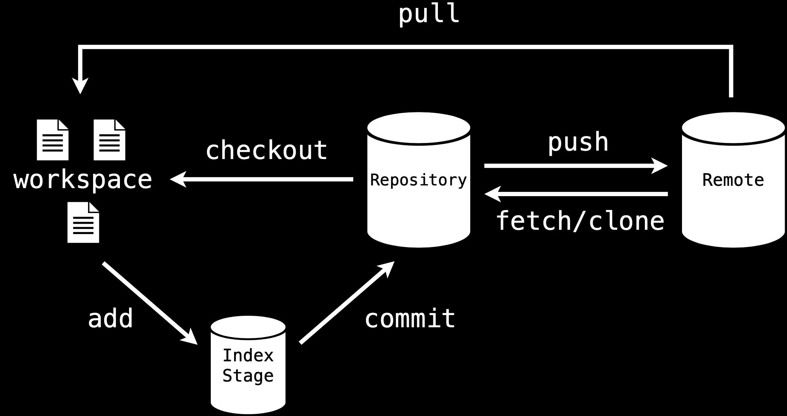

git 存在3个区域：

| **区域**   | **别名**    | **存储位置**      | **核心功能**       | **操作命令** |
| :--------- | :---------- | :---------------- | :----------------- | :----------- |
| **工作区** | Workspace   | 本地目录          | 开发者直接编辑文件 | 手动编辑文件 |
| **暂存区** | Index/Stage | `.git/index` 文件 | 准备下次提交的变更 | `git add`    |
| **版本库** | Repository  | `.git/objects`    | 永久存储的提交历史 | `git commit` |

代码回滚用的是 git reset 指令。区别在于参数：

- git reset --hard commitId：将代码回滚到工作区，本次代码（文件）的变动都会被舍弃。
- git reset --soft commitId：将代码回滚到暂存区，本次代码（文件）的变动不会被舍弃，也就是相当于执行了 `git add` 的操作

一般而言，为了安全和灵活，都采用 `git reset --soft commitId` 指令。


HEAD：用来指向分支的最后一次提交对象。

如果想要回到上一步，可以用 `HEAD~1` 代替具体的 commitID。

如果想要丢弃还需要进一步处理：

- git reset HEAD .`：则将暂存区的提交回滚掉。相当于没有执行 `git add`（只有本地新改动的数据）
- `git checkout -- .`: 将本地新改动的数据丢弃掉。


git checkout：

- 切换分支，例如：`git checkout master`
- 重新存储工作区文件。例如：`git checkout -- .`


## git 原理

- git 以 key、value 的形式存储。
- 二进制仓库的底层数据结构为树
- 本次修改文件的 hash 值为 key
- 本次修改文件的压缩版本为 value


### 1. git 对象存储

git 将存储对象的40位 HASH 分为2部分：

- 头2位作为文件夹

- 后38位作为对象文件名。结构为：`.git/objects/hash[0:2]/hash[2:40]`

  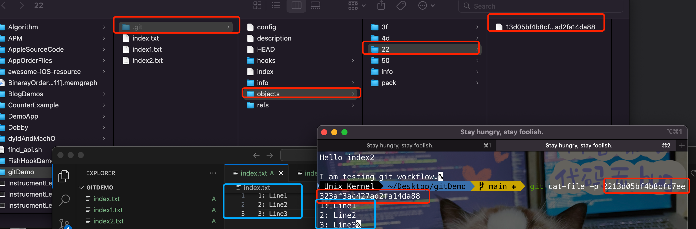

  比如：`gitDemo/.git/objects/22/13d05bf4b8cfc7ee323af3ac427ad2fa14da88`


QA: 为什么要设计这样的目录结构（Hash 值总40位，前2位为文件夹名称，后38为文件名称），而不直接用40位 hash 值作为文件名？

- 部分文件系统对目录下的文件数量有限制。例如，FAT32 限制单目录下的最大文件数量位 65535 个
- 部分文件系统查找文件属于线性查找，目录下的文件越多，查找越慢


### 2. git add 的本质

 

`git ls-files -s` 指令查看暂存区文件  。

git add 的本质就是内容哈希化。

- 输入：文件内容（二进制流）
- 处理：
  - 添加头部信息：**"blob " + 内容字节数 + "\0"**
  - 计算 SHA-1: **SHA1(header + content)**
- 输出：40位十六进制的哈希值

比如对 “Hello” 进行哈希计算：

1. 原始内容：`b"Hello"`
2. 添加头部
   - 内容长度：5字节
   - 构造头部：`b"blob 5\0"`
3. 完整数据：`b"blob 5\0Hello"`
4. SHA-1 计算。`HashUtils.sha1(data).hexdigest()`

### 3. 如何计算 git 哈希

使用指令 **git hash-object -w ./index.txt** 即可。

将得到的40位长度的哈希，拆为2部分，前2位为文件夹名称，后38位为文件名。


Demo1:

对 `index.txt` 文件使用 `git hash-object -w index.txt` 指令计算哈希。

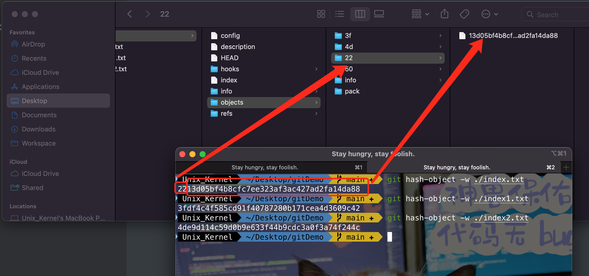

Demo2：

 `index.txt`文件内容没有改变， 继续计算哈希。发现哈希值一致

结论：

- **只要文件内容不变，hash 值不变。**
- **每次计算一次哈希，都会在 `.git/objects/` 文件夹下多出一个子文件夹。**

Demo3:

对 `index.txt` 文件内容进行调整，`git hash-object -w index.txt` 指令计算哈希

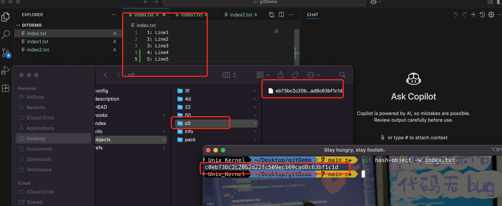

结论：

- **文件内容改变了，hash 值变了。**
- **文件内容改变后，生成新的 hash 值，同时会在 `.git/objects/` 文件夹下多出一个新的文件夹**。文件夹名称为新的哈希值的前2位，文件夹内文件名称为新的哈希值的后38位。


### 4. 模拟 git add

利用指令 **`git update-index --add --cacheinfo 100644 {FileHashValue} index.txt`** 将工作区的文件添加到缓存区

- `--add`: 强制将指定文件添加到暂存区（即使文件不存在于工作目录中）
- `--cacheinfo`: 手动指定文件的「模式（mode）+ 哈希值（hash）+ 路径（path）」来更新暂存区，用于添加那些不在工作目录中的文件
- `100644`: 文件模式（file mode），表示这是一个普通文件（非执行文件、非符号链接等）。Git 中常见模式：`100644`（普通文件）、`100755`（可执行文件）、`120000`（符号链接）等
- `{FileHashValue}`: 文件内容的 SHA-1 哈希值（40 位字符串），对应 Git 数据库（`.git/objects`）中存储的文件内容
- `index.txt`：最终在暂存区中记录的文件名（路径）

Demo：

- 为了模拟 `git add` 的效果，先把仓库中的 `.git` 文件夹删掉
- 利用指令 `git hash-object -w index.txt` 计算出 index.txt 的哈希值
- 利用指令 `git update-index --add --cacheinfo 100644 2213d05bf4b8cfc7ee323af3ac427ad2fa14da88 index.txt` 将 `index.txt` 和计算出来的哈希值写入到暂存区
- 利用指令 `git status` 查看是否成功写入到暂存区
- 继续按照上述2个流程（git hash-object 和 git update-index）将剩余2个文件进行模拟添加到暂存区

整体效果如下图：

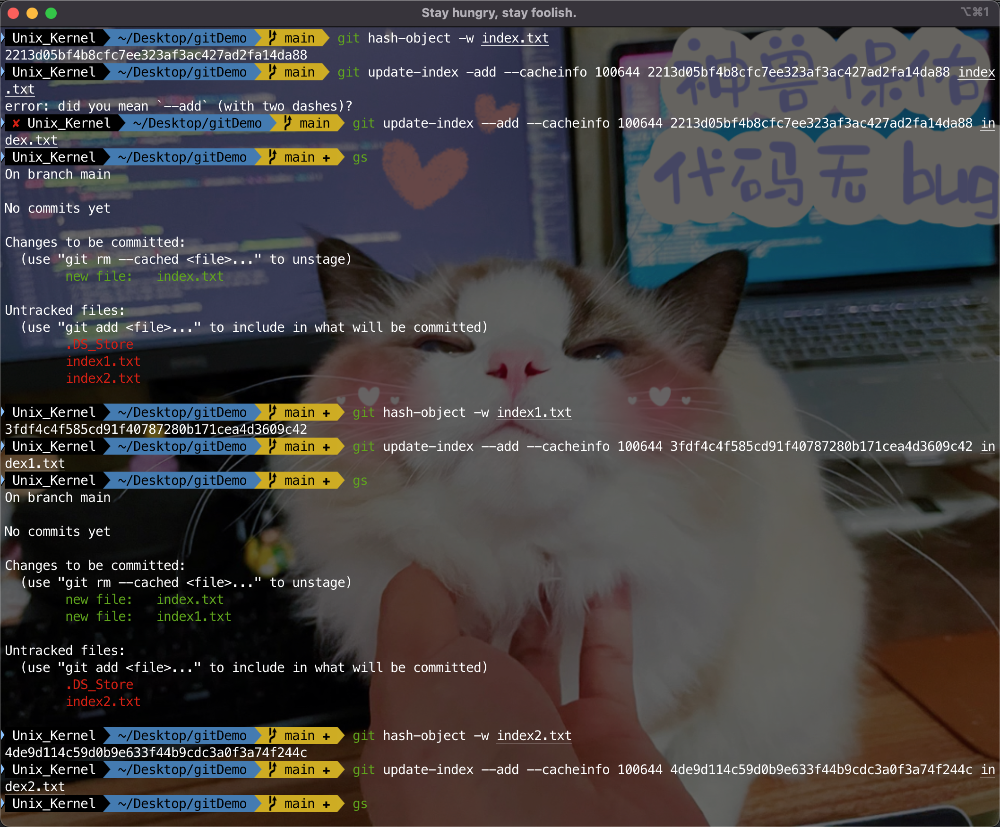


### 5. git 只有文件，没有目录

为什么进一步强调 **git 只有文件，没有目录**的概念，做一个实验。

第一步：上述步骤生成了3份 git hash，分别保存在 `.git/objects/` 目录下。

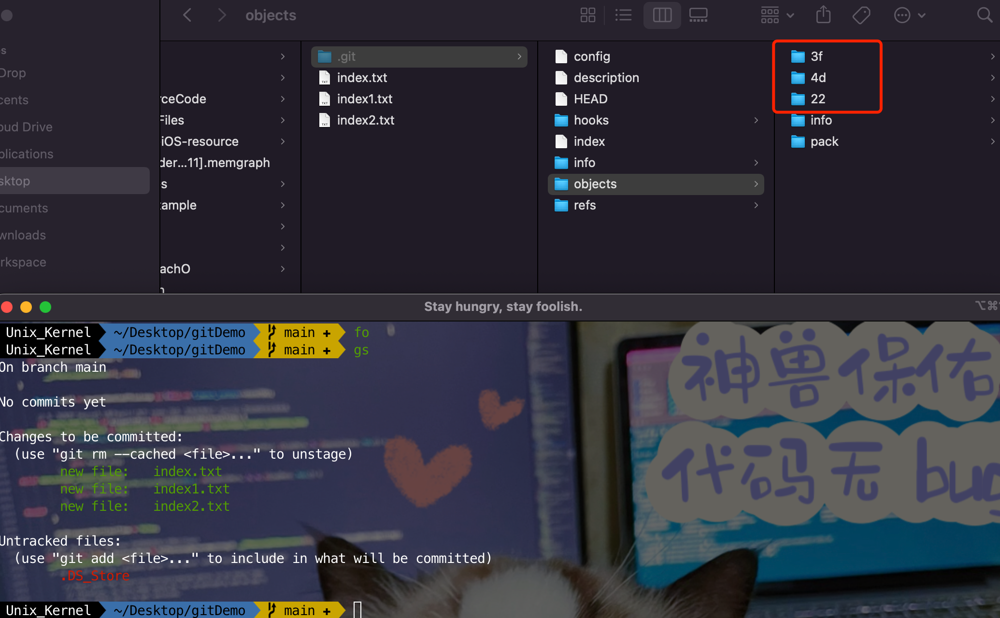

第二步：接下去将暂存区的文件生成一颗树。使用指令 **git write-tree**

第三步：查看生成的树信息。使用指令 `git cat-file -p {TreeHash}`

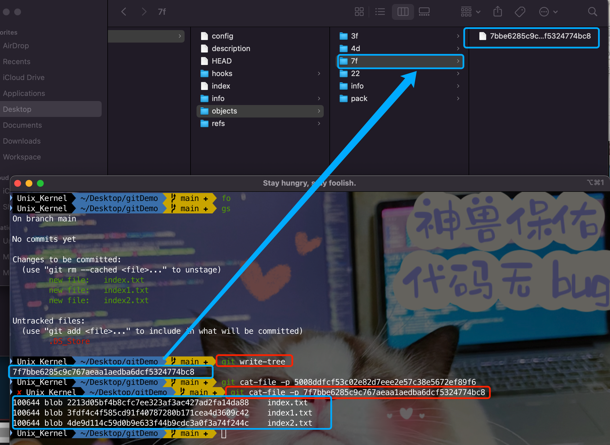

第四步：使用指令 **`git read-tree --prefix=FantasticLBP/ 7f7bbe6285c9c767aeaa1aedba6dcf5324774bc8`** 将指定的 tree 对象内容读取到当前索引中，并将其所有文件放在名为 `FantasticLBP/` 的目录下。

此时文件目录为：

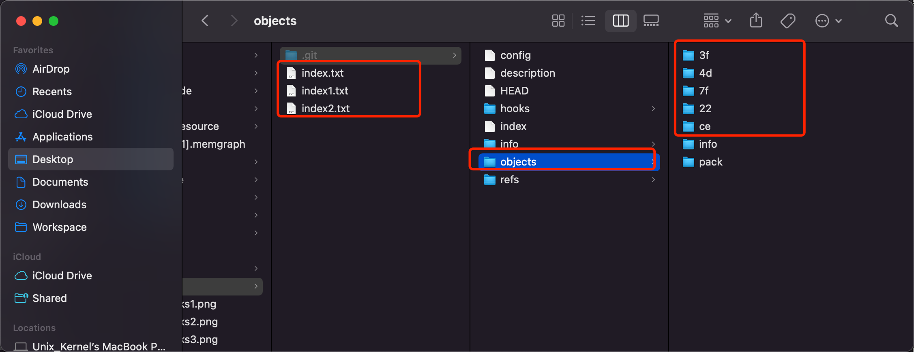

第五步：此时的效果为，暂存区里面存在另一份目录名为 `FantasticLBP/` 的暂存区信息。但是此时实体文件夹下并不存在。使用指令 `git checkout -- .` 便可以从暂存区恢复。

恢复后的目录结构为：

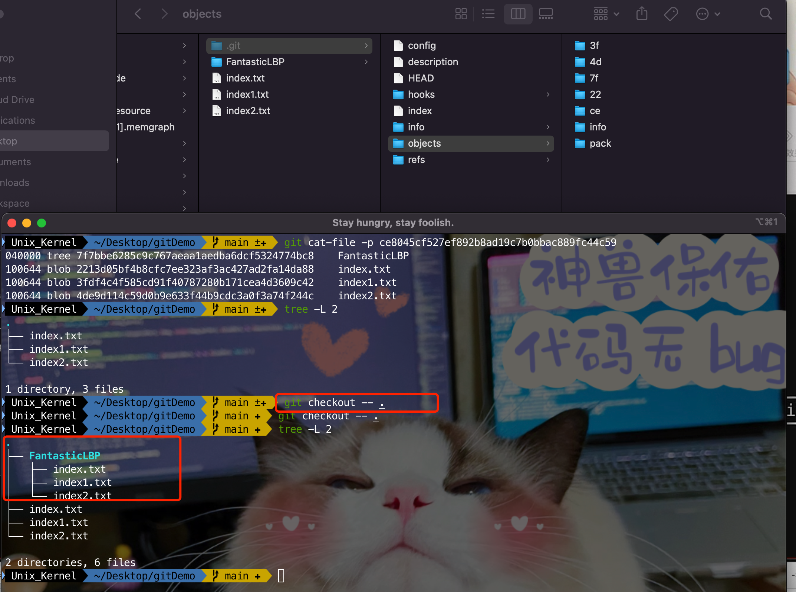


结论：

- 通过在暂存区里面重新构建一颗树，便可以使用 checkout 恢复出来
- 所以在使用代码重置功能的时候，最好使用 `git reset --soft head~1 `  的方式进行，因为更加灵活。使用 `--hard` 就没有暂存区的记录了。

### 6. git commit 的本质

上述步骤：

- 生成了3份文件的 git hash
- 同时又将3份文件写入到暂存区，得到一个暂存区 tree 的哈希: `ce8045cf527ef892b8ad19c7b0bbac889fc44c59`。

接下去为了探索 git commit 的本质，我们用 **`echo 'init commit' | git commit-tree ce8045cf527ef892b8ad19c7b0bbac889fc44c59`** 来完成提交。

**`git commit-tree`**：Git 底层命令，用于创建一个新的提交对象（commit object）。它需要一个 tree 对象作为基础，并通过标准输入接收提交信息。命令执行成功后，会输出新创建的提交对象的 SHA-1 哈希值。

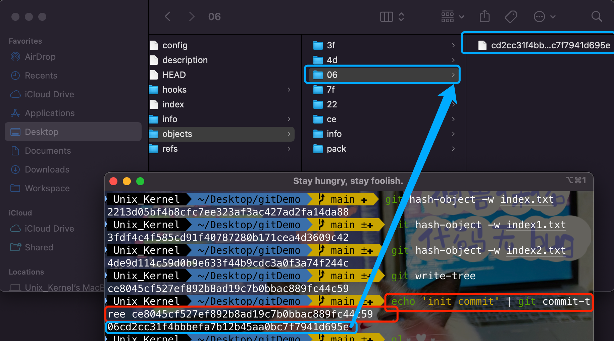

可以看到：

git commit 提交后也是会生成一个新的提交对象（commit object），新的提交对象也会在 `.git/objects/` 目录下存在。


### 7. git rebase

假如当前在分支 featureA 上，执行 `git rebase master` 后的效果，等价于将寻找到 featureA 和 master 的最近公共祖先节点，然后从 最近公共祖先节点到 featureA 的最新节点之间的 commit 都会被拆开，拼接到 master 分支最后面的 commit 上，重新组合成一个新的 commit。

也就是搞清楚2个对象：

- 当前在什么分之上？featureA
- git rebase 指令后跟什么分之？master

执行完的效果就是：master + featureA（从 master 和 featureA 的最近公共祖先处截断、拼接在后面）

```shell
C0 <--- C1 <--- M1 <--- M2 [master]
         \
           \
             A1 <--- A2 <--- A3 [featureA, HEAD]
```

- 寻找公共祖先

  ```shell
  LCA = git merge-base featureA maste` # 返回 C1
  ```

- 提取提交差异

  ```shell
  commits = git log C1..featureA --pretty=format:"%H` # 获取从 C1 到 featureA 的 commit 差异，得到： [A1, A2, A3]
  ```

- 重置到目标基点

  ```shell
  git reset --hard M2 # featureA分支指针临时指向M2
  ```

- 按顺序重新重置提交

  ```shell
  git cherry-pick A1 # 创建新提交A1' (父提交=C1)
  git cherry-pick A2 # 创建新提交A2' (父提交=A1)
  git cherry-pick A3 # 创建新提交A3' (父提交=A2)
  ```

最终结果

```shell
C0 <--- C1 <--- M1 <--- M2 [master]
                         \
                           \
                             A1' <--- A2' <--- A3' [featureA, HEAD]
```


git rebase 还可以用于一些提交信息的处理，比如 `git rebase -i {CommitHash}`

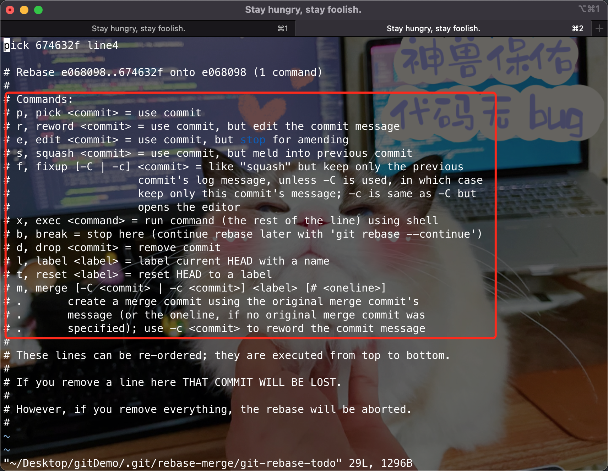

git rebase 还可以将多次 commit 合并为1次，也可以修改某次 commit 的信息等等，具体的可以看指令后面的注释。


### 8. 冲突展示

#### 1. 双路展示策略

git 在 merge 或者 rebase 都会存在冲突的可能，关于文件内容冲突默认是按照双路合并的形式进行展示的。这样子信息有限

可以通过下面指令，查看当前的冲突展示规则：

```shell
git config merge.conflictstyle
```

如果没有任何输出，则说明没有任何设置，默认就是**双路展示策略**。

冲突标记仅显示**当前分支**（`<<<<<<< HEAD`）和**合并分支**（`>>>>>>> <branch>`）的内容，例如：

```shell
<<<<<<< HEAD
当前分支的修改
=======
合并分支的修改
>>>>>>> feature
```


#### 2. 三路展示策略

可以通过下面指令，将冲突展示策略改为**三路合并**进行展示：

```shell
git config merge.conflictstyle diff3
```

该指令用于配置 Git 合并冲突的展示格式，**`diff3` 模式会在冲突标记中增加「共同祖先版本」**，相比默认的 `merge` 模式提供更完整的冲突上下文，在决策时，提供更多的上下文信息。

这个公共祖先，指的就是**最近公共祖先（Lowest Common Ancestor, LCA）**。

展示如下：

```shell
<<<<<<< HEAD
当前分支内容 (ours)
||||||| merged common ancestors
共同祖先版本内容 (base)
=======
要合并的分支内容 (theirs)
>>>>>>> branch-name
```

结论：**配置为三路展示策略，会在冲突时展示最近公共祖先节点的信息，在代码冲突分析决策的时候提供更多的上下文，所以推荐大家通过 git config --global merge.conflictstyle diff3  配置为三路展示策略**。


#### 3. 相关指令

```shell
# 检查全局配置（无输出表示未设置）
git config --global merge.conflictStyle

# 检查仓库级配置（无输出表示未设置）
git config --local merge.conflictStyle

# 查看实际生效值（输出默认值 'merge'）
git config --get merge.conflictStyle

# 配置全局为三路展示策略
git config --global merge.conflictstyle diff3

# 配置当前仓库为三路展示策略
git config merge.conflictstyle diff3 
```


#### 4. 配置冲突解决工具

要将 `git mergetool` 配置为使用 Xcode 自带的 diff 工具（FileMerge）

- 确保已安装 Xcode 命令行工具

  ```shell
  xcode-select --install
  ```

- 配置 git 使用 opendiff 作为冲突解决工具

  ```shell
  # 设置 mergetool 为 opendiff
  git config --global merge.tool opendiff
  
  # 指定 opendiff 的调用参数
  git config --global mergetool.opendiff.cmd \
  "opendiff \"\$LOCAL\" \"\$REMOTE\" -ancestor \"\$BASE\" -merge \"\$MERGED\""
  ```

- 不建议配置这个 `git config --global mergetool.trustExitCode true`，保持默认或者设置为 false，有助于进行最后一次的确认

配置后的使用方式：

`git mergetool` 使用指令将会启动 Xcode 的 FileMerge 工具。

比如，我模拟了文件冲突，调用 `git mergetool` 使用 opendiff 打开了文件冲突展示能力

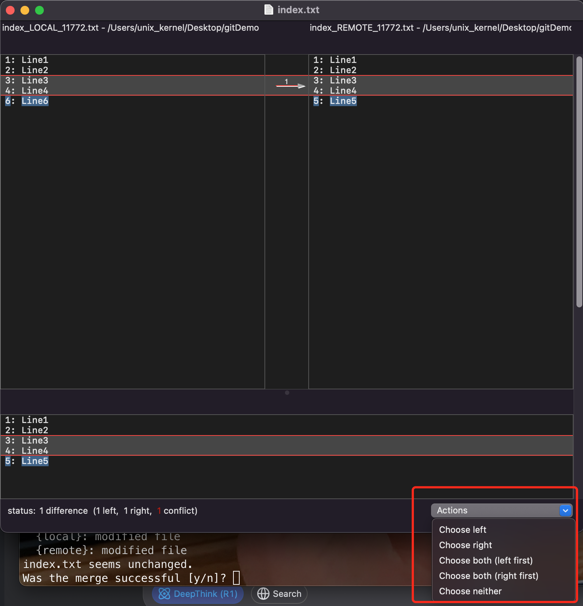

当前 case 下，我需要选择左侧为结果，所以点击了 "Choose left"。下面区域为合并后的结果。在终端还有来一次确认过程。做到 double check。

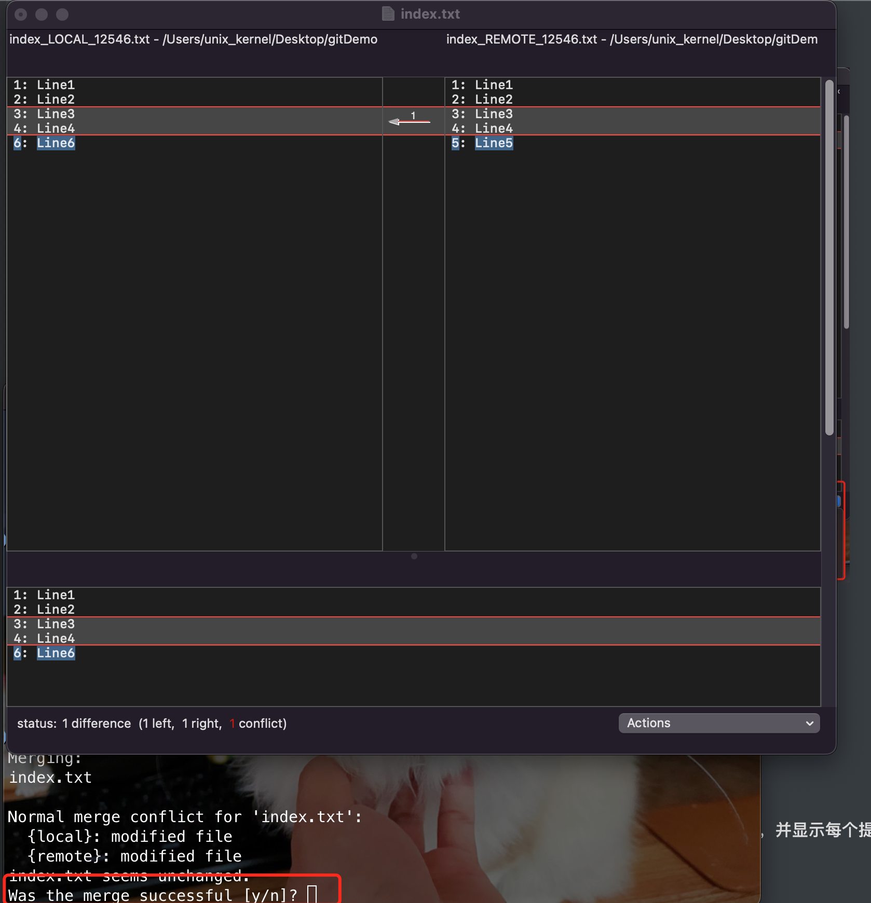

属于 y 后，相当于选择了结果，接下去再进行 add、commit 等操作。


### 9. git log -p

#### 1. 基础指令

**`git log -p commitId`**   是一个组合命令，用于**详细展示特定提交及其之前的提交历史，并显示每个提交的代码差异**

说明：从指定的 `commitId` **开始回溯**，按时间倒序列出其**祖先提交**

示例如下


#### 2. 输出信息结构

每个提交显示2块信息：

- 提交元信息	

  比如

  ```shell
  commit 0d614db5d3ba7ae2606de696a3627819b2368378	# 提交哈希
  Author: FantasticLBP <wsbglbp@outlook.com>	    # 作者信息
  Date:   Sat Jul 26 19:25:59 2025 +0800				  # 提交时间
  
      Line5																				# 提交日志（提交说明）
  ```

- 代码差异

  以 diff 格式展示修改内容。比如：

  ```shell
  diff --git a/index.txt b/index.txt
  index 2213d05..67124b1 100644
  --- a/index.txt
  +++ b/index.txt
  @@ -1,3 +1,5 @@
   1: Line1
   2: Line2
  -3: Line3
  \ No newline at end of file
  +3: Line3
  +4: Line4
  +5: Line5
  ```

  

#### 3. 常用指令

| 目的               | 指令格式                              | 指令效果                |
| ------------------ | ------------------------------------- | ----------------------- |
| 限制输出数量       | git log -p -2 d3adb33f                | 仅显示最近 2 个提交     |
| 过滤文件           | git log -p d3adb33f -- path/to/file   | 只查看该文件的修改历史  |
| **图形化显示分支** | git log -p --graph --oneline d3adb33f | 用 ASCII 图展示分支结构 |


### 10. git stash

`git stash` 是 Git 中一个强大的工作流工具，用于**临时保存未提交的更改**，让您可以清理工作目录并切换到其他任务

```
git stash push [-m "描述信息"] [其他选项]
```

使用上述指令：将当前**工作目录修改**和**暂存区修改**存入储藏栈


Demo：

- 故意在当前分支进行随意修改，用来模拟需要 stash 的场景。

- 使用指令 `git stash push -m 'commitMessage'` 将当前**工作目录修改**和**暂存区修改**存入储藏栈

- 使用 `git stash list` 用于**查看当前所有存储条目**的核心命令，展示的信息从时间上由近到远

  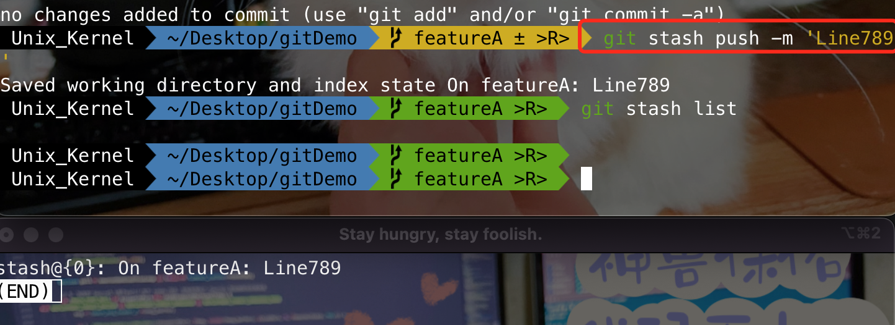

  - 使用 `git stash show -p stash@{0}` 查看**存储修改内容**。其中 `-p` 是 `--patch` 的缩写，显示完整差异（补丁格式）,`stash{0}` 指定要查看的储藏引用（0 表示最近一次储藏）

    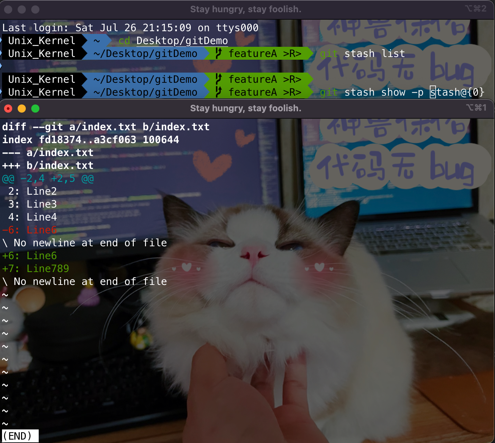

    

  - 也可以使用 `git stash` 指令，会自动生成默认消息，包含清晰的 WIP 日志。也是标准推荐做法。

    ```shell
    # 标准命令
    git stash
    # 等价于
    git stash push "WIP on $(git branch --show-current): $(git log -1 --format=%s)"
    ```

  - 使用 `git stash apply stash@{1}` 来应用某次具体的 stash 栈里的信息。注意：新 stash 的 序号更早，早期的由近到远依次+1

    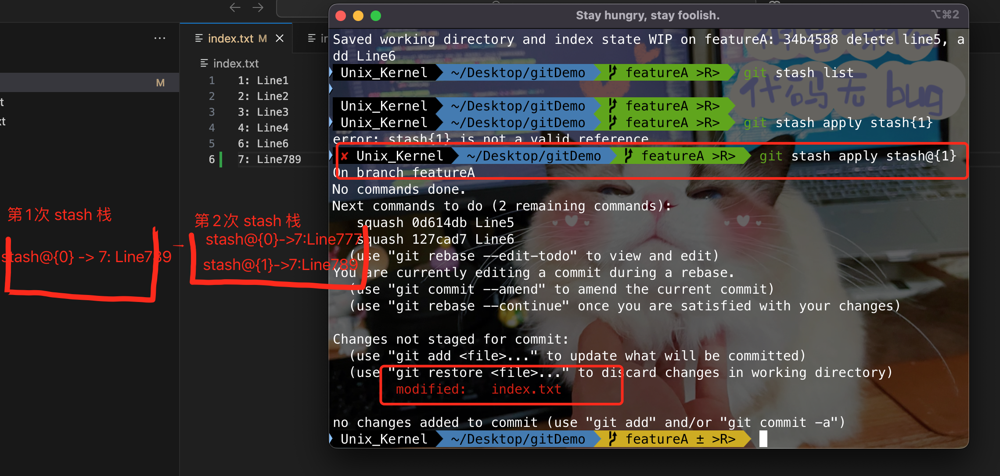

  - 如果从 stash 里取出的代码不满意，如何恢复到 之前的状态？使用组合命令 **git stash show -p stash@{1} | git apply -R`** 来达到反向应用补丁的效果。

    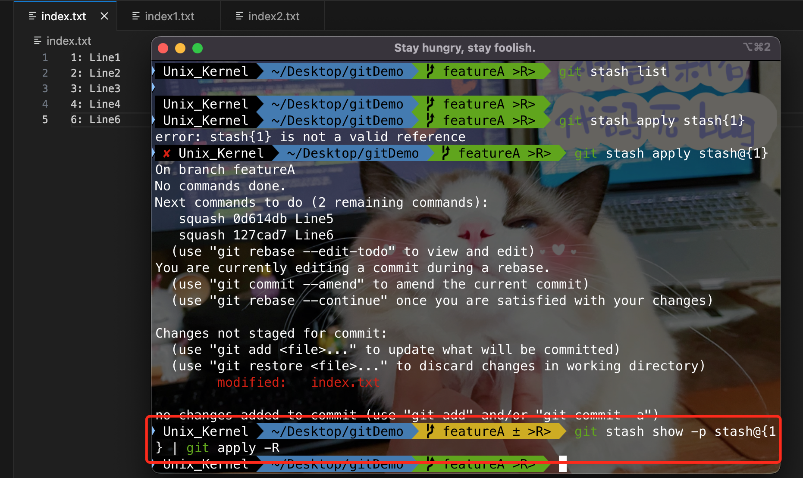

    管道符 `|` ,将前一个命令的输出作为后一个命令的输入。比如：

    ```shell
    # 应用了错误的存储
    git stash apply stash@{1}
    
    # 发现需要撤销
    git stash show -p stash@{1} | git apply -R
    ```

  - stash 由于是栈，所以有 push、pop 能力。push 就是往栈里加，pop 就是移除。完整指令为 **`git stash pop stash@{0}`**


### 11. git ignore

在开发中经常会遇到有些类型的文件不需要提交到远端进行多人协作，比如 iOS 开发中的 cocoapods install 后的 pods 目录，或者 NodeJS 开发中的 node_modules 目录，git 也设计了该口子，允许使用 **.gitignore ** 文件用于指定 Git 版本控制系统应忽略的文件和目录，避免将临时文件、编译产物或敏感信息纳入版本控制。

#### 1. 核心规则

- 每行一个规则，支持通配符：
  - `*` 匹配任意字符（除路径分隔符外）
  - `**` 匹配任意层级目录
  - `?` 匹配单个字符
  - `[abc]` 匹配指定字符
- 路径规则：
  - 以 `/` 开头：仅匹配项目根目录（如 `/temp.log`）
  - 以 `/` 结尾：仅匹配目录（如 `build/`）
- 取反规则：用 `!` 取消忽略（如 `!src/important.log`


#### 2. 最佳实践

- 在项目根目录创建 ``.gitignore` 文件

- 根据项目和语言类型，搜索一个标准的 `.gitignore` 模版，将内容复制进去

- 如果项目初始化的时候没有添加完全部的 `.gitignore` 文件内容。再到后来开发的过程中，给 `.gitignore` 里面添加了内容，但后来添加的 `.gitignore` 已经比较晚了，当前提示不允许追踪的文件，还是会被 git 追踪。并且已经提交到暂存区了。

  因为都存在于本地暂存区了，所以可以使用指令 **`git update-index --assume-unchanged {FileName}`** 来告诉 git，不要追踪暂存区的 FileName 该文件

  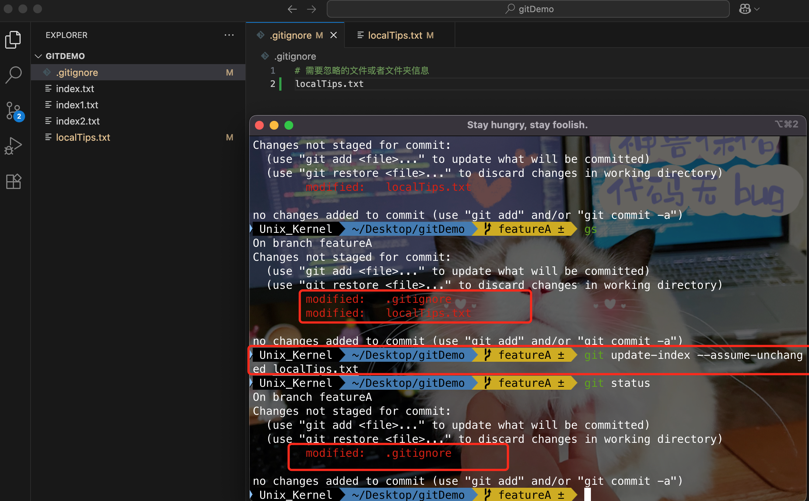

#### 3. 进阶玩法

- 文件已经被追踪，此时再配置到 `.gitigore` 文件中，还是会被追踪。此时需手动删除缓存：

  ```shell
  git rm --cached {fileName}
  ```

- 验证忽略规则

  ```shell
  git check-ignore -v {fileName}
  ```


### 12. git revert

`git revert` 是 Git 中用于安全撤销已提交更改的命令，它通过创建一个**新的反向提交**来撤销指定提交的更改，**不会重写历史**

比如

```shell
# 撤销最近一次提交
git revert HEAD

# 撤销指定提交（按 commit hash）
git revert a1b2c3d

# 撤销多个提交（从旧到新依次撤销）
git revert commit1 commit2
```

最佳实践：

- 撤销公共提交：用 revert 

- 复杂撤销：用 `-n` 组合多个撤销后再提交

  ````shell
  git revert -n commit1 commit2
  # 手动调整后提交
  git commit -m "Batch revert"
  ````

- 撤销文件，优先使用 `git checkout {commitId} -- {fileName}`


### 13. git reflog

>  git-reflog - Manage reflog information

`git reflog`（引用日志）是 Git 的**安全网**，它记录了本地仓库中所有分支和 HEAD 指针的变更历史，主要用于恢复误操作（如错误重置、删除分支等）

一些常见的操作无法解决的问题，一些不符合预期的行为发生时，我们可以根据 reflog 来“恢复”之前的状态。

核心用途

- 找回丢失的提交：恢复被 `reset`/`rebase` 删除的提交
- 恢复误删分支：找回已删除的分支指针
- 追踪操作历史：查看所有 HEAD 和分支的移动记录
- 灾难恢复：当 `git log` 无法显示提交时（如分支被覆盖）


##### 1. 一些实际场景

- 恢复误删的操作：

  ```shell
  # 错误重置了提交
  git reset --hard HEAD~3
  
  # 查看 reflog 找到被删提交的哈希
  git reflog
  # f45e678 HEAD@{1}: commit: Important feature
  
  # 恢复到指定位置
  git reset --hard f45e678
  ```

- 找回被删除的分支

  ```shell
  # 误删分支
  git branch -D feature/login
  # 根据 reflog 日志，匹配找到 'feature/login' 信息
  git reflog | grep 'feature/login' 
  # c9d8a7b HEAD@{2}: checkout: moving from main to feature/login
  # 重建分支
  git breanch feature/login c9d8a7b
  ```


### 14. git hook

Git Hook 是 Git 提供的自动化脚本机制，可在特定 Git 操作（如提交、推送、合并等）前后触发自定义任务，从而优化开发流程、提升代码质量和协作效率。结合脚本能力广泛用于 CI/CD 领域。


一个项目如果是 git init 之后的，会在 `.git/hooks` 目录下存在一堆 hooks 模版，如下图

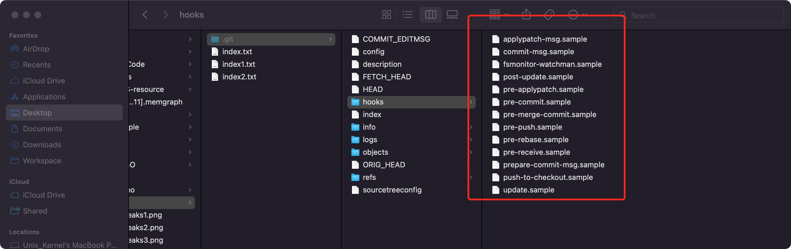

- 顾名思义，pre-push、post-push 分别是在 push 之前、push 之后触发的钩子。所以其他几个钩子类似

- 本次演示继续在之前的 Demo 上演示，使用 Pre-Commit 钩子，去掉拓展名。注释掉其他代码，添加一句打印输出

  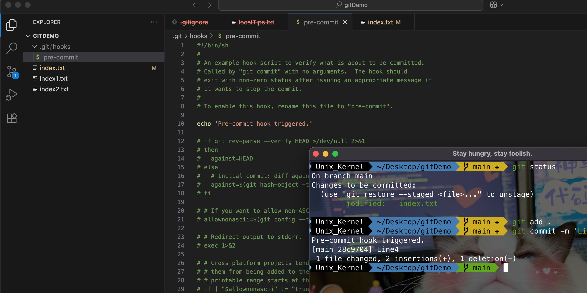

注意：这里可以使用 shell、也可以使用 python、JS、Ruby 等脚本


#### 1. 代码格式与静态检查

- 钩子：`pre-commit`

- 作用：提交前自动运行 ESLint、Prettier、Flake8 等工具，检查语法错误、代码风格或安全漏洞。若检查失败，则阻止提交

  ```shell
  # pre-commit 脚本片段
  eslint --fix --ext .js,.ts src/  # 自动修复并检查JS/TS文件
  ```


#### 2. git 日志规范化

- 钩子：`commit-msg`

- 作用：检查提交信息是否符合约定格式（如必须包含前缀 `[Feat]`、`[Fix]` 或关联问题编号）。违规时终止提交

  ```shell
  # commit-msg 脚本片段
  if ! grep -qE "^(FEAT|FIX|DOC):" "$1"; then
    echo "提交信息必须以 FEAT/FIX/DOC 开头！"
    exit 1
  fi
  ```

#### 3. 单元测试与代码覆盖率

- 钩子：`pre-push`
- 作用：推送前运行测试套件（不管是单元测试也好，还是精准测试也好），必须保证全部的测试 case 通过，且代码覆盖率达到95%以上才可以合并。确保新代码不破坏现有功能。测试失败则阻止推送。


#### 4. 自动部署测试环境

- 钩子：`post-receive`（服务端）
- 作用：代码推送到远程仓库后，自动将代码同步至服务器目录，触发部署流程（如更新网站文件）


#### 5. CI/CD 流程

- 钩子：`post-receive`（服务端）
- 作用：推送完成后通知 CI 工具（如 Jenkins、GitLab CI）执行流水线任务（构建、测试、部署）


### 15. 本地仓库对应远端仓库是1对多的关系

为了模拟本地和远端是1对多的关系：

- 将之前的 Demo 的 `.git` 文件夹删掉。模拟一个干净的文件夹，没有 git 信息
- 创建2个文件夹，模拟 git 远端服务器的 repo 信息。分别为 gitDemoServer1、gitDemoServer2
- 分别在 gitDemoServer1、gitDemoServer2 文件夹执行 `git init --bare` ，**在服务器文件夹初始化裸仓库**
- 在 gitDemo 终端路径下，执行 `git init` 初始化本地仓库
- 继续在 gitDemo 终端路径下分别执行  **`git remote add origin  /Users/unix_kernel/Desktop/gitDemoServer1` **和** `git remote add origin2 /Users/unix_kernel/Desktop/gitDemoServer2`** ，为了给当前的 repo 配置多个远端仓库
- 最后执行 `git remote -v` 指令查看当前 repo 的 remote 信息

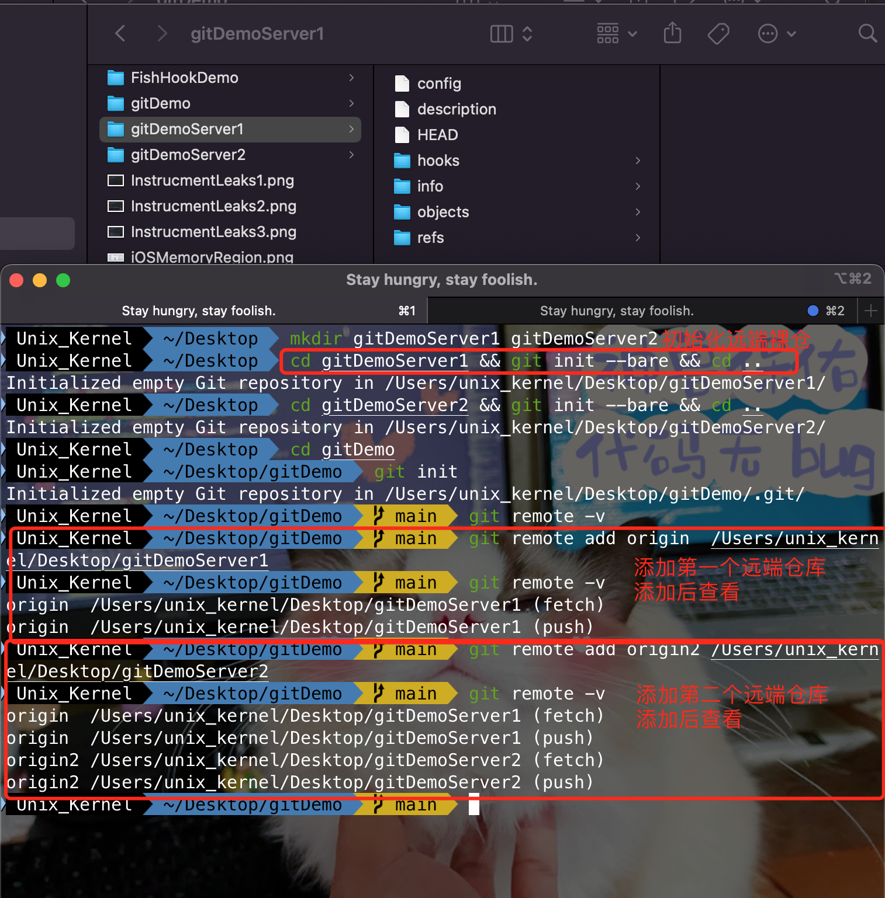

说明：

- 裸仓库特点：

  - 没有工作目录（不能直接编辑文件）
  - 目录内容直接包含 Git 内部文件（无 `.git` 隐藏文件夹）

- `git remote add origin  /Users/unix_kernel/Desktop/gitDemoServer1` 

  -  `origin` 和 `origin2` 是远程仓库的别名
  - 路径可以是绝对路径（推荐）或相对路径

- 本地只有1个分支，远端分支名也不一定相同。所以需要告诉 git 本地分支如何与远端进行关联

  ````shell
  git remote add -t main origin https://github.com/FantasticLBP/GitDemo
  ````

  - `git remote add` ：想本地仓库添加要 track 的远程仓库
  - `-t main` ： 指定本地要 track 远程仓库中的哪个分支
  - `origin`: 远程仓库的名字
  - `https://github.com/FantasticLBP/GitDemo`: 远程仓库的地址

 
